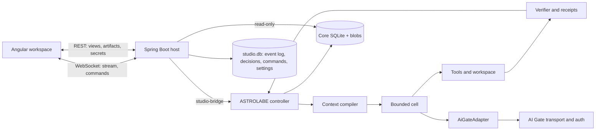

# ASTROLABE Studio — UI specification and implementation plan

| Field | Value |
|---|---|
| Document | `ASTROLABE_UI_BEST_MIX.md` · v1.0 · 2026-09-29 |
| Status | Proposed specification. No Studio code exists. Wireframes are design artifacts, not a running application |
| Merged from | `ASTROLABE_UI_OPUS.md` (baseline), `ASTROLABE_UI_FABLE.md`, `ASTROLABE_UI_DESIGN.md`. Provenance and resolved conflicts: Appendix E |
| Brief | `ui_goals.md` |
| Baseline inspected | ASTROLABE `25c297c281aa` (core `0.1.0`, Kotlin 2.4.20, JDK 26, store schema v4, P0–P6 fixture-validated, `:provider-ai-gate` present) · llm-transport-sdk `877a1a6fa555` (AI Gate `net.ai.gate:ai-gate 0.1.0-SNAPSHOT`) |
| Stack | Angular latest stable (v22 line) · Spring Boot 4.x on JDK 26 (Java) · one Kotlin bridge module · ASTROLABE core in-process · WebSocket first, REST for snapshots, paging, artifacts and secrets |
| Product name | **ASTROLABE Studio** (*Studio* = Angular frontend + Spring Boot backend) |

---

# Part I — Concept and verified facts

## 0. Reading guide

### 0.1 Routes

| Reader | Read |
|---|---|
| Product owner | §1, §2.2, §5, §8, §36 |
| UX / visual designer | §4–§24 |
| Backend engineer | §2, §3, §25–§31, Appendix A, B |
| Frontend engineer | §3–§24, §27–§29, §32, Appendix A |
| Implementing LLM agent | §37 first, then the sections it names |
| Verifying a claim about ASTROLABE / AI Gate | §2, Appendix A, B, D |

### 0.2 Conventions

- **MUST / MUST NOT / SHOULD / MAY** as in RFC 2119. Unmarked text is explanatory.
- ASTROLABE and SDK identifiers are quoted exactly in `code font`; UI labels in "quotes". Paths are relative to `ASTROLABE/` and `llm-transport-sdk/llm/`.
- Every fact appears once and is referenced by section or id. Identifiers are stable:

| Prefix | Meaning | Defined in |
|---|---|---|
| `P-nn` | ASTROLABE property that shapes the UI | §2.2 |
| `G-nn` | Integration gap with interim approach and owner | §2.11 |
| `OD-nn` | Owner decision with proposed default | §36.2 |
| `R-<AREA>-nn` | Requirement. Areas: `SHL` shell · `THR` thread · `CMP` composer · `OVR` overview · `PLN` plan · `CHG` changes · `EVD` evidence · `CTX` context · `DEC` decisions · `ACT` activity · `KB` knowledge · `STA` statistics · `SET` settings · `PRV` providers · `BE` backend · `WS` protocol · `FE` frontend | §4–§32 |
| `W-nn` | Wireframe | §4–§19, index §24.1 |
| `T-nn` / `AS-nn` | Implementation task / acceptance scenario | §34 / §35 |

### 0.3 Honesty rules

1. **Verified** = read in source at the baseline above. **Gap** = the libraries do not provide it; §2.11 names the interim approach and owner. **Decision** = a Studio design choice. A proposed API is never presented as existing.
2. **Never invent.** Where ASTROLABE does not emit or store something, the UI shows "unknown", "not measured" or "not captured". It never synthesises status, cost, progress or completion.
3. Numbers such as budgets and thresholds are ASTROLABE's declared defaults (`Defaults.kt`), not recommendations. Performance figures are targets, not measurements.
4. If implementation finds a fact in §2 wrong, fix §2 first and record the change (§34.1).

### 0.4 Traceability to the brief

| Brief requirement | Covered by |
|---|---|
| Analyse architecture, code, SDK; ASTROLABE-specific UI, not a clone | §2, §1.2, §3, §8, §13, Appendix A, D |
| Self-contained concept + plan + prototype + request | whole document; §24; §34; §37 |
| Look, function, settings, entry points, interaction with ASTROLABE | §4–§23; §17, Appendix B; §4.5; §25–§29 |
| Backend requirements, API, entry points; frontend part | §25–§31; §32 |
| Angular + Spring Boot/Java; WebSocket primary, REST additional | §25, §27, §28, §32 |
| Configure everything: roles, agents, profiles, LLMs, authentication | §17, §18, Appendix B |
| Statistics, background processes, workflow execution | §16, §14, §8 |
| Two-pane layout, persistent composer, Agent Overview with animated workflow and reasoning progress | §4, §7, §8 |
| Compact, dense, expandable details, dark/light, calm, not bloated | §4.2, §21, §1.3 |

---

## 1. Product

### 1.1 What the Studio is

ASTROLABE is not a chat agent. It is a **deterministic campaign controller** that turns a request into a **versioned task contract**, plans a **requirement graph of increments**, executes each increment in a **bounded cell** (one model loop with a role), and accepts work **only on evidence**: receipts bound to a workspace stamp. Humans hold typed authority: they answer questions, approve dangerous effects, resolve contract amendments and sign reviews.

The Studio keeps the familiar coding-agent desktop layout (left sidebar for projects and sessions; main workspace with conversation, tool calls and changes; persistent composer) and adds three things ASTROLABE provides data for:

1. **Contract and evidence spine.** Every status comes from the contract, ledger and receipts, never from model prose.
2. **Agent Overview.** A calm animated view of the real harness components exchanging messages as events arrive, with the agent's **STATE register** as its high-level reasoning.
3. **Authority inbox ("Needs you").** Typed decision cards bound to a contract revision, each stating the consequence of every option.

At any moment the user can answer: (1) what objective and constraints is the agent following; (2) what is working now, on which files, with which role and model; (3) what has been verified against the current candidate; (4) what needs me, and what will my answer authorize; (5) what has this consumed, including helpers and failed attempts.

The defining interaction is **select an activity → inspect its scope and evidence → act through the owning runtime component**.

### 1.2 Key decisions

| # | Decision | Choice | Reason |
|---|---|---|---|
| 1 | Session model | A sidebar session is a **campaign** (`work_id`); later messages are **amendments** or **answers**, never free chat. No text is sent to AI Gate outside a campaign | P-02; an untracked second model loop would bypass the contract |
| 2 | Live data | Event bus (liveness) **plus** journal tailing and store reads (truth), merged by the backend into one ordered stream per campaign | Events are content-free; many declared events are never emitted (§2.5) |
| 3 | Driving ASTROLABE | The public `Controller` through a thin Kotlin **host bridge** with a Java interface; the facade alone is insufficient | G-01, G-02, G-05, G-10, G-11, G-22 |
| 4 | Reasoning display | STATE register and gate lines; provider reasoning only as an opaque token count | P-06 |
| 5 | Model text | Turn-level rendering with content-free progress meters in v1 | P-15, G-09 |
| 6 | Progress metric | Accepted requirements at a named candidate. Cell count, elapsed time, tokens and model statements are not progress | P-03 |
| 7 | Layout | One sidebar, one workspace, six campaign tabs, one inspector drawer on demand. No permanent third column | Brief: compact, expandable |
| 8 | Visual language | Neutral graphite/paper, one accent, three semantic colours as small marks, motion only for real events | Brief: calm, not colourful |
| 9 | Settings | Layered (Studio → project → campaign), validated by the libraries' own validators, **frozen per attempt**; every field shows effective value, source and activation boundary | P-10 |
| 10 | Deployment | Local single-user: backend on loopback, launch-token session; browser first, desktop shell later | Repository and credential access |

### 1.3 Principles

| # | Principle | In the UI |
|---|---|---|
| 1 | Truth from the store, motion from the bus | Every number, status and body traces to a store row, blob, view or Studio record. Events say what to refresh and animate |
| 3 | Honest states | Unknown ≠ zero, stale ≠ green, partial ≠ failed, blocked-with-question is a normal stop. Each state has its own glyph and word (§21.3) |
| 4 | Authority is explicit | Typed cards, contract revision, consequences. Policy decisions are logged visibly |
| 6 | One stable mental map | Fixed Overview topology, fixed sidebar order, same glyphs everywhere |
| 7 | Linkable, resumable, replayable | Every item has an id and deep link. Reload, reconnect or restart reproduces the same state from the store and the Studio event log |
| 8 | Local-first and safe | Secrets never reach the browser. Recovery material is never served. `trusted-local` is labelled "no sandbox" |
| 9 | Keyboard-first | Palette, single-key decision actions, predictable focus |

### 1.4 Non-goals for v1

- Replacing ASTROLABE's controller, scheduler, verifier, curator or accounting with UI logic.
- Hidden chain-of-thought, invented "thinking" text, token-by-token model text (G-09).
- Editing repository files in the Studio. It shows diffs and asks the harness to revert (§10.3).
- Editing behaviour the library does not expose; such items are read-only with their gap id.
- Remote multi-user server mode (seams noted in §30.6). Evaluation-lab UI for research arms; mandatory `Controls` are never exposed (P-18).

### 1.5 Users and core scenarios

Personas: **Builder** (runs campaigns daily; needs fast start, progress, quick decisions, trustworthy diffs) · **Reviewer** (judges results; needs evidence, integrity flags, attribution, publication control) · **Operator** (configures providers, profiles, budgets, roles; needs validation, cost and routing statistics).

| ID | Scenario |
|---|---|
| S-01 | First run: connect provider, add repository, accept profiles, start an S0 campaign |
| S-02 | Interactive S2 campaign: plan review, question, D-class approval, human review, finish |
| S-03 | Watch a long campaign in the Overview |
| S-04 | Campaign stops `waiting_for_input`; answer later; resume |
| S-05 | Backend crash mid-run; reconcile unknown outcomes; resume |
| S-06 | Judge the result from evidence and changes |
| S-07 | Publish to local commit and push with per-stage approvals |
| S-08 | Curate knowledge candidates |
| S-09 | Add a provider, draft and qualify a profile, assign tiers |
| S-10 | Investigate cost |
| S-11 | Unattended autonomous run; read the finish receipt afterwards |

### 1.6 Delivery levels and platforms

| Level | Content |
|---|---|
| Prototype | Fixture mode (§24.3): complete navigation on recorded or scripted campaigns, visibly marked "Demo data" |
| Connected baseline | Real campaigns, evidence, decisions, amendments, cancel, resume, providers, complete settings |
| Advanced | S3 lanes, knowledge administration, publication beyond patch, replay, desktop packaging. A feature appears as available only when its backend capability and tests exist |

Platforms: Windows 10/11 and Linux x64 (ASTROLABE's process layer refuses other systems). macOS MUST be shown as unsupported until ASTROLABE supports it.

---

## 2. ASTROLABE through the UI lens

Everything in §2 was read from source (Appendix D). Claims where the three source documents disagreed were rechecked on 2026-09-29 (Appendix E).

### 2.1 Architecture on one screen

```text
            YOU — authority: request · amendments · answers · approvals · reviews · publication grants
                                               |
+---------------------------- CAMPAIGN CLOCK — Controller (deterministic, resumable) ---------------------------+
| contract ▶ impact pre-scan ▶ shape S0–S3 ▶ plan cell (S1+) ▶ requirement graph ▶ ready frontier ▶ increment ▶ |
| [ compile ▶ CELL ▶ verify ▶ (review) ▶ (integrate, S3) ▶ accept ] ▶ ledger ▶ next … ▶ finish receipt          |
| owns: contract · graph · ledger · budgets · lease · cancellation · authorization · reconciliation · resume    |
+---------------+----------------------------------------------------------------------------▲------------------+
                | compiled context [S][R][K]                                                  | result packet
+---------------▼-------------------- CELL CLOCK — one role, one increment, ≤ 40 turns --------+------------------+
| turn = model ▶ Read (look, kb) ▶ one Edit batch ▶ Execute (run, verify) ▶ Metadata (state, task, kb.propose)    |
|        ▶ end-of-turn checker ▶ gates and nudges ▶ checkpoint (shadow-ref snapshot)                              |
| state: STATE register · Workset KNOWN / NOT SEEN · transcript [T] · anchor [A] · gauge line                     |
| exit: done (a proposal until the exit gate accepts) · blocked · partial · failed · cancelled                    |
+-----------------------------------------------------------------------------------------------------------------+
  Tools ▸ workspace (CAS edits, transforms, shadow ref) ▸ verification scheduler (checks, receipts @ stamp)
        ▸ evidence store (SQLite + blobs) ▸ knowledge base (notes, admission queue, curator)
  Router (function → tier → profile) · Delegation (probe · review · QA · writer) · Recovery ladder
```

**Roles** are configurations of one cell runtime: `plan`, `implementing`, `probe`, `review`, `qa`, `writer`, `repair`, `extractor`. **Shapes:** S0 one implementing cell; S1 adds the plan cell and multiple increments; S2 adds probes, reviews, routing escalation, recovery; S3 adds parallel writers in worktrees with an integrator (off by default).

### 2.2 Distinctive properties and UI consequences

| ID | ASTROLABE property | UI consequence |
|---|---|---|
| P-01 | **Two clocks**: a long resumable campaign and bounded cells | Two zoom levels: campaign rail + cell loop. Thread grouped by cell. Rebuilds do not create a new objective |
| P-02 | **Contract is user-authoritative and versioned**; the model may add acceptance or *propose* changes; replies bind `contractRevision` | Composer intents "Start / Amend / Answer"; versions and origins visible; stale replies rejected before sending |
| P-03 | **Completion is evidence-gated**; the verifier accepts, not the model | Status only from ledger, receipts, events. Refused completions show exactly what is missing |
| P-04 | **Honest vocabulary** | Distinct marks for current / stale / unknown / not run / inconclusive; money "unknown", never 0 |
| P-05 | **Four identities** (`work`, `attempt`, `candidate`, `context`) + generation + workspace | Ids as mono chips; deep links by id; DTOs carry all qualifiers |
| P-06 | **Externalized reasoning**: STATE register; private reasoning is not serialized | "Reasoning" is the register, animated on change |
| P-07 | **Roles are configurations**, not security boundaries; overrides may only reword (G-24) | Roles editor offers only edits the runtime applies |
| P-08 | **Shapes are policy-selected** with logged inputs | Shape badge with reason; absent machinery is absent, not greyed |
| P-09 | **Deterministic/semantic boundary**: scheduling, budgets, permissions, stamps, acceptance are never model decisions | Deterministic components drawn differently from model-driven cells; no model avatar on them |
| P-10 | **Frozen attempt configuration** (`AttemptConfig.freeze`, fingerprint) | Settings apply to the next campaign or attempt; running campaigns show their frozen config |
| P-11 | **Typed human authority** awaited inside the cell, no timeout; lease 1 h, not renewed (G-02) | Inbox, lease countdown, explicit decline, notifications |
| P-12 | **Economics discipline**: usage by cache class; every child, retry, rebuild, review spends the originating budget; missing usage is missing | Statistics by cache class, "unknown" segments, totals include helpers and retries |
| P-13 | **Safety labels**: effect classes R/W/D, permission ladder, `trusted-local` vs `confined`, rules binding, redaction, instruction-shape flags | Persistent execution-mode chip; D-class cards show argv, cwd, effect, reason |
| P-14 | **Workspace safety**: shadow ref per mutating turn, initial dirty state, never `reset`/`clean`; attribution agent / by-run / pre-existing | Changes with attribution and turn slider; pre-existing user changes never offered for revert |
| P-15 | **Content-free events; the journal is the only record of model output** | Turn-level rendering; progress meters while the model works |
| P-16 | **One campaign per project** (`ProjectLock`); resumable outcomes `waiting_for_input`, `blocked_external` (`waiting_for_process` declared, never produced) | Lock state in the sidebar; "Resume" only for resumable outcomes |
| P-17 | **Knowledge with admission and provenance**; notes are data, never instructions | Knowledge inbox with lint findings and evidence |
| P-18 | **Research arms are not production** (`Controls`, `eval`) | Never exposed in Settings |
| P-19 | **Five coherence horizons**: reads, STATE claims, checks, notes, delegated results can each go stale | Staleness shown per kind; historical evidence stays inspectable, never repainted |
| P-20 | **Quality floors constrain routing**; refusal instead of silent downgrade | Routing refusal explains the floor and eligible alternatives |
| P-21 | **Publication is a permission ladder** `patch → local-commit → push → merge → deploy` with separate grants and human anchors | Ladder with per-stage approvals; "delivered" is never used for a patch |

### 2.3 Host integration surface that exists today

| Concern | API (verified) | Notes |
|---|---|---|
| Facade | `Astrolabe(config, adapter, authority, clock, idGen, layers, deployer, estimators, ownsAdapter)`; constructor throws `InvalidConfig` on `config.violations()`; `open(repo): Project`; `suspend campaign(project, request, policy?, publication?): CampaignHandle`; `close()` blocks (never call from a callback). `Astrolabe.VERSION = "0.1.0"`, `FIRST_ATTEMPT = "a1"`, work ids `W-<token>` | Always mints a new work id and `a1`; one `Authority` per instance; no lease or `maxCells` control. `null` policy budgets `contextLimitTokens(main) × defaults.campaignCells` tokens |
| Java facade | `AstrolabeJava`: `(config, JavaProviderAdapter, JavaAuthority, …)` and `(config, ProviderAdapter, JavaAuthority, estimators, …, ownsAdapter)`; `open`, `campaign(): CompletableFuture<JavaCampaignHandle>`, `subscribe(EventSink)`, `close()`. Handle: `workId`, `views`, `isDone`, `publication`, `await`, `cancel`, `amend(text)`, `subscribe` | Futures complete on worker threads; `EventSink` runs on the bus dispatcher and must not block. Cancelling the `await` future cancels the campaign |
| Project | `Project` has an **internal constructor**; obtained only through `Astrolabe.open(repo)`. Exposes `views`, `store`, `os`, `kb` (`EmptyKb` today), `close()` | The host owns and closes it; closing during a campaign is invalid |
| Controller (public) | `Controller(config, clock, idGen, events, env, faults, spans, leaseDuration = 1 h, precompiles, router, extraction, layers, estimators)`; `open(project, CampaignRequest(work, attempt, text), CampaignPolicy(tokens, cost?, resumeExpected)): OpenedCampaign`; `suspend run(c, CellModel, Authority, SyntaxCheck, maxCells = 12)`; `suspend publish(c, run, PublicationRequest, Authority, Deployer?)` | Resume = `open` with the same ids. `Astrolabe.campaign` is a short composition of these calls |
| Opened campaign | `OpenedCampaign`: `ids`, `contract`, `state`, `stop`, `cancellation.cancel(reason)`, `contracts.amendByUser/propose/resolve(…, apply)`, `intents`, `reconciliation`, `lease`, `journal`, `kb`, `attempt`, `shape` | The handle the bridge keeps per running campaign |
| Events | `Events(clock, replay = 256, bufferCapacity = 4096)`; `subscribe(EventSink): Subscription(active, dropped)`; `EventRecord(seq, at, event)` | §2.5 |
| Read models | `Views(store)`: `contract`, `ledger`, `register(context)`, `workset(context)`, `checks`, `budget`, `receipts`, `finishReceipt` | Pure `SELECT`s returning `StoredRow` bodies. One JDBC connection and lock shared with the running campaign (G-17). No cross-view atomic read: `Db.snapshot` is `internal` (G-31) |
| Journal | `Journal(store, clock)`: `events(JournalScope(work, context?, kinds?))`, `search(query, scope, limit)`, `lastSeq(work)` | No "after seq" read (G-08) |
| Store | `Store.db.query(sql, params, map)` is public; `BlobStore.get/exists/path` | No list-campaigns API (G-07) |
| Configuration | `Config`, `Defaults`, `ShapePolicy`, `ProfileRoles`, `Flags`, `Role`, `TierTable`, `RedactionConfig`, `RulesBinding`; `Config.violations()`; `AttemptConfig.freeze` + `fingerprint` | Host-built `@Serializable` data classes; no config-file loader in core (G-32) |
| Provider adapter | `AiGateAdapter(llm, profiles, ownsLlm = false)` (`ObservableAdapter`); `estimators(HeuristicEstimator())`; static `violations(llm, profiles)`; `warnings()`; `AiGateProfiles.draft / qualify` | §2.10. The Studio wires it; it never builds an adapter |

### 2.4 The authority contract

| Method | Request (fields) | Reply (fields) | No answer |
|---|---|---|---|
| `ask` | `Question(id, contractRevision, ids, text, options[])` | `Answer(questionId, contractRevision, text, chosenOption?, changesRequirements)` | `null` → cell ends `blocked` → campaign `waiting_for_input` |
| `approve` | `DClassRequest(id, contractRevision, ids, action, argv, cwd?, expectedEffect, reason, contractAllowlisted)` | `Decision(requestId, contractRevision, approved, reason?)` | Not allowed; exceptional completion counts as no answer |
| `resolve` | `AmendmentProposal(id, contractRevision, ids, by{Model,User}, change, reason, weakening)` | `Resolution(proposalId, contractRevision, outcome{Accepted,Rejected,Pending}, byAuthority, reason?)` | Not allowed |
| `review` | `ReviewRequest(id, contractRevision, ids, scope Increment\|Campaign, candidate, packetRef, criteria, originalObligations, diffRef, receipts, rubric)` | `Verdict(requestId, contractRevision, reviewedCandidate, outcome Approve\|Revise\|Reject\|InsufficientEvidence\|Escalate, findings[severity Blocker\|Major\|Minor\|Nit, location "path:line@hash", issue, suggestedFix?, kind Correctness\|Contract\|Quality\|TestIntegrity], coverage, contractViolations, confidence 0–1, signedBy, missingCriterion)` | `null` → review `Unavailable` → blocked, never skipped |

Rules:
- Every reply names the pending item and contract revision; `Replies.check(replyRevision, currentRevision)` yields `Current` or `Superseded`.
- `AutonomousAuthority(AutonomousPolicy(acceptNonWeakening = false, reviewer = null))`: answers questions with `null`, approves only `contractAllowlisted` requests, rejects weakening proposals, leaves non-weakening ones `Pending` unless `acceptNonWeakening`, returns no verdict. `byAuthority = "policy:autonomous"`.
- Weakening proposals are never auto-accepted. Model proposals through `task.propose` are hard-coded `weakening = true`; plan-intake and curator proposals pass `false` (no semantic weakening detector).
- Where invoked: D-class runs; every publication stage above `patch` (`action "publish.<stage>"`); `task.ask`; `reassessBlocked` at reopen (`Question("unblock-…")`); campaign review and blocking test-integrity flags under `IntegrityApproval.Human`.
- Plan acceptance, knowledge admission and model amendments all arrive as `AmendmentProposal`, distinguishable only by `reason` text (G-21).
- `Contracts.amendByUser` appends a request and bumps the version; its default transformation is identity and `Contract.objective` returns the latest request text. A short amendment such as "also keep anonymous access" is therefore not a rebuilt contract; the UI MUST preserve prior requests and show the amendment as an addition (§7.3).

### 2.5 Events, journal and what is actually observable

**Bus semantics.** `emit` never blocks. Each record gets a bus-assigned monotonic `seq` (per `Events` instance, shared by all campaigns of one runtime; not a per-campaign or durable cursor). Each subscriber has its own buffer (4096, drop-oldest) and first receives the last 256 records. A slow subscriber loses its oldest records, counted in `Subscription.dropped`, visible as a `seq` gap. A throwing sink is counted in `sinkFailures`. Filter by `event.ids.work`.

**Common fields.** `ids(work, attempt, candidate?, context?)`, `phase{Understand, Locate, Edit, Verify, Recover, Retrieve, Compact, Delegate, Plan, Review, Integrate}`, `span?`, `parent?`.

**Emission status (verified by emitter search; full catalog in Appendix A).**

| Status | Events |
|---|---|
| Emitted in controller-driven campaigns | `campaign.*`, `contract.*`, all `cell.*`, `ask.question`, `ask.answered`, `blocked`, `warning`, `run.reconciled` (at reopen), `delegation.*`, `kb.proposed`, `span.started/ended` |
| Emitted only when the emitter is built with the bus | `cell.model_progress` (adapter is an `ObservableAdapter`; AI Gate is); `kb.admitted`, `kb.invalidated` (`Curator` built by the host with the bus); `check.started/finished` and `budget.reserved/exhausted` (the controller builds `Checker` and `CellBudget` **without** the bus, so they do not fire today) |
| Declared, no emitter | `edit.applied/rejected/reverted/transformed`, `run.started/output/finished`, `check.scheduled/stale`, `routing.decided`, `recovery.classified/repaired/escalated`, `budget.reconciled` |

The Studio derives equivalents from the journal and tables (G-03) and MUST switch to real events when they appear, without UI changes. The frontend MUST NOT wait for a never-emitted event.

**Values worth knowing.** `campaign.increment_closed.status` is always `verified`. `cell.ended.status` ∈ `completed, blocked, partial, failed, cancelled`; `packetRef` is always `null`; `manifestRef` is a `manifests` row id. `cell.gate_fired.gate` ∈ `entry, exit, pressure, stall, loop, register, stale-fact, impact, contract-touch, repeated-failure, scope, acceptance-surface, reserve, turns`. `cell.tool_called.phase` maps the dispatcher phase: Read → `Locate`, Edit → `Edit`, Execute → `Verify`, Metadata → `Understand`. `campaign.shape_selected.inputsRef` is inline text, not a reference. `warning.kind` includes `config-frozen`, `calibration`. `span.ended.cost` is `"<currency> <amount>"` or `null` (unknown, never zero). `cell.model_progress{stage started|output|retrying, textChars?, outputTokens?, attempt?}` is content-free and throttled by the SDK to ≤ 1 per 250 ms.

**Journal.** `JournalEvent(eventId, ids, turn, kind, argsDigest, refs, text, payload, at, seq)`; `seq` is monotone **per work**; the journal is the durable ordered narrative.

Kinds: `call, result, edit-intent, edit-outcome, check, nudge, boundary, intent, reconcile` (content and UI mapping: Appendix A.2). Recovery is visible only as `boundary` rows with `payload.type` = `recovery-failure`, `recovery-repair`, `recovery-repair-completed`, `alternative-attempt`, `substantive-attempt`; publication as `publication-request` / `publication-outcome`.

### 2.6 Store, identities and durable records

**Layout.** `<Config.stateRoot ?: OS user-state dir>/astrolabe/projects/<repo-identity digest>/` holds `state.sqlite`, `blobs/` (`tmp/`, `recovery/`), `exports/`, `indexes/`, `candidates/` (`worktrees/`, `shadow/`), `logs/` (`<actionId>.log` + `.proc.json`), `campaigns/<work>/<attempt>/attempt-config.json`, `controller.lock` (`LockHolder(pid, startedAt, harnessVersion)`). Nothing is written inside the repository.

**Tables read by the Studio (read-only).** `campaigns`, `attempts`, `contracts`, `requests`, `requirements`, `acceptance`, `constraints`, `amendments`, `increments`, `ledger`, `sizing`, `leases`, `cells`, `turns`, `manifests`, `register_versions`, `workset_exports`, `journal`, `receipts`, `observations`, `aliases`, `intents`, `handles`, `usage`, `routing_log`, `packets`, `notes`, `note_queue`, `note_usage`, `note_revisions`, `blobs`. All rows carry `work_id, attempt_id, candidate_id, context_id, schema_version, created_at, body`. `packets.kind` written today: `plan, increment_split, integration, qa-run, increment-review, behaviour-snapshot, campaign-review, fact-retention, preimage:<ws>:<editId>`. `BlobKind{OUTPUT, PREIMAGE, POSTIMAGE, DIFF, LOG, PACKET, MODULE}`; blobs are content-addressed and verified on `get`.

**Identities.** `WorkId` `W-…` · `AttemptId` `a1` (recovery alternatives `att-…` are journal-only) · `CandidateId` (stamp digest: base commit + tracked delta + untracked manifest + environment) · `ContextId` `cell-…`, `s3-…`, `child-…` · `Generation` (rebuild count) · `ExecutionGeneration` (lease reassignment). Result aliases `#n` are per work.

**Reference resolution.**

| Ref | Resolves to |
|---|---|
| `campaign.finished.finishReceiptRef` | Digest of a `PACKET` blob; also `exports/<work>/finish-receipt.json`. `Views.finishReceipt` reads a packet kind nothing writes (G-04) |
| `cell.ended.manifestRef` | `manifests` row |
| `cell.tool_resulted.resultAlias` (`#n`, or `#-` when nothing new) | `aliases` → `observations.content_blob` (`OUTPUT`/`LOG`) |
| `check.finished.receiptRef` | The checker's result id, not a `receipts.receipt_id` (G-25). Correlate through `Views.checks` and journal `check` rows |
| `receipts.raw_blob` | `LOG`/`OUTPUT` blob |
| `TransformReceipt.diffRef`, `CampaignReview.diffBlob` | `DIFF` blob |
| Anchored edits | No diff blob; `PREIMAGE` + `POSTIMAGE` blobs and packet `preimage:<ws>:<editId>` |

**Lifecycle.** `CampaignPhase{Opened, Running, Finishing, Ended}`. `CampaignOutcome` wire values: `completed, waiting_for_process, waiting_for_input, blocked_external, budget_exhausted, cancelled, failed`. Cell `partial` or `replan` is not a campaign completion state. `PartialReason{TurnBudget, TokenBudget, Reserve, Pressure, CompletionStalled}`. Increment statuses `Pending, InProgress, Verified, Blocked, Cancelled`; requirement statuses `pending, in_progress, verified, blocked`. Stop reasons are free text.

**Reopen sequence** (`Controller.open` with existing ids): load or freeze `AttemptConfig` (a changed config emits `warning{config-frozen}` and is ignored) → snapshot 0 or drift (external moves become `Touched(note = "external")`) → pre-scan and contract → `Resumed` for `Finishing` or resumable `Ended` → `Unblocked` for blocked increments when the contract version grew → every open intent set `Unknown` with `run.reconciled{unknown_outcome}` → background handles re-polled, never relaunched → automatic reconciliation of replay-safe or workspace-confined intents only under `UnknownOutcomeReconciliation.Automatic` → a still-running cell marked `Lost` → lease acquisition (`LeaseHeld`, `GrantRefused`) → `campaign.opened`, `campaign.shape_selected`.

**Contract model.** One `contracts` row per version with projection tables `requests, requirements, acceptance, constraints, amendments`; fields as shown in §9.2. Acceptance kinds `Run(command, scope, last) | Check(text, evidenceRef) | Review(text, signedBy)`, each with `origin` and `obligationVersion`. `Origin` = `user | harness | model(strengthens) | amended(version)`. Amendments `AM-…` carry `by, cell?, change, reason, weakening, status Pending|Accepted|Rejected, resolvedBy?`. Risk = `blastRadius, reversibility Easy|Hard, contractTouch`.

**Finish receipt.** `FinishReceipt{work, attempt, contractVersion, outcome, status ("completed" | "partial" for budget_exhausted | outcome wire), reason, stamp, requirements[id, status, blockers], acceptance[id, kind, status, stamp, currency, logIds], changes(agent, byRun, preExistingUserChanges, unattributed), acceptanceSurfaceModified, checksRun[checkId, receiptId, outcome, verifierVersion, envId], notVerified, deadEnds, decisions, adrCandidates, openItems, pendingAmendments, routingDecisions (empty today), budget(byCacheClass, money, helperShare?), memoryCandidates (empty today), highestAuthorizedStage, equivalence?, review?, qa[]}`. Acceptance statuses: run `not_run|green|red|missing_evidence`; check `accepted|not_assessed`; review `approved|not_reviewed`.

**Publication.** `Stage{Patch < LocalCommit < Push < Merge < Deploy}`; `PublicationRequest(through, remote?, mergeTarget?, deployTarget(name, production)?, knownRemotes, message?)`; results `Published(stage, commit, target, requestId) | Refused(stage, refusal) | Failed(stage, requestId, detail)`. Harness branch `refs/heads/astrolabe/<work>/<attempt>`; never the user's branch. `PublicationPolicy.decide`: above ceiling → refused; `Patch` autonomous; `DClassPolicy.Deny` refuses all; stamp drift → `unverified-candidate`; otherwise autonomous only when blast radius ≤ 3 files and known, reversibility `Easy`, S2+ judge approval at the stamp, stage allowlisted above `LocalCommit`. Human anchors: `interface-contract, data-migration, production-deploy, new-network-access, ceiling-elevation`. Refusal wire values: `masked-op, unknown-op, missing-capability, above-stage-ceiling, stage-not-implemented, confinement-unavailable, protected-content, unverified-candidate, stage-out-of-order, not-approved, user-branch`. Deploy needs a host `Deployer`.

### 2.7 Cell runtime facts

| Topic | Facts |
|---|---|
| Turn loop | `cell.turn_started` → admission (a refused generation turn with an admitted check turn is a **reserve turn**: `edit` masked) → render `[A]` and `[S][R][K][T]` → `cell.model_requested` → progress → `cell.model_responded` → journal `call` → `validateCalls` (a schema error, masked op, edit on reserve turn or missing `state` op refuses **all** calls with `⟦not executed: …⟧` and no `tool_called`) → dispatch Read (4 parallel) → one Edit batch behind a shadow snapshot → Execute (only if the batch applied fully) → Metadata → end-of-turn checker → gates (≤ 2 nudge lines carried to the next `[A]`) → checkpoint into `cells`, `turns`, `workset_exports` + `boundary` journal row |
| Tool vocabulary | `look{tree, outline, read, find, def, refs, importers, impact, recall, bmap, catalog}` · `edit{anchored, create, delete, rename, revert, transform}` · `run{run, poll, cancel}` · `verify{check, tests, acceptance, baseline, review}` · `state{patch, blocked, retrieval_miss}` · `task{ask, delegate, collect, propose}` · `kb{search, get, propose, skill}` |
| Result envelope | `⟦result <alias> tool=<tool>[ class=R\|W\|D][ v={path: h4,…}][ stamp=h4] truncated=yes\|no effects=observed\|unknown\|none[ status=<s>][ flags]⟧`; gauge `⟨ctx P% · reserve ok\|reached · checks … · known N/tok · STATE vV · turn T/M⟩` |
| Status vocabularies | run process `running exited deadline_exceeded cancelled lost`; run/check outcome `passed failed timeout infra_error inconclusive not_run unavailable denied unknown_outcome`; edit `ok rejected partial refused`; look `ok historical denied failed masked not_found refused unavailable unchanged unsupported`; state `ok rejected blocked masked`; task `answered blocked collected denied dispatched failed masked pending proposed rejected`; kb `ok not_found queued refused unsupported masked` |
| Effects | `EffectClass{R, W, D}`. D = privilege, network, package install, git ref mutation, destructive delete outside tmp, paths outside workspace or protected, unparseable shell. `ExecutionMode{TrustedLocal, Confined}`; confined without a backend is refused, trusted-local never substituted (G-14). Redaction replaces matches with `[REDACTED:<kind>]`. `NativeReplay` and `RecoveryPreimage` content must never be shown |
| Edits | Compare-and-swap on `expect`; result lines `✓ i kind path @h8→@h8 +a −r · syntax`; `revert:#id` and `revert:turn:N` through the shadow ref `refs/astrolabe/<work>/<attempt>/<ws>/head`; `transform` runs alone in its turn and stores a `DIFF` blob |
| Processes | `run(bg=true)` persists `Handle` in `handles`; raw log `logs/<actionId>.log`; redacted `LOG` blob (≤ 8 MiB at terminal); cursor = byte offset; timeout kills the tree → `deadline_exceeded`; `run(op=cancel)` reports `unknown_outcome`; on reopen handles are re-polled, never relaunched; `Os.close()` kills everything it owns (no detached jobs survive host exit) |
| Context | Regions `[S]` role text, mask, mode · `[R]` repo prime · `[K]` contract slice, pre-existing ledger, carry-forward, seeds, notes · `[T]` transcript · `[A]` anchor rebuilt every turn (digest, STATE, workset, touched, checks, focus, notes, gauge, nudges), capped at `anchorMaxTokens`. No rendered request or anchor text is persisted (G-26) |
| STATE register | `Register(version, cell, increment, incrementTitle, constraints, plan[marks todo\|cursor\|done\|cancelled], facts[h\|v\|x], deadEnds, decisions, open, focus, amendments, next)`; ops `plan.add/cursor/tick/cancel, fact.add/refute, deadend.add, decision.add, open.add/close, focus.set, amend.propose, next`; `cell.register_patched` fires only on an applied `state.patch`; history in `register_versions`; cap `registerCapTokens` |
| Workset / manifest | Workset entries `(path, range, version, source Look\|PostEdit\|Seed\|Recall\|Transform, turn, resultId, tokens, hidden)`. Manifest: `notes, seeds, skills, arithmetic, selectedUnits, omissions, estimatedTokens, actualUsage, boundaryReason done\|partial\|replan\|pressure\|resume, outcome` |
| Verification | Check kinds `Syntax, Type, Lint, Unit, Integration, Acceptance, Full, Quality, Review, Product`; cost classes `Inline, Fast, Slow, Expensive`; triggers `EveryEdit, EndOfTurn, StepBoundary, RiskAboveTheta, IncrementEnd, CampaignEnd, OnDemand`. Applicability `Current\|Stale\|Unknown` with stale reasons. Receipt fields: §11.3. Baseline at snapshot 0: `PreExisting\|New\|Changed\|Ambiguous`. Test-integrity flag kinds `unclassified-weakening-risk, deleted-test, weakened-assertion, skip-marker, snapshot-update, check-config, acceptance-command, additions-only`; a flag blocks completion when required checks exist, kind ≠ additions-only and unapproved |
| Workspace | Writes denied under `.git .github .gitlab migrations` by default. S3 worktrees under `<candidates>/worktrees/` |
| Delegation | `ChildKind{Writer, Probe, Review}` (QA is not a child kind); limits from `Defaults.writerDepth/probeDepth/parallelCells`; refusals `Cancelled, Depth, Shape, Parallel, Budget` return `task` status `rejected` with **no event** (G-29). Children return packets, never transcripts. Increment and campaign reviews run through `ReviewCell`, not the Delegator: `cell.started{role: review}` + packet `increment-review`/`campaign-review`, no `delegation.*` event |
| Role outputs | `probe` → investigation packet; `review` → `Verdict`; `writer` → result packet in its own worktree; `qa` → packet `qa-run`, driven by the host-invoked `QaDriver` behind `Flags.qaCell`; `extractor` → note candidates (`Extraction.NONE` through the facade, G-28); `repair` → `Fixed \| Diagnosis \| Escalate` |
| Recovery | 13 failure classes; ladder `Reconcile → Retry (≤ 2) → Repair (≤ 1) → Return`; guards yield `Pass \| Nudge \| Trip` (a trip stops the campaign to ask). Visible only through journal `boundary` payloads and pinned lines |
| Routing | `FunctionTable.DEFAULT` (`routing-11.1-v1`, not configurable) assigns a default tier per function; `tier = max(calibrated, neverBelow, riskFloor)`; winner = lowest expected cost, unknown last; refusal `no affordable profile at tier <T> for <F>: …` stops a plan/S0/S1 campaign as `budget_exhausted`. Visible through `cell.model_requested.profileId`, `routing_log`, journal escalation rows |
| Knowledge | Note kinds `ADR CON LES PIT BMAP NEG SKILL STATUS CAL`; statuses `candidate admitted stale superseded deprecated rejected`; lint rules `Duplicate, EvidenceMissing, EvidenceUnresolvable, AnchorUnresolvable, ScopeUnbounded, Contradiction, Secret, OneOffGeneralization`; any finding rejects; Autonomous admits only anchored `LES`/`PIT` with bounded scope and confidence ≤ 0.6; ADR always waits for `Authority.resolve`. `Flags.kbInjection`: `Off` (mandatory `CON`/`ADR`/`CAL` still compiled), `Frozen`, `Live` |
| Host-invoked APIs the controller never calls | `Curator`, `QaDriver`, `event.Export.write`, `telemetry.Export.write` (`usage.json`, `accounting.json`, `otel-spans.json`), `Economics.report/export`, `KbHealth.of`, `PromotionProposals.export`. The controller itself writes only `finish-receipt.json`, `kb/notes/STATUS-<work>.md` and store rows |
| Statistics sources | `usage` table → `Accounting.calls` → `CallAccount` rows; money = `BillableUsage.price(priceTable)`; a missing or unpriced dimension yields `Money.unknown = true`. Several `CampaignMetrics` fields are always `null` and `CalibrationLog` is in memory only (G-19) |
| Evaluation | P0–P6 are fixture-validated; every live gate is `UNMEASURED`. Optional layers MUST be presented as "off by default, unmeasured" |

### 2.8 Configuration facts

- `Config` fields: `defaults, profiles, profileRoles(main="main", helper="helper", escalation=null), mode, executionMode, dClass, integrityApproval, unknownOutcomeReconciliation, ceiling, rulesFile, redaction, stateRoot, flags, roles, qualityGates, tierTable`. Full inventory: Appendix B.
- **Freezing.** At the first open of an attempt the controller freezes `AttemptConfig(harnessVersion, config, roleTextVersions, controls = Controls.ALL, production = true)` into `attempts` and `attempt-config.json`. Only `profiles[profileRoles.main]`, `defaults.gitDeadlineSeconds` and `stateRoot` are read live. Changing configuration means building a new `Controller`/`Astrolabe` for the next campaign.
- **Roles.** An override must keep the name, may not widen `toolMask`, re-grant `deniedNoteKinds`, raise `permission` or change `packetKind`, and must pass `RoleTexts.violations`. `RoleTexts.worded` applies **only** `personaLines`, `duties`, `policyTextVersion`; validated narrowing of masks or permissions is accepted but ignored at runtime (G-24).
- **Unwired defaults.** Several `Defaults` fields have no reader in `core/src/main` (G-23, list in Appendix B.3).
- **Flags.** All `false`; `kbInjection = Off`. `OptionalLayers(outlines, dense, tools, mounts)` are constructor arguments. S3 needs `defaults.shapePolicy.s3Enabled` and `flags.s3Writers`. `Watcher`, `MeasurementGate`, `LanguageService` exist behind flags but are not wired into the campaign.
- **Not on `Config`** (G-13): `dClassAllowlist`, capability sets, `EffectPolicyConfig`, protected paths, `FunctionTable`, `RoutingPolicy` knobs, injection weights, measurement commands, sniffed-command overrides, `maxCells` and lease through the facade.
- **Rules file.** Candidates `.astrolabe/rules.md`, `AGENTS.md`, `CLAUDE.md` with trust status `untrusted|missing|unreadable|changed|approved`. Discovery never binds; only an approved `RulesBinding(path, digest, provenance)` is treated as instructions.

### 2.9 Profiles and the `gate` block

`Profile(id [A-Za-z0-9._-]{1,128}, provider, model, capabilities, priceTable(date, currency, perMillion), config, latency Fast|Standard|Slow, stratumOutcomes)`. Credentials come from the `Llm` runtime, never from the profile. `Profile.config.gate` version 1 (unknown members are rejected):

| Member | Meaning / default |
|---|---|
| `v`, `api` | Version 1; `api` must equal `llm.features(model).api()`; it does not select another protocol |
| `options` | `ChatOptions` JSON template; omitted = inherit. `timeouts`, `retry`, `sessionId`, `providerOptions` belong inside it. `responseCache` must be bypass; `continueFrom` unsupported |
| `reasoningHandoff` | `reject` (default) or `drop` for foreign reasoning |
| `outputCap` | `enforced` or `unsupported`; APIs that cannot cap require an explicit `unsupported` and no `options.maxTokens` |
| `catalogCheck` | `fail` (default), `warn`, `off`; relaxing it does not establish capability evidence |
| `prefixRetention` | Optional `short` / `long` for S/R/K cache markers |
| `tokenCount` | `local` (default) or `endpoint` (may add a network request per estimate; falls back to local) |
| `effort` | `map` (default) maps core effort to a reasoning level; `off` keeps the template's setting |

The adapter rejects `continuation`, `nativeCompaction` and `hostedExecution` = true even where the SDK advertises support; show them as unavailable. Capability edits declare configuration; they do not prove an endpoint supports it. `strict` defaults to true; billing/limit adaptations stay fatal through mandatory `strictCodes`; history policy follows `reasoningHandoff`.

### 2.10 AI Gate transport as the UI sees it

| Area | Facts |
|---|---|
| Module status | `:provider-ai-gate` (`io.astrolabe.provider.aigate`) is **implemented**: `AiGateAdapter`, `AiGateInvocation`, `ProfileBinding`, `AiGateProfiles`, `AiGateEstimator`, translators. Built from the sibling SDK checkout as a composite build (`-Pastrolabe.aiGateBuild=<path>`); skipped when the checkout is absent. Offline tests pass (incl. a whole campaign through the adapter). `./gradlew :provider-ai-gate:liveTest` is opt-in, billable, and has not been run. Live behaviour per provider is a **qualification state**, not missing functionality |
| Runtime | One `Llm` per backend from `Llm.builder()` (`provider`, `discoverProviders`, `credentials`, `environment`, `defaults`, `catalog`, `http`, `listener`). Thread-safe, `AutoCloseable` |
| Providers | 13 presets: `openai, openai-codex, anthropic, google, openrouter, deepseek, xai, qwen, mistral, groq, ollama, lm-studio, vllm`; templates for OpenAI-compatible, Anthropic-compatible, LiteLLM, Azure OpenAI. Secret-free config `ai-gate.providers/1` (`ProvidersConfig.read/validate/write`). `Provider.fields()`, `ApiCompat.fields()`, `ChatOptions.fields(model)`, `Model.parameters()` return `FieldDescriptor(key, label, kind{TEXT, SECRET, URL, INTEGER, DECIMAL, BOOLEAN, CHOICE, DURATION, JSON}, required, defaultValue, help, group, choices, min, max, unit)` |
| Authentication | `Auth.status(provider)` → `NOT_CONFIGURED \| CONFIGURED \| EXPIRING \| EXPIRED \| REFRESH_FAILED` (+ type, source, expiresAt, account); `methods`, `login(provider, type, AuthInteraction, CancelToken)`, `save`, `logout`, `revoke`. Prompts `Text, SecretText, Select, Code`; notices `OpenUrl, DeviceCode, Info, Progress`. Flows: authorization-code + PKCE (loopback or redirect), device code. Login progress reaches only the interaction, never events (G-27). Not supported: Claude subscription OAuth, Google OAuth, Copilot |
| Credentials | `CredentialStore` SPI with memory/file/scoped forms. The file store is owner-only but **not encrypted**; no OS keychain ships (G-27) |
| Catalog | `llm.models()`: `all`, `available`, `refresh`. Sources bundled, models.dev feed, live listings, custom. `Model`: limits, modalities, reasoning levels, capabilities `SUPPORTED/UNSUPPORTED/UNKNOWN`, catalog prices (not invoices), source |
| Checks | `llm.test(model)`: four unbilled steps and four opt-in billable probes (§18.3). `report.ok()` means no failed step; `NOT_SUPPORTED` is not verified access (Anthropic and Google presets have no model listing). `llm.preview` → `toCurl()`; `llm.describe()` redacted |
| Telemetry | `LlmListener`: `RequestEvent.Started/FirstOutput/Progress/Retrying/Finished(outcome, usage, cost, latency, attempts, warnings)`, `CredentialEvent.Refreshed/RefreshFailed`, `CatalogEvent`. Calls are tagged `astrolabe.profile`, `astrolabe.invocation`. `Usage.finalForCall() == false` means output may still grow. SDK retry attempts live inside one invocation and are distinct from campaign `attemptId` |
| Errors | `ProviderError{Transport, RateLimit(retryAfterSeconds?), OutputLimit, Refusal, ExpiredContinuation, InvalidRequest, UnsupportedSchema, MissingUsage, ContextOverflow, Authentication, Timeout(outcomeUnknown)}`; `StopReason{EndTurn, ToolUse, OutputLimit, Refusal, Cancelled, Truncated}`. Billing dimensions `uncached_input, cache_read, cache_write_5m, cache_write_1h, output` |
| Limits | No client-side rate limiter or quota API. Codex login needs loopback port 1455 on the backend machine; Codex models have no per-token prices. The catalog should be frozen (`offline()` or `snapshotFile`) for campaign use. Cancelling a reply future is not evidence that billing stopped; `LlmCall.outcome()` survives cancellation |
| Licence | The SDK declares `GPL-3.0-only` (OD-04) |

### 2.11 Gap register

Priority: **P0** blocks v1 (interim mandatory) · **P1** degrades it · **P2** limits advanced features. "Upstream" is the proposed library change (T-27); until it lands the Studio uses the interim.

| ID | Need | Evidence | Studio interim | Upstream | Pri |
|---|---|---|---|---|---|
| G-01 | Resume a resumable campaign | Facade always mints a new work id | Bridge: `Controller.open` + `run` with the same ids | `AstrolabeJava.resume` | P0 |
| G-02 | Human waits longer than the lease | Lease 1 h, never renewed; expiry → `blocked_external` at next dispatch | Bridge sets `leaseDuration` from settings (OD-03); countdown; resume with late answer | Lease renewal while awaiting `Authority` | P0 |
| G-03 | Edit, run, check, routing, recovery, budget events | §2.5 | Normalizer derives items from journal rows, `receipts`, `routing_log`, `usage` | Pass the bus to `Edit`, `Run`, `Checker`, `Router`, `Recoveries`, `CellBudget` | P1 |
| G-04 | Result packets and finish receipt as records | `cell.ended.packetRef` null; `Views.finishReceipt` empty | Parse the cell-end `boundary` summary; finish receipt from the `PACKET` blob, fallback to the export file | Persist packets and set refs | P1 |
| G-05 | Resolve model-proposed amendments | Host must call `Contracts.resolve(work, id, authority, apply)` | Bridge exposes resolve with a typed `ContractPatch` (§9.4) | Typed patch in `Contracts` | P0 |
| G-06 | Structured campaign input | `CampaignRequest(work, attempt, text)` only | Composer hints rendered as a labelled annex, explicitly "hints, not contract items" (§7.2, OD-11). The UI MUST NOT present hints as enforced | `CampaignSpec` accepted by `open` | P1 |
| G-07 | List campaigns, cells, turns | No API | Read-only SQL in one backend module with documented queries (OD-02) | `Views.campaigns()`, `Views.cells(work)` | P0 |
| G-08 | Tail the journal | `Journal.events(scope)` returns all rows | SQL `seq > ? LIMIT ?` | `Journal.after(work, seq, limit)` | P0 |
| G-09 | Live model text | Progress is content-free by design | Meters; text at turn end | Optional adapter-local ephemeral delta listener on the **same** call and stream consumer; never a second request (OD-05) | P2 |
| G-10 | Knowledge administration | `Project.kb` is `EmptyKb` | Bridge instantiates `Notes`, `Queue`, `Curator` with the shared bus | `ProjectKb` facade | P1 |
| G-11 | Unknown-outcome reconciliation | Reachable only through `OpenedCampaign.intents` | Wizard; bridge calls `IntentJournal.reconcile` on the open project, then resumes | Facade method | P0 |
| G-12 | New attempt on the same work | `open` refuses `a2` | "New campaign from W-…" (seeded request, links, prior cost shown) | Attempts API | P2 |
| G-13 | Knobs not on `Config` | §2.8 | Read-only with "not configurable yet"; `maxCells` and lease set by the bridge | Thread through `Config` (OD-09) | P1 |
| G-14 | Confined execution | No backend registered | Option disabled with explanation | Container/bwrap backend | P2 |
| G-15 | MCP tools | No `McpClient` reaches `Run` in the controller path | MCP settings marked "declared, not callable" | Wire `McpClient` | P2 |
| G-16 | Per-campaign config and authority | Config is per `Controller`; facade has one `Authority` | Runtime registry keyed by config fingerprint; one `AuthorityBridge` per run | — | P0 |
| G-17 | Concurrent reads | One JDBC connection and lock per store | Event-driven, coalesced, cached reads; no polling loops | Read-only secondary connection (WAL) | P1 |
| G-18 | Process logs and handle control | No host API | Read-only log tail from `logs/` with redaction; "Cancel campaign". Emergency terminate is OD-08 | `Handles` facade | P1 |
| G-19 | Statistics producers | Null metrics; in-memory calibration and `Spans` | Compute from `usage`, persisted `span.*`, journal; show "not measured" | Producers and persistence | P2 |
| G-20 | Revert from the UI | No safe host API while a campaign runs | "Ask the agent to revert" amendment | `Project.restore(work, turn)` with guards | P2 |
| G-21 | Typed `resolve` kinds | Only `reason` text distinguishes them | Classify by `reason` prefix and known ids; default = contract amendment | `kind` on `AmendmentProposal` | P1 |
| G-22 | Publish after the run ended | `publish` needs the live `OpenedCampaign` and its run | Bridge keeps the handle for a **publication window** until publish, dismiss, restart or lease expiry | Publish from a persisted finish receipt | P1 |
| G-23 | `Defaults` fields the runtime does not read | Appendix B.3 | Read-only "declared, not wired" | Wire or drop | P1 |
| G-24 | Role overrides beyond wording | `RoleTexts.worded` | Editor offers wording only | Apply validated narrowing | P2 |
| G-25 | `check.finished.receiptRef` is not a receipt id | §2.6 | Correlate through `Views.checks` and journal | Emit the receipt id | P1 |
| G-26 | Rendered context is not persisted | §2.7 | Reconstruct from journal, register, workset, manifest; label "reconstructed"; historical anchor = "not captured" | Persist render manifest | P2 |
| G-27 | Credential store unencrypted; auth status not evented | §2.10 | `StudioCredentialStore` on the OS vault (§30.3); re-read `Auth.status` after every flow | Keychain store; auth events | P0 |
| G-28 | `Extraction`, `QaHttpLauncher`, host `Spans` not injectable through the facade | §2.7 | Available through the bridge's `Controller` construction where a constructor parameter exists; otherwise inactive | Facade seams | P2 |
| G-29 | Delegation refusals, integration outcomes, review-cell reviews, KB staleness produce no events | §2.7 | Read `task` tool results, `packets`, `note_revisions`, journal | Events | P1 |
| G-30 | Idempotent core mutations | `amend`, start, publish take no command id or expected revision | Host command ledger (§27.5); revision checked immediately before the call; uncertain outcome = `unknown`, never auto-repeated | Command ids at core boundaries | P1 |
| G-31 | Atomic cross-view snapshot | `Db.snapshot` is `internal`; views are separate queries | Snapshot = views read back-to-back, stamped with `observedAt` and the journal `lastSeq` before and after; re-read when they differ. Never labelled atomic | Public snapshot read with revision | P1 |
| G-32 | No config loader | Host builds `Config` in code | Studio stores settings as JSON in `Config` shape; the bridge decodes with kotlinx.serialization | — | P0 |
| G-33 | User-requested check run | No host API | Not offered; note shown | Scheduler request API | P2 |

### 2.12 Architecture decision: the host bridge

The backend embeds ASTROLABE in-process and drives the public `Controller` through **`studio-bridge`**, a small Kotlin module with a plain Java interface (`CompletableFuture`, no `suspend`, no `Flow`) and no UI logic (§25.3). When upstream gains the proposed methods the bridge shrinks to delegation; nothing above it changes (OD-01). The bridge MUST NOT duplicate the scheduler, verifier or accounting, and MUST NOT write ASTROLABE tables.

---

## 3. Domain model and read model

### 3.1 Object model and vocabulary

```text
Studio
+-- Providers & accounts (AI Gate providers, credentials, catalog)          global
+-- Profiles & routing (Profile, ProfileRoles, TierTable)                   global, overridable per project
+-- Settings layers (Studio defaults → project overrides → campaign options → frozen per attempt)
+-- Projects (git repositories; one ASTROLABE state root each)
    +-- Repository health (git, dirty state, sniffed commands, rules file, lock)
    +-- Knowledge base (notes, admission queue, skills, behaviour maps)
    +-- Campaigns (work_id)                                                   one running at a time
        +-- Attempt (a1)                                                      frozen AttemptConfig + fingerprint
            +-- Contract (versions: requests, requirements, acceptance, constraints, scope, budget, authorization)
            +-- Requirement graph (increments) + ledger
            +-- Cells (context_id, role, increment) -- Turns -- model output · tool calls · edits · checks · gates
            +-- Children (probe / review / qa / writer / repair cells)
            +-- Evidence (receipts, reviews, baseline, finish receipt)
            +-- Changes (shadow-ref snapshots per turn, attribution)
            +-- Decisions (questions, approvals, amendments, reviews)
            +-- Economics (usage per invocation, spans)
```

The Studio uses ASTROLABE's vocabulary so logs, docs and UI agree; every term has a glossary tooltip (Appendix C). UI copy MUST NOT use "assistant", "chat" or "thinking" as labels.

| ASTROLABE term | Studio label | Shown as |
|---|---|---|
| Campaign / `work_id` | "Campaign" | Sidebar session; mono chip `W-0042` |
| Attempt | "Attempt" | Header chip `a1` |
| Candidate / stamp | "Stamp" | Short hash chip with tooltip (base commit, tracked delta, untracked manifest, environment) |
| Cell / `context_id` | "Cell" + role | Thread section; Overview node |
| Increment | "Increment" | Plan graph node; rail chip `I2` |
| Requirement / acceptance | "Requirement R1" / "Acceptance AC-1 (run · check · review)" | Contract, acceptance matrix |
| Receipt | "Receipt" | Evidence rows |
| STATE register | "Working register" (short "STATE") | Reasoning panel |
| Workset | "Workset (known / not seen)" | Context inspector |
| Gate / nudge | "Gate" / "Nudge" | One-line markers |
| Authority request | "Decision" | Needs-you cards |

"Session" is a navigation label, not a second authority model. Renaming, pinning or archiving changes Studio metadata only and never deletes evidence.

### 3.2 State ownership



1. **Core owns** requirements, acceptance, ledger, workspace mutation, verification validity, accounting, KB admission. **Host owns** projects registry, settings until frozen, command tracking, delivery, pending-decision presentation. **Angular owns** selection, layout, drafts, rendering.
2. ASTROLABE tables are read-only for the Studio. Writes go only through `Controller`/`Contracts`/`IntentJournal`/`Curator`/authority replies and host-invoked export APIs.
3. Configuration is Studio-owned until frozen; from the first open of an attempt the frozen `AttemptConfig` is the truth for that attempt.
4. Pending decisions are Studio records of harness-owned futures. A reply is single-use and revision-checked before it reaches the harness. After a backend restart the old future no longer exists: the Studio MUST NOT complete it from a reconstructed row (§13.9).
5. The Studio event log is a **delivery record and cache**, not a second ledger. It can always be rebuilt from the store where the mapping is deterministic; otherwise items are marked `reconstructed`. SDK listeners are diagnostics; core accounting is the authority for campaign totals.

### 3.3 Read model: three layers

| Layer | Source | Used for |
|---|---|---|
| Live signals | `EventRecord` stream | Animation, counters, progress meters, "what to refresh" |
| Narrative | `journal` rows per work, tailed after each event batch | Thread items: model output, tool results, edits, checks, gates, packets, intents, recovery, publication |
| Views | `Views` + documented read-only queries (G-07) | Structured content of every screen; refetched on relevant events |

The events that invalidate each view are listed in the "Refresh" column of Appendix A. Views are coalesced to at most one read per view per 250 ms (G-17).

### 3.4 Read-model rules

- Every campaign DTO carries `projectId, workId, attemptId, contractRevision, candidateId` when known; cell DTOs add `contextId, generation, workspaceId`. Unknown values are `null` with a reason, never synthetic ids.
- `phase`, `outcome`, `connectionStatus` and `publicationStage` are separate fields. A disconnected client can still have a running campaign.
- `recordedOutcome` is separate from `currentValidity`. A passing receipt can be stale now.
- `allowedActions` is computed by the backend with disabled reasons and revalidated on every command.
- Requirement progress is `acceptedCurrent / requiredCurrent` for a named contract revision and candidate. With a zero denominator show "0 requirements defined", never 0 % or 100 %.
- Budget use, elapsed time and context occupancy have their own units; none is a completion percentage.
- Every view states its freshness: live, last synchronized at, historical, or unavailable.
- Unknown enum values MUST NOT crash the client. Unknown **authority or completion** values fail closed: render "Unsupported state" and enable no action.

### 3.5 The campaign stream

The backend merges four sources into one durable, ordered stream per campaign (`StudioItem`, §29), each item with a Studio sequence number:

1. **Bus events**, stored verbatim (kotlinx JSON with `@SerialName` type) plus parsed hints (envelope header).
2. **Journal rows** as `journal.<kind>` items with parsed fields.
3. **Derived items** standing in for G-03: `derived.edit`, `derived.check`, `derived.recovery`, `derived.routing`.
4. **Studio items**: `studio.opened`, `studio.run_ended`, `studio.resync`, `studio.decision_requested/resolved`, `studio.policy_decision`, `studio.publication`, `studio.view_changed{view, revision}`.

Client reducers depend only on this stream plus lazily fetched views and bodies. Live and replay use the same pure reducer (R-OVR-03). Items link to evidence; bodies are never inlined.

---

# Part II — UI specification

## 4. Shell, navigation and entry points

### 4.1 Navigation map and routes

| Level | Element | Content |
|---|---|---|
| Global | Sidebar | Projects → campaigns; Library (Knowledge, Statistics, Settings); footer: Needs you, Activity, provider status |
| Campaign | Six tabs | Thread · Overview · Plan · Changes · Evidence · Context |
| Any | Inspector drawer | Details of any selected item, with a back stack |
| Any | Overlays | Command palette, decision focus mode, provider login, confirmations |

Processes, children and recovery live in the Activity drawer and the Thread; usage lives in Statistics; the finish receipt lives in Evidence and the Thread. They are not extra tabs.

| Route | View |
|---|---|
| `/` | Last opened campaign, else project list; first run: onboarding checklist |
| `/p/:projectId` | Project home (§19) |
| `/p/:projectId/c/:workId` | Campaign, Thread tab |
| `/p/:projectId/c/:workId/{overview\|plan\|changes\|evidence\|context}` | Campaign tabs |
| `/p/:projectId/knowledge[/:noteId]` | Knowledge |
| `/stats?scope=campaign:W-…\|project:…\|all` | Statistics |
| `/inbox` | All pending decisions |
| `/activity` | Processes, children, provider calls, jobs |
| `/settings/:section` · `/providers[/:providerId]` | Settings, providers |
| `/diagnostics` | Host health, versions, counters |

Query parameters select items: `?cell=<contextId>&turn=14&item=<itemId>&ref=<blob|receipt|alias>`; `?seq=<n>` opens the Overview in replay at that position. Links copied from the UI MUST use these forms. Reloading a deep link loads its snapshot before subscribing. Possessing an id does not authorize access; references stay bound to their project.

### 4.2 Regions and breakpoints

| Region | Size | Behaviour |
|---|---|---|
| Sidebar | 264 px (resizable 220–360); 56 px icon rail when collapsed | Always present ≥ 1024 px; overlay below |
| Header | 48 px | Breadcrumb, identity chips, campaign menu |
| Mission strip | 40 px (64 px when wrapped) | Live campaign summary; every element is a link |
| Tab bar | 36 px | Campaign views |
| Content | Remaining | Scrolls independently; layout grid with `min-height: 0` so the composer never leaves the viewport |
| Composer | 88 px minimum (3 lines), grows to 40 % of the viewport | Floats over the bottom of Thread; docked in other tabs |
| Inspector drawer | 480 px (resizable 380–960) | Overlays from the right; never pushes content below 640 px; `Esc` closes; pinning docks it (user choice, per tab, never default) |
| Toasts | Bottom-right above the composer | Max 3; only for command results and connection state; decisions never appear only as toasts |

| Breakpoint | Behaviour |
|---|---|
| Wide ≥ 1600 px | Optional split: Thread 55 % + Overview 45 % |
| Standard 1280–1599 | Full workflow; details collapsed; composer visible at 1280×720 without page scroll |
| Compact 1024–1279 | Sidebar starts as a rail; side-by-side diffs switch to unified |
| Tablet 768–1023 | Sidebar overlay; tabs become a menu |
| Narrow < 768 | Monitoring and decisions only: Overview summary as an ordered list, Needs you, Thread read-only, unified diff. Writing code is not a target |
| 200 % zoom | Reflows like a narrower viewport; actions stay reachable, no clipped text |

### 4.3 Main window — W-01

```text
+--------------------------+---------------------------------------------------------------------------------------+
| ◈ ASTROLABE        ⌘K    | payments-api ▸ Idempotency keys for POST /payments   W-0042 · a1   S2 ⓘ  Interactive  |
| + New campaign           |                                                     trusted-local ⚠  ceiling Patch ⋯  |
|--------------------------|---------------------------------------------------------------------------------------|
| PROJECTS                 | ● Running · Verify | I2 · 1/4 verified | implementing · main · high | turn 14/40 |    |
| ▾ payments-api    ● ⎇main| ctx ▮▮▮▮▯▯ 38% | types ✓ tests ✗ full ◌ | 412K / 2.5M tok · $3.10 +? | ⚑ 1 needs you  |
|    ● Idempotency keys 2m |---------------------------------------------------------------------------------------|
|    ✓ Retry backoff   1d  |  Thread   Overview   Plan   Changes 4   Evidence •   Context              ⌕  ≡ ▾      |
|    ◐ Refactor router 3d  |---------------------------------------------------------------------------------------|
| ▸ web-client             |                                                                                       |
| ▸ infra-scripts  locked  |  U1 · You · 10:02                                                                     |
|                          |  Add idempotency-key handling to POST /payments; public API unchanged.                |
| LIBRARY                  |                                                                                       |
|   ✦ Knowledge        3   |  --- Opened · snapshot 0 (2 pre-existing changes) · shape S2 — review: item ---       |
|   ▤ Statistics           |                                                                                       |
|   ⚙ Settings             |  ▣ plan · cell-1 · main · 9 turns · done                                     ⌄        |
|                          |    4 increments · 3 acceptance proposals → 2 accepted, 1 rejected                     |
|                          |                                                                                       |
|                          |  ▣ implementing · cell-8 · I2 "thread ctx through handlers" · turn 14/40     ⌃        |
|                          |    13 ▸ look refs handle_user → 6 refs · complete · tier 1                            |
|                          |    14 ▾ "Signature changed; running the accept check."                                |
|                          |       ✎ edit  src/handlers/user.py  +2 −1  c02e→d1e7  syntax ✓               ⤢        |
|                          |       ▶ run   pytest -q -k ctx  W  ✗ 11 passed · 1 failed  2.1 s  #42        ⤢        |
|                          |               FAILED test_cli_ctx — TypeError: handle_cli() missing 'ctx'             |
|                          |       ≡ STATE v15 · +fact v · Next: edit src/cli/main.py handle_cli                   |
|                          |       ⚑ impact · handle_user signature changed; 3 references not inspected            |
|                          |       ⟨ ctx 38% · reserve ok · types ✓ · tests(k ctx) ✗ · known 5 / 2.6K ⟩            |
|--------------------------|  +-------------------------------------------------------------------------------+    |
| ⚑ Needs you          1   |  | Amend ▾ | Describe a change to the request…                                   |    |
| ◷ Activity           2   |  | ⓘ Becomes U3 and contract v4; the running cell sees it next turn   @  #  ⌘⏎ ■ |    |
| ● anthropic  ○ openai ↗  |  +-------------------------------------------------------------------------------+    |
+--------------------------+---------------------------------------------------------------------------------------+
```

All names, costs, counts and ids in wireframes are fictional fixtures.

### 4.4 Sidebar, header, mission strip, tabs, inspector

- **Sidebar top:** app mark, palette button, "New campaign". **Projects:** name, branch, one state indicator (campaign running · locked by another process · repository problem). Expanding lists campaigns by last activity (pinned first) with status glyph (§21.3), title (first line of `U1`, renamable as Studio metadata), relative time. **Library:** Knowledge (badge = candidates waiting), Statistics, Settings. **Footer:** Needs you (count), Activity (running items), provider dots (connected, expiring, login required).
- **Header:** breadcrumb; `W-…` and `a1` chips (click copies); shape badge (tooltip: selector inputs from `campaign.shape_selected.inputsRef`); mode chip; execution-mode chip (`trusted-local ⚠`: "No sandbox. Effect classes are labels verified after the fact."); ceiling chip; menu (Copy link, Rename, Pin, Export, Open state folder, New campaign from this, Archive).
- **Mission strip** (live or recently ended campaign): status and phase; increment progress; active role, profile, tier; turn counter; context gauge with the α marker; check summary; budget (tokens and money, "+?" when some usage is unknown); lease countdown when a decision is pending; Needs-you count. Each element opens the view that explains it.
- **Tabs:** Thread (§6) · Overview (§8) · Plan (§9) · Changes (§10, badge = changed files) · Evidence (§11, dot when a required item is red or stale) · Context (§12). Shortcuts `Alt+1…6`.
- **Inspector drawer:** one generic container (tool result, file diff, receipt and log, note, invocation, increment, decision history) with a back stack, item id and deep-link button. It never blocks the composer.

- **R-SHL-01** The sidebar MUST reflect a campaign status change within 500 ms of the corresponding event.
- **R-SHL-02** A project locked by another process MUST show the holder (`pid`, start time, harness version from `ProjectLockHeld`) and MUST NOT present stale data as live.
- **R-SHL-03** The strip MUST never display a value it cannot source; missing values render as "—" with a tooltip naming the missing source.
- **R-SHL-04** A browser tab is a viewer, not the owner of a campaign. Closing it leaves the campaign running; a second tab shares the same host and never opens a second project lock.

### 4.5 Entry points

| Entry | Behaviour |
|---|---|
| Launch (web) | Backend starts, opens the browser at the launch URL (§30.1) |
| Launch (desktop shell, phase D) | Shell starts the backend, waits for `/api/v1/health`, opens the window. It states whether closing the window leaves the host running and offers "Quit and stop campaigns" |
| Open repository | Native folder picker (desktop) or server-side path entry with validation (web) → `project.open`. A browser upload is not a writable repository mount |
| Reopen campaign | Attach to the running handle or load history. Resume is a separate visible command when allowed |
| Deep link | Opens the owning project and subscribes |
| Notification | Opens the exact pending item with its original project, work and revision |
| Command palette | §20.1 |
| CLI hand-off (optional) | `astrolabe-studio open <path>` / `start <path> --request-file f.md` call the REST API of the running backend or start one. It MUST NOT start a second controller |
| External editor | Validated `path:line` links use the configured editor handler after a user action; otherwise "Copy path" |

---

## 5. Main workflow

### 5.1 End-to-end journey

| Stage | ASTROLABE (source of truth) | The user sees | User can |
|---|---|---|---|
| 0 First run | — | Onboarding checklist: connect a provider, add a repository, confirm profiles (main + helper) | Skip any step |
| 1 Open project | `Astrolabe.open` takes the `ProjectLock` | Project home: repository health, sniffed commands, rules-file status, campaigns, knowledge summary | Bind the rules file; start a campaign |
| 2 Compose | — | Composer in *New campaign* intent with options and a preflight line | Write the request; set mode, budget, ceiling, publication; add hints |
| 3 Open | `Controller.open`: attempt freeze, snapshot 0, contract, reconciliation, lease, shape | "Opening…" step list, then `campaign.opened` and `campaign.shape_selected` boundaries | Cancel before the first dispatch |
| 4 Plan (S1+) | Plan cell; in interactive mode each acceptance proposal is a `resolve` call | Plan cell section; increments in Plan; a **Plan review** card | Accept or reject each proposed item |
| 5 Execute | `campaign.increment_selected` → cells → turns | Thread fills; Overview animates; mission strip updates | Watch, amend, answer, approve |
| 6 Verify | Checker, acceptance runs, exit gate, verifier | Check lines, receipts, "completion refused: …", `campaign.increment_closed` | Inspect evidence |
| 7 Review (S2+) | Review cells; `authority.review` for human paths | Verdict cards; Human review decisions | Sign a verdict |
| 8 Finish | Full suite and quality gates at one stable stamp; campaign review; finish receipt | Finish card: outcome, requirement statuses, not-verified items, attribution, budget | Resume (if resumable), publish, curate, start next |
| 9 Publish | `publish` walks stages; each is `authority.approve` | Ladder, per-stage approvals and results | Approve stages |
| 10 Learn | Candidates in `note_queue`; host-driven `Curator` | Knowledge inbox | Admit, reject, supersede, roll back |

### 5.2 Campaign display status

Derived from the store (`campaigns.phase`, `campaigns.outcome`), the runtime registry (is a live run attached?) and pending decisions.

```text
 compose -start-▶ OPENING --▶ RUNNING(phase) ⇄ NEEDS YOU (overlay: pending decision, lease countdown)
                    |            |
                    |            +--▶ FINISHING --▶ COMPLETED
                    |            +--▶ WAITING FOR INPUT --resume--▶ OPENING      (resumable)
                    |            +--▶ BLOCKED (external) --resume--▶ OPENING     (resumable)
                    |            +--▶ BUDGET EXHAUSTED   (final → "New campaign from this")
                    |            +--▶ CANCELLING --▶ CANCELLED (final)      FAILED (final)
                    +-error--▶ OPEN FAILED (config, lock, reconciliation, lease fence) — reason shown, fix, retry
 RUNNING -- backend stopped --▶ INTERRUPTED --resume--▶ OPENING   (the running cell is recorded Lost, then Resumed)
```

| Display status | Derived from | Glyph |
|---|---|---|
| Opening | Bridge `open` in progress | `◌` |
| Running · *phase* | `phase = Running` + live run; phase from the latest event | `●` accent |
| Needs you | Running + ≥ 1 pending decision | `⚑` overlay |
| Finishing | `phase = Finishing` | `●` |
| Completed | `outcome = completed` | `✓` |
| Waiting for input / process | `waiting_for_input` / `waiting_for_process` (not produced today) | `◐` |
| Blocked | `blocked_external` | `⏸` |
| Budget exhausted | `budget_exhausted` (finish receipt status `partial`) | `◔` |
| Cancelling | Cancel accepted, outcome not yet recorded: "Stopping · settling effects and usage" | `◌` |
| Cancelled / Failed | `cancelled` / `failed` | `⊘` / `✕` |
| Interrupted | `phase ∈ {Running, Finishing}` without a live run | `⏸` grey |
| Locked | `ProjectLockHeld` | lock glyph |

- **R-CMP-06** `Cancelled` is final (not resumable). The cancel confirmation MUST say so and MUST suggest declining a pending question instead when the goal is to pause (decline → cell blocked → `waiting_for_input`, resumable). ASTROLABE has no pause or step API; the UI MUST NOT label cancellation "Pause".
- **R-CMP-07** After cancel is accepted the UI shows settlement until the core records the outcome. If `providerTerminalWaitSeconds` expires, the UI keeps "usage unreconciled" with the core's conservative charge; a terminal outcome does not prove provider billing stopped.

### 5.3 Interactive versus autonomous

| Situation | Interactive | Autonomous (`AutonomousAuthority` semantics) |
|---|---|---|
| `task.ask` question | Decision card; the cell waits | No answerer: cell blocked → `waiting_for_input`; Studio notifies |
| D-class effect | Approval card | Denied unless the contract allowlists it; "decided by policy" line |
| Model amendment | Decision card (G-05) | Weakening: rejected; non-weakening: pending unless `acceptNonWeakening` |
| Plan acceptance proposals | Plan review card | Frozen as `model`-origin items without asking |
| Test-integrity flag | Per `integrityApproval` (default `Autonomous`: review cell first, human fallback) | Same |
| Knowledge admission | Candidates wait in the inbox | Policy auto-admits only evidence-backed, scoped `LES`/`PIT` with confidence ≤ 0.6 |
| Publication beyond Patch | Approval per stage | Only when the autonomous predicate holds (§2.6) |

- **R-THR-01** In autonomous campaigns every policy decision MUST appear in the Thread as a muted "policy" line with the rule that decided it, and in the inbox history.

### 5.4 What each shape shows

| UI element | S0 | S1 | S2 | S3 |
|---|---|---|---|---|
| Lifecycle and verification nodes in the Overview | ✓ | ✓ | ✓ | ✓ |
| Plan cell section, multi-increment graph, Plan review decisions | — | ✓ | ✓ | ✓ |
| Probe / review / QA children; increment and campaign review verdicts; recovery and routing escalation lines | — | — | ✓ | ✓ |
| Worktree lanes, ownership map, integrator and merge queue | — | — | — | ✓ |
| Knowledge proposals during the run | extraction at finish | ✓ | ✓ | ✓ |

Hidden elements are absent, not greyed. The shape badge tooltip explains why the shape was chosen and what it enables.

### 5.5 Resume, reconciliation, lease, new campaign

1. **Reconnect** restores the display from snapshot plus stream replay. It never restarts a campaign.
2. **Resume** (resumable outcome or Interrupted). The Studio first checks unknown outcomes: with `unknownOutcomeReconciliation = Host` and open intents, the **Reconcile wizard** (§13.7) runs first (G-11); a Resume acknowledgement alone never lifts the fence. Resume calls the bridge (`open` with the same ids, then `run`). A factual answer given while stopped is recorded; an answer that changes requirements is an amendment, which unblocks blocked increments on open. A lost process is shown as lost, never silently relaunched.
3. **Lease.** While a decision is pending the lease keeps running; the strip shows "lease 23 min". If it expires, the next dispatch stops the campaign `blocked_external` (resumable), and a finished campaign can no longer be published (G-22). A late answer is recorded; the Studio offers "Resume with this answer" (or resumes immediately with `runtime.autoResumeOnLateAnswer`).
4. **Final outcomes** (`completed`, `cancelled`, `failed`, `budget_exhausted`): no resume. "New campaign from this" pre-fills the composer with the original requests, links the campaigns (Studio metadata), lists unfinished requirements, and shows prior outcomes and accumulated cost (G-12). A model change never resets expenditure.
5. **Profile edits while running** show "Saved for future attempts". The active attempt keeps its snapshot.

### 5.6 Opening failures

| Failure | Detected by | UI |
|---|---|---|
| Invalid configuration | `InvalidConfig` / `Config.violations()` / `AiGateAdapter.violations` | Inline list with links to the offending fields |
| Project locked | `ProjectLockHeld(lockFile, holder)` | Holder details; "Retry"; "Open active campaign" when the holder is this backend |
| Lease held or expired, unreconciled intents | `GrantRefused` / `LeaseHeld` | Explanation and the Reconcile wizard |
| Provider not authenticated | `auth().status` before start; `ProviderError.Authentication` during the run | "Log in to <provider>" decision; the campaign is blocked on the host, never retried as transport |
| Routing refused | `Routed.Refused` | Unsatisfied floor, excluded profiles with reasons; "Configure eligible profile" |
| Unsupported repository | `DirtyState` refusals (submodules, sparse checkout), non-root path | Reason |

### 5.7 Completion

Completion presents the finish card: objective, accepted requirements, current checks, **not verified** items, candidate stamp, changed files by attribution, cost with completeness, highest authorized stage. "Completed" requires the core outcome and finish receipt; assistant prose cannot set the badge. `waiting`, `blocked`, `budget_exhausted` and `cancelled` are never shown as completion.

---

## 6. The Thread

### 6.1 Purpose and composition

The Thread is the chronological, readable record of one campaign. It replaces the chat of other tools but reads like one. It is derived from the campaign stream (§3.5), ordered, durable and never edited.

```text
Campaign head      U1 (verbatim request) · annex hints (if any) · opening boundary (snapshot 0, reconciliation, pre-scan, shape)
Cell section ×N    in dispatch order; children nested under the delegation item that created them
  Turn ×M          collapsed rows; the live turn expanded
Boundaries         increment selected/closed · rebuilds · full-suite runs · campaign review · publication
Decisions          inline cards at the point they were requested (also in Needs you)
Amendments         U2, U3… as authority bubbles where they were issued
Finish             finish receipt card
```

### 6.2 Item catalogue

Sources per item: Appendix A.

| Item | Collapsed | Expanded / drawer |
|---|---|---|
| Request / amendment `U*` | Authority bubble: author, time, contract version | Contract diff before/after |
| Opening boundary | Snapshot 0, external changes, unknown outcomes, shape | Pre-scan log, reconciliation list |
| Increment selected / closed | `▸ I2 "title"` · `✓ I2 verified (R2)` | Increment drawer |
| Cell section header | Role icon · role · cell id · increment · profile/tier · turns · status | Packet summary, manifest, register history |
| Turn row | `14 ▸` model gist · tool chips · duration · output tokens | Full turn (§6.3) |
| Model output | First line | Markdown text, tool calls with arguments, reasoning chip ("reasoning · opaque · 1.2K tok") |
| Tool call | Family icon · op · target · status · class · stamp | Parsed envelope; captured output from referenced blobs |
| Edit | Paths · diffstat · versions · syntax | Unified diff; flags |
| Check / receipt | `types ✓ 14 files @d1e7`; absolute counts and delta ("24 passed, 1 failed · 1 new failure") | Receipt drawer with log |
| Register patch | `≡ STATE v15 · +fact v · Next: …` | Register diff |
| Gate / nudge | `⚑ impact · …` | Rule explanation |
| Rebuild | `↻ rebuilt · pressure · generation 2` | Manifest of the new projection |
| Delegation | `⇢ probe "question" · 6/15 turns` | Child cell section (nested), packet. A refused dispatch (no event) appears from the `task` result `rejected … refused (<limit>)` |
| Recovery | `⟲ repair: diagnosis …` | Failure class, ladder step, outcome verbatim |
| Budget | Only exhaustion is a line | Budget drawer |
| Knowledge | `✦ LES-231 proposed` | Note drawer |
| Warning | Muted line with kind | Text |
| Finish | Finish card | Evidence tab |
| Gap repaired | "n events were not received live; rebuilt from the store" | — |

### 6.3 Cell section and turn anatomy

```text
▣ implementing · cell-8 · I2 "thread ctx through handlers" · main (high) · turn 14/40 · ● running      ⌃  ⋯
  13 ▸ look refs handle_user → 6 refs · complete · tier 1                                   0.4 s
  14 ▾ …expanded live turn…
▣ review · cell-9 · I2 · main (high) · 4 turns · ✓ approve (confidence 0.8)                           ⌄
```

- Roles have monochrome icons (plan ◇, implementing ▣, probe ⌕, review ⚖, qa ▷, writer ✎, repair ⟲, extractor ✦).
- A completed cell collapses to its header plus one result line ("done · 3 files · AC-4 ✓ · 2 receipts · 41K tok"); the current cell stays expanded; the user's choice sticks.
- **Collapsed turn:** number · first line of model text (or "tool calls only") · tool chips in execution order (`look×3`, `edit`, `run ✗`, `state`) · wall time · output tokens. Consecutive read/search operations collapse to "Inspected 4 files · 2 searches".
- **Live turn:** a progress line from `cell.model_progress`: "main · generating · 1,204 chars · 312 out · 3.4 s"; "retrying (attempt 2)" on transport retry. The turn fills when the journal `call` row arrives.
- **Expanded:** model text, then operations grouped by execution phase **Read → Edit → Execute → Metadata**, then the end-of-turn checker line, gates, gauge line.
- Interrupted output is marked "Partial"; it never stands in for the final response.

### 6.4 Tool cards

| Family | Collapsed | Expanded |
|---|---|---|
| `look` | `⌕ read src/router.py:80-96 @a9f1 · 17 lines` / `⌕ find "dispatch" · 12 hits · complete` | Output with line numbers and version; `complete`/`truncated`/`tier` flags; recall pointer |
| `edit` | `✎ src/handlers/user.py +2 −1 · c02e→d1e7 · syntax ✓` | Diff; per-file syntax; `touched_outside_scope`; test-integrity kinds; transform receipt |
| `run` (also `mcp:`, `tool:`) | `▶ pytest -q -k ctx · W · ✗ 11 passed 1 failed · 2.1 s` | Argv, cwd, effect class and reclassification, status, counts, stamp before/after, changed paths, background handle, log |
| `verify` | `✓ acceptance AC-4 · green @s8` | Receipts, applicability, closure, reuse proof |
| `state` | `≡ STATE v15 · 3 ops` | Ops and register diff |
| `task` | `? ask Q-7` · `⇢ delegate probe` · `⇠ collect` · `✚ propose` | Question and answer, packet, proposal |
| `kb` | `✦ search "idempotency" · 3 notes` | Hits with stale labels; note preview |

Envelope flags render on every card: `truncated`, `effects unknown`, `redaction applied`, **`⚠ instruction-shaped content`** (shown with its cues, never executed), `stale @version`.

### 6.5 Gates and nudges

| Gate | Line (example) | Severity |
|---|---|---|
| Exit (hard) | `⛔ completion refused · AC-4 red @s8 · AC-3 review unsigned · step 3 undisposed` | high |
| Entry | `⚑ entry · no accept: on the plan step` | medium |
| Pressure | `⚑ pressure · 66% ≥ α 65% — folding into register, rebuild` | medium |
| Stall / Loop / Repeated failure | `⚑ stall · 3 turns without progress` · `⚑ loop · identical call twice` · `⚑ same failure twice` | medium |
| Impact | `⚑ impact · Router.dispatch signature changed; 6 references not inspected` | medium |
| Contract touch | `⚑ contract payments-api@7 touched — ADR required` | high |
| Scope | `⚑ scope · edit outside I2 write scope (allowed once)` | medium |
| Test integrity | `⚑ acceptance surface · skip-marker added in tests/test_pay.py` | high |
| Reserve | `⚑ reserve reached — verify and report; no new edits` | high |
| Turn budget | `⚑ 80% of turns — reach a coherent boundary` | low |

### 6.6 Filters, search, navigation

- Filters: All · Conversation · Tools · Checks · Decisions · Problems (red, refused, warnings) · role filter · "only evidence".
- Search (`Ctrl+F`): loaded items client-side; "Search whole campaign" calls `Journal.search` and shows `complete`.
- Jump: `[` / `]` previous/next cell; `J`/`K` next/previous turn; `G L` to live. No auto-scroll when the user has scrolled up: a "12 new · ↓ Live" pill appears. Text selection, expanded rows and scroll position survive updates.
- Every item has "Copy link" and "Open in drawer"; the visible range can be copied as Markdown.

### 6.7 Requirements

- **R-THR-02** A tool card MUST show the status from the envelope or receipt, never from model commentary.
- **R-THR-03** Bodies MUST load lazily from referenced blobs of served kinds only (§30.4).
- **R-THR-04** The Thread MUST stay responsive (≥ 55 fps scroll, < 100 ms expand) for 20,000 items, using windowed rendering with variable heights; fewer than ~200 rows are in the DOM at once.
- **R-THR-05** Live updates MUST be batched per animation frame.
- **R-THR-06** Every item MUST link to a store row, blob or Studio record. Reloading reproduces the same order from the Studio sequence.
- **R-THR-07** Model text MUST appear only from the journal `call` row. Provisional counters never become text.

---

## 7. The Composer

### 7.1 Intents

The composer always shows what the text will become. The intent follows context and can be switched when more than one applies.

| Intent | Available when | Backend action | Label under the field |
|---|---|---|---|
| **New campaign** | No campaign runs in the project | `campaign.start` → bridge `open` + `run` | "Starts a campaign in payments-api (mode, budget, ceiling)" |
| **Amend** | A campaign is live or resumable | `campaign.amend` → `contracts.amendByUser` | "Becomes U3 and contract v4; the running cell sees it next turn" |
| **Answer Q-7** | A question is pending | `decision.reply` with `Answer` | "Answers Q-7 (contract v3). Changes requirements: off — recorded as evidence" |
| **Resume** | Resumable or interrupted | `campaign.resume` (optionally with a preceding amendment) | "Resumes W-0042 at contract v4" |
| **Draft follow-up** | A campaign is running | none (saved locally) | "Saved as a draft; becomes a new campaign after this one ends" |

Approvals, amendment resolutions and reviews are answered in their decision cards (§13), not in the text field. Disabled state, with the reason, when the project is locked or the campaign is final.

### 7.2 Anatomy and options

```text
+---------------------------------------------------------------------------------------------+
| New campaign ▾ | Add idempotency-key handling to POST /payments; public API unchanged.      |
|                | @src/pay/  #CON-payments-api                                               |
| Interactive ▾  Budget 2.5M tok · $20 ▾  Ceiling Patch ▾  Publish: none ▾   + Hints ▾        |
| ⓘ Snapshot 0 will record 2 pre-existing changes · profiles ok · lock free        ⌘⏎ Start   |
+---------------------------------------------------------------------------------------------+
```

- **Mentions:** `@path` from the project atlas; `#R1`, `#AC-2`, `#rcpt-19`, `#57`, `#CON-…` rendered as chips and inserted as plain text (the request is stored verbatim).
- **Options (New campaign):** mode; budget (`CampaignPolicy.tokens`, optional `cost`); ceiling; publication request; "resume expected" (rules out S0). Mode and ceiling are configuration-level: the backend selects or creates the runtime for that configuration (§25.4). The effective configuration and its violations are viewable before start.
- **Hints (G-06, OD-11):** acceptance items, constraints, exclusions, write scope, protected paths, appended as a delimited annex the plan cell reads. The UI labels them "hints — the harness decides" and MUST NOT present them as enforced controls. In interactive S1+ campaigns, the plan cell's acceptance proposals return as Plan review decisions; that is where hints become contract items.

```text
<request text>

--- astrolabe-studio annex v1 · hints, not contract items ---
acceptance:
  - run: pytest tests/payments -q
  - check: no public signature change in src/api/
constraints: [do not change the refund flow]
scope: {write: [src/pay/, tests/payments/], protected: [migrations/]}
```

### 7.3 Behaviour

- **R-CMP-01** `Ctrl/⌘+Enter` submits; `Enter` inserts a newline (configurable). Drafts persist per project, campaign and intent in memory/session storage by default; durable local drafts are opt-in with "Clear drafts". Drafts never contain credentials.
- **R-CMP-02** Amend and Answer MUST show the contract revision they bind to. If the revision changes before submission the composer shows "Contract moved to v5 — review" and blocks until the user confirms (mirrors `Replies.check`).
- **R-CMP-03** Slash commands run UI actions and are never sent as text: `/new`, `/amend`, `/answer`, `/resume`, `/cancel`, `/publish`, `/reconcile`, `/overview`, `/evidence`, `/kb`, `/settings`, `/stats`.
- **R-CMP-04** The stop button cancels the campaign after the finality confirmation (R-CMP-06).
- **R-CMP-05** Preflight runs as the user types (debounced): configuration validity, provider authentication, lock state, dirty-state preview. Blocking problems disable Start and link to the fix.
- **R-CMP-08** The draft is cleared only after the backend durably confirms the command. While disconnected, mutating actions are disabled except saving a local draft; an already submitted action shows its pending or unknown status instead of offering a fresh duplicate.
- **R-CMP-09** Amend preserves every prior request. The preview shows the new `U*` and resulting version; a short amendment is presented as an addition, never as a replacement objective (§2.4).

---

## 8. Agent Overview

### 8.1 Purpose and rules

The Overview answers five questions in three seconds: **Where is the campaign? Which agent is active and what is it doing this turn? Why — what is its plan and hypothesis? What is waiting for me? Is it healthy — context, reserve, checks, budget?**

1. Only events move things. An idle campaign is still.
2. The topology is fixed by the architecture; nodes never jump. It is not a node editor: dragging cannot rewrite the plan.
3. One accent marks the active path. Status colours appear only as small marks.
4. Deterministic machinery (controller, compiler, router, verifier) is drawn as squared outlined blocks; model-driven cells as rounded capsules with a turn ring; stores with a double top rule; the human as a circle (P-09).
5. Every animated element is clickable and opens the item that caused it.
6. Text inside a node is data, never narrative. No model prose is summarised anywhere on the Overview.

### 8.2 Layout — W-02

```text
+- Overview · W-0042 · a1 · contract v3 · S2 -------------------------------- ● Live ▾  Follow active ●  ≣ list +
| OPEN ✓ - PRE-SCAN ✓ - SHAPE S2 ✓ - PLAN ✓ - ✓I1 - ●I2 - ○I3 - ○I4 - FINISHING ○ - FINISH ○ - PUBLISH –        |
+----------------------------------------------------------------------+----------------------------------------+
|                                  ( YOU )  ⚑1                         | ACTIVE AGENT                           |
|                                     ┆                                | ▣ implementing · cell-8                |
|   +--------+       +------------+   ┆   +------------+               |   I2 "thread ctx through handlers"     |
|   | ROUTER |------▶| CONTROLLER |---+--▶|  COMPILER  |               |   main · claude-… · high · effort M    |
|   +--------+       +-----+------+   ┆   +-----+------+               |   turn 14 / 40  ▰▰▰▰▱▱▱▱▱▱             |
|                    ▲     | result   ┆         | [S][R][K]            |   now  ▶ run pytest -q -k ctx · 2.1 s  |
|   +------+         |     ▼          ┆         ▼                      | CONTEXT  S R K ▮▮▮ T ▮▮▮▮ A ▮ |α 38%   |
|   |  KB  |◀-------▶+---------------------------------+  ◀--▶ +-------+| RESERVE  verify ok · persist ok       |
|   +------+         |  ◖ Model ◗ Read ◖ Edit ◗ Exec ◖ |       | MODEL || CHECKS types ✓  tests(k ctx) ✗  full ◌|
|                    |   CELL · implementing · t14      |       | main  || BUDGET   412K / 2.5M tok · $3.10 +?  |
|                    +--+----------+--------------+-----+       +-------+| GATES    ⚑ impact (1 in this cell)   |
|                       | look     | edit         | run / verify         | WAITING  —                           |
|                  +----▼---+ +----▼------+ +-----▼------+   +----------+| CHILDREN                             |
|                  | ATLAS  | | WORKSPACE | |  VERIFIER  |--▶| EVIDENCE || ⌕ probe-3 "does CLI build handlers?" |
|                  +--------+ +-----------+ +------------+   +----------+|   6 / 15 turns · ● running           |
|        ◌ probe-3 (satellite)                          turn history ▁▃▅▂▇▃▅▆▂▃▅▇ |                             |
+-----------------------------------------------+----------------------+----------------------------------------+
| REASONING · STATE v15 · 1,020 / 1,200 tok      | ACTIVITY                                        filter ▾     |
| Plan   ✓1 locate dispatch                 #12  | 12:04:31  run   pytest -q -k ctx         ✗ 11/1     2.1 s    |
|        ▶2 pass ctx into handlers   AC-4 → R2   | 12:04:29  edit  src/handlers/user.py     +2 −1               |
|        ○3 update 3 call sites        after 2   | 12:04:20  look  refs handle_user          6 refs             |
|        ✕4 rename Router — out of scope (C1)    | 12:04:02  model main · 3 calls · 1.8K out                    |
| Facts  ✓ Router.dispatch(req, ctx)  @a9f1 #17  | 12:03:40  check types(touched) ✓ 14 files @c02e              |
|        ◇ handlers are keyword-only  ⚠ in Next  | 12:03:12  gate  impact · 3 references not inspected          |
|        ✕ popleft is atomic (refuted #31)       | …                                                            |
| Decide D1 ctx explicit, not contextvar         |                                                              |
| Open   Q1 does CLI build handlers? (trip: src/cli/)                                                           |
| Next   edit src/cli/main.py handle_cli signature, then run accept                                             |
+---------------------------------------------------------------------------------------------------------------+
```

On standard widths Reasoning and Activity share one tabbed area. On narrow widths the flow canvas is replaced by the list view, the rail, the Active-agent card and Reasoning.

### 8.3 Campaign rail

| Stage | Source | States |
|---|---|---|
| OPEN | Bridge open steps, `campaign.opened` | pending · active · done · failed |
| PRE-SCAN | journal `boundary` "open: impact …" | done |
| SHAPE | `campaign.shape_selected` | done (S0–S3) |
| PLAN (S1+) | plan cell `cell.started/ended`, packet `plan` | active · done · refused |
| Increments | `CampaignState.graph`, `campaign.increment_selected/closed`, `Views.ledger` | `○` pending · `●` in progress · `✓` verified · `⏸` blocked · `⊘` cancelled · `↺` regression obligation; ready frontier outlined |
| FINISHING | `phase = Finishing`, journal "full suite (…)", campaign review packet | active · done · not certified |
| FINISH | `campaign.finished(outcome)` | outcome glyph |
| PUBLISH | journal `boundary` publication rows, `PublicationRun` | per stage |

Long campaigns compress verified chips (`✓×6`). Hover shows title, acceptance ids, cells, sizing; click opens the increment drawer. The rail shows "increment 2 of 4 **selected**", never implying the plan is fixed.

### 8.4 Flow canvas: nodes and edges

Fixed positions on a 12 × 8 grid, SVG `viewBox 0 0 1200 640`.

| Node | Shape | Represents | Live label (≤ 2 lines, data only) |
|---|---|---|---|
| YOU | circle | Human authority | pending decisions; lease countdown |
| CONTROLLER | squared | Campaign controller | phase · increment · budget mark |
| ROUTER | squared | Function → tier → profile | last profile and tier; escalation count |
| COMPILER | squared | Context compiler | `[K]` tokens of the last compile; rebuild reason |
| CELL | capsule + ring | Active main-line cell | role · increment · turn; recovery mark (`retry 1/2`) |
| MODEL | capsule (external) | Provider profile | profile · output tokens · retries |
| ATLAS | store | Repository navigation (`look`) | reads this turn; stale drops |
| WORKSPACE | store | Workspace and shadow ref | current stamp; files touched |
| VERIFIER | squared | Scheduler and exit gate | last check outcome |
| EVIDENCE | store | Receipts, journal, ledger | receipts count; `R1 ✓ R2 ▶` |
| KB | store | Knowledge base and curator | injected / proposed |
| Satellites | small capsules | Child cells (probe, review, QA, writer, repair) | kind · turns · status |
| INTEGRATOR (S3) | squared | Integrator and merge queue | queue length; step |

Edges are typed and fixed: YOU⇄CONTROLLER (amendments, resolutions, grants), CELL⇢YOU (in-cell questions and approvals, dashed while pending), ROUTER→CONTROLLER, CONTROLLER→COMPILER→CELL, CELL⇄MODEL, CELL⇄ATLAS, CELL→WORKSPACE, WORKSPACE→VERIFIER, CELL⇄VERIFIER, VERIFIER→EVIDENCE, CELL⇄KB, KB→COMPILER, CELL→CONTROLLER (result), CONTROLLER→EVIDENCE (ledger), CELL⇄satellites, satellites→INTEGRATOR→WORKSPACE (S3). An edge never implies that agents share one conversation: edges carry packets, checks or dispatches.

Recovery, routing and budget are marks on CELL, ROUTER and CONTROLLER rather than separate nodes.

### 8.5 Node states and motion grammar

| Node state | Look | Trigger |
|---|---|---|
| idle | dim | no open activity |
| active | accent border; soft pulse while an activity is open (e.g. between `model_requested` and `model_responded`) | per Appendix A |
| attention | attention outline | something waits (YOU) or is exhausted (budget mark) |
| error | danger outline until the next successful signal | failed / rejected / blocked |

| Element | Specification |
|---|---|
| Particle | 6 px dot, travel 500–700 ms ease-in-out; ≤ 6 concurrent per edge; excess coalesced into an edge counter "×12" within 100 ms windows. Tone: success when the parsed status is passed/ok, danger when failed/refused/denied, neutral otherwise |
| Node activation | 160 ms in; decays over 1,200 ms |
| Waiting pulse | 1.6 s period, ±30 % opacity; only on YOU and a waiting MODEL |
| Ring segment / rail chip | 180 ms / 200 ms crossfade |
| Motion setting | Full · Calm (particles only on MODEL and VERIFIER edges) · Off |
| Reduced motion | Behaves as Off: static edge highlight for 1 s, instant state changes |

The complete event → motion table is Appendix A. Derived signals (journal tail) animate the same way as events: recovery rows mark CELL `⟲`; escalation rows flash ROUTER; publication outcomes light the rail.

### 8.6 Turn ring

The CELL capsule carries five segments in ASTROLABE's turn order: **Model → Read → Edit → Execute → Metadata**. The dispatcher phase on `cell.tool_called` selects the segment. Segments that ran this turn stay softly filled, so the ring shows the shape of the turn. The outer arc is turns used (`turn/turnsMax`, nudge mark at 80 %); the inner arc is context use against α. At turn end the ring is pushed into a **turn-history strip** (last 12 turns) with glyphs for edits, green/red checks, nudges and blocks; clicking scrolls the Thread to the turn.

### 8.7 Active-agent card

Role, cell id, increment title; profile, model, tier, effort; turn counter; current operation and elapsed time; context stack `[S][R][K][T][A]` against α (sizes from the manifest, `cell.model_requested.estimatedTokens`, `anchorTokens`); reserve state (from the gauge line); latest outcome per check; campaign budget (tokens, money with unknown share); gates fired in this cell; waiting-for (decision and lease countdown); children. In S3 the card header reads "3 active cells" and lists them; it never suggests a single agent.

### 8.8 Reasoning panel

Source: `Views.register(contextId).latest`, refreshed on `cell.register_patched`; history from `register_versions`. This is the only "reasoning" surface.

| Register section | Rendering |
|---|---|
| Constraints (inferred) | Muted chips |
| Plan | `✓` done (evidence link), `▶` cursor, `○` pending (with `after:`), `✕` cancelled with reason; `accept:` chips link to acceptance items |
| Facts | `◇` hypothesis (`h`), `✓` verified (`v`, evidence `#id`, anchor `path:line@version`), `✕` refuted (`x`); `stale @c02e` tag from the harness |
| Dead ends | Text · scope · reopen condition |
| Decisions | `D1` text · because · rejected · probe |
| Open | Question · trip condition · needs |
| Focus / Amendments / Next | Focus directory · pending proposals · the single Next line, emphasised |

New lines fade in (180 ms); a hypothesis that becomes verified morphs its glyph; a refuted fact is struck through; the cursor glides between steps. No simulated typing. A size meter shows the register against `registerCapTokens`. A version slider rewinds the register. Gate lines appear beside it as "harness feedback to the model". A cell selector switches to a child's register.

### 8.9 Activity ticker and replay

- **Ticker:** the last 50 stream items (time, kind, target, result, duration), filterable, each linked to its Thread item.
- **Replay** (phase D): the same pure reducer runs from the nearest snapshot to the chosen position, so replay looks exactly like the live view did. Controls: scrubber with markers (cells, gates, decisions, failures), speeds 1×/4×/16×, "next decision / gate / failure", "Live".
- **Controls:** Fit · Follow active (disabled when the user pans or selects history) · list view.

### 8.10 Shapes and lanes

| Shape | Canvas behaviour |
|---|---|
| S0 | Compact single-cell path; lifecycle and verification nodes stay; no satellites |
| S1 | Plan cell on the rail; continuation cells and compile boundaries |
| S2 | Probe and review satellites with their own mini header (kind, turn `T/M`, status) and returned packets; routing and recovery marks |
| S3 | Writers as parallel lanes, one per handle, labelled with worktree and increment; INTEGRATOR between lanes and EVIDENCE showing the step (`Validate, Freshness, Apply, CombinedCheck, Gates, Publish`); combined-candidate checks precede acceptance. A returned unit shows "S3 off after a returned unit" |

### 8.11 List view and fallbacks

- The canvas has an equivalent **list view** with the same nodes as rows and the same live text, keyboard-navigable. It feeds the polite ARIA live region (at most one announcement per second).
- With the socket down the canvas freezes with a "stale since <time>" ribbon; on resync it re-renders from views without replaying animations.
- A sequence gap leads to a view refresh and a visible "rebuilt from store" marker, never a stuck node.

### 8.12 Requirements

- **R-OVR-01** Every visual change MUST be caused by a stream item; no idle animation, no fabricated "information exchange".
- **R-OVR-02** Node positions MUST be fixed; satellites use reserved slots (max 3 visible + "+n").
- **R-OVR-03** The reducer MUST be pure and shared by live and replay; a replayed position MUST render identically to the live render at that sequence.
- **R-OVR-04** Clicking any node, edge label, particle, ring segment or register line MUST open the causing item.
- **R-OVR-05** The animation loop MUST run outside Angular change detection and stay ≤ 3 % CPU idle and ≤ 15 % at 50 events/s on a mid-range laptop; ≤ 200 animated elements at once.
- **R-OVR-06** When no campaign is live, the Overview shows the last campaign's final state with its outcome.
- **R-OVR-07** Colour is never the only carrier of state.
- **R-OVR-08** The Reasoning panel MUST equal `Views.register(context).latest` at every `cell.register_patched`. Provider reasoning, when present, appears only as "reasoning · opaque · n tokens".

---

## 9. Plan & Contract

### 9.1 Layout — W-03

```text
+- Plan - Contract v3 ▾ (compare v2) ------------------------------+- Requirement graph - group by requirement ☐ - fit ⤢ ---+
| REQUESTS                                                         |                                                        |
| U1 10:02 You  Add idempotency-key handling to POST /payments…    |   +--------------+     +--------------+                |
| U2 11:40 You  Also cover the retry path.                         |   |✓ I1 store key|----▶|● I2 thread   |--+             |
| REQUIREMENTS                                                     |   | AC-1 · 1 cell|     | ctx · AC-4   |  |             |
| R1 ✓ key stored and checked per merchant      AC-1 AC-4   U1     |   +--------------+     | 2 cells · 31t|  ▼             |
| R2 ● retry path cannot duplicate effects      AC-3        U2     |                        +--------------+ +------------+ |
| ACCEPTANCE                                                       |   +--------------+                      |○ I4 retry  | |
| AC-1 ▶ run    pytest tests/payments -q    user   rcpt-19 @s57 ✓  |   |○ I3 3 call   |---------------------▶| AC-3 review| |
| AC-2 ☑ check  no public signature change  user   #44 accepted    |   | sites · AC-1 |                      +------------+ |
| AC-3 ⚖ review retry semantics…            user   unsigned        |   +--------------+   frontier: I3 (outlined)           |
| AC-4 ▶ run    pytest -k idempot   model·strengthens R1  stale ◌  |                                                        |
| CONSTRAINTS   C1 do not change the refund flow (user) · C2 …     | LEDGER  R1 verified · rcpt-19 · stamp valid            |
| EXCLUSIONS    refund flow · billing UI                           |         R2 in progress                                 |
| SCOPE         write src/pay/ tests/payments/ · protected …       |                                                        |
| BUDGET        2.5M tok (412K used) · 12 cells · 40 turns         |                                                        |
| AUTHORIZATION ceiling Patch · D-class ask · local-test-only      |                                                        |
| AMENDMENTS    AM-3 pending · model · weakening ⚠   [Review]      |                                                        |
+------------------------------------------------------------------+--------------------------------------------------------+
```

### 9.2 Contract panel

Data: `Views.contract(work)`, `Views.ledger(work)`.

- **Versions:** selector over `contracts`; "compare" shows a structured diff (added/removed/changed items, who amended and why).
- **Requirements:** id, text, ledger status, acceptance ids, dependencies, authority reference (`U*`).
- **Acceptance:** kind icon (▶ `run` · ☑ `check` · ⚖ `review`), criterion, **origin chip** (`user` · `harness` · `model · strengthens R1` · `amended@v3`), obligation version, evidence state: `run` → last receipt, stamp, currency; `check` → evidence reference and assessment; `review` → signer or "unsigned".
- **Constraints, exclusions, scope** (plus built-in protected lists read-only), **budget** with spent and remaining (derived: contract budget minus priced usage), **authorization**, **risk**, **contracts touched** (CON notes).
- **Amendments:** pending (proposer, cell, change, reason, **weakening** flag) and resolved history.

- **R-PLN-01** Requirement status MUST come from the ledger only; register ticks never change it.
- **R-PLN-02** A weakening proposal MUST be visually distinct, show a before/after comparison naming the obligations it would retire, and require an explicit typed confirmation to accept. The default action is Reject.
- **R-PLN-03** A model proposal never becomes a user amendment because it appeared in the Thread.

### 9.3 Requirement graph

- Layered left-to-right layout of increments. Card: id, title, status glyph, acceptance chips, cells and turns, write-scope size. Edges are `depends_on`. The **ready frontier** is outlined; regression obligations carry `↺`; cancelled increments are dashed with their reason.
- Increment drawer: requirements, acceptance with receipts, write scope, expected files, risk, `produces`, cells (links), sizing (turns, continuations, rebuilds), refactor-mode marker (`red_ok_until` and its expiry; temporary red never removes final acceptance).
- Plan artifacts from packet `plan`: decision packets, ADR candidates, shape suggestion. S3: ownership map (paths → increment) and serialized claims.
- The graph is observed execution. Users change it only by amending the contract.

### 9.4 Resolving amendments (G-05, G-21)

| Kind | Recognised by | UI |
|---|---|---|
| Plan acceptance proposal | `reason` starts with "plan proposal" | Plan review card: one row per proposed item, Accept / Reject, "Accept all remaining" |
| Knowledge admission | `reason` = "knowledge admission" (initiated by the Studio's own `Curator.admitWith`) | Knowledge inbox row |
| Contract amendment | anything else | Amendment card with a **ContractPatch editor** |

The ContractPatch editor offers typed edits (§29): change a `run` command or scope, change `check`/`review` text, remove an item (weakening), add a constraint or exclusion, change write/protected paths, change budget numbers. It previews the contract diff `vN → vN+1`. "Accept" sends the patch; the bridge applies it as the `apply` function of `Contracts.resolve`. "Reject" and "Leave pending" need no patch.

---

## 10. Changes and publication

### 10.1 Sources

| Data | Source |
|---|---|
| Snapshots per mutating turn | Shadow ref `refs/astrolabe/<work>/<attempt>/<workspace>/head` (`ShadowRef.records()`: turn, commit, manifest, stamp); turn 0 is the initial dirty state |
| Diffs between snapshots | Read-only `git diff` between snapshot commits (§30.5) |
| Per-edit diff when no snapshot pair applies | Computed server-side from the edit's pre/post images and returned as `DiffDto`; the images themselves are never served (§30.4). Transforms use their `DIFF` blob |
| Attribution | Finish receipt `changes` split when available; during the run: journal `edit-outcome` paths (agent), `run` changed paths (by run), snapshot 0 entries (pre-existing), `Touched(note = external)` (external) |
| Edit history | journal `edit-intent` / `edit-outcome` with aliases, `why`, preimage digests |
| Flags | Test-integrity kinds, scope warnings, rejected edits to protected paths |

### 10.2 Layout — W-04

```text
+- Changes · compare  turn 0 (snapshot 0) ◀--------●------▶ turn 38 (current)   unified ▾   agent ☑ run ☑ pre-existing ☐    +
| FILES (6)                         | src/handlers/user.py                                        A · +2 −1 · c02e→d1e7     |
| A  src/handlers/user.py   +2 −1   |  40   def handle_user(req):                                                           |
| A  src/cli/main.py        +5 −2   |  40 + def handle_user(req, ctx):                                                      |
| A  tests/payments/test_…  +31     |  41       user = load(req.user_id)                                                    |
| R  src/pay/schema.py      +1 −1   |  …                                                                                    |
|    (by run #39 ruff format)       | - edits touching this file ---------------------------------------------------------  |
| U  README.md              +3      |  #41 turn 14 "accept ctx" · I2 · syntax ✓                                             |
|    pre-existing · untouched       | - flags ----------------------------------------------------------------------------  |
| ⚑ tests/payments/test_retry.py    |  none                                                                                 |
|    skip-marker added (justified)  |                                                                                       |
+-----------------------------------+---------------------------------------------------------------------------------------+
| PUBLICATION  Patch ✓ - Local commit ○ - Push ○ - Merge – - Deploy –      ceiling: Patch   highest authorized: Patch       |
| [Export .patch]  [Request publication…]  (needs ceiling ≥ Local commit — Settings › Autonomy; applies to new campaigns)   |
+---------------------------------------------------------------------------------------------------------------------------+
```

- Attribution letters: **A** agent, **R** by run (formatter, generator), **U** pre-existing user change, **X** external change during the campaign, **?** unattributed.
- Diff viewer: unified or split, syntax-highlighted, word-level highlights; large files load in bounded chunks; binary and non-UTF-8 files show metadata only.
- **Turn slider** compares any two snapshots (default 0 ↔ current). Selecting a Thread edit jumps here with that turn pair.
- The header shows the current stamp and whether the workspace still matches the last green stamp.

### 10.3 Revert (G-20)

ASTROLABE reverts through its own guarded operations (`edit(revert: "#id" | "turn:N")`). While a campaign is live the Studio offers **"Ask the agent to revert"**, which pre-fills an amendment ("Revert edit #41 in src/handlers/user.py because …"). A direct restore from the Studio is out of scope until an idle-only, dirty-state-guarded host API exists. Pre-existing user changes are never offered for revert.

### 10.4 Publication

- The ladder shows each stage, the configured ceiling, the **highest authorized stage**, and refusals with their wire reason and anchors verbatim (§2.6).
- "Request publication…" opens the `PublicationRequest` form: `through`, `remote`, `mergeTarget`, `deployTarget`, message. Each stage above `patch` arrives as an approval decision (§13.5). Local commit writes `refs/heads/astrolabe/<work>/<attempt>`.
- Reaching a ceiling does not grant every action below it; each stage is a separate grant for an exact target. Changing workspace contents invalidates the preview (`unverified-candidate`).
- "Export .patch": snapshot 0 → final snapshot, agent changes only by default; candidate-bound.
- Deploy needs a host `Deployer`; the Studio ships none in v1, so Deploy is shown as unavailable.
- After a campaign finishes, the panel shows the **publication window** with the lease countdown (G-22). Once the lease expired or the backend restarted it explains that this campaign can no longer be published and offers "New campaign from this".

- **R-CHG-01** The Studio MUST never run a git command that writes refs, index, stash or the working tree (§30.5). Publication happens only through ASTROLABE's publisher.
- **R-CHG-02** The label "delivered" MUST NOT appear for a patch; the UI uses "highest authorized stage". Patch, committed, pushed, merged and deployed are distinct outcomes.
- **R-CHG-03** External changes MUST be labelled exactly as the store records them.

---

## 11. Evidence

Segments: **Acceptance** · **Checks** · **Receipts** · **Reviews** · **Integrity** · **Finish receipt**.

### 11.1 Acceptance

```text
R1 ✓ verified  key stored and checked per merchant                                   ledger: rcpt-19 · stamp valid
   AC-1 ▶ pytest tests/payments -q         user                green  rcpt-19 @s57 · current ✓
   AC-4 ▶ pytest -k idempot                model·strengthens   green  rcpt-22 @s55 · stale ◌ (closure moved)
R2 ● in progress  retry path cannot duplicate side effects
   AC-3 ⚖ retry semantics cannot duplicate side effects   user   unsigned → review cell requested
```

`run` items: outcome, stamp, **currency** (`current` / `stale` / `unknown`), receipt link. `check` items: evidence reference and whether the assessment was accepted. `review` items: signer and verdict, or "unsigned". Regression obligations flagged; pre-existing failures matching the baseline marked "pre-existing (unchanged)", only with linked baseline evidence.

### 11.2 Checks by layer

| Layer | Shown |
|---|---|
| L0 syntax, types, lint | End-of-turn checker lines with Δ and absolute counts and stamp |
| L1 unit / blast / acceptance runs | Test counts, failing tests, receipts |
| L2 integration, full suite, quality gates, combined tree (S3) | Receipts; "final gates need a stable stamp" failures list the moved paths |
| L3 product use (QA cell) | Receipts and cases with artifacts |
| L4 measurement | Measurement artifacts (declared, not wired today) |
| L5 independent review | Verdicts |

Check table columns: check, kind, selector, trigger, cost class, last outcome, applicability with stale reason, last stamp, acceptance ids. Filters: Required, Failed, Stale, Running, All. A stamp timeline (s0 … sN) shows, per check, a dot per receipt so staleness is visible over time.

### 11.3 Receipts, reviews, integrity

- **Receipts table:** receipt id, check, outcome, parsed counts, stamp before/after, verifier version, environment, input closure, reuse proof. Drawer: command, cwd, check-definition and contract versions, limits, tested-input stability, raw log with search, redaction and capture limits.
- **Reviews:** verdict cards for increment and campaign scope: outcome, confidence, signer (judge cell or human), path through tiers, findings (severity, `path:line@hash`, issue, suggested fix, kind), coverage, contract violations, missing criterion. Findings link into the diff.
- **Integrity:** test-integrity flags with path, surface, kind, the worker's justification, the **original obligation** beside the change, the resolving verdict, `blocksCompletion`. Scope-guard refusals and warnings.
- **Baseline:** snapshot-0 receipts and the pre-existing ledger (`PreExisting | New | Changed | Ambiguous`).

### 11.4 Finish receipt

Rendered from the `PACKET` blob referenced by `campaign.finished.finishReceiptRef`, falling back to `exports/<work>/finish-receipt.json` (G-04), every field of §2.6 in sections. Export buttons write the derived files (`Export.write`, `telemetry.Export`, `Economics.export`) and list the written paths.

- **R-EVD-01** A green mark MUST mean "current receipt at the current stamp" (or a recorded reuse proof). Historical green on a moved stamp is shown as stale; an old receipt is never repainted.
- **R-EVD-02** `inconclusive`, `not_run`, `unavailable` MUST never render as passed. An empty run that discovered no tests is distinct from a passing suite.
- **R-EVD-03** Outcome values are shown verbatim from the receipt. The derived check line maps the event spelling (`infraerror`, `notrun`, `unknownoutcome`) to the receipt spelling.
- **R-EVD-04** "Request check" is not offered (G-33); the segment says so.
- **R-EVD-05** A human review records a verdict; it never rewrites test results.

---

## 12. Context inspector

Developer X-ray of what the model saw. Default target: the current cell; any cell can be selected. Read-only.

| Panel | Source | Shows |
|---|---|---|
| Context stack | manifest (via `cell.ended.manifestRef`), `cell.model_requested` (`estimatedTokens`, `anchorTokens`), profile context limit | `[S][R][K][T][A]` bar per request with α threshold, output headroom and cache breakpoints |
| Manifest | `manifests` row | Selected items with reasons, omissions with reasons, budget arithmetic, boundary reason, estimated vs actual tokens, estimator version |
| Knowledge injected | journal `boundary` "kb injected: …" | Notes, scores, mandatory vs ranked, exclusions with reasons |
| Workset | `Views.workset(context)` | Exported `(path, range, version)`; KNOWN vs NOT SEEN; stale drops |
| Register history | `register_versions` | Version list and diffs |
| Rebuilds | `cell.rebuilt` | Reason, generation |
| Reconstruction | journal, register, workset, manifest, observation blobs | Labelled "reconstructed", citing the rows used. The volatile anchor of past turns is "not captured" (G-26) |
| Invocations | `usage` rows + provider telemetry (§25.7) | Per call: profile, uncached input, cache read, cache write (5 m / 1 h), output, money or unknown, warm/cold, latency, time to first output, retries, warnings, provider request id |

- **R-CTX-01** The inspector MUST label all sizes as estimates or provider-reported, per their source.
- **R-CTX-02** Context pressure `alpha` is never presented as task progress.

---

## 13. Decisions — "Needs you"

### 13.1 Decision kinds

| Kind | ASTROLABE source | Reply | If unanswered |
|---|---|---|---|
| Question | `Authority.ask` from `task.ask` or `reassessBlocked` | `Answer` or decline (`null`) | Cell waits (lease runs); decline → blocked → `waiting_for_input` |
| Effect approval (D-class) | `Authority.approve(DClassRequest)` | `Decision` | Cell waits; deny → refused with reason |
| Publication stage | `Authority.approve`, action `publish.<stage>` | `Decision` | Stage not published |
| Plan acceptance | `Authority.resolve` (reason "plan proposal …") | `Resolution` | Stays pending |
| Contract amendment | `Contracts.resolve` via the bridge | `Resolution` + `ContractPatch` when accepted | Stays pending; a pending proposal grants nothing |
| Human review | `Authority.review` (integrity flag, `review:` item, campaign review fallback) | `Verdict` or `null` | Review unavailable → blocked, never skipped |
| Knowledge admission | Studio-initiated `Curator.admitWith` → `resolve` | `Resolution` per queue entry | Stays queued |
| Reconcile unknown outcomes | Studio-initiated before resume | Evidence text per intent | Resume stays fenced |
| Rules file binding | Studio-initiated from discovery | Bind (path, digest, provenance) or ignore | File remains data |
| Provider login | `auth().status`, `ProviderError.Authentication`, `CredentialEvent.RefreshFailed` | Login flow (§18.2) | Campaign blocked on the host |

### 13.2 Card anatomy

```text
+- ⚑ Effect approval · D-class ---------------------------- W-0042 · I2 · cell-8 · contract v3 · 4 min ago --+
| pip install requests==2.32.3                                                    cwd: ./  class D           |
| Why the agent wants it: "tests need requests for the retry fixture"                                        |
| Classified D because: package install (packageInstallIsDClass) · network                                   |
| Contract allowlist: not allowlisted                                                                        |
| If you approve: the command runs once, under trusted-local (no sandbox).                                   |
| If you deny: the call is refused with your reason; the cell continues.                                     |
| If you wait: the cell stays paused; lease expires in 52 min, then the campaign stops (resumable).          |
| Reason (optional) ____________________________________________                                             |
|                                           [D] Deny     [A] Approve once        ⋯ add to contract allowlist |
+------------------------------------------------------------------------------------------------------------+
```

Every card states: kind, campaign/increment/cell, **contract revision**, age, **consequences of each option**, lease countdown, shortcuts. Approval applies to that request under that revision. "Add to contract allowlist" is a separate explicit amendment, never a side effect of approving once; there is no incidental "always allow".

### 13.3 Question card

Question text (Markdown), options as buttons (`1`–`9`), free-text answer, and the **"This changes requirements"** switch, explained inline: *off* = recorded as evidence, no new contract version; *on* = becomes an amendment (new version, new `U*`).

### 13.4 Human review card

A focused review surface: criteria and rubric, original obligations beside the change, diff (`diffRef`), receipts. Verdict form: outcome, findings (severity, location picked from the diff as `path:line@hash`, issue, suggested fix, kind), coverage, confidence, missing criterion (required for `insufficient_evidence`), signer (Studio user identity). The Studio validates the `Verdict` invariants before sending.

### 13.5 Publication stage card

Stage, target ref or remote, commit, whether the autonomous predicate held and, if not, the unmet clauses and human anchors as labelled reasons.

### 13.6 Plan review card

All acceptance proposals of one plan as rows with Accept / Reject; "Accept all remaining" answers following proposals of the same plan as they arrive (the harness asks sequentially).

### 13.7 Reconcile wizard

Lists intents left `unknown` (action, argv, class, replay-safe, workspace-confined, recorded time, and what the Studio observed: stamp diff, handle status). For each, the user records evidence: "effects observed — …" or "did not happen — …". Only then does Resume run. Under `Automatic` the wizard shows what the controller closed itself; D-class, external and background effects keep their fence. The wizard never repeats an unknown effect and never offers "Retry anyway".

### 13.8 Inbox

`/inbox` and the sidebar "Needs you" list all pending decisions, grouped by project and campaign, oldest first, filter by kind. Selecting a card loads its form; resolved items stay visible for the session under "Resolved" with `byAuthority` and the reason. Bulk actions only for plan proposals and knowledge admissions.

### 13.9 Persistence, restart and expiry

- Pending decisions are rows in `studio.db` and survive browser reloads. Browser disconnect keeps a valid pending item available.
- After a **backend restart** the harness future is gone. The decision becomes `expired` ("campaign interrupted"); the campaign shows Interrupted. On resume the harness re-raises its request through the recovered runtime (`reassessBlocked` for questions) and a new decision is created. A recorded late answer is offered as "Resume with this answer".
- If the campaign ends while a decision is pending (cancel, lease fence), the decision becomes `expired` with the outcome.
- An explicit timeout, where configured, resolves into a supported blocked or denied outcome. It never counts as consent.

- **R-DEC-01** A reply MUST carry the request id and the contract revision it answers. If the revision moved, the card becomes "superseded" and cannot be sent; the backend enforces the same check.
- **R-DEC-02** Pending decisions MUST appear on every connected client; the first valid reply wins and the others update. Two tabs resolving the same decision cannot both succeed.
- **R-DEC-03** A decision raises an OS notification when the window is not focused (setting; default on).
- **R-DEC-04** The backend records every decision and reply in its audit log (§26).
- **R-DEC-05** The Studio MUST NOT answer a harness request without a user action, except through the harness's own autonomous policy.
- **R-DEC-06** Trusted rules are separate from repository, model and tool text: a note or a model sentence cannot grant a permission.

---

## 14. Activity: processes, children, recovery

Drawer (`/activity`, sidebar footer) listing everything running or queued.

| Group | Items | Source |
|---|---|---|
| Campaigns | Live campaigns across projects, status, elapsed | Runtime registry |
| Processes | Background handles: argv (redacted), cwd, effect class, status (`running · exited(code) · deadline_exceeded · cancelled · lost`), started, deadline, cursor bytes, log size, capture completeness | `handles`, `logs/` (G-18) |
| Intents | Intent id, action, argv, expected effect, status (`recorded · dispatched · running · observed · committed · unknown`), replay-safe, workspace-confined, reconciliation evidence | `intents`, journal |
| Children | Probe / review / QA / writer cells: kind, mode, question or packet, turns, lease, status, rejection reason | `delegation.*`, `cell.*`, `packets` |
| Integration (S3) | Rounds: step, reason, published / rejected, returned to main line | packet `integration` |
| Recovery | Failure class, ladder step, guards, repair outcome, escalation tier and change, hypothesis — verbatim | journal `boundary` recovery payloads |
| Provider calls | In-flight requests: provider, model, elapsed, retries, first output | `LlmListener` |
| Studio jobs | Catalog refresh, qualification runs, exports, admission batches | Backend job registry |

A process opens a live log viewer (stdout/stderr labels, follow mode, search, copy, download redacted log). The Studio tails the file the runner writes from the stored cursor, applies the frozen attempt's redaction patterns before sending, and falls back to the `LOG` blob when the file is gone.

- **R-ACT-01** "No new output" is not a terminal status. The raw status is preserved when the core vocabulary differs from the display label.
- **R-ACT-02** Network disconnect leaves processes running; backend exit follows core ownership (`Os.close()` kills what it owns). The UI MUST NOT imply detached execution.
- **R-ACT-03** Cancelling one process is not offered in v1; the drawer offers "Cancel campaign". An emergency terminate is OD-08: if enabled it is confirmed, logged, limited to handles of the same work and workspace, and explained as producing `cancelled` or `unknown_outcome` without proving effects stopped.

---

## 15. Knowledge

Per project; host-driven through the bridge (G-10).

| View | Content | Source |
|---|---|---|
| **Inbox** | Candidates waiting: kind, summary, body, scope, anchors with resolution state, evidence refs, confidence, origin (work, cell, extractor), lint findings | `Queue.pending()` |
| **Notes** | Browse by kind and status; usage (injected, cited, last cited); revisions; supersession chain; validity (depends on, last validated, invalidation trigger); role visibility | `Notes`, `note_usage` |
| **Skills** | Trigger, prerequisites, steps, modules, invariants, token budget, rendered view per role | SKILL notes + module blobs |
| **Behaviour maps** | Subsystem → behaviours → entry points, implementation, tests; locator status `Current / Changed / Unresolved` | BMAP notes |
| **Batches** | Admission batches with Rollback | `Queue.batch`, `Curator.rollback` |
| **Health** | Candidates, admitted, rejected, waiting, injections, admission rate, cited rate, stale injections, repeated mistakes, locator validity, index freshness | `KbHealth` |

| Action | Call | Guard |
|---|---|---|
| Admit / Reject selected | `Curator.admitWith(ids, authority, contractRevision)` with the user's decisions pre-collected | Lint findings reject automatically; ADR admission is signed by the user |
| Policy admission | `Curator.admit(ids, AdmissionMode.Autonomous)` after each autonomous campaign | Admits only what the policy allows |
| Supersede with an edited copy | `Curator.supersede` | Admitted bodies are never edited in place |
| Deprecate / Roll back / Recheck | `Curator.deprecate` / `rollback(batchId)` / `recheck` | Rollback refused when later revisions conflict |
| Prune (preview first) | `Curator.prune(minInjected = 5, floor = 0.25)` | `CON`/`ADR` never decay |
| Promote to a check | `Curator.promote(minCited = 3)` | Produces a proposed task, never a commit |
| Regenerate index | `Curator.regenerate()` | Derived Markdown only |

- **R-KB-01** Knowledge is data: the UI MUST NOT present notes as instructions or let a note change settings or authority. A user edit creates a proposal through the curator; it never writes a Markdown export or promotes a claim directly.
- **R-KB-02** Injection mode (`Flags.kbInjection`) is shown with a link to its setting and its evaluation status. Stale notes stay inspectable but are not shown as eligible live context.
- **R-KB-03** No curator action runs while a campaign of the project is running with `kbInjection = Live`; the Studio refuses and explains.

---

## 16. Statistics and routing

Scopes: campaign · project · all projects; time range. Every number states its coverage ("priced 118 of 121 calls; 3 unknown").

| Panel | Metric | Source |
|---|---|---|
| Spend | Tokens by cache class stacked; money with an "unknown" hatched segment; warm vs cold money; remaining and reserved budget | `usage` / `Accounting.calls`, `totals` |
| Outcome economics | Cost per accepted task; first-attempt increment pass rate; verified / blocked / cancelled increments | `Accounting.totals`, ledger |
| Cells | Turns, continuations per increment, rebuilds per cell, boundary reasons, `[A]` tokens | events, `sizing` |
| Verification | Checks by layer, outcomes, inconclusive and flaky reruns, full-suite runs | receipts, journal |
| Recovery | Failure classes, repairs, escalations, alternative attempts | journal `boundary` rows |
| Routing | Profile per function and tier over time; per decision: function, required tier, selected profile and effort, price and calibration date, risk floor, excluded alternatives with reasons, refusal; tier table and function table in force | `routing_log`, `cell.model_requested`, journal |
| Interventions | Questions, approvals, amendments, reviews with time-to-answer | Studio decision log |
| Timeline | Spans by phase with exclusive and inclusive cost; critical path vs summed worker time | Persisted `span.*` items; `otel-spans.json` when `otelExport` is on |
| Provider health | Latency, time to first output, retries, error codes, rate-limit headers, warnings | `LlmListener` telemetry |
| Knowledge | KB health figures | `KbHealth` |

Four quantities stay separate and labelled: (1) model-visible context occupancy; (2) estimated admission and reservation; (3) provider-reported billable dimensions; (4) priced cost from a dated price table. Uncached input, cache reads, each cache-write class and output are priced once each; diagnostic total-input or reasoning-in-output is never added a second time. Core `BillableUsage` and its frozen price table are the authority for campaign totals; SDK telemetry is diagnostic.

- **R-STA-01** Missing values MUST render as "not measured" or "unknown", never 0. Money is shown as "≥ $3.10" when some calls are unpriced.
- **R-STA-02** Cache-hit rate MAY be shown only as a diagnostic next to cost per accepted task, never as a goal.
- **R-STA-03** Worker time and wall time MUST be shown separately.
- **R-STA-04** Currencies are never summed without an explicit dated conversion policy. Cost per accepted task is undefined at zero accepted tasks.
- **R-STA-05** Totals include helpers, probes, reviews, repairs, retries and integration. A missing routing trace shows "not captured in this runtime version".

---

## 17. Settings

### 17.1 Principles

- **Layers:** *ASTROLABE defaults* → *Studio defaults* → *project overrides* → *campaign options* (composer: mode, ceiling, budget, publication, effort) → **frozen at the attempt boundary**. ASTROLABE consumes one resolved `Config`; the merge is a Studio policy.
- **Merge semantics:** scalars replace; lists replace as a unit; maps merge by declared key. "Reset to inherited" removes an override. Explicit `null` is allowed only for schema-nullable fields and is not the same as inherit; "inherit" differs from explicit false, empty list or zero.
- **One control per concept:** `Config` top-level fields and their copies in `Defaults` overlap (`mode, executionMode, dClass, integrityApproval, unknownOutcomeReconciliation, ceiling, profileRoles`). The Studio edits the top-level fields and leaves the `Defaults` copies at library defaults.
- **Provenance:** every field shows **effective value · inherited from · applies when · supported by** (`library default` · `Studio` · `Project` · `Campaign` · `frozen`).
- **Validation:** every edit is validated by the backend with `Config.violations()`, a dry-run `AttemptConfig.freeze`, `AiGateAdapter.violations(llm, profiles)`, `ProvidersConfig.validate` and Studio rules. Violations appear inline at the field path (`ConfigViolation.field`). `adapter.warnings()` appear separately. Frontend constraints are early feedback only.
- **Activation:** UI preferences apply immediately. Core, role, routing, provider endpoint and model-call settings apply to new campaigns and attempts. Bind port, state-root change and transport infrastructure may need a restart or project reopen. Banner: "Applies to new campaigns and new attempts. Running: W-0042 uses frozen configuration `fp 3a9c…` [View]".
- **Honesty:** knobs not reachable through `Config` are read-only with their defaults and gap id (G-13); unread `Defaults` fields are read-only "declared, not wired" (G-23); unavailable integrations stay discoverable with the named prerequisite and are never working toggles. Mandatory `Controls` (`reserve, testIntegrityGuard, deltaPlusAbsolute, floors, lifecycleControls`) are never editable.
- **"Configure everything"** means every supported public setting has a UI location or an explanation of why it is host-managed. It does not mean arbitrary callbacks as JSON, invented roles, or switching off correctness controls.
- Task budget or authority changes on a running campaign are contract amendments, not settings.

### 17.2 Layout — W-05

```text
+- Settings ------------------------------ scope: [ Studio defaults ▾ ]  ( Project: payments-api )   ⌕ search settings  +
| General                  | AUTONOMY & SAFETY                                                                          |
| Providers & accounts     | Mode                     ( Interactive ▾ )              library default · Interactive      |
| Models & routing         | D-class effects          ( Ask ▾ )                       Studio                            |
| Roles                    | Test-integrity approval  ( Autonomous ▾ )  ⓘ review cell first, human fallback             |
| Autonomy & safety      ◀ | Unknown outcomes         ( Host ▾ )        ⓘ you reconcile before resume                   |
| Budgets & limits         | Publication ceiling      ( Patch ▾ )                                                       |
| Shape policy             | Execution mode           ( Trusted-local ▾ )  Confined: unavailable — no backend (G-14)    |
| Verification             | Rules file               AGENTS.md  ✓ bound (digest 91c2…, user:alex)   [Rebind] [Unbind]  |
| Knowledge                | Redaction patterns       9 built-in · 1 custom            [Edit]                           |
| Optional layers          | Protected paths          .git · .github · migrations · lockfiles   read-only (G-13)        |
| Tools & MCP              | -----------------------------------------------------------------------------------------  |
| Storage & diagnostics    | ⚠ Applies to new campaigns. W-0042 runs with frozen config fp 3a9c… [View]                 |
| Studio runtime           |                                                           [Discard]  [Validate]  [Apply]   |
| Advanced                 |                                                                                            |
+--------------------------+--------------------------------------------------------------------------------------------+
```

### 17.3 Sections (complete field list: Appendix B)

| Section | Contents | Backing object |
|---|---|---|
| General | Theme, density, motion, language, fonts, diff style, time format, composer send key, notifications, keyboard map | Studio |
| Providers & accounts | §18 | AI Gate |
| Models & routing | Profiles (§18.5), profile roles, tier table, main-model effort and output narrowing; read-only: function table, probe/review tiers | `Config.profiles`, `profileRoles`, `tierTable`, `CellModel` |
| Roles | The eight declared roles, full configuration shown, allowed edits only (§17.4) | `Config.roles` |
| Autonomy & safety | Mode, D-class policy, integrity approval, unknown-outcome reconciliation, ceiling, autonomous policy, execution mode, rules-file binding, redaction (with preview against synthetic examples); read-only: protected paths, effect-policy lists, capability sets, human anchors | `Config`, `AutonomousPolicy`, `RulesBinding`, `RedactionConfig` |
| Budgets & limits | Campaign, cell, context, guards, delegation, timeouts; default campaign budget. Every numeric field names its unit | `Defaults`, `CampaignPolicy` |
| Shape policy | Size thresholds, S3 enablement, slack factor | `Defaults.shapePolicy` |
| Verification | Quality gates (argv list + cwd, shown as executable and arguments), checker time boxes, θ, full-suite cadence | `Config.qualityGates`, `Defaults` |
| Knowledge | Injection mode; note caps read-only | `Flags.kbInjection`, `Defaults` |
| Optional layers | Each flag with enabled · installed · qualified · active-for-this-attempt shown as separate facts (Appendix B.4) | `Flags`, `OptionalLayers` |
| Tools & MCP | MCP mounts (declared, not callable: G-15): server, tool descriptors, local approvals, effect overrides, frozen catalog and changed-descriptor diff. Remote "read only" hints are not authorization | `OptionalLayers.mounts` |
| Storage & diagnostics | State root, exports folder, Studio data folder, event-log retention, blob size limit, log level | `Config.stateRoot`, Studio |
| Studio runtime | Lease duration, `maxCells`, auto-resume after late answer, decision reminders, publication window, max concurrent campaigns | Bridge (Appendix B.7) |
| Advanced | Effective configuration viewer (assembled `Config` JSON), fingerprint preview, frozen-vs-current diff, import/export, reset | — |

### 17.4 Roles editor

Shows each role's context view, note scope, skill filter, tool mask, permission, tier prior, duties, ask-back, output packet, persona lines and text version (`policyTextVersion#digest8`).

| Editable (applied at runtime by `RoleTexts.worded`) | Read-only (shown for transparency) |
|---|---|
| Persona lines (≤ 3), duties, policy text version | Name, context view, note scope, skill filter, tool mask, permission, tier prior, ask-back, output packet, denied note kinds |

`Config.violations` rejects adding or renaming roles, widening a mask, raising a permission, changing the packet, and wording that claims completion, grants authority or sets a control aside. It accepts a narrowed mask, lowered permission and extra denied note kinds, but the runtime ignores them (G-24), so the editor does not offer them. The editor shows a diff against the library default and warns that rewording changes the attempt fingerprint. Banner: "A role is a configuration, not a security boundary; the executor enforces capability regardless."

**What "customizing agents" means in ASTROLABE**

| Aspect | Where | Effect |
|---|---|---|
| Which model serves each function | Profiles, profile roles, tier table | The router picks per function and tier; floors are never lowered |
| How the main model works | `CellModel.effort`, output narrowing, profile `gate` options | Per campaign |
| Role wording | Roles editor | Persona lines and duties in the role text |
| Budgets of delegated agents | `probeTokens`, `reviewIncrementTokens`, `parallelCells`, `probeDepth`, `writerDepth`, `repairCalls` | Child cell budgets and limits |
| Which agents exist | Shape policy, `qaCell`, `s3Writers` | Probes and reviews (S2), QA cells, parallel writers (S3) |
| Autonomy | Mode, D-class policy, integrity approval, ceiling | Who answers and what needs approval |

### 17.5 Presets, import and export

| Preset | Sets |
|---|---|
| Cautious | Interactive · D-class Ask · integrity approval Human · ceiling Patch · unknown outcomes Host |
| Balanced (library defaults) | Interactive · D-class Ask · integrity approval Autonomous · ceiling Patch · unknown outcomes Host |
| Autonomous | Autonomous · D-class Ask (degrades to deny unless allowlisted) · integrity approval Autonomous · `acceptNonWeakening` off · unknown outcomes Automatic · ceiling Patch |

Applying a preset shows the diff first. Export (`astrolabe-studio.settings/1`, JSON) holds Studio and project layers and provider configuration in `ai-gate.providers/1` form; secrets and captured secret matches are never exported. Import validates fully before applying and shows the diff.

### 17.6 Settings schema

`GET /settings/schema` returns one descriptor per field: `key, type, label, group, unit, default, enum/range, secret, nullable, scope, activation, sourceSymbol, availability (editable | read-only | host-managed | unwired | unavailable), unavailableReason, gap`. Forms are generated from it and from SDK `FieldDescriptor`s.

- **R-SET-01** Saving uses an expected settings revision and reports field-specific errors; it creates a `settings_history` row.
- **R-SET-02** Apply is disabled while violations exist. A saved change reports "applies to new campaigns" and the new fingerprint; the running attempt's fingerprint is unchanged.
- **R-SET-03** A schema coverage test MUST account for every serializable public field of `Config, Defaults, Flags, ShapePolicy, ProfileRoles, Role, Profile` and the `gate` block: each is editable, read-only, host-managed, unwired or unavailable with a reason.
- **R-SET-04** No unsupported parameter is accepted and silently discarded.

---

## 18. Providers, accounts and models

### 18.1 Connection, model, profile

- A **connection** is one configured provider endpoint, protocol family and credential scope. Several accounts of one vendor use distinct provider ids (`openai-work`), because one credential exists per provider id.
- A **model** is a catalog or custom entry under a connection, with capability provenance and freshness.
- A **profile** binds a model to validated harness capabilities, call settings, dated prices and routing evidence.

A valid key, a catalog entry and a qualified profile are three different readiness checks and are shown separately.

Provider list: auth state, credential source (stored, environment, keyless), account, models available, last connection test, last error. Actions: Connect, Test, Log out (removes local credentials), Revoke (also remote revocation where available), Edit, Remove. Logout and Revoke ask what to do with affected active calls.

### 18.2 Connect wizard

Steps: 1 Provider → 2 Sign-in → 3 Test → 4 Profiles.

| Mode | UI | Backend |
|---|---|---|
| API key | Form generated from `FieldDescriptor`s; `SECRET` masked, never echoed; "Get a key" link; Save and test | `auth().save(provider, ApiKeyCredential)` over a private REST POST |
| Environment / supplied token | "Provided by host" with status | Host-controlled; environment values are never returned |
| Browser OAuth | "Open sign-in page", waiting state with countdown, Cancel | `auth().login(provider, OAUTH, interaction, cancelToken)` on a worker thread; `AuthNotice.OpenUrl` |
| Device code | Large code, copy button, verification link, expiry countdown | `AuthNotice.DeviceCode`; the SDK owns polling |
| Additional prompt | Text, choice or code paste from `AuthPrompt`; secret text over REST only | Typed response to the waiting login thread |
| Keyless local servers | Base URL and connectivity test | `ollama`, `lm-studio`, `vllm` |
| Custom endpoints | Base URL, headers, compat flags from descriptors | OpenAI- or Anthropic-compatible templates |
| Expired / revoked | Reconnect action and the specific auth error | No silent fallback to another account or key |

Flow ids, cancellation, expiry and completion state live in the host. Auth notices and device codes travel on the private live-only `auth:{sessionId}` topic, bound to the initiating session, never replayed or persisted. `RedirectInteraction.complete(callbackUri)` runs only after validating session ownership; SDK state and PKCE validation are preserved; OAuth callback state is single-use. A provider that requires a registered loopback callback is capability-gated rather than given an unregistered callback. After a backend restart unfinished logins are expired and a fresh login is offered. After every flow the Studio re-reads `Auth.status` (G-27).

### 18.3 Connection test

`llm.test(model)` steps `CONFIGURATION → NETWORK → AUTHENTICATION → MODEL_ACCESS` (not billed), each with status, latency and message; `NOT_SUPPORTED` is explained and is not shown as verified. Billable probes (`INFERENCE`, `USAGE`, `TOOLS`, `CACHE`) are opt-in behind a confirmation naming provider and model. "Preview request" shows `llm.preview(...).toCurl()` with `$ENV_VAR` placeholders.

### 18.4 Model catalog

Filter by provider, capability, modality, context size, reasoning levels, price. Each model shows limits, capabilities (`supported / unsupported / unknown`), reasoning levels, prices per million tokens with their source ("catalog, not an invoice") and source kind (`BUNDLED, CATALOG, FEED, LIVE, CUSTOM, UNLISTED`). "Refresh catalog" calls `models().refresh`. The Studio keeps the catalog frozen for campaign use (`snapshotFile`) and shows the snapshot date. Catalog refresh never alters an active attempt.

### 18.5 Profiles

- **Create from model:** `AiGateProfiles.draft(llm, provider, model, id, priceDate)` → reviewable `Profile` (limits, dated prices, `gate` block). Missing catalog limits require an explicit model definition.
- **Editor:** id; provider/model; capabilities, separating **catalog claims · administrator declarations · dated qualification evidence** (unknown stays unknown and cannot qualify a required feature); limits (`0 < output ≤ context`); price table (date, currency, exact decimal rate per billing dimension; unknown prices stay unknown); latency class; `gate` block (§2.9). Effective adapter values are displayed rather than generic SDK defaults.
- **Qualify:** `AiGateProfiles.qualify(llm, profile, cache, timeout)` — billable (3–5 short calls); confirmation first; the result shows problems, notes, narrowed usage fields and caching (breakpoints withdrawn when the cache probe fails) as a **proposal**; "Freeze qualified profile" saves it for future attempts.
- **Qualification state:** `draft` · `validated` (no violations) · `qualified <date>` · `stale` (catalog or SDK changed since). Offline adapter fixtures qualify implementation behaviour, not the user's endpoint.
- Codex preset: requires `gate.outputCap = "unsupported"` and no `options.maxTokens`; the UI shows "Output cap not enforced by provider".

### 18.6 Transport settings

HTTP, timeout, retry and catalog settings with their defaults: Appendix B.8. Wire log `BODIES` and insecure TLS are flagged as danger settings. Payload transforms, custom transports and SSL callbacks require host code, not UI-uploaded scripts. SDK retry is separate from core recovery attempts; customizing statuses never disables the core unknown-outcome policy. The Studio never retries provider calls itself.

### 18.7 Health

Per provider: recent requests (latency, time to first output, retries, error codes, warnings), last rate-limit headers, credential events. `RefreshFailed` or `invalid_credentials` creates a "Provider login" decision. There is no quota API; quota problems appear only as `quota_exhausted` errors.

- **R-PRV-01** Secrets MUST never be sent to the frontend after entry; the UI shows only `Secret.fingerprint()`, type, source and state.
- **R-PRV-02** Billable actions MUST require explicit confirmation naming the provider and model.
- **R-PRV-03** Provider states are the SDK's `AuthStatus` values verbatim.

---

## 19. Projects and diagnostics

### 19.1 Adding a project

Path input with server-side validation (desktop: native picker). Checks: git working-tree root; git version; repository identity; state root location (outside the worktree); unsupported layouts (submodules, sparse checkout); platform support; lock state. Canonical registration deduplicates path aliases (symlinks, junctions, case).

### 19.2 Project home — W-06

```text
+- payments-api · ~/src/payments-api · ⎇ main @ 4e1a9c2 · 2 modified · 1 untracked -------------- [Start campaign] +
| HEALTH   git 2.49 ✓ · state root ~/.local/state/astrolabe/projects/7c1e… (84 MB) · lock: free                    |
| RULES    AGENTS.md  untrusted (discovered)  [Review & bind]      CLAUDE.md not present                           |
| COMMANDS (sniffed, declared-not-inferred)                                                                        |
|   .           pyproject.toml   test: python -m pytest -q   lint: python -m ruff check .   typecheck: mypy .      |
|   web/        package.json     test: npm test              build: npm run build           typecheck: npx tsc …   |
| KNOWLEDGE 42 admitted · 3 waiting · health ✓                                                                     |
| CAMPAIGNS                                                                                                        |
|   ● W-0042 Idempotency keys for POST /payments      S2  running · I2      2 min                                  |
|   ✓ W-0041 Retry backoff                            S1  completed          1 d   · Patch                         |
|   ◐ W-0039 Refactor router                          S2  waiting for input  3 d   [Resume]                        |
+------------------------------------------------------------------------------------------------------------------+
```

- Sniffed commands are read-only (G-13); "Use as acceptance hint" copies a command into the composer's hints.
- Rules file: discovered candidates are data until bound. "Review & bind" shows the bytes and digest and creates `RulesBinding(path, digest, "user:<name>")` in project settings, applied at the next attempt; a changed file shows "changed since approval" and needs reapproval.
- Remove project: forgets it in the Studio; never deletes the state root (offered separately with confirmation). Close project is refused while a campaign runs.

### 19.3 Diagnostics

Versions (Studio, ASTROLABE `VERSION`, store schema, AI Gate), JDK, state root, `studio.db` size; counters (events received, dropped, gaps, sink failures, resyncs, WebSocket sessions and queue depth, journal tail lag, store read wait, command age, pending decisions); Studio log tail. Optional: run `:eval:fixtures` when an ASTROLABE checkout and Gradle are configured and render `report.json`; `null` invariant violations render as "unmeasured", never 0; live gates render `UNMEASURED`.

---

## 20. Command palette, keyboard, notifications

### 20.1 Command palette (`Ctrl/⌘+K`)

Fuzzy search over actions (start, amend, resume, cancel, publish, reconcile, toggle theme), navigation (projects, campaigns, tabs, settings fields), and entities by id (`W-…`, `R1`, `AC-3`, `rcpt-…`, `#57`, note ids, file paths). Recent items first.

### 20.2 Keyboard map

| Keys | Action |
|---|---|
| `Ctrl/⌘+K` | Command palette |
| `Alt+N` (browser) · `Ctrl/⌘+N` (desktop) | New campaign |
| `Ctrl/⌘+Enter` | Submit composer |
| `Alt+1…6` | Thread · Overview · Plan · Changes · Evidence · Context |
| `Ctrl/⌘+I` / `Ctrl/⌘+.` | Needs-you inbox / Activity drawer |
| `J` / `K` · `[` / `]` · `G L` | Next / previous turn · previous / next cell · jump to live |
| `Enter` / `Esc` | Open item in drawer / close drawer or overlay |
| `A` / `D` / `1…9` | Approve / deny / choose option in a focused decision card |
| `Ctrl/⌘+Shift+.` | Cancel campaign (confirmation) |
| `?` | Shortcut sheet |

Shortcuts are remappable. The Studio never overrides browser refresh, tab management or common text-editing shortcuts.

### 20.3 Notifications

| Event | In-app | OS notification (default) |
|---|---|---|
| New decision | Badge + inline card | On |
| Lease below 10 minutes with a pending decision | Banner | On |
| Campaign finished (any outcome) | Toast + sidebar | On |
| Provider login required | Decision card | On |
| Warning events | Thread line | Off |

Notifications never contain secrets or code; clicking focuses the exact item.

---

## 21. Visual design system

### 21.1 Direction: "instrument"

Precise, calm, modern: the look of a well-made measuring instrument rather than a dashboard. Neutral graphite (dark) or paper (light) surfaces, hairline borders, dense typography, one accent, semantic colours as small marks. Identity comes from three quiet touches only:

1. **App mark:** an astrolabe *rete* — a circle, eight ticks and a pointer.
2. **Plate grid:** faint concentric circles (≈ 3 % opacity) behind the Overview canvas.
3. **Meridian line:** a 2 px accent line marking the active item in lists and the active path in the Overview.

Not allowed: gradients on data, glow, glass effects, giant metrics, nested cards, colourful role coding, emoji as status, decorative animation, saturated fills for large areas, oversized pill containers.

### 21.2 Colour tokens

| Token | Dark | Light | Use |
|---|---|---|---|
| `--bg-canvas` | `#0B0D10` | `#F6F7F9` | App background |
| `--bg-sidebar` | `#0F1115` | `#EFF1F4` | Sidebar |
| `--bg-surface` | `#14171C` | `#FFFFFF` | Cards, panels, composer |
| `--bg-raised` | `#1A1E25` | `#FFFFFF` + shadow | Drawers, popovers |
| `--bg-hover` / `--bg-active` | `#1F242C` / `#252B35` | `#F0F2F5` / `#E7EAEF` | Hover / selected rows |
| `--border-subtle` / `-default` / `-strong` | `#222730` / `#2C323D` / `#3A4250` | `#E6E9EE` / `#D9DDE4` / `#C3C9D2` | Dividers / inputs, cards / emphasis |
| `--text-primary` / `-secondary` | `#E6E9EE` / `#A7AFBC` | `#161A20` / `#4B5361` | Body / meta |
| `--text-tertiary` / `-disabled` | `#737C8B` / `#4E5562` | `#7A8392` / `#A9B0BB` | Non-essential hints / disabled |
| `--code-bg` | `#0F1216` | `#F7F8FA` | Code, logs |
| `--accent` ("meridian") | `#8FA3F5` | `#3B55C9` | Active, running, focus, primary action, selection. Never a status |
| `--accent-subtle` | `rgba(143,163,245,.12)` | `rgba(59,85,201,.08)` | Selected, live backgrounds |
| `--success` | `#5DBB8A` | `#1F8A55` | Verified, passed, current |
| `--danger` | `#E27D72` | `#C23B30` | Failed, refused |
| `--attention` | `#D9A94E` | `#A06A0E` | Needs you, waiting, stale, warnings |
| `--neutral-mark` | `#737C8B` | `#7A8392` | Pending, unknown, not run, cancelled |
| `--diff-add-bg` / `--diff-del-bg` | `rgba(93,187,138,.10)` / `rgba(226,125,114,.10)` | `rgba(31,138,85,.08)` / `rgba(194,59,48,.08)` | Diff lines (word level ×2.2 alpha) |

Phase families (timeline only, saturation ≤ 40 %): Think (Understand, Locate, Retrieve, Plan) · Act (Edit, Integrate) · Check (Verify, Review) · Maintain (Recover, Compact, Delegate). Contrast: primary and secondary text ≥ 4.5 : 1 on every surface; tertiary and UI borders ≥ 3 : 1; tertiary is never the only carrier of information. Focus indication has its own validated contrast; a decorative divider is not a focus indicator. These values are initial tokens, verified by automated contrast checks in T-06 and T-24.

### 21.3 Status system

Status glyphs are custom 12 px SVG components with a 1.5 px stroke (never emoji), always paired with a word in tooltips and accessible names.

| State | Glyph | Colour | Word |
|---|---|---|---|
| Running / active | `●` (soft pulse only while live) | accent | running |
| Verified / passed / completed | `✓` | success | verified · passed · completed |
| Current (receipt at current stamp) | solid mark | as outcome | current |
| Stale | dashed ring `◌` | attention | stale |
| Unknown | `?` in ring | neutral | unknown |
| Failed | `✕` | danger | failed |
| Refused (gate, policy) | barred circle | danger | refused |
| Needs you | `⚑` | attention | needs you |
| Waiting for input | `◐` | attention | waiting |
| Blocked (external) | `⏸` | attention | blocked |
| Budget exhausted | `◔` | attention | budget exhausted |
| Inconclusive | `≈` | neutral | inconclusive |
| Not run / unavailable | `–` | neutral | not run · unavailable |
| Pending | `○` | neutral | pending |
| Cancelled | `⊘` | neutral | cancelled |
| Hypothesis / verified fact / refuted fact | `◇` / `✓` / struck `✕` | neutral / success / neutral | hypothesis · verified · refuted |

### 21.4 Typography

| Role | Font | Size / line height | Weight |
|---|---|---|---|
| Micro label (uppercase, +0.04 em) | Inter | 11 / 16 | 500 |
| Meta | Inter | 12 / 18 | 400 |
| UI body (default) | Inter | 13 / 20 | 400 |
| Prose (requests, model text) | Inter | 14 / 22 | 400 |
| Section / page title | Inter | 16 / 24 · 20 / 28 | 600 |
| Ids, paths, commands | JetBrains Mono | 12.5 / 18 | 400 |
| Code and logs | JetBrains Mono | 13 / 20 | 400 |

Fonts are self-hosted with a system-UI fallback stack. Numbers use tabular figures. Token counts are abbreviated (`1.2K`, `2.5M`) with exact values in tooltips. 12 px is the minimum size for metadata that carries information.

### 21.5 Space, radius, elevation, motion

| Token group | Values |
|---|---|
| Spacing (4 px grid) | 4 · 8 · 12 · 16 · 20 · 24 · 32 |
| Row height / control height | compact 28 · comfortable 32; pointer targets ≥ 24 × 24 px |
| Card padding | compact 12 · comfortable 16 |
| Prose width | Thread text column ≤ 860 px; tool cards and diffs up to 1,100 px |
| Radius | 3 (chips) · 5 (inputs, buttons) · 8 (cards) · 12 (drawers, dialogs, composer) |
| Elevation | Dark: lightness steps + 1 px border; overlays `0 12px 32px rgba(0,0,0,.45)`. Light: `sm 0 1px 2px` · `md 0 4px 12px` · `lg 0 12px 32px` at 6–12 % alpha |
| Motion | `--dur-fast` 120 ms · `--dur-base` 180 ms · `--dur-slow` 280 ms · `cubic-bezier(.2,0,0,1)`; no bounce; no looping spinner without a source event; "waiting" states name what is awaited |

Theme follows the OS by default, switches instantly, and is resolved before first paint (no flash). Tokens are CSS custom properties on `:root[data-theme]`; density is `data-density`. Code highlighting uses two matching low-saturation themes.

### 21.6 Iconography and components

Lucide icons, 1.5 px stroke, 16 px (14 px in dense rows). Tool families: look `search`, edit `pencil`, run `terminal`, verify `shield-check`, state `list-checks`, task `split`, kb `book-open`. Roles use the monochrome set of §6.3.

Component inventory: Button (primary, secondary, ghost, danger) · IconButton · Chip (id, status, origin, file) · StatusGlyph · Tooltip · Menu/Popover · Tabs · SegmentedControl · form controls · Dense Table (sortable, virtualized) · Tree · Card · KeyValue list · Banner · Toast · Dialog · Drawer (back stack) · Skeleton · EmptyState · Kbd hint · Markdown · CodeView · DiffView · LogView · Meter · Ring · StackBar · Sparkline · Timeline · DAG Graph · FlowCanvas · GaugeLine · EnvelopeHeader · DecisionCard · VerdictForm · ContractPatchEditor · SettingsField. Keep shared controls small; do not build a generic schema designer or workflow editor.

### 21.7 Data visualization

Few and small: budget meter, tokens by dimension (stacked bar), cost over turns (line), span tree (indented bars). Thin marks, no pie charts, no 3D, no gradients, direct labels, units always shown. **Unknown values are drawn as a hatched segment** labelled `unknown`. Every chart has a table toggle. Time axes in local time with UTC in tooltips.

---

## 22. States catalogue

Opening failures: §5.6.

| Situation | Presentation | Next action |
|---|---|---|
| No provider connected | Onboarding card; Start disabled with reason | Connect a provider |
| No qualified model | Setup checklist with the exact failing capability | Configure profile |
| No project / no campaigns | Empty state with short explanation | Add repository / focus composer |
| Project busy | Existing campaign shown | Open active campaign |
| Campaign opening | Step list (attempt freeze, snapshot 0, contract, reconciliation, lease, shape) with elapsed time | Cancel |
| Loading | Skeleton rows; a spinner only with text and only after 300 ms | — |
| Waiting for input | Inline decision, attention badge | Answer / decline / cancel |
| Waiting for process | Handle, command, latest output time | Inspect |
| Blocked external | Reason and reconciliation status | Resolve prerequisite, resume |
| Budget exhausted | Consumption, reserves, unfinished obligations | New campaign from this |
| Provider error | Retry state, delay, category, known/unknown outcome | Inspect |
| Cancelling | Settlement progress and active effects | Inspect; no second start until settled |
| WebSocket disconnected | Top banner "Reconnecting… (live updates paused)"; views stay readable with last-synchronized time; canvas frozen | Automatic; drafts preserved; commands disabled |
| Event gap detected | Inline "Resynchronizing from the store…" | — |
| Backend restarted | Campaign Interrupted; decisions expired | Reconcile if needed, resume |
| Unsupported capability | Named missing adapter or gap | Configure prerequisite |
| Not measured / unknown | "unknown" / "not measured" text, hatched bars | — |
| Blob too large or recovery-only | "Not available in the UI" with the reason | — |
| Completed | Finish card and highest authorized stage | Review / export / publish |
| Prototype / fixture mode | Persistent "Demo data" banner | — |

Every error carries the harness or SDK message verbatim plus Studio context; refusal reasons are never reworded.

---

## 23. Accessibility and internationalization

- **Standard:** WCAG 2.2 AA.
- **Keyboard:** every action reachable without a pointer; visible focus (2 px accent ring, 2 px offset); dialogs trap focus, close with `Esc`, return focus to the trigger; roving tabindex in trees, tables and the flow canvas.
- **Screen readers:** semantic roles (`tree`, `grid`, `tablist`, `dialog`, `log`); the Activity ticker is an ARIA `log`; the Overview has a text summary region and the list view (§8.11); status changes announced politely, new decisions assertively; tokens are never announced one by one.
- **Colour independence:** every state has a glyph and a word; diffs also use `+`/`−` gutters.
- **Motion:** `prefers-reduced-motion` honoured; Motion "Off" disables all non-essential animation.
- **Zoom and contrast:** usable at 200 % zoom; forced-colors mode supported.
- **Internationalization:** all strings externalized; English first; ASTROLABE terms (Campaign, Increment, Cell, Receipt, Stamp, STATE) stay in English in every locale with localized tooltips; numbers, dates and money via `Intl`. A second locale is OD-10.

---

## 24. Prototype

### 24.1 Wireframe index

| Id | Screen | Section |
|---|---|---|
| W-01 | Main window: Thread with composer | §4.3 |
| W-02 | Agent Overview | §8.2 |
| W-03 | Plan & Contract | §9.1 |
| W-04 | Changes and publication ladder | §10.2 |
| W-05 | Settings | §17.2 |
| W-06 | Project home | §19.2 |
| — | Decision card, composer anatomy | §13.2, §7.2 |

### 24.2 Storyboard (scenario S-02, interactive S2)

The storyboard is the prototype's script: fixture mode replays it, and T-07/T-08 must reproduce every frame from stream data.

| Frame | Moment | What the user sees |
|---|---|---|
| F1 | Project home | Repository health, sniffed commands, rules file "untrusted" → bound after review (W-06) |
| F2 | Compose | *New campaign*, Interactive, budget 2.5M tokens, ceiling Patch, one `review:` hint; preflight green |
| F3 | Opening | Step list; boundary "snapshot 0 · 2 pre-existing changes · shape S2" (W-01) |
| F4 | Plan | Plan cell section; graph fills with four increments; **Plan review** card: accept two, reject one (W-03) |
| F5 | Execution | Implementing cell on I1; Overview COMPILER→CELL, ring cycling; Reasoning shows a hypothesis becoming verified (W-02) |
| F6 | Evidence | I1 closes: rail chip ✓, ledger R1 verified, AC-1 current at the stamp |
| F7 | Effect approval | `pip install …` D-class card with consequences and lease countdown; approve once |
| F8 | Question | Probe satellite returns; the cell asks Q-7; answer without changing requirements |
| F9 | Refused completion | Exit gate line "completion refused · AC-4 red"; next turn fixes it; increment closes |
| F10 | Review and finish | Review verdict *approve*; campaign review; finish card `completed` with not-verified list and attribution (W-04) |
| F11 | Learn and publish | Knowledge inbox: one LES candidate admitted; "Request publication → Local commit" approval |

### 24.3 Fixture mode and cassettes

- **Fixture mode** (`studio.fixtureMode=true`): a scripted model runs **through the real `AiGateAdapter`** using the SDK's `FakeProvider`/`ScriptedReply` (with `pacing(tokensPerSecond)`) against fixture repositories. The complete UI runs without keys or cost. ASTROLABE's `core` test fixtures are used only in automated tests, never on the server's runtime classpath.
- **Cassettes:** a recorded campaign = copy of `state.sqlite` + the Studio event log (`events.jsonl`) + served blobs, versioned under `fixtures/campaigns/<name>/`. **Replay mode** serves a cassette through the same WebSocket/REST protocol at real time, ×4 or step; the frontend cannot tell replay from live. Cassettes are the golden inputs for reducer tests and e2e.
- Fixture mode and replay are first-class runtimes, kept green, always labelled "Demo data". A demo is never advertised as an integrated agent.

### 24.4 Fixture scenarios

| Id | Interaction sequence | Required result |
|---|---|---|
| FX-01 Local correction, S0 | Start → inspect edit → check passes → finish | Compact Overview; finish receipt; patch stage |
| FX-02 Investigation, S2 | Overview → select probe → inspect packet → review | Fresh role contexts, packet edges, requirement links |
| FX-03 Approval | Receive action → deny; reset → approve once | One resolution per request; Thread records outcome |
| FX-04 Stale evidence | Passing receipt → relevant file change | Receipt stays historically passed; currency becomes stale |
| FX-05 Disconnect | Drop socket during run → type draft → reconnect | Draft preserved; snapshot + replay; no second campaign |
| FX-06 Cancellation | Stop during model/tool activity | Cancelling → settlement → cancelled; no fake success |
| FX-07 Incomplete usage | Invocation ends without a billed dimension | Known subtotal and unknown marker; no $0 |
| FX-08 Settings | Change main profile during run → save | Active snapshot unchanged; new value marked future |
| FX-09 S3 | Two writers finish → candidate moves → integration rejects one | Workspace-qualified lanes; revalidation before merge |
| FX-10 Superseded answer | Open approval v3 → amend to v4 → submit | Conflict; no authorization effect |
| FX-11 Recovery | Restart host with an unknown process effect | Honest unknown/lost state; reconcile wizard; no automatic repeat |
| FX-12 Layout / accessibility | Dark/light; reduced motion; keyboard only; 1280×720 | Reachable composer, focus, list alternative |
| FX-13 Question blocked | Decline a question → `waiting_for_input` → amend → resume | Same campaign id continues |
| FX-14 Weakening proposal | Model proposes narrowing acceptance | Card marked weakening; typed confirmation required |
| FX-15 Budget exhausted (autonomous) | Unattended run ends `budget_exhausted` | Status `partial`; not-verified list; policy decisions in history |

---

# Part III — Backend and protocol

## 25. Backend architecture (Spring Boot, Java)

### 25.1 Overview

The backend is the **host** in ASTROLABE's sense: it builds the transport (`Llm`), wires the adapter, drives the controller through the bridge, implements the authority, ingests events, reads the store, runs host-invoked APIs, owns settings and its own state, and exposes one WebSocket protocol plus REST. It runs on the developer's machine next to the repositories. One JVM; application boundaries below are packages, not microservices.

```text
Browser / desktop shell (Angular)
   |  WebSocket  /api/v1/ws  (§27)                 REST  /api/v1/**  (§28)
   ▼
studio-server — Spring Boot 4.x on JDK 26, bound to 127.0.0.1:<port>
 +- web ........ WsGateway · REST controllers · LaunchTokenFilter · OriginGuard · problem+json errors
 +- commands ... CommandDispatcher (validation, authorization, idempotency, preconditions, durable result)
 +- services ... Project · Campaign · Decision · Settings · Provider · Knowledge · Stats · Changes · Activity · Export · Notification
 +- live ....... EventIngest (EventSink) -▶ Normalizer ◀- JournalTailer -▶ EventLog (studio.db) -▶ TopicBroker -▶ sessions
 +- readmodel .. ViewReader (Views + documented queries) · RefResolver · ChangesProjection · ProcessesProjection · TraceProjection
 +- host ....... RuntimeRegistry · ProjectRegistry · LiveCampaigns · AuthorityBridge (JavaAuthority) · LeaseMonitor
 +- bridge ..... studio-bridge (Kotlin): Controller · OpenedCampaign · Contracts · IntentJournal · Curator/Queue/Notes · Config assembly
 +- transport .. AI Gate Llm runtime · StudioCredentialStore · AuthInteractionRelay · LlmTelemetryListener · AiGateAdapter (existing)
 +- storage .... studio.db (SQLite + Flyway) · OS credential vault · Studio data directory
ASTROLABE state roots (one per repository) — owned and written only by ASTROLABE
```

### 25.2 Modules and stack

| Module | Language | Depends on | Responsibility |
|---|---|---|---|
| `studio-protocol` | Java 26 records | — | Wire DTOs, command and topic definitions; generates JSON Schema, OpenAPI and TypeScript types |
| `studio-bridge` | Kotlin 2.4 (ASTROLABE's toolchain) | `astrolabe:core`, `provider-api`, `provider-ai-gate`, optional `index-treesitter`, `net.ai.gate:ai-gate` | Implements the Java interface `AstrolabeHost`; converts `suspend`/`Flow` to `CompletableFuture`/callbacks; no business logic |
| `studio-server` | Java 26, Spring Boot 4.x | protocol, bridge | Web, commands, services, persistence, security |
| `studio-web` | TypeScript, Angular | protocol (generated types) | Frontend; production build served by `studio-server` |
| `studio-desktop` (phase D) | Shell + jlink runtime (OD-07) | server | Native window, folder picker, notifications, single instance |

| Item | Choice | Reason |
|---|---|---|
| JDK | 26 | Both libraries target JDK 26; FFM native access (`--enable-native-access=ALL-UNNAMED`) is required by ASTROLABE's process layer. A Java 21 host cannot load them |
| Framework | Spring Boot latest stable supporting JDK 26 (verify and pin in T-01); Spring MVC + `spring-websocket` plain `TextWebSocketHandler`; no STOMP, no broker | One endpoint, custom envelope with resumable cursors |
| Build | One Gradle build including `../ASTROLABE` and `../llm-transport-sdk/llm` as included builds, the pattern ASTROLABE uses for the SDK. T-01 asserts `:provider-ai-gate` is actually included. Pin the checkout or artifact used | Composite is what the inspected integration uses |
| Serialization | Jackson for the Studio protocol; ASTROLABE `@Serializable` types converted through their kotlinx JSON in the bridge, never re-modelled by hand | No duplicated field mapping |
| Persistence | SQLite + Flyway, explicit SQL | Small single-user state |

Recheck stable versions at scaffolding, pin all of them, record the date. No prerelease is required.

### 25.3 The host bridge interface

Java-facing, implemented in Kotlin. Potentially blocking calls return `CompletableFuture` and run off the caller's thread.

```java
public interface AstrolabeHost extends AutoCloseable {
  // projects (Astrolabe.open takes the ProjectLock; one per repository)
  ProjectInfo openProject(Path repo, String projectConfigJson);      // throws ProjectLocked(holder)
  void closeProject(String projectId);                               // refused while a campaign runs
  RepoHealth repoHealth(String projectId);                           // git, dirty preview, sniffed commands, rules candidates

  // campaigns
  CompletableFuture<CampaignRef> start(String projectId, StartSpec spec, JavaAuthority authority);   // open + run in background
  CompletableFuture<CampaignRef> resume(String projectId, String workId, JavaAuthority authority);   // G-01
  void cancel(String workId, String reason);                         // cancellation token: FINAL outcome
  ContractJson amend(String workId, String text);                    // contracts.amendByUser
  CompletableFuture<ContractJson> resolveAmendment(String workId, String amendmentId,
                                                   ResolutionReply reply, ContractPatch patch);      // G-05
  void reconcileIntent(String projectId, String intentId, String evidence);                          // G-11
  CompletableFuture<PublicationResultJson> publish(String workId, PublicationSpec spec, JavaAuthority a); // G-22

  // reads (read-only; G-07, G-08)
  List<CampaignRow> campaigns(String projectId);
  ViewsJson views(String projectId, String workId, Set<ViewKind> kinds);
  RegisterJson register(String projectId, String contextId, Integer version);
  JournalPage journalAfter(String projectId, String workId, long afterSeq, int limit);
  JournalHits journalSearch(String projectId, String workId, String query, int limit);
  BlobResult blob(String projectId, String digest, Set<String> allowedKinds, long maxBytes);
  List<SnapshotRecordJson> snapshots(String projectId, String workId);
  AccountingJson accounting(String projectId, String workId);
  TraceJson spans(String workId);                                    // live campaigns only; history from the event log
  FinishReceiptJson finishReceipt(String projectId, String workId);  // G-04
  List<HandleJson> handles(String projectId);                        // G-18
  List<IntentJson> intents(String projectId, String status);

  KnowledgePort knowledge(String projectId);                         // G-10

  ConfigCheck validate(String effectiveConfigJson, List<String> profileIds);   // Config.violations + freeze dry-run + adapter violations
  String fingerprint(String effectiveConfigJson);

  AutoCloseable subscribe(EventSink sink);                           // one shared Events bus; records carry ids.work
}
```

- **Obtaining a `Project`.** `Project` has an internal constructor, so the bridge obtains one only through `Astrolabe.open(repo)`. Per open project it keeps one `Astrolabe` built with the project-layer configuration (its `stateRoot` and git deadline decide where and how the store opens), the shared `AiGateAdapter`, and a placeholder `AutonomousAuthority()` that is never consulted. Campaigns run through `Controller.open(project, …)`, which shares that store and lock. The bridge never calls `Controller.open(repo: Path, …)`, which would open a second store and contend for the same lock. `stateRoot` is project-scoped; changing it closes and reopens the project.
- Commands on live campaigns are keyed by `workId` through the live-campaign registry; reads take `projectId` + `workId`.
- `StartSpec` = request text (with optional annex), effective configuration JSON, `CampaignPolicy`, optional `PublicationRequest`, main-model effort and output narrowing, `maxCells`, lease duration.

### 25.4 Runtime registry and configuration per campaign

- A campaign's configuration is the merge of layers (§17.1). The registry keys runtimes by the **attempt-config fingerprint**.
- The Studio stores settings as JSON in `Config` shape; the bridge decodes with kotlinx.serialization (G-32).
- Per campaign the bridge constructs `Controller(config, clock, idGen, events = sharedBus, spans = sharedSpans, leaseDuration, layers, estimators)` and `CellModel(adapter, mainProfile, estimator, effort, maxOutputTokens)`.
- One `Llm` runtime and one `AiGateAdapter` serve the whole Studio. Known profiles are passed at construction so problems surface early; both are closed at shutdown.
- A new settings revision never touches running campaigns; the next `start` builds a new runtime lazily; the previous one is closed once its campaigns are done, on a background thread, never from a callback.
- `OptionalLayers`: `outlines` = tree-sitter index when present and flagged; `dense` = none until an embedding provider exists; `tools` = generated-tool registry when enabled; `mounts` = declared MCP catalog (not callable, G-15).
- If `provider-ai-gate` is absent from the build, the server boots in fixture mode only, with a banner.

### 25.5 Campaign supervisor

| Step | Action |
|---|---|
| Preflight | Validate configuration; `auth().status` for every profile's provider; lock state; dirty-state preview |
| Open | `Controller.open(project, CampaignRequest(work, a1, text), policy)` on a virtual thread (blocks on git, atlas, SQLite, reconciliation). The event subscription exists before open |
| Register | `LiveCampaigns.put(work, opened)`; update `campaign_index`; emit `studio.opened` with reconciliation results |
| Run | `run(opened, cellModel, authorityBridge, syntax, maxCells)` in the bridge's coroutine scope |
| End | Persist outcome; emit `studio.run_ended`; keep the handle for the publication window (G-22) when a finish receipt exists, else close |
| Resume | Reconcile unknown outcomes if required → `open` with the same ids → `run` |

- **R-BE-01** On backend shutdown the Studio MUST stop campaigns by cancelling their coroutine **jobs** (state stays `Running`; the next open records the cell `Lost` and resumes), **never** through the cancellation token, which makes the outcome final.
- **R-BE-02** Only one campaign per project may run; `start` on a busy project returns `campaign_active`. Different projects may run concurrently up to `runtime.maxConcurrentCampaigns`.

### 25.6 Provider wiring

```java
Llm.Builder builder = Llm.builder().discoverProviders();            // presets
customProviders.forEach(builder::provider);                         // from ProvidersConfig.read(json, presets), secret-free
Llm llm = builder
    .credentials(studioCredentialStore)                             // §30.3
    .environment(settings.useEnvironmentKeys() ? Environment.system() : Environment.none())
    .catalog(c -> c.snapshotFile(dataDir.resolve("catalog-snapshot.json")))   // frozen limits for campaigns
    .listener(llmTelemetryListener)
    .http(h -> applyHttpSettings(h))
    .build();

AiGateAdapter adapter = new AiGateAdapter(llm, profiles, /* ownsLlm */ false);
EstimatorFactory estimators = adapter.estimators(new HeuristicEstimator());
```

Profile problems are reported by `AiGateAdapter.violations(llm, profiles)` before any campaign starts. Each resource has exactly one closer: the Studio owns the `Llm` and the adapter (`ownsLlm = false`, `ownsAdapter = false`).

### 25.7 Provider telemetry

`LlmTelemetryListener` receives `RequestEvent`, `CredentialEvent`, `CatalogEvent`. It returns quickly: it copies bounded metadata into a queue processed on a virtual thread. `Finished` rows go to `llm_request`, joined to ASTROLABE invocations through the `astrolabe.invocation` tag; `RefreshFailed(loginRequired)` creates a provider-login decision. Telemetry is diagnostic and is never added to campaign totals.

### 25.8 Authority bridge

- One `AuthorityBridge` (a `JavaAuthority`) per running campaign.
- Each call creates a `decision` row (kind, work, cell from `ids.context`, contract revision, request JSON), publishes `decision.requested` on `app` and `campaign:{work}`, and returns a `CompletableFuture` held in memory.
- Replies are validated: decision pending, same request id, `Replies.check(replyRevision, currentRevision)`; `superseded` otherwise; then the future completes. The claim is atomic, so exactly one reply wins.
- Decline: `ask`/`review` complete with `null`; `approve` completes `approved = false` with the user's reason; `resolve` completes `Pending` or `Rejected`.
- `resolve` classification (G-21): §9.4.
- Autonomous campaigns wrap `AutonomousAuthority(AutonomousPolicy(acceptNonWeakening, reviewer))` and record each outcome as a `policy` decision.
- `LeaseMonitor` computes lease expiry from `OpenedCampaign.lease` and publishes countdowns for campaigns with pending decisions.

- **R-BE-03** The bridge MUST never complete an authority future on the event-bus dispatcher thread or block that thread.

### 25.9 Event ingestion, journal tailing, normalization

```text
Events bus --EventSink--▶ per-campaign serial executor --▶ Normalizer --▶ EventLog.append(seq++) --▶ TopicBroker
                                              ▲
JournalTailer (debounced 150 ms after relevant events; every 2 s while live) -- journalAfter(work, lastJournalSeq, 500)
```

- The sink only copies the record into the executor's queue.
- Bus events, journal rows, derived items and Studio items become `StudioItem`s (§3.5), each with a durable per-campaign Studio sequence. The item and any view-revision change are committed to `studio.db` in one transaction **before** the item is published.
- **Gaps:** a jump in bus `seq` or a growing `Subscription.dropped` marks the campaign for resynchronization: the tailer re-reads the journal after its last sequence, views are reloaded, `studio.resync` is emitted. A host log alone cannot recover an event never captured; missing live animation is reported as a presentation gap, authoritative state is restored from the store.
- Model progress is coalesced to at most one item per invocation per 250 ms and is not persisted beyond the latest value.
- Unknown additive event types are stored and rendered as generic lines.

### 25.10 Read services

- **ViewReader:** `Views` calls plus documented read-only queries, all in one class with SQL as constants (OD-02): `journal` by work / seq range / kind / context; `campaigns`, `attempts`; `cells`, `turns`, `manifests` by context; `handles`, `intents` by work; `packets` by work / kind; `notes`, `note_queue`, `note_revisions`, `note_usage` by project; `routing_log`, `usage` by work; `leases`; `aliases` by work / alias. Each view has a `revision` (hash of the result); only changed views produce `studio.view_changed`.
- **Caching:** views are cached per campaign, invalidated per the refresh matrix (§3.3), coalesced to one read per view per 250 ms (G-17). No polling loops.
- **Snapshot:** per G-31, stamped with `observedAt` and journal `lastSeq`. A database read is not a filesystem snapshot: external changes may occur afterwards, so mutating and publishing commands revalidate through core.
- **RefResolver:** `blob(digest)` with kind allowlist (§30.4) and hash verification; `alias(#n)` → observation → blob; `manifest(id)`; `receiptLog(receiptId)`; `finishReceipt(work)`.
- **ChangesProjection:** shadow-ref snapshot records + read-only git diff; per-edit diffs from pre/post images computed server-side and cached by `(preimageDigest, postimageDigest)`.
- **ProcessesProjection:** `handles` joined with log file size and `.proc.json`; live tail from the stored cursor with redaction.
- **TraceProjection:** span tree from persisted `span.*` items; inclusive cost aggregation; unknown costs propagate as unknown.

### 25.11 Other services

| Service | Notes |
|---|---|
| SettingsService | Layers, provenance, validation through `AstrolabeHost.validate`; audit of every apply |
| KnowledgeService | Notes, queue, curator operations; admission via `admitWith` with an authority that returns the user's pre-collected decisions; the `Curator` is built with the shared bus so `kb.admitted`/`kb.invalidated` fire |
| ExportService | Finish receipt, patch, campaign bundle (event log + views JSON), `Export.write`, `telemetry.Export.write`, `Economics.export`, `PromotionProposals.export` |
| StatsService | Aggregations over `usage`, spans, journal, decisions, `llm_request` |
| NotificationService | In-app notifications; OS notifications through the frontend Notification API or the desktop shell |

Each host-invoked operation is a command with a durable result.

### 25.12 Threading

- MVC and WebSocket handlers on virtual threads. WebSocket callbacks parse, authenticate, validate, enqueue and return.
- A bounded queue serializes commands affecting one work/project; lifecycle and decision commands never wait behind diff generation.
- Bridge coroutines on `Dispatchers.Default`; blocking ASTROLABE calls (open, git, SQLite reads) on virtual threads. Blocking SDK auth, catalog and probe operations use bounded worker admission; virtual threads do not remove the need for queue limits.
- A serial executor per campaign preserves normalization order.
- Outbound sends are serialized per WebSocket session (`ConcurrentWebSocketSessionDecorator` or equivalent).
- Nothing blocks the ASTROLABE event-bus dispatcher or AI Gate listener threads.

### 25.13 Shutdown order

Stop accepting commands → announce `runtime.status{closing}` → cancel campaign **jobs** (resumable) → wait up to `providerTerminalWaitSeconds` for settlement → mark unresolved operations `unknown` for reconciliation → close opened campaigns and projects → close the adapter → close the `Llm` → close `studio.db`. `Astrolabe.close()` runs on its own thread, never from a callback.

### 25.14 Backend requirements

- **R-BE-04** The backend MUST persist every stream item with its Studio sequence and serve resumes by cursor.
- **R-BE-05** All store access MUST be read-only; writes to ASTROLABE state happen only through ASTROLABE APIs, never SQL.
- **R-BE-06** Partial or late streamed tool calls are never executed by anything in the Studio; tool calls go through core journaling, validation, permissions and dispatch.
- **R-BE-07** The backend MUST check ASTROLABE's store schema version (v4 today) and refuse unknown newer versions with a clear message.
- **R-BE-08** Fixture mode and replay MUST use the same protocol and services as live mode.

---

## 26. Persistence

### 26.1 Studio database (`studio.db`, SQLite, Flyway)

| Table | Key | Purpose |
|---|---|---|
| `project` | `id` | Path, name, repository digest, state root, added/opened times, pinned, archived |
| `campaign_index` | `work_id` | Listing across projects: project, title, created/updated, display status, outcome, shape, mode, config fingerprint, parent work, last Studio and journal sequence, pinned, archived |
| `event_log` | `(work_id, seq)` | Stream items: source (`bus`, `journal`, `studio`, `derived`), kind, cell, turn, time, JSON payload |
| `gap` | `(work_id, from_seq)` | Detected bus gaps and resyncs |
| `reducer_snapshot` | `(work_id, seq)` | Reducer state every 500 items (fast open, replay) |
| `decision` | `id` | Kind, project, work, cell, contract revision, request JSON, status (`pending, answered, declined, superseded, expired, policy`), reply JSON, times, actor, lease expiry |
| `command` | `(principal, command_id)` | Name, payload hash, status (`accepted, running, succeeded, rejected, unknown`), result JSON, times |
| `settings_layer` / `settings_history` | `(scope, revision)` | Layers as JSON in `Config` shape plus Studio-only keys; diff summary |
| `provider` | `id` | Secret-free provider configuration (`ai-gate.providers/1` entry) |
| `profile` | `id` | `Profile` JSON, state (`draft, validated, qualified, stale`), qualification report |
| `auth_flow` | `flow_id` | Provider, state, started/finished, expiry. No notices, no secrets |
| `llm_request` | `request_id` | Provider telemetry joined to invocations (30-day retention) |
| `job` / `notification` | `id` | Background jobs and progress / in-app notifications |
| `audit` | `id` | Actor, action, target, details for settings, decisions, publication, credential changes, emergency actions |

### 26.2 Files and retention

- Studio data directory (OS user data location, owner-only): `studio.db`, `catalog-snapshot.json`, `logs/`, `exports/`. Secrets are not stored in files (§30.3).
- Event log retention: kept while the campaign is not archived; archived campaigns are trimmed after `runtime.eventLogRetentionDays`. Snapshot-from-store fallback is always available, because the store remains the truth.
- Core evidence retention is governed by ASTROLABE and cannot be shortened by clearing Studio data. Archive hides campaigns; it never deletes evidence or workspaces.
- Command records are kept as long as their campaign's event log. Expired keys are rejected (`idempotency_expired`), never silently reused.

---

## 27. WebSocket protocol — ASTRO-WS/1

### 27.1 Transport

- One endpoint `/api/v1/ws`, subprotocol `astrolabe.studio.v1`, JSON text frames, one connection per browser tab. Authentication is the HttpOnly session cookie (§30.1); the server also requires `Origin` and `Host` to equal the Studio origin.
- WebSocket carries the campaign stream, commands and results, decisions, progress, process output, auth notices and prompts. REST carries bootstrap, views, paged resources, artifacts and everything involving secrets.
- Ids are strings. `seq` is a per-topic integer below 2^53. Timestamps are UTC ISO 8601. Money is `{currency, amount}` with a decimal **string** amount, or `null` for unknown. Token counts are numbers.

### 27.2 Envelope

```json
{ "v": 1, "t": "evt", "topic": "campaign:W-0042", "seq": 1289, "at": "2026-09-29T12:04:31.120Z",
  "kind": "cell.tool_resulted",
  "data": { "ids": { "work": "W-0042", "attempt": "a1", "context": "cell-8" }, "opId": 3,
            "resultAlias": "#42", "header": "⟦result #42 tool=run class=W … stamp=s8 …⟧",
            "parsed": { "tool": "run", "class": "W", "status": "failed", "stamp": "s8" } } }
```

| Field | Meaning |
|---|---|
| `v` | Protocol major version. An unsupported major requires upgrade |
| `t` | `hello` · `welcome` · `sub` · `subbed` · `unsub` · `evt` · `snapshot` · `resync` · `cmd` · `result` · `err` · `ping` · `pong` |
| `id` | Client-chosen id for `sub`/`cmd`, echoed in `subbed`/`result`/`err` |
| `topic`, `seq` | Per-topic ordering; durable for `campaign:*` |
| `kind`, `data` | Item type and payload |

### 27.3 Handshake

```json
→ { "v":1, "t":"hello", "data": { "clientId":"c-7f3a", "protocols":[1],
      "resume": [ { "topic":"campaign:W-0042", "sinceSeq":1270 }, { "topic":"app", "sinceSeq":88 } ] } }
← { "v":1, "t":"welcome", "data": { "sessionId":"s-19c2", "epoch":"<backend start id>", "server":"1.0.0",
      "astrolabe":"0.1.0", "storeSchema":4, "aiGate":"0.1.0-SNAPSHOT", "mode":"live|fixture|replay",
      "heartbeatMs":15000, "limits": { "frameBytes":262144, "queuedFrames":2000 },
      "capabilities": { "textPreview": false, "confined": false, "mcp": false, "resume": true } } }
```

### 27.4 Topics

| Topic | Content | Replay |
|---|---|---|
| `app` | Decisions requested/resolved (all projects), notifications, provider health, runtime status, project list changes, jobs, settings changes | Last 500 items |
| `project:{projectId}` | Campaign index changes, lock state, knowledge queue counts | Last 500 items |
| `campaign:{workId}` | The campaign stream (§3.5) | Full (durable event log) |
| `process:{projectId}:{handleId}` | Redacted log chunks with byte cursors | From a cursor |
| `auth:{sessionId}` | Provider login prompts and notices | None (live only, private, never persisted) |
| `stats:{scope}` | Aggregates recomputed at most once per second while live | Latest value |

`sub { topic, sinceSeq?, snapshot? }` → `subbed { topic, headSeq }` → replayed `evt`s (`sinceSeq+1 … head`) → live `evt`s. When `sinceSeq` is older than retention, the `epoch` changed incompatibly, or `snapshot: true`, the server sends `snapshot { topic, seq, data }` first; snapshot and its cursor come from one host transaction.

Progress items (`cell.model_progress`) and process output are **ephemeral**: they carry their own per-invocation or per-handle offsets and do not consume durable `seq`, so dropping them never creates a false gap.

### 27.5 Commands, results, idempotency

```json
{ "v":1, "t":"cmd", "id":"2fd89b14-0764-4e12-94d7-0d35b272e0cd", "name":"decision.reply",
  "target": { "projectId":"p-1", "workId":"W-0042" },
  "expected": { "contractRevision": 3 },
  "confirm": false,
  "args": { "decisionId":"q-8", "reply": { "text":"Anonymous users keep the previous behaviour.",
            "chosenOption": null, "changesRequirements": false } } }
```

Each command produces one or more `result { id, status, operationId?, result?, error? }` frames; the last has a terminal status.

| Status | Meaning |
|---|---|
| `accepted` | Durably recorded and queued. Not executed yet |
| `running` | Dispatched |
| `succeeded` / `rejected` | Terminal |
| `unknown` | The effect is uncertain (crash between dispatch and result). Never auto-repeated; the UI shows it until reconciled |

Rules:
- `id` is the idempotency key: one per user intent, reused for retries of that intent. The backend atomically claims `(principal, id)` with the canonical payload hash. Same key, different payload → `idempotency_conflict`. A duplicate of a pending command returns its current state; of a completed command, the same result.
- Commands are ordered per project/work and validated against the current revision immediately before the call into ASTROLABE (G-30).
- The command record is persisted before a consequential effect. A host transaction cannot make a git operation or model call atomic; after a crash the dispatcher reconciles against core records and otherwise reports `unknown`.
- World-changing commands (`campaign.cancel`, `publication.request`, `kb.*` admissions, `intent.reconcile`, `settings.apply`, billable probes) require `confirm: true`, set by an explicit UI confirmation, and are audited.
- Cancelling one HTTP or WebSocket request never cancels a campaign.
- Unknown commands are rejected. Capability-gated commands return `not_supported` with the gap id and prerequisites, never a placeholder success.

### 27.6 Command catalog

| Command | Args / preconditions | Path |
|---|---|---|
| `project.open` / `project.close` | `path` / `projectId` (close refused while running) | bridge |
| `campaign.start` | `projectId`, `request`, `annex?`, `options` (mode, ceiling, policy, publication, effort, maxCells), `settingsRevision`; project idle | bridge `start` |
| `campaign.resume` | `workId`, `amendment?`; resumable or interrupted; no unreconciled intents under `Host` | bridge `resume` (G-01) |
| `campaign.cancel` | `workId`, `reason`, `confirm` | cancellation token; settlement observed |
| `campaign.amend` | `workId`, `text`, `expected.contractRevision` | `contracts.amendByUser` |
| `decision.reply` | `decisionId`, `reply` (Answer / Decision / Resolution / Verdict), `expected.contractRevision` | authority future |
| `decision.decline` | `decisionId`, `reason?` | authority future |
| `amendment.resolve` | `workId`, `amendmentId`, `outcome`, `patch?`, `confirmWeakening?` | `Contracts.resolve` (G-05) |
| `intent.reconcile` | `projectId`, `intentId`, `evidence`, `confirm` | `IntentJournal.reconcile` (G-11) |
| `publication.request` | `workId`, `through`, `remote?`, `mergeTarget?`, `deployTarget?`, `knownRemotes`, `message?`, `confirm`; inside the publication window | bridge `publish` (G-22) |
| `campaign.export` | `workId`, `kinds[views\|usage\|economics\|promotion\|bundle\|patch]` | ExportService |
| `kb.admit` / `reject` / `supersede` / `deprecate` / `rollback` / `recheck` / `prune` / `promote` / `regenerate` | `projectId`, ids, payloads | `Curator` |
| `rules.bind` / `rules.unbind` | `projectId`, `path`, `digest` | project settings |
| `settings.save` / `settings.apply` | `scope`, `expected.settingsRevision`, typed changes / `revision`, `confirm` | SettingsService |
| `provider.update` / `provider.remove` | secret-free definition, `expected.revision` | ProviderService |
| `provider.login.start` / `respond` / `cancel` | `providerId`, `method` / `sessionId`, `promptId`, non-secret `value` / `sessionId` | SDK login on `auth:{sessionId}` |
| `provider.logout` / `provider.revoke` | `providerId`, affected-call disposition | SDK auth |
| `provider.test` | `providerId`, `modelId`, `billable?` + `confirm` | `llm.test` |
| `profile.qualify` | `profileId`, `confirm` | `AiGateProfiles.qualify` (job) |
| `session.update` | `workId`, title / pinned / archived | Studio metadata only |

### 27.7 Delivery, reconnect, resynchronization

1. Per-topic order; at-least-once delivery; the client de-duplicates by `seq`.
2. Heartbeat `ping`/`pong` every 15 s; 45 s silence closes the socket. On loss the client marks live data stale and freezes animation.
3. Reconnect with jittered exponential backoff, 0.5 s → 15 s; stop on explicit authentication failure.
4. Resume from the last **applied** `seq`. If the cursor expired, the `epoch` changed or the local projection is invalid, request a snapshot; buffer events after its cursor; replace state atomically; then apply newer events.
5. Read command statuses by id for unconfirmed actions (`GET /operations/{id}`). Never replay unknown mutations blindly.
6. Restore selected ids, expanded inspectors, scroll anchors and drafts where those ids still exist.
7. The server sends `resync { topic, reason }` when it dropped a slow session's queue or resynchronized from the store; the client reloads through REST.
8. The browser never computes receipt validity itself to "catch up".

### 27.8 Flow control

Frames ≤ 256 KiB (bodies go through REST). Per-socket outbox ≤ 2,000 frames or 8 MiB; oldest ephemeral frames are dropped first, then the socket receives `resync` for affected topics. Progress coalesced to ≤ 4/s per invocation; process output chunks ≤ 64 KiB at ≤ 5/s per handle. Distinct decisions, terminal results and receipt transitions are never coalesced. ≤ 100 subscriptions per socket. A UI client cannot backpressure the coding loop. Validate the limits in load tests.

### 27.9 Error codes

`unauthorized` · `forbidden_origin` · `unknown_topic` · `invalid_args` · `conflict_revision` · `superseded` · `idempotency_conflict` · `idempotency_expired` · `confirmation_required` · `billable_not_confirmed` · `project_locked` · `campaign_active` · `not_resumable` · `lease_fenced` · `unreconciled_intents` · `config_invalid` (with violations) · `provider_auth_required` · `refused` (harness or SDK refusal; message verbatim; structured fields such as `refusal`, `anchors` in `details`) · `not_supported` (with the gap id) · `payload_too_large` · `rate_limited` · `unavailable` · `internal`.

Error shape (WebSocket `err`/`result.error` and REST): `{ code, message, requestId, retryable, fieldErrors[], currentRevision?, gap?, details? }`. No secret, stack trace or unredacted command output.

### 27.10 Example

```text
→ cmd    {id:"c1", name:"campaign.amend", target:{workId:"W-0042"}, expected:{contractRevision:3}, args:{text:"Also cover the retry path."}}
← result {id:"c1", status:"succeeded", result:{version:4}}
← evt    campaign:W-0042 #1301 contract.amended {version:4, by:"user"}
← evt    campaign:W-0042 #1302 cell.turn_started {turn:15, turnsMax:40}
← evt    campaign:W-0042 #1303 cell.model_requested {invocationId:"inv-88", estimatedTokens:21870, profileId:"main", anchorTokens:1460}
← evt    campaign:W-0042 (ephemeral) cell.model_progress {invocationId:"inv-88", stage:"output", textChars:640, outputTokens:171}
← evt    campaign:W-0042 #1311 journal.call {turn:15, text:"…", items:[…]}
← evt    app #95 decision.requested {id:"dreq-12", kind:"effect", workId:"W-0042", contractRevision:4, …}
```

- **R-WS-01** Unknown `kind`s MUST be rendered as generic lines, never dropped.
- **R-WS-02** Secrets, auth notices and device codes MUST never enter a durable or replayed topic.

---

## 28. REST API

Base path `/api/v1`; OpenAPI 3.1 generated from `studio-protocol`; errors as RFC 9457 `application/problem+json` with the fields of §27.9. All routes require the session except `GET /health`. DTOs only: never Kotlin-serialized internals as a contract of their own, never database rows.

- **Lists:** `{ items: T[], nextCursor: string|null }`, default 50, maximum 200; cursors bind to sort and filter.
- **Status mapping:** 400 malformed · 401 expired session · 403 forbidden · 404 absent or inaccessible · 409 revision, lock or idempotency conflict · 410 expired cursor or flow · 413 payload too large · 422 invalid settings or capability request · 429 rate limit · 503 runtime unavailable.
- **Mutations** mirror WebSocket commands through the same dispatcher (`POST /commands` with the identical envelope, or the resource routes below with header `Idempotency-Key`), so scripts and tests can drive the Studio without a socket. There is no generic "execute shell" endpoint.
- **Views** return `revision` as an ETag; `If-None-Match` avoids re-sending unchanged views.

| Group | Method and path | Purpose |
|---|---|---|
| System | `GET /health` · `GET /host` · `GET /capabilities` · `GET /operations/{commandId}` · `POST /commands` | Liveness; versions, mode, paths, counters; capability flags; durable command status; command fallback |
| Projects | `GET /projects` · `POST /projects {path}` · `GET/DELETE /projects/{pid}` · `POST /projects/{pid}/open` · `/close` | Registry and lifecycle |
| | `GET /projects/{pid}/health` · `/files?q=` · `/rules` · `POST /projects/{pid}/rules/bind` | Repository health, atlas file search for mentions, rules candidates and binding |
| Campaigns | `GET /projects/{pid}/campaigns` · `POST /projects/{pid}/campaigns` (start) · `GET /campaigns/{work}` · `GET /campaigns/{work}/snapshot` | List, start, display status, snapshot (= WS `snapshot`) |
| | `POST /campaigns/{work}/resume` · `/cancel` · `/amend` · `/amendments/{id}/resolve` · `/publication` · `/export` | Lifecycle commands |
| | `GET /campaigns/{work}/contract?version=` · `/ledger` · `/graph` · `/cells` · `/cells/{ctx}` · `/register/{ctx}?version=` · `/workset/{ctx}` · `/manifest/{ctx}` | Contract, plan, cells, context |
| | `GET /campaigns/{work}/checks` · `/receipts` · `/receipts/{id}` · `/finish-receipt` · `/reviews` · `/integrity` · `/baseline` | Evidence |
| | `GET /campaigns/{work}/events?after=&limit=` · `/journal?after=&limit=&kinds=&cell=` · `/journal/search?q=` | Studio event log, journal pages, search |
| | `GET /campaigns/{work}/snapshots` · `/changes` · `/diff?from=&to=&path=` · `/diff?edit=` · `/patch?from=&to=&agentOnly=` | Changes |
| | `GET /campaigns/{work}/accounting` · `/spans` · `/routing` · `/recovery` · `/children` | Economics, trace, routing, recovery, delegations |
| Artifacts | `GET /projects/{pid}/blobs/{digest}?range=` · `GET /campaigns/{work}/aliases/{n}` | Allowed kinds only, size-capped, ranged (§30.4). Artifact ids are never filesystem paths |
| Decisions | `GET /decisions?status=&project=&work=` · `GET /decisions/{id}` · `POST /decisions/{id}/reply` · `/decline` | Inbox |
| Intents | `GET /projects/{pid}/intents?status=unknown` · `POST /projects/{pid}/intents/{id}/reconcile` | Reconciliation |
| Activity | `GET /activity` · `GET /projects/{pid}/handles` · `GET /projects/{pid}/handles/{h}/log?cursor=` · `GET /jobs[/{id}]` · `GET /notifications` | Processes, jobs, notices |
| Knowledge | `GET /projects/{pid}/kb/notes?kind=&status=&q=` · `…/notes/{id}` · `…/queue` · `…/batches` · `…/skills` · `…/bmaps` · `…/health` | Browse |
| | `POST …/kb/admit` · `/reject` · `/supersede` · `/deprecate` · `/rollback` · `/recheck` · `/prune?dryRun=` · `/promote` · `/regenerate` | Curate |
| Settings | `GET /settings?scope=` · `PUT /settings?scope=` · `POST /settings/validate` · `GET /settings/effective?project=&work=` · `GET /settings/schema` · `GET /settings/presets` · `POST /settings/import` · `GET /settings/export` | Layers, validation, effective and frozen views, form schema |
| Providers | `GET /providers` · `GET /providers/presets` · `POST /providers` · `PUT/DELETE /providers/{id}` · `GET /providers/{id}/fields` | Provider configuration (secret-free) |
| | `GET /providers/{id}/auth` · `POST /providers/{id}/credentials` (write-only) · `POST /providers/{id}/login/{session}/secret` · `POST /providers/{id}/logout` · `/revoke` · `/test` · `/preview` · `GET /providers/{id}/health` · `GET /oauth/callback/{session}` | Authentication, tests, health, OAuth redirect completion |
| Models & profiles | `GET /models?provider=&capability=&q=` · `POST /models/refresh` · `GET /profiles` · `POST /profiles/draft` · `PUT/DELETE /profiles/{id}` · `POST /profiles/{id}/validate` · `/qualify` | Catalog and profiles |
| Statistics | `GET /stats?scope=&from=&to=` | Aggregates (§16) |
| Diagnostics | `GET /diagnostics` · `POST /diagnostics/fixtures` · `GET /diagnostics/fixtures/latest` · `POST /replay` (replay mode) | Host health, evaluation report, cassette loading |

Credential and auth POSTs keep only safe result metadata and a keyed request digest, never a replayable plaintext body.

---

## 29. Shared DTO catalogue

Java records in `studio-protocol` are the source; TypeScript types are generated and never hand-edited. Where a DTO mirrors an ASTROLABE `@Serializable` type (*mirror*), the backend passes the kotlinx JSON through and field names are the Kotlin property names. `Money = { currency: string; amount: string } | null` (null = unknown).

```ts
// Envelope of every item in a campaign stream (WS evt.data and REST /events)
export interface StudioItem {
  seq: number;                      // durable per-campaign Studio sequence
  at: string;
  source: 'bus' | 'journal' | 'derived' | 'studio';
  kind: string;                     // 'cell.tool_called' | 'journal.call' | 'derived.check' | 'studio.opened' | …
  ids: { work: string; attempt: string; candidate?: string | null; context?: string | null };
  cell?: string; turn?: number;
  phase?: Phase;
  span?: string | null; parent?: string | null;
  refs?: { type: 'blob'|'receipt'|'manifest'|'alias'|'packet'|'decision'|'checkpoint'; id: string }[];
  reconstructed?: boolean;
  data: unknown;                    // verbatim ASTROLABE JSON for bus/journal; typed for derived/studio kinds
}
export type Phase = 'Understand' | 'Locate' | 'Edit' | 'Verify' | 'Recover' | 'Retrieve'
                  | 'Compact' | 'Delegate' | 'Plan' | 'Review' | 'Integrate';

export type Decision =
  | DecisionBase & { kind: 'question'; question: { id: string; text: string; options: string[] } }
  | DecisionBase & { kind: 'effect'; request: { id: string; action: string; argv: string[]; cwd: string | null;
                     expectedEffect: string; reason: string; contractAllowlisted: boolean } }
  | DecisionBase & { kind: 'publication'; stage: 'local-commit' | 'push' | 'merge' | 'deploy';
                     autonomous: boolean; unmet: string[]; anchors: string[]; request: unknown }
  | DecisionBase & { kind: 'plan_acceptance' | 'amendment' | 'kb_admission';
                     proposal: { id: string; by: 'Model' | 'User'; change: string; reason: string; weakening: boolean } }
  | DecisionBase & { kind: 'review'; request: ReviewRequestDto }
  | DecisionBase & { kind: 'reconcile'; intents: IntentDto[] }
  | DecisionBase & { kind: 'rules_binding'; candidate: { path: string; digest: string } }
  | DecisionBase & { kind: 'provider_login'; providerId: string; reason: string };
export interface DecisionBase {
  id: string; projectId: string; workId?: string; cellId?: string; contractRevision?: number;
  status: 'pending' | 'answered' | 'declined' | 'superseded' | 'expired' | 'policy';
  byAuthority?: string; reason?: string;
  createdAt: string; answeredAt?: string; leaseExpiresAt?: string;
}

export type ContractPatch =               // G-05: what an accepted amendment does
  | { op: 'acceptance.update'; id: string; command?: string[]; cwd?: string | null; text?: string; scope?: string }
  | { op: 'acceptance.remove'; id: string; confirmWeakening: true }
  | { op: 'constraint.add'; text: string } | { op: 'exclusion.add'; text: string }
  | { op: 'scope.set'; writePaths: string[]; protectedPaths: string[] }
  | { op: 'budget.set'; tokens?: number; cost?: string; cells?: number; turnsPerCell?: number; attempts?: number };
```

| DTO | Key fields |
|---|---|
| `CampaignSummaryDto` | work, attempt, projectId, title, displayStatus, phase, outcome?, reason?, shape?, contractVersion, configFingerprint, startedAt, finishedAt?, currentIncrement?, currentCell{context, role, status, turn, turnsMax}, progress{acceptedCurrent, requiredCurrent, candidate}, budget{tokensSpent, tokensLimit, money, unknownCount, reserveOk?}, pendingDecisions, resumable, allowedActions[{name, enabled, reason?}] |
| `CampaignSnapshotDto` | topic, seq, observedAt, journalSeq, summary, views{name → {revision, data}}, decisions[], unresolvedIntents[], captureGaps[] |
| `ContractDto` | *mirror* of `ContractView` rows decoded: version, requests, requirements, acceptance (`run`/`check`/`review` union with `origin`, `obligationVersion`), constraints, exclusions, scope, budget, authorization, risk, amendments |
| Mirrors (kotlinx JSON passed through) | `LedgerDto`, `IncrementDto`, `RegisterDto` (+ historyCount), `WorksetDto`, `ManifestDto`, `IntegrityFlagDto` (+ blocksCompletion), `ReviewRecordDto`, `VerdictDto`, `NoteDto`, `QueueEntryDto`, `SkillDto`, `BehaviourMapDto`, `KbHealthDto`, `FinishReceiptDto` |
| `CellDto` | context, generation, workspace, role, status, increment?, turns, registerVersion?, stamp?, touched[], openIntents, rebuilds, manifestRef?, startedSeq, endedSeq?, reason? |
| `CheckDto` | id, kind, selector, trigger, costClass, lastOutcome?, applicability `Current\|Stale\|Unknown`, staleReason?, lastStamp?, acceptanceIds[], lastReceiptId? |
| `ReceiptDto` | *mirror* of `Receipt` + rawBlob, alias?, currentValidity |
| `FileChangeDto` | workspace, path, kind `A\|M\|D`, attribution `agent\|run\|user\|external\|unknown`, before?, after?, editId?, context, increment?, turn?, added?, removed?, diffAvailable, diffKind? |
| `DiffDto` | path, before?, after?, hunks[{oldStart, oldLines, newStart, newLines, lines[{t, s}]}], truncated |
| `HandleDto` | handleId, alias?, argv[] (redacted), cwd?, effectClass, effectsUnknown, status, rawStatus, startedAt, deadline?, cursor, logBytes?, captureComplete, actionId |
| `IntentDto` | *mirror*: intentId, actionId, argv[], cwd?, expectedEffect, status, replaySafe, workspaceConfined, at, reconciliation?; + observed{stampDiff?, handleStatus?} |
| `DelegationDto` | handle, kind, mode, child, dispatchedAt, leaseExpiry?, delegatedCost?, status?, rejectedReason?, packetSummary? |
| `RecoveryItemDto` | seq, at, type, increment?, cell?, failureClass?, recovery?, outcome?, attempts?, tier?, profile?, change?, hypothesis?, text |
| `CallDto` / `TotalsDto` | *mirror* of `CallAccount` / calls, callsWithoutUsage, money, coldMoney, warmMoney, quantities, costPerAcceptedTask? |
| `SpanDto` | id, parent?, phase, status, exclusiveCost, inclusiveCost, durationNanos?, children[] |
| `RoutingDto` | cells[{context, role, profileId, tier?}], tierTable, functionTable (read-only), log[], escalations[] |
| `PublicationDto` | request, results[{stage, result, commit?, target?, refusal?, detail?}], reached, branch, windowExpiresAt? |
| `ProviderDto` | id, preset, name, baseUrl, defaultApi, apis[], authMethods[], authStatus, fields[], apiKeyUrl? |
| `AuthStatusDto` | state, type?, source?, expiresAt?, account?, fingerprint? |
| `FieldDescriptorDto` | key, label, kind, required, defaultValue?, help?, group?, choices?, min?, max?, unit? |
| `ModelDto` | providerId, id, name, api, contextWindow?, maxOutputTokens?, reasoningLevels[], capabilities{name → `SUPPORTED\|UNSUPPORTED\|UNKNOWN`}, prices?, source, updatedAt?, parameters[] |
| `ProfileDto` | profile (*mirror*), state, violations[], warnings[], qualification?{at, qualified, problems[], notes[], report} |
| `ConnectionReportDto` | ok, steps[{kind, status, latencyMillis?, message?, error?}], firstFailure? |
| `SettingsFieldDto` | §17.6 descriptor + value, origin |
| `EffectiveConfigDto` | revision, fingerprint, config (*mirror* JSON), violations[{path, message, source `config\|attempt\|ai-gate\|studio`}], adapterWarnings[] |
| `HostDto` | studioVersion, astrolabeVersion, schemaVersion, aiGateVersion?, jdk, mode, stateRoot, dataDir, counters |
| `ProjectDto` | id, path, repoIdentity, branch?, baseCommit?, dirtySummary?, lockHolder?, rules{candidates[], binding?}, worktrees[], capabilities |

---

## 30. Security and privacy

### 30.1 Local session

- The server binds to `127.0.0.1` on a random free port (fixed port optional). Remote binding is not offered in v1; it is a separate capability, not a bind-address change.
- At start it creates a 256-bit, single-use, short-lived launch token and opens `http://127.0.0.1:<port>/launch?t=<token>`. `/launch` exchanges it once for an HttpOnly, `SameSite=Strict` session cookie and redirects to `/`. No bearer credential stays in a URL or in browser storage.
- REST mutations require a CSRF header (double-submit token). WebSocket upgrades require matching `Origin` and `Host`. All requests require `Host` ∈ {`127.0.0.1:<port>`, `localhost:<port>`} (DNS-rebinding protection). No CORS.
- Strict Content Security Policy: `default-src 'self'`; no inline scripts; `connect-src 'self'`; fonts and assets bundled; no third-party requests from the frontend.

### 30.2 Threats and controls

| Threat | Control |
|---|---|
| Malicious web page calling the local server | Origin/Host checks, SameSite cookie, CSRF header, no CORS |
| Other local users | Owner-only data directory; credentials in the OS vault; single-use launch token |
| Prompt-injected or hostile repository content in the UI | Model text and tool output rendered as sanitized Markdown or plain text; no raw HTML; ANSI parsed safely; instruction-shape flags displayed |
| Secret leakage | ASTROLABE redacts before persistence; the Studio redacts every outbound log tail with the frozen attempt's patterns; never logs payloads; provider secrets never leave the backend |
| Exposure of recovery material | Blob allowlist (§30.4) |
| Path traversal | Blobs addressed by digest only; file endpoints limited to the atlas file list; project paths canonicalized (symlinks, junctions, case aliases) |
| Command injection | The backend never runs a shell with user text; git via argv allowlist (§30.5) |
| Server-side request abuse through provider, catalog or MCP URLs | Validate schemes, destinations and redirects; loopback endpoints only for explicitly local-model providers; reject credential-bearing custom headers |
| Stale authority | Approvals bind user, request, work, attempt, revision and, where relevant, candidate and target |
| Supply chain | Pinned dependencies, lockfiles, SBOM (CycloneDX), dependency audit in CI |

### 30.3 Credentials

`StudioCredentialStore` implements AI Gate's `CredentialStore` SPI. Values are stored in the OS vault: Windows Credential Manager (DPAPI) or Linux Secret Service (libsecret). Where no vault is available, an AES-256-GCM encrypted file whose key is protected by the best available OS mechanism; never plaintext; the UI states which storage is in use. REST never returns secrets: only `Secret.fingerprint()`, type, source and state. "Use API keys from environment variables" (OD-06) maps to `Environment.system()`; off maps to `Environment.none()`. Rotation changes auth material, not provider identity or a frozen model policy. Secrets never enter URLs, browser storage, exported settings, the Thread, stream replay, analytics, error text or logs.

### 30.4 Blob exposure policy

Served: `OUTPUT`, `LOG`, `DIFF`, `PACKET`, `MODULE`. Never served as content: `PREIMAGE`, `POSTIMAGE`, anything under `blobs/recovery/`, native replay material. The backend may read pre/post images only to compute a diff returned as `DiffDto`. Responses are capped (5 MB, ranged reads for logs).

### 30.5 Git safety

Read-only allowlist: `rev-parse`, `log`, `show`, `diff`, `for-each-ref`, `cat-file`, `ls-files`, `status --porcelain=v2`, always with `--no-optional-locks` and `GIT_OPTIONAL_LOCKS=0`, a deadline (`gitDeadlineSeconds`) and output caps. Never `checkout`, `reset`, `clean`, `stash`, `commit`, `push`, `fetch` or any ref update.

### 30.6 Future team/server mode (not v1)

TLS, OIDC login, per-user credential scopes (`CredentialStore.scoped` / `Llm.withCredentials`), `Environment.none()`, project-level authorization, explicit repository roots, decision attribution per user, per-audience delivery streams. The protocol already carries the actor on every decision and audit row.

### 30.7 Privacy and exports

No telemetry leaves the machine by default. Studio logs exclude prompts, code and tool output. Exports are explicit user actions and contain redacted contract, config fingerprint, ids, requirement and check summaries, provenance and chosen artifacts; credentials and opaque provider state are excluded.

---

## 31. Packaging and operations

| Mode | Description |
|---|---|
| Development | `./gradlew :studio-server:bootRun` (JDK 26) + `ng serve` with a proxy |
| Local app (v1) | One executable jar serving the Angular build; a launcher opens the browser at `/launch`; single backend instance |
| Desktop (phase D, OD-07) | Shell running a jlink'd JDK 26 + server sidecar: native window, folder picker, OS notifications, single instance, deep links. Same Angular bundle and backend contracts. Not introduced before the browser-served product works |

- **Platforms:** Windows 10/11 and Linux x64. Git required. Packaging validates SQLite and FFM/native requirements, project paths with spaces and non-ASCII characters.
- **Configuration:** `studio.yaml` (data directory, port, log level, default lease, event-log retention, blob cap) with `STUDIO_*` environment overrides; the bind address is always loopback in v1.
- **Logging:** JSON logs, rotation, correlation ids (`workId`, `contextId`, `invocationId`, `commandId`, `seq`); secrets never logged.
- **Self-observability:** Actuator health and Micrometer metrics on loopback only (counters of §19.3).
- **Upgrades:** Flyway migrations for `studio.db`; store schema check (R-BE-07).
- **Backup:** `studio.db` plus settings export; ASTROLABE state roots are separate and untouched.

---

# Part IV — Frontend

## 32. Frontend architecture (Angular)

### 32.1 Stack

| Concern | Choice |
|---|---|
| Framework | Angular latest stable (T-01 pins the version): standalone components, signals, zoneless change detection, OnPush, built-in control flow, `@defer`, route-level lazy loading; TypeScript strict |
| State | Signal stores (plain injected services) + pure reducers; RxJS for socket lifecycle, batching, retries. One normalized store per open campaign; components never open their own sockets. No state-management library is required |
| Components | Own small component set on Angular CDK (overlay, a11y, menu/listbox, virtual scroll); no Material theme; no CSS framework |
| Code and diffs | CodeMirror 6 (`@codemirror/merge`, lazily loaded languages), read-only, over server-computed hunks |
| Markdown | `marked` + DOMPurify (Trusted Types policy); tool output rendered as text |
| Logs | Virtualized log view with safe ANSI parsing |
| Graphs | Overview: hand-placed SVG (fixed coordinates per shape template). Plan DAG: simple layered layout first; add `elkjs` in a Web Worker only if measurement shows the need |
| Charts | Custom SVG for bars, rings, stacks, timelines |
| Icons, fonts | Lucide; Inter and JetBrains Mono self-hosted |
| Forms | Typed reactive forms generated from `GET /settings/schema` and SDK `FieldDescriptor`s |
| Tooling | ESLint, Prettier, Vitest, Playwright, axe; Storybook optional |

New dependencies are pinned and justified. Avoid building a generic schema designer or workflow editor.

### 32.2 Source layout

```text
studio-web/src/app/
  core/        ws-client · api-client (generated) · session · theme · i18n · keyboard · notifications · errors
  protocol/    generated DTO types (never edited by hand)
  state/       app · projects · campaign (one store per open campaign) · decisions · settings · providers · knowledge · stats · activity
  reducers/    pure functions: campaign stream → ThreadModel · OverviewModel · PlanModel · EvidenceModel (shared by live and replay)
  ui/          shared components (§21.6)
  features/    shell · sidebar · header · mission-strip · composer · inspector · thread · overview · plan · changes
               evidence · context · decisions · activity · knowledge · stats · settings · providers · projects · palette · diagnostics
  workers/     diff.worker · replay.worker · (elk.worker)
styles/        tokens.css · base.css · themes/{dark,light}.css · code-themes/
```

### 32.3 Data flow

1. **Backfill then live:** opening a campaign loads the nearest reducer snapshot and `GET /campaigns/{work}/events?after=…` pages, then subscribes to `campaign:{work}` with `sinceSeq`.
2. **Reducers:** `reduce(model, item) → model` is pure and deterministic. It also emits an *effects queue* (particles, highlights) consumed by the animation layer; effects are ephemeral and regenerated in replay.
3. **Views:** `studio.view_changed` invalidates a cached view; the store refetches through REST with its ETag.
4. **Lazy bodies:** blobs, register versions, manifests, diffs and receipts are fetched on demand and kept in an LRU cache keyed by id or digest.
5. **Decisions:** the decisions store is fed by the `app` topic and is the single source for the inbox, inline cards and badges.
6. **Memory bound:** at most 50,000 items per open campaign in memory; older ranges are paged in on scroll; ring buffers for progress and process output (1 MB per handle).
7. **Offline:** read-only cached presentation stays visible with a timestamp; mutating actions are disabled (R-CMP-08).

### 32.4 Rendering and performance rules

- `track` by stable id in every `@for`; update affected records only; no per-frame signal writes (animation state lives in plain objects inside the canvas component, driven by `requestAnimationFrame` outside change detection).
- Diff tokenization and graph layout in workers; `@defer (on viewport)` for diffs, graphs and charts.
- Bundle budgets: initial ≤ 350 KB gzip (shell + Thread); each lazy feature ≤ 250 KB.
- Targets (not measurements): first usable view < 1.5 s locally; selection, tab change and form feedback < 100 ms p95; view update to paint ≤ 50 ms; limits of R-THR-04 and R-OVR-05; no unbounded memory growth during a 30-minute stream fixture; reconnect restores a 10,000-item history from snapshot without rendering every historical delta.

### 32.5 Theming and security

`data-theme` and `data-density` on `<html>` resolved before first paint by a tiny external script (CSP-compatible). DOMPurify for all Markdown; no unsanitized `innerHTML`; Trusted Types enforced; no `eval`-dependent libraries.

### 32.6 Requirements

Components follow the inventory of §21.6; their behaviour is specified in §4–§20.

- **R-FE-01** Every component has tests or stories for: empty, loading, typical, dense, error, dark and light themes, and reduced motion where relevant.
- **R-FE-02** A screen is complete only when it runs on backend data (fixture mode counts), never on hand-written mock JSON.

---

# Part V — Delivery

## 33. Testing strategy

| Level | Scope | Tooling |
|---|---|---|
| Pure contracts | Serialization round trips, exact decimal and cursor preservation, unknown variants, settings merge, descriptor coverage (R-SET-03) | JUnit, Vitest |
| Reducer golden tests | Recorded campaign streams → expected Thread/Overview/Plan models; parsers for envelope headers, checkpoint lines, register bodies | Vitest, cassettes |
| Replay determinism | Live model at seq *n* equals replayed model at seq *n* for sampled *n* | Vitest |
| Components | Shared and feature components in all states | Angular Testing Library + Vitest |
| Visual regression | Key screens, both themes, both densities, 1440×900 · 1280×720 · 390×844 | Playwright screenshots |
| Backend units | Normalizer, journal tailer, authority bridge (revision checks, decline paths, classification), command dispatcher (idempotency, unknown), settings validation mapping, credential store, blob policy, git allowlist, redaction | JUnit |
| Bridge integration | Offline open/run/resume/amend/resolve/reconcile/publish against ASTROLABE test fixtures (`FakeProfiles`, `ScriptedModel`, `FakeAdapter`, fixture repositories) and one campaign through the real `AiGateAdapter` with the SDK's fake provider; publish against temporary local bare remotes | Kotlin tests |
| Protocol | JSON Schemas, generated TypeScript compiled in CI, subscribe/replay/gap/resync/idempotency; a contract test fails when ASTROLABE's `core.api` changes an event | JUnit + Vitest |
| Host integration | Real Spring HTTP/WebSocket with temporary stores and repositories; multiple viewers; restart at controlled effect boundaries; expired cursors; slow clients | JUnit |
| End to end | Acceptance scenarios §35 against the backend in fixture mode; console and network inspection | Playwright |
| Performance | 20,000-item campaign; Overview at 50 events/s; 200 items/s ingest; memory ceilings; 24 h cassette soak at ×4 | Playwright traces, custom harness |
| Accessibility | axe in component and e2e runs; keyboard-only scenarios; token contrast; reduced motion; 200 % zoom | axe, Playwright |
| Security | Origin/Host/CSRF, blob allowlist, secret non-exposure in all responses and frames (automated scan), CSP violations | JUnit, Playwright |
| Platform | Windows and Linux path, process, credential-store and packaging smoke. No macOS claim from browser rendering alone | CI matrix |
| Live (opt-in, billable) | Real providers, only with an explicit flag, keys and confirmation; exact provider/model/API and date recorded; recorded as a cassette afterwards | Separate Gradle task; never in CI by default |

Use each library's existing focused tests and ABI checks when proposing upstream changes.

---

## 34. Implementation plan

### 34.1 Rules for every task

1. Build on the existing libraries: ASTROLABE core and the **implemented** `:provider-ai-gate` adapter. No task re-implements transport, scheduling, verification, authority or accounting.
2. Small vertical slices with a visible outcome, a deterministic fixture and focused verification. Every task ends with its verification passing on Windows and Linux.
3. A screen is done only when it runs on backend data (fixture mode counts). Fixture mode and replay stay green forever.
4. Protocol, DTOs and the settings schema are generated once and reused; no hand-written duplicates.
5. A gap `G-nn` is handled exactly as §2.11 says. The Studio never works around a gap by writing ASTROLABE state. Do not modify ASTROLABE or the SDK; needed changes become upstream proposals (T-27).
6. §2 is the contract with ASTROLABE. If a task finds a fact wrong, it fixes §2 first and records the change. The baseline revisions are a design baseline, not a guarantee that the checkout is unchanged.
7. Every deviation is recorded in `docs/decisions.md` with the reason and the section it changes. Progress is kept in `docs/progress.md` (done, decisions, dead ends, next).
8. No billable provider call without explicit confirmation. No phase starts before the previous checkpoint passes.
9. UI copy follows the honesty rules (§0.3, R-SHL-03, R-EVD-01, R-THR-02).

### 34.2 Phases and dependency graph

| Phase | Outcome | Checkpoint |
|---|---|---|
| A — Foundations and prototype | Bridge, live pipeline, protocol, shell, Thread and Overview on fixture data | **A:** navigable Studio in fixture mode showing a scripted campaign; replay determinism green; labelled "Demo data" |
| B — First real campaign | Providers and credentials, projects, lifecycle, decisions | **B:** a campaign against a connected provider from composer to finish card, with questions and approvals, surviving reloads and backend restarts |
| C — Evidence and control | Plan, Evidence, Changes, Context, settings, amendments, reconciliation | **C:** configure, run, inspect, intervene, verify and recover entirely from the UI |
| D — Depth and delivery | Knowledge, statistics, publication, S2/S3 visuals, replay, quality gate, packaging | **Release:** all acceptance scenarios for claimed capabilities pass; unsupported optional integrations have clear explanations; no mocked success in connected mode |

```text
T-01 -▶ T-02 -▶ T-03 -▶ T-04 -▶ T-05 -+-▶ T-07 -+
            +----------▶ T-06 --------+-▶ T-08 -+-▶ [Checkpoint A]
[A] -▶ T-09 -▶ T-10 -+
[A] -▶ T-11 ---------+-▶ T-12 -▶ T-13 -▶ [Checkpoint B]
[B] -▶ T-14 · T-15 · T-16 · T-17 · T-18 · T-19 (parallel) -▶ [Checkpoint C]
[C] -▶ T-20 · T-21 · T-22 · T-23 · T-25 (parallel) -▶ T-24 -▶ T-26 -▶ T-28 -▶ [Release]
T-27 (upstream proposals) runs in parallel from Checkpoint A
```

### 34.3 Phase A — Foundations and runnable prototype

| Task | Deliver | Verify |
|---|---|---|
| **T-01** Toolchain and compatibility | Gradle build with `studio-protocol`, `studio-bridge`, `studio-server`, `studio-web`; ASTROLABE and the SDK as included builds; assertion that `:provider-ai-gate` is included; JDK 26 toolchain; native-access flag; Angular workspace; exact pinned versions with resolution date; CI on Windows and Linux | Clean build and tests green on both platforms; server starts; `ng build` passes budgets; a bridge test runs one ASTROLABE fixture campaign; a Java consumer compiles against the provider-module `AstrolabeJava` overload. No credentials or network |
| **T-02** Protocol and schemas | Java records for envelopes, items, commands, decisions, DTOs (§27–§29); JSON Schema, OpenAPI and TypeScript generation; error codes; settings schema as data (Appendix B) | Generated TypeScript compiles in CI; schema round trips incl. every `AgentEvent` serial name, exact decimals, unknown events; a protocol change without regeneration fails CI; schemas reject unscoped commands |
| **T-03** Host bridge v1 | `AstrolabeHost` methods for projects, start, resume (G-01), cancel, amend, subscribe, views, register, `journalAfter` (G-08), campaigns list (G-07), blobs with kind allowlist, snapshots, accounting, finish receipt (G-04), configurable lease (G-02) and `maxCells` | Kotlin integration tests: start → complete; question → decline → `waiting_for_input` → amend → resume → complete; job-cancel shutdown leaves the campaign resumable (R-BE-01); token cancel ends `Cancelled`; second start on a busy project refused |
| **T-04** Live pipeline, gateway, session | EventIngest, Normalizer (bus, journal, derived items for G-03), JournalTailer, EventLog and reducer snapshots (Flyway), TopicBroker, WS handshake/sub/replay/resync, command dispatcher with idempotency and durable results, REST `/events` and `/operations`, launch-token session, Origin/Host/CSRF guards | Ordering per topic; replay from any `sinceSeq`; injected bus drop produces `studio.resync` and no lost journal items; duplicate command returns the first result; same key with different payload is `idempotency_conflict`; unauthorized sockets fail; load test 200 items/s |
| **T-05** Fixture mode and cassettes | `studio.fixtureMode` wiring a scripted model through the real `AiGateAdapter` (SDK `FakeProvider`, `ScriptedReply`) on fixture repositories; cassette recorder and replay mode with speed control; scenarios FX-01…FX-15 where a fixture can drive them | Scenarios S-01 and S-02 run unattended end to end; recorded streams become golden fixtures for T-07/T-08; replay reaches the recorded end state |
| **T-06** Shell and design system | Tokens and themes (§21), shared components, shell (sidebar, header, mission strip, tabs, inspector drawer, palette), WsClient with reconnect/resume, stores, routing (§4.1), i18n scaffolding | All states in both themes; visual baselines; keyboard navigation of the shell; axe clean; contrast check for every token pair; composer visible at 1280×720; AS-15 |
| **T-07** Thread v1 | Item catalogue (§6.2), cell sections, turns with live progress, tool cards per family with lazy blobs, gates, boundaries, filters, search, virtualization | Golden reducer tests on fixture streams; R-THR-02…07; 20,000-item performance run |
| **T-08** Overview v1 | Rail, flow canvas with the full event → motion mapping (Appendix A), turn ring, turn-history strip, Active-agent card, Reasoning panel, Activity ticker, list view, motion settings | Every mapped event produces its motion (automated DOM assertions); R-OVR-01…08; CPU budget at 50 events/s; reduced-motion test; gap simulation shows "rebuilt from store"; AS-16 |

### 34.4 Phase B — First real campaign

| Task | Deliver | Verify |
|---|---|---|
| **T-09** Providers and credentials | AI Gate `Llm` runtime (§25.6), `StudioCredentialStore` on the OS vault, provider list, connect wizard (API key via descriptors; OAuth browser and device code through the `AuthInteraction` relay; keyless local servers; custom endpoints), connection test, `LlmTelemetryListener`, provider-login decisions | Secrets never appear in any response or frame (automated scan); OAuth flows against a local fake IdP; prompt expiry; wrong-session callback rejected; `REFRESH_FAILED` produces a decision; AS-20 |
| **T-10** Models and profiles | Frozen catalog snapshot and browser; `AiGateProfiles.draft`; profile editor with `gate` block; violations and warnings in the editor; qualification job with billable confirmation; profile roles and tier table | Invalid profiles show field-level violations; qualification cannot start without confirmation; a failed cache step withdraws breakpoints with a note; AS-21 |
| **T-11** Projects | Add/open/close; repository health; sniffed commands; rules-file discovery and binding; lock handling with holder details; campaign list and index | Lock held by a second process is reported; path aliases deduplicated; unsupported repositories refused with reasons; binding records digest and provenance |
| **T-12** Composer and lifecycle | Intents (§7.1), options, hints annex (G-06), preflight, effective configuration view, runtime registry by fingerprint, start/amend/cancel/resume, lease setting, display status (§5.2) | AS-01, AS-11, AS-12, AS-30, AS-33; amend shows the new contract version; the frozen `attempt-config.json` matches the effective configuration shown |
| **T-13** Decisions | `AuthorityBridge` (§25.8), decision persistence, inbox, inline cards (question, effect, publication, plan acceptance), revision guard, decline semantics, lease countdown, restart and expiry semantics (§13.9), OS notifications, autonomous "policy" entries | AS-02…AS-07, AS-14; simultaneous answers from two tabs; delayed reply after cancellation; restart while awaiting authority |

### 34.5 Phase C — Evidence and control

| Task | Deliver | Verify |
|---|---|---|
| **T-14** Plan & Contract | Versions and diff, origins, weakening highlight, requirement graph with frontier, ledger, increment drawer | R-PLN-01…03; the contract view shows the origins produced in AS-07 |
| **T-15** Evidence | Acceptance, checks by layer, receipts and logs, reviews, integrity, baseline, finish receipt, exports | AS-09, AS-10, AS-29; R-EVD-01…05; exports byte-identical to core's `Export.write` |
| **T-16** Changes | Snapshots, diffs, attribution, turn slider, per-edit diffs, export patch, "ask the agent to revert" | AS-22; R-CHG-01…03; external edit between two views keeps its label |
| **T-17** Context inspector | Manifests, context stack, workset, register history, reconstruction, invocations with provider telemetry | R-CTX-01, R-CTX-02 |
| **T-18** Settings | Schema-driven forms, layers and provenance, merge semantics, validation through the bridge, presets, import/export, roles editor, optional layers page, read-only G-13 and G-23 items | AS-18, AS-19, AS-32; R-SET-01…04; round-trip of library defaults |
| **T-19** Amendments, reconciliation, human review | ContractPatch editor + `resolveAmendment` (G-05), reconcile wizard (G-11), verdict form | AS-08, AS-13; a reconciled intent lifts the fence on resume; stale reconciliation rejected |

### 34.6 Phase D — Depth and delivery

| Task | Deliver | Verify |
|---|---|---|
| **T-20** Knowledge | Inbox, notes, skills, behaviour maps, batches, curator operations, health (G-10) | AS-24; R-KB-01…03 |
| **T-21** Statistics and routing | Spend by cache class, outcome economics, spans timeline, routing inspector, provider health, interventions | AS-25; R-STA-01…05 |
| **T-22** Publication and multi-agent visuals | Publication form, per-stage approvals, publication window (G-22); S2 satellites; S3 worktree lanes and integrator | AS-23; stage-specific denial; cancellation before push; missing deployer explicit; FX-09 |
| **T-23** Activity | Processes and log tails with redaction (G-18), intents, children, recovery, provider calls, jobs | AS-34; log follow on a long-running background process; lost process after restart |
| **T-24** Quality gate | Accessibility (axe, keyboard-only, contrast), performance budgets, soak, security tests, SBOM, reconnect/restart chaos tests | AS-26, AS-27, AS-31 |
| **T-25** Replay and export | Scrubber with markers and speeds; campaign bundle export | AS-17 |
| **T-26** Desktop packaging | Launcher or shell (OD-07) + jlink'd JDK 26 runtime; folder picker, notifications, single instance; quit settles or records a recoverable interruption | Clean-machine install/start/quit smoke on Windows and Linux incl. offline UI load and paths with spaces and non-ASCII characters |
| **T-27** Upstream proposals (parallel) | Proposals or pull requests to ASTROLABE for G-01…G-05, G-07, G-08, G-10, G-11, G-21, G-30, G-31; bridge switched to the new APIs when merged | Bridge tests still green after the switch |
| **T-28** Diagnostics and documentation | Diagnostics screen (§19.3); user guide (screens, settings, authority rules), operator guide (files, ports, session, exports), developer guide (protocol, read model, cassettes), licence notice (OD-04) | `null` invariants render "unmeasured" |

---

## 35. Acceptance scenarios

Each scenario runs in fixture mode unless marked *live*. A release passes every scenario for each capability it claims.

| ID | Given / When / Then |
|---|---|
| AS-01 | Given a connected provider and a repository, when the user starts an S0 campaign, then the Thread shows the opening boundary, one implementing cell with turns and tool cards, and a finish card whose status comes from the ledger (`completed`) |
| AS-02 | When a cell calls `task.ask`, a Question card appears inline, in the inbox and as an OS notification; answering with "changes requirements" off records evidence (no new contract version) and the cell continues |
| AS-03 | Answering with "changes requirements" on creates contract v+1 and a new `U*` bubble; the contract view shows the diff |
| AS-04 | Declining a question ends the cell blocked and the campaign `waiting_for_input`; Resume (optionally with an amendment) continues the same campaign id |
| AS-05 | A D-class request shows argv, cwd, expected effect, reason and consequences; approve once runs it; deny records the refusal with the user's reason; nothing is added to the allowlist implicitly |
| AS-06 | If the contract version changes while a card is open, the card becomes "superseded" and cannot be sent; a forced send is rejected by the backend |
| AS-07 | A plan with three acceptance proposals produces a Plan review card; accepting two and rejecting one adds exactly two items with origin `model · strengthens` |
| AS-08 | Accepting a weakening amendment requires a typed confirmation and a ContractPatch; the resulting contract diff is shown |
| AS-09 | When the exit gate refuses completion, the Thread shows exactly the missing items; no "done" appears until `campaign.increment_closed` |
| AS-10 | A relevant edit after a green receipt turns the acceptance item stale; the old receipt stays historically passed; the next run makes the item current again |
| AS-11 | Cancelling shows the finality warning; the outcome becomes `cancelled`; no Resume is offered |
| AS-12 | Killing the backend mid-run and restarting shows the campaign Interrupted; Resume records the lost cell and continues; the Thread has no duplicate or missing items |
| AS-13 | With `unknownOutcomeReconciliation = Host` and an open intent after a crash, Resume is blocked until the reconcile wizard records evidence; nothing is repeated automatically |
| AS-14 | With a short test lease, a pending question outlives the lease: the countdown reaches zero, the campaign stops `blocked_external` at the next dispatch, and "Resume with this answer" works |
| AS-15 | Dropping the WebSocket shows the reconnect banner and preserves the draft; reconnecting resumes with `sinceSeq` without gaps; a forced server-side gap produces a resync; no second campaign is created |
| AS-16 | At 50 events/s the Overview stays within the CPU budget; each mapped event produces its motion; clicking an animated element opens its Thread item; reduced motion removes particles |
| AS-17 | Replaying a finished campaign to position *n* renders the same models as the live render at *n* |
| AS-18 | Invalid settings (reserves summing to ≥ 1, a missing `profileRoles.main`) show inline violations and block Apply; a valid change reports "applies to new campaigns" and a new fingerprint while a running campaign keeps its frozen configuration |
| AS-19 | The roles editor accepts rewording persona lines and duties and shows every other field read-only; the backend rejects an override that widens a mask, raises a permission, changes the packet or uses forbidden wording, with the message from `Config.violations()` |
| AS-20 | A device-code login shows the code, verification link and countdown; Cancel stops the login; success updates the provider state after a status re-read |
| AS-21 | Qualification cannot start without billable confirmation; its result narrows the profile as a proposal and marks it qualified when frozen |
| AS-22 | Changes show pre-existing user changes as `U` (never revertable), formatter output as `R`, agent edits as `A`, external edits as `X`; the exported patch excludes `U` by default |
| AS-23 | Requesting a local commit raises a publication approval; approval writes `refs/heads/astrolabe/<work>/<attempt>` (never the user's branch); the ladder shows the highest authorized stage; a refused stage shows the wire reason and anchors verbatim |
| AS-24 | Knowledge candidates show lint findings; admitting one ADR records the user as signer; rolling back the batch returns notes to the queue |
| AS-25 | Calls without usage appear as "unknown" in cost and tokens, with coverage text; totals include helpers and retries; cost per accepted task is shown only when defined |
| AS-26 | Requests with a foreign `Origin` or `Host` are rejected; no REST or WebSocket payload, log or export contains a secret (automated scan); recovery blobs are refused |
| AS-27 | Scenario S-02 can be completed keyboard-only; axe reports no serious violations; the UI works in both themes, with reduced motion and at 200 % zoom |
| AS-28 *(live)* | With a real provider key, a qualified profile runs an S0 campaign on a fixture repository to `completed`; usage and cost appear by cache class |
| AS-29 | A run that discovered zero tests is shown as distinct from a passing suite; `inconclusive`, `not_run`, `unavailable` never render green |
| AS-30 | Double submit, retry after reconnect, or the same action from two tabs cannot create a duplicate campaign or a second approval |
| AS-31 | A snapshot/cursor race, a bus drop and a backend restart each converge to the authoritative store state |
| AS-32 | Every inspected configuration field has a settings disposition (editable, read-only, host-managed, unwired, unavailable) with validation and activation timing |
| AS-33 | Stop shows settlement before the cancelled outcome and prevents new dispatch and publication; expired settlement keeps "usage unreconciled" |
| AS-34 | Process status distinguishes running, no new output, terminal, lost and unknown; logs are bounded, redacted and follow by cursor |
| AS-35 | Every protocol error and unsupported capability has a useful explanation and next action; `not_supported` names its gap |

---

## 36. Risks and owner decisions

### 36.1 Risks

| Risk | Impact | Mitigation |
|---|---|---|
| ASTROLABE internals used by the bridge change | Bridge breaks | Thin bridge, integration tests on ASTROLABE fixtures in CI, contract tests against `core.api`, pinned versions, upstream proposals (T-27) |
| Direct store reads couple the Studio to schema v4 | Breakage on schema change | One module with documented queries; schema version check (R-BE-07); replace with views when upstream adds them |
| Store lock contention (one connection) | Slower campaigns, UI lag | Event-driven, coalesced, cached reads; measured read wait; G-17 proposal |
| Bus drops under load; treating the bus as durable history | Missing live items | Sink only enqueues; journal tailing + resync; UI shows resync explicitly |
| Never-emitted events tempt the UI to wait for them | Stuck views | Appendix A marks each; derived items; no code path keyed only on those names |
| UI retries around an uncertain mutation | Duplicate effects or campaigns | Command ledger, `unknown` status, no automatic repeat (§27.5); G-30 proposal |
| Human waits exceed the lease | Campaign stops `blocked_external` | Configurable lease (OD-03), countdown, resume with the late answer |
| Text-based classification of `resolve` calls | Wrong card type | Conservative default (amendment), tests on all three texts, G-21 proposal |
| Hints annex mistaken for enforced controls | False sense of scope or acceptance | Labelled "hints"; Plan review is where they become contract items; OD-11 |
| Provider behaviour not verified live | Surprises in real campaigns | Qualification state per profile; opt-in live smoke |
| Overview becomes decorative or heavy | Misleading or janky | Every label is data-bound; replay parity; Calm/Off motion; CPU budgets |
| macOS unsupported by ASTROLABE's process layer | Users on macOS blocked | Stated in the UI and packaging |

### 36.2 Owner decisions

Ask the owner only when blocked. Otherwise follow the proposed default and record it in `docs/decisions.md`.

| ID | Decision | Proposed default |
|---|---|---|
| OD-01 | Contribute facade methods upstream first, or ship with the Kotlin bridge over `Controller` | Bridge first; upstream in parallel (T-27) |
| OD-02 | Direct read-only store queries versus new `Views` | Direct access behind one module; contribute views later |
| OD-03 | Default lease for interactive campaigns. A longer lease extends workspace ownership after a crash | 8 h in the Studio (library default 1 h) |
| OD-04 | GPL-3.0-only licence of AI Gate versus the Studio's distribution licence | Owner; decide before release |
| OD-05 | Ephemeral live text preview (G-09) | Not in v1 |
| OD-06 | Use API keys from environment variables by default | On for single-user local use |
| OD-07 | Desktop delivery: launcher + browser only, or a shell (Tauri 2 / Electron) | Launcher first; Tauri 2 in phase D after file picker, OAuth callback, accessibility and lifecycle are proven |
| OD-08 | Emergency per-process terminate from the host (`Os.terminate`) | Off in v1; "Cancel campaign" only |
| OD-09 | Expose `dClassAllowlist` and capability sets through `Config` | Defer; read-only in v1 |
| OD-10 | Second UI locale (Russian) | After v1; strings externalized from the start |
| OD-11 | Structured campaign input: annex hints now, or wait for `CampaignSpec` upstream | Annex hints, clearly labelled |
| OD-12 | Team/server mode timing | After v1 |
| OD-13 | Studio data location | OS user data directory; ASTROLABE state roots stay separate |

---

## 37. Implementation request

Copy the block below into the implementing agent's first message, together with this document and both library repositories.

```text
ROLE
You are the lead engineer implementing ASTROLABE Studio: an Angular frontend and a Spring Boot (Java) backend that
hosts the ASTROLABE coding-agent harness (Kotlin) and its implemented AI Gate provider adapter.

INPUTS
- Specification (authoritative for the Studio): ASTROLABE_UI_BEST_MIX.md. Read §0–§3, §25–§30, §33–§36 and
  Appendices A and B before writing code; read the UI section (§4–§24) of each feature you build.
- ASTROLABE sources: ./ASTROLABE (core, provider-api, provider-ai-gate, index-treesitter). Read
  SOTA-BEST-MIXED-AGENT.md and the linked subsystem documents; do not implement from the immutable sources/ files.
  The AI Gate adapter (:provider-ai-gate) EXISTS; wire it, never re-implement it.
- AI Gate SDK: ./llm-transport-sdk/llm (net.ai.gate:ai-gate, 0.1.0-SNAPSHOT).
- §2 is the contract with the libraries. Verify any fact you depend on against the sources (Appendix D) before
  coding; if the code disagrees, correct §2 first and record it.

GOAL
Deliver the Studio in the order of §34 (T-01 → T-28), each task with its verification passing on Windows and Linux.
Do not start a phase before the previous checkpoint passes.

HARD CONSTRAINTS
1. Do not modify ASTROLABE or the SDK. Needed changes are upstream proposals (T-27); until they land, use the
   interim approach of the matching gap G-nn in §2.11.
2. Drive ASTROLABE through the host bridge (§2.12, §25.3): public Controller, per-campaign Authority, configurable
   lease, resume by reopening with the same ids. On shutdown cancel campaign jobs, never the cancellation token
   (R-BE-01). Never block the event bus; never call close() from a callback.
3. Never write ASTROLABE tables, files under a project state root, or the repository. Mutations go only through
   the bridge, authority replies and host-invoked APIs (Curator, Export, telemetry.Export, Economics).
4. Never invent state. Status comes from events, the ledger, receipts and store rows only. Unknown stays unknown;
   stale is never green; assistant text never marks work complete. Do not code against never-emitted events
   except to handle them if they appear (Appendix A).
5. Configuration is immutable per attempt: build a new runtime per configuration fingerprint; surface
   warning{config-frozen}; saved settings apply to future attempts.
6. Replies carry the contract revision and are validated with Replies.check on both sides; approvals are
   single-use; weakening amendments require typed confirmation and default to Reject.
7. Commands are idempotent intents with durable results (§27.5). An uncertain effect is "unknown" and is never
   repeated automatically. Never add a second model call to obtain UI text.
8. Security (§30): loopback only; launch-token session; Origin/Host/CSRF checks; secrets only in the OS vault and
   never sent to the browser; never serve PREIMAGE/POSTIMAGE/recovery/native blobs; git access read-only with the
   allowlist.
9. No billable provider call without explicit user confirmation; automated tests use fixture mode and cassettes.
   Live tests are opt-in and reported separately.
10. No screen is complete on mock JSON; it must run on backend data (fixture mode counts, labelled Demo data).
11. Use ASTROLABE's vocabulary (Appendix C) in code, DTOs and UI copy. No "assistant", "chat", "thinking" labels.
12. Design: follow §21 tokens, §4.2 dimensions and breakpoints, wireframes W-01…W-06 and fixture scenarios
    FX-01…FX-15. Details are expandable; no permanent third panel. Animate only observed activity.
13. Stack: JDK 26, Spring Boot 4.x, Kotlin 2.4.20 for the bridge, Angular latest stable, zoneless with signals,
    signal stores, CodeMirror 6, Vitest, Playwright. Pin exact versions in T-01 and record the date.

WORKING METHOD
- Keep docs/progress.md (done, decisions, dead ends, next) and docs/decisions.md (any deviation from the spec).
- Per task: plan briefly, implement, run the task's verification, update progress, commit.
- Generate TypeScript types from studio-protocol; never hand-edit generated code.
- Write reducer golden tests from recorded fixture-mode streams before building the Thread and Overview.

FIRST STEPS
T-01 skeleton and compatibility proof → T-02 protocol → T-03 bridge v1 with ASTROLABE fixture tests → T-04 live
pipeline, gateway and session → T-05 fixture mode through the real AiGateAdapter with the SDK fake provider →
T-06 shell and design system → T-07 Thread → T-08 Overview → Checkpoint A.
Deliver T-01 and T-02 first with a status note listing the exact Spring Boot, Angular and Node versions chosen
and any compatibility finding.

ASK THE OWNER ONLY IF BLOCKED
The owner decisions in §36.2. Otherwise follow the proposed defaults and record them in docs/decisions.md.

REPORT AT EACH CHECKPOINT
What was delivered, verification output (tests, budgets, screenshots), deviations with reasons, gaps encountered,
capabilities that remain unsupported, next tasks.

DEFINITION OF DONE FOR V1
AS-01…AS-35 pass for every capability the release claims; fixture scenarios FX-01…FX-15 pass on cassettes;
the quality gate (T-24) passes; owner decisions OD-01…OD-13 are recorded with their outcomes; documentation
(T-28) is complete. Missing runtime behaviour is never replaced by mock success in connected mode.
```

---

# Appendices

## Appendix A — Event and journal → UI mapping

Source: `core/src/main/kotlin/io/astrolabe/event/AgentEvent.kt`. **Emitted** was established by searching `core/src/main` for emitters: `yes` = fires in controller-driven campaigns · `adapter` = only with an `ObservableAdapter` (AI Gate is one) · `host` = only when the host builds the emitter with the bus · `cond` = the emitter takes an optional bus that the controller does not pass today · `no` = no emitter. For `cond` and `no` the listed stand-in is used until the real event appears (G-03). "Refresh" names the views invalidated (§3.3).

### A.1 Agent events

| Event · key fields | Emitted | Thread | Overview motion | Refresh / other |
|---|---|---|---|---|
| `campaign.opened` · requestId | yes | Opening boundary | CONTROLLER active; rail OPEN ✓ | Contract, campaign index, sidebar |
| `campaign.shape_selected` · shape (`S0…S3\|blocked`), inputsRef (inline text) | yes | Shape line with reason | Rail SHAPE; canvas template switch | Header shape badge |
| `campaign.increment_selected` · incrementId | yes | Increment boundary | CONTROLLER→COMPILER particle "I2"; rail chip active | Ledger, graph |
| `campaign.increment_closed` · incrementId, status (always `verified`) | yes | "✓ I2 verified (R2)" | CONTROLLER→EVIDENCE "ledger R2 ✓"; rail chip ✓ | Ledger, contract, evidence |
| `campaign.finished` · outcome, finishReceiptRef | yes | Finish card | All nodes settle; rail FINISH | All views, finish receipt, index; notification |
| `contract.amended` · version, by | yes | `U*` bubble or amendment line | YOU→CONTROLLER "U3 · v4" | Contract; revision check on open decisions |
| `contract.amendment_proposed` · proposalId, weakening | yes | Proposal line | — | Contract amendments; decision if routed |
| `contract.amendment_resolved` · proposalId, outcome | yes | Resolution line | — | Contract; decision closed |
| `cell.started` · incrementId?, role | yes | New cell section | COMPILER→CELL "[K] 4.1K"; ring reset; CELL relabel | Cells |
| `cell.turn_started` · turn, turnsMax | yes | New live turn row | Ring arms Model; outer arc | Mission strip turn |
| `cell.model_requested` · invocationId, estimatedTokens, profileId, anchorTokens? | yes | Live progress "requesting" | ROUTER flashes the profile; CELL→MODEL | Context stack; routing |
| `cell.model_progress` · invocationId, stage, textChars?, outputTokens?, attempt? | adapter | Progress line (ephemeral) | MODEL→CELL shimmer with counter; `retrying`: attention ring "retry n" | — |
| `cell.model_responded` · invocationId, stop, usage? | yes | Turn duration and output tokens; model item after the journal tail | MODEL→CELL | Budget (debounced) |
| `cell.tool_called` · opId, family, op, phase | yes | Pending tool chip | Particle CELL→ATLAS (look) / →WORKSPACE (edit) / →VERIFIER (run, verify) / →KB / →satellites or YOU (task); ring segment Read / Edit / Execute / Metadata | Activity ticker |
| `cell.tool_resulted` · opId, resultAlias?, header | yes | Chip status from the parsed header | Return particle, tone by status | By family: changes, handles, checks |
| `cell.gate_fired` · gate, text | yes | Gate line | Flag badge on CELL (exit gate: also VERIFIER) | — |
| `cell.register_patched` · version, ops | yes | `≡ STATE vN` line | Reasoning lines highlight | Register of that context |
| `cell.workset_changed` · known, dropped[] | yes (every turn) | Note inside the expanded turn | ATLAS "−n stale" | Workset |
| `cell.rebuilt` · reason (free text), generation | yes | Rebuild marker | Ring folds and re-forms; COMPILER→CELL "rebuild · reason" | Context |
| `cell.ended` · status, packetRef (always null), manifestRef? | yes | Cell result line | CELL→CONTROLLER; ring completes | Cells, manifest |
| `ask.question` · questionId | yes | Question marker (card from the authority bridge) | CELL⇢YOU dashed; YOU pulses | Decisions |
| `ask.answered` · questionId, changesRequirements | yes | Answer line | YOU→CELL | Decisions; contract if amended |
| `blocked` · reason, questionId? | yes | Blocked line | CELL attention mark | Display status |
| `warning` · kind, text | yes | Muted line | Mark on the related node | Settings banner for `config-frozen` |
| `run.reconciled` · actionId, outcome (`unknown_outcome\|auto_reconciled`) | yes (at reopen) | Reconciliation line | CONTROLLER chip | Activity, reconcile decisions |
| `delegation.dispatched` · handle, kind, delegatedCost? | yes | Delegation item | Satellite appears | Children |
| `delegation.collected` · handle, status (`published\|failed`) | yes | Item update | Particle back to CELL | Children |
| `delegation.rejected` · handle, reason | yes | Item update | Satellite danger, fades | Children |
| `kb.proposed` · noteId, kind | yes | Knowledge line | CELL→KB "LES-231?" | Queue badge |
| `kb.admitted` · noteId | host | Knowledge line | KB flash | Notes |
| `kb.invalidated` · noteId, reason | host | Knowledge line | — | Notes |
| `span.started` / `span.ended` · status, cost (`"<cur> <amount>"` or null), durationNanos? | yes (Plan for the campaign, Edit per cell) | — | — | Trace, header money |
| `check.started` · checkId | cond | — | VERIFIER meter | Stand-in: `derived.check` |
| `check.finished` · checkId, receiptRef, outcome (lowercase, no underscores) | cond | Check line | VERIFIER→EVIDENCE with the receipt id | Checks, receipts · stand-in: journal `check` + `receipts` |
| `budget.reserved` · reservationId, tokens, purpose | cond | — (aggregated) | Budget arc in the Active-agent card | Stand-in: `usage` rows |
| `budget.exhausted` · scope | cond | Line | CONTROLLER attention mark | Stand-in: campaign outcome, reserve gate |
| `edit.applied` / `rejected` / `reverted` / `transformed` | no | Edit card | WORKSPACE stamp | Changes · stand-in: `derived.edit` from `cell.tool_resulted` family `edit` + journal `edit-outcome` |
| `run.started` / `output` / `finished` | no | Run card, log stream | VERIFIER / WORKSPACE | Activity · stand-in: journal `result` + `handles` + log tail |
| `check.scheduled` / `check.stale` | no | — | — | Stand-in: `Views.checks`, receipt applicability |
| `routing.decided` · function, tier, profileId, reason | no | Routing chip on the cell header | ROUTER label | Stand-in: `derived.routing` from `cell.model_requested.profileId`, `routing_log`, escalation rows |
| `recovery.classified` / `repaired` / `escalated` | no | Recovery item | CELL `⟲` mark | Stand-in: `derived.recovery` from journal `boundary` payloads |
| `budget.reconciled` · reservationId, actualTokens? | no | — | — | Stand-in: `usage` rows carry actuals |

### A.2 Journal kinds

| Kind | Content used | Thread | Other |
|---|---|---|---|
| `call` | Model output items (message text, native calls, reasoning refs), stop, late evidence | Turn body | Invocation drawer |
| `result` | "call id: header line" + refs (result alias, blob digests) | Tool card detail | Blob links |
| `edit-intent` | Intended edit | Pending edit | Changes (pending) |
| `edit-outcome` | Edit alias, paths, versions, preimage digests | Edit card | Changes attribution `A`; `derived.edit` |
| `check` | Receipt id, check id, outcome | Check line | Evidence; `derived.check`; VERIFIER→EVIDENCE particle |
| `nudge` | Gate text, completion refusals | Gate line | — |
| `boundary` | Turn checkpoint, open/pre-scan/shape, KB injection, pre-compilation, full suite, regression obligations, rebuild, packets, recovery and escalation, publication request/outcome, refactor mode, index tier | Boundary lines; turn footer | Rail (full suite, publication); `derived.recovery` |
| `intent` | Intent lifecycle | — | Activity, reconciliation |
| `reconcile` | Reconciliation evidence | Reconciliation line | Decisions |

### A.3 Studio and derived items

| Item | Meaning |
|---|---|
| `studio.opened` | Open finished: reconciliation (unknown outcomes, external changes, handles), snapshot 0 summary |
| `studio.run_ended` | `run` returned: outcome, reason |
| `studio.resync` | Stream repaired from the store after a gap |
| `studio.view_changed` | A view's revision changed: `{view, revision}` |
| `studio.decision_requested` / `studio.decision_resolved` | Placement of decision cards in the Thread |
| `studio.policy_decision` | Autonomous policy outcome with its rule |
| `studio.publication` | Publication job progress and results |
| `derived.edit` / `derived.check` / `derived.recovery` / `derived.routing` | Stand-ins for G-03 |

---

## Appendix B — Settings inventory

Scopes: **S** Studio defaults · **P** project override · **C** campaign option (composer). Everything is frozen into `AttemptConfig` at the first open of an attempt except fields marked *live*. Values are the inspected library defaults, not recommendations. † = declared, not read by the runtime (G-23): shown read-only.

### B.1 `Config` top level

| Field | Type | Default | Validation | Scope | Notes |
|---|---|---|---|---|---|
| `mode` | `Interactive \| Autonomous` | Interactive | — | S P C | Copied into the contract |
| `executionMode` | `TrustedLocal \| Confined` | TrustedLocal | — | S P | Confined unavailable (G-14); trusted-local is never a sandbox |
| `dClass` | `Ask \| Deny` | Ask | — | S P C | Autonomous: Ask degrades to deny unless allowlisted |
| `integrityApproval` | `Autonomous \| Human` | Autonomous | — | S P | Never disables the integrity guard |
| `unknownOutcomeReconciliation` | `Host \| Automatic` | Host | — | S P | Automatic covers only replay-safe or workspace-confined foreground intents |
| `ceiling` | `Stage` | Patch | — | S P C | Ladder ceiling |
| `rulesFile` | `RulesBinding(path, digest, provenance)?` | null | non-blank path and provenance | P | Set by "Review & bind"; re-checked on disk at open |
| `redaction.patterns` | list `{kind, regex}` | 9 built-in kinds (`private-key-block, aws-access-key-id, github-token, openai-key, slack-token, jwt, bearer-token, url-credentials, secret-assignment`) | unique kinds; no `: = ]` in kinds; regexes compile | S P | |
| `redaction.envAllowlist` / `maxBytes` | set / int | built-in list / 262,144 | `maxBytes > 0` | S P | |
| `stateRoot` | string? | null (OS user-state directory) | — | S P | *live* at `open(repo)`; changing it reopens the project; migration requires an idle project |
| `profiles` | map id → `Profile` | empty | key = `profile.id` | S P | B.2; the empty map is not runnable |
| `profileRoles.main` / `.helper` / `.escalation` | profile id | `main` / `helper` / null | referenced non-null ids must exist | S P | "No helper" sets helper to null explicitly |
| `tierTable` | `{version, calibrationDate?, profiles{Low, Medium, High, ExtraHigh}}` | `UNTIERED` | version non-blank; ids configured; `Deterministic` never a key | S P | Untiered: the main profile serves every tier |
| `roles` | map name → `Role` | empty | §2.8 | S P | B.5 |
| `qualityGates` | list `Command(argv, cwd?)` | empty | argv non-empty | P | Each becomes a `CHK-quality-gate*` check |
| `flags` | `Flags` | all false; `kbInjection = Off` | — | S P | B.4 |
| `defaults` | `Defaults` | `Defaults()` | `defaults.violations()` | S P | B.3 |
| Studio `autonomousPolicy.acceptNonWeakening` / `.reviewer` | bool / string? | false / null | — | S P | `AutonomousPolicy`; never accepts weakening |

### B.2 Models and routing

| Key | Type / values | Scope | Notes |
|---|---|---|---|
| `Profile.id`, `provider`, `model` | strings | S P | Must exist in the SDK runtime |
| `capabilities.*` booleans | `toolSchemaValidation, parallelToolCalls, streaming, cancellation`; `nativeCompaction, continuation, hostedExecution` fixed false | per profile | From draft or qualification |
| `capabilities.outputLimitTokens`, `contextLimitTokens` | int | per profile | `0 < output ≤ context`; ≤ catalog limits per `catalogCheck` |
| `capabilities.caching` | `CacheCapability(breakpoints, maxBreakpoints?, minimumTokens?, writeClasses)` | per profile | Breakpoints only with explicit-marker APIs |
| `capabilities.usageFields`, `schemaDialects` | billing dimensions; `json-schema-2020-12`, `openai-strict`, `anthropic-input-schema` | per profile | Each usage field must be reported by the API |
| `priceTable` | `{date, currency ISO-4217, perMillion by dimension}` | per profile | Prices ≥ 0; unknown stays unknown |
| `latency`, `stratumOutcomes` | `Fast\|Standard\|Slow`; `[stratum, trials, accepted]` | per profile | Calibration evidence is imported with provenance |
| `config.gate.*` | §2.9; API ids `anthropic-messages`, `openai-responses`, `openai-completions`, `google-generate-content` | per profile | From `AiGateProfiles.draft` |
| Generation options in `gate.options` | `temperature, topP, topK, maxTokens, stop, seed, reasoning` | per profile | Only where descriptors support them |
| Adapter-owned options | `toolChoice, parallelToolCalls, output, strict, strictCodes, responseCache, historyPolicy` | read-only | Cannot override core tool masking or output requirements |
| Studio `mainEffort`, `maxOutputTokens` (`CellModel`) | `Minimal\|Low\|Medium\|High` (Medium); int ≤ profile output limit | S P C | Effort mapped by `gate.effort` |
| `defaults.probeTier` † · `reviewTier` † · `reviewRoutineTier` † | Medium · High · Medium | read-only | |
| Function table | `routing-11.1-v1` | read-only | G-13 |

### B.3 `Defaults`

| Group | Fields (default) |
|---|---|
| Campaign | `campaignCells` (12; also sizes the default token budget) · `attemptsPerIncrement` (2) · `campaignRecoveryReserve` † (0.10) · Studio default campaign tokens (main context limit × campaign cells) · Studio default cost cap (none) |
| Cell | `turnsPerCell` (40) · `turnNudgeFraction` (0.80) · `reserveVerification` (0.15) · `reserveRecoveryAndPersist` (0.05) |
| Context | `alpha` (0.65, pressure threshold) · `k` (8, eviction batch) · `m` † (6) · `rMaxTokens` (16,000) · `anchorMaxTokens` (2,500) · `immediateStubTokens` (800) · `lookBudgetTokens` (1,500) · `runBudgetTokens` (1,200) · `registerCapTokens` (1,200) · `digestCapTokens` (150) · `digestTokensPerRequirement` (8) · `digestCapCeilingTokens` (2,000) · `patchCapTokens` (400) · `factLineMaxChars` † (240) · `seedsMaxTokens` † (4,000) · `focusNotesMaxTokens` (300) · `focusZoomMaxTokens` (300) · `touchedInAnchor` (10) |
| Guards | `stallTurns` (3) · `loopIdentical` (2) · `repeatedSignatureRepairs` (2) · `doomLoopSameCalls` (3) |
| Delegation | `probeTurns` † (15) · `probeTokens` (40,000) · `reviewLookMax` † (10) · `reviewIncrementTokens` (30,000) · `reviewCampaignTokens` † (60,000) · `repairCalls` (2) · `writerDepth` (1) · `probeDepth` (2) · `parallelCells` (3) |
| Verification | `checkerTimeBoxSeconds` (20) · `checkerFallbackTimeBoxSeconds` (120; applies when a touched-file selector expands to project scope) · `theta` (40, risk threshold) · `fullSuiteCadence` (5) · `flakyIsolatedReruns` † (1) |
| Knowledge | `noteBodyMaxTokens` † (120) · `noteSummaryMaxChars` † (200) · `injectionMaxNotes` † (8) · `injectionMaxTokens` † (1,500) · `admissionConfidenceMax` † (0.6; `AdmissionPolicy` uses its own constant) |
| Timeouts | `runTimeoutSeconds` † (120) · `gitDeadlineSeconds` (600, ≤ 3,600; *live*) · `providerTerminalWaitSeconds` (60; settlement bound, separate from AI Gate deadlines) |
| Shape policy | `shapePolicy.smallMaxFiles` (3) · `smallMaxRequirements` (1) · `largeMinFiles` (11) · `largeMinRequirements` (4) · `s3Enabled` (false) · `slackFactor` (1.5) |
| Policy copies | `mode, executionMode, dClass, integrityApproval, unknownOutcomeReconciliation, ceiling, profileRoles`: left at library defaults; the Studio edits the top-level `Config` fields |

Validation (`Defaults.violations()`, `ShapePolicy.violations()`): counts > 0; `m`, `theta`, `digestTokensPerRequirement`, `flakyIsolatedReruns` ≥ 0; `alpha`, `turnNudgeFraction` and the three reserves in (0, 1); `admissionConfidenceMax` in [0, 1); `reserveVerification + reserveRecoveryAndPersist < 1`; `gitDeadlineSeconds ≤ 3600`; `smallMax* ≥ 1`; `largeMinFiles > smallMaxFiles`; `largeMinRequirements > smallMaxRequirements`; `slackFactor ≥ 1`. The host also rejects non-finite values. The effective digest cap is `min(base + perRequirement × count, max(base, ceiling))`.

### B.4 Optional layers (`flags.*`, scope S P)

| Flag | Effect | Needs | Wired | Status label |
|---|---|---|---|---|
| `precompile` | Next increment's `[K]` built during slow checks | — | yes | Off until evaluated |
| `calibrationPrior` | Per-repository sizing prior in the plan block | — | yes | Off until evaluated |
| `treeSitterIndex` | Tier-1 outline index | `index-treesitter` on the classpath | yes | Off until evaluated |
| `languageService` | Tier-2 language service | Host service | no | Unavailable |
| `denseRetrieval` | Embedding-based KB candidates; lexical fallback | An embedding provider (none in v1) | yes | Unavailable |
| `generatedTools` | Project/global generated tools | Registry (none in v1) | yes | Unavailable |
| `skillsPromotion` | Promotion proposals for skills | — | eval only | Declared, not active |
| `asyncChecker` | Async watcher feedback | Host `Watcher` | no | Unavailable |
| `qaCell` | L3 product-use QA cells | Host-driven `QaDriver` | host | Off until evaluated |
| `l4Gates` | Measurement gates | Measurement commands (G-13) | no | Unavailable |
| `s3Writers` | Parallel writers | Also `shapePolicy.s3Enabled` | yes | Off until evaluated |
| `otelExport` | `otel-spans.json` export | — | host | Available |
| `worthTestEstimate` | Advisory delegation economics | — | eval only | Declared, not active |
| `kbInjection` | `Off \| Frozen \| Live` note injection | — | yes | Off until evaluated |

Status labels: **Available** — supported and switchable · **Off until evaluated** — switchable, shipped off until its evaluation gate passes · **Unavailable** — the Studio cannot supply the dependency; disabled with the reason · **Declared, not active** — no runtime effect.

### B.5 Roles (`roles.<name>`, scope S P)

Declared roles: `implementing, plan, probe, review, qa, writer, repair, extractor`. Applied by the runtime: `personaLines` (≤ 3), `duties`, `policyTextVersion` (G-24). Shown read-only: `name, contextView, noteScope, skillFilter, toolMask, permission, tierPrior, askBack, packetKind, deniedNoteKinds`. Text versions are frozen per attempt.

### B.6 Campaign options (composer, scope C)

| Option | Maps to | Default |
|---|---|---|
| Request text | `CampaignRequest.text` (→ `U-1`), stored verbatim | — |
| Tokens, cost cap, resume expected | `CampaignPolicy(tokens, cost?, resumeExpected)` | main context limit × `campaignCells`, none, false |
| Mode, ceiling, D-class | `Config` fields of the campaign's runtime | from S/P |
| Publication | `PublicationRequest{through, remote, mergeTarget, deployTarget{name, production}, knownRemotes, message}` | none (patch only) |
| Effort, output narrowing | `CellModel` | from S/P |
| Hints | Request annex (G-06) | none |

### B.7 Studio runtime (Studio-only)

| Key | Default | Notes |
|---|---|---|
| `runtime.leaseDuration` | 8 h (OD-03) | Passed to `Controller(leaseDuration)`; library default 1 h |
| `runtime.maxCells` | = `campaignCells` | Passed to `run(maxCells)` |
| `runtime.autoResumeOnLateAnswer` | off | Off: offer "Resume with this answer" |
| `runtime.decisionReminderMinutes` | 15 | Reminder notifications |
| `runtime.publicationWindow` | until published, dismissed, backend restart or lease expiry | G-22 |
| `runtime.maxConcurrentCampaigns` | 3 | Across projects |
| `runtime.eventLogRetentionDays` | 90 after archive | §26.2 |
| `runtime.blobMaxBytes` | 5 MB | §30.4 |
| `providers.useEnvironmentKeys` | on (OD-06) | `Environment.system()` vs `none()` |
| `studio.fixtureMode` | off | §24.3 |

### B.8 AI Gate transport (Studio scope)

| Area | Settings (default) |
|---|---|
| Providers | Secret-free `ai-gate.providers/1` entries: preset, name, base URL, wire API, permitted headers, declared models, default call options, compat flags |
| HTTP | `httpVersion` (HTTP_2) · proxy · trust store · client certificate · `userAgentSuffix` · `wireLog` (`OFF`) · `insecureSkipTlsVerification` (false, danger) |
| Timeouts | `connect` 10 s · `streamIdle` 5 min · `total` 10 min (local models 5 s / 10 min / 30 min); inherited call → provider → runtime |
| Retry | `maxAttempts` 3 · `retryOnStatus` {408, 409, 429, 503, 529} · `initialBackoff` 500 ms · multiplier 2.0 · `maxBackoff` 8 s · `maxRetryAfter` 60 s. The SDK limits retries after visible streaming and ambiguous post-send failures |
| Catalog | Refresh interval 24 h · feeds on · live listings on · offline off · snapshot file in the Studio data directory |
| Per-call metadata | Correlation tags, listeners, cancellation token: host-owned, not editable |

### B.9 Read-only in v1 (not reachable through `Config`, G-13)

`Authorization.dClassAllowlist` and capability sets (`workspace-local-test-only`, `workspace-read-only`); `EffectPolicyConfig` lists (`privilegeCommands, networkCommands, packageInstallCommands, gitRefMutations, destructiveFileCommands, writingCommands, scriptInterpreters, tmpPrefixes, packageInstallIsDClass, caseInsensitivePaths`); protected paths and names; human anchors; `FunctionTable.DEFAULT`; `RoutingPolicy` (`qualityFloor, pins, remainingAttempts, limits`); injection weights; measurement commands; sniffed-command overrides; hard-coded constants (`CacheSchedule.maxDelay = 2`, `LadderLimits(retries = 2, repairs = 1, backoffBaseMillis = 1000)`, guard limits, probe and review budgets, calibration thresholds, instruction-shape threshold, low-blast-radius limit 3 files); mandatory `Controls`.

### B.10 Studio UI preferences (per user)

Theme, density (compact default), motion, language, UI and code fonts, diff style, time format, composer send key, keyboard map, notifications per kind, follow-output preference, replay speed.

---

## Appendix C — Glossary

| Term | Meaning |
|---|---|
| Campaign (`work_id`, `W-…`) | One user objective executed by the controller: contract, graph, ledger, evidence, knowledge slice, workspace state. Survives retries, resumes and model changes |
| Attempt (`a1`) | One execution under a frozen configuration |
| Candidate / stamp (`@h8`) | Identity of workspace contents: base commit, tracked delta, untracked manifest, environment |
| Cell (`context_id`) | One bounded model loop with one role, for one increment |
| Generation / execution generation | Rebuild count of a context / counter that fences superseded work from publishing |
| Contract (`vN`) | Requests, requirements, acceptance, constraints, exclusions, scope, budget, authorization, risk; versioned |
| Request (`U-n`) | A verbatim user message appended to the contract |
| Requirement (`R#`) / acceptance (`AC-#`: `run`, `check`, `review`) | What must hold, and how it is proven: command, evidence claim, or judgement |
| Origin | Who created an acceptance item: `user`, `harness`, `model` (strengthens only), `amended@vN` |
| Amendment (`AM-…`) / weakening | A contract change; a weakening narrows or removes an obligation and is never auto-accepted |
| Increment | Unit of work with executable acceptance; the unit of context, verification and checkpoints |
| Ledger | Harness-derived requirement status; never written by the model |
| Ready frontier | Increments whose dependencies are satisfied |
| Regression obligation | A green item that must stay green; re-run when its inputs move and at the end |
| Shape S0–S3 | Which machinery is active: one cell · campaign · + probes/reviews/routing/recovery · + parallel writers |
| Role | A configuration of the cell runtime: view × mask × permission × tier prior × duties × packet |
| Gate / nudge | Harness rule that refuses or advises (exit, entry, pressure, stall, loop, impact, scope, integrity, reserve, turns) |
| STATE (working register) | Model-maintained, harness-validated plan, facts (`h`/`v`/`x`), dead ends, decisions, open items, focus, amendments, next |
| Workset (KNOWN / NOT SEEN) | Exact source ranges the model has seen at their current versions |
| Context layout `[S][R][K][T][A]` | System · repo prime · compiled increment context · transcript · volatile anchor |
| Receipt | Immutable record binding a check to a stamp, environment, counts, log and input closure |
| Currency / applicability | Whether a receipt certifies the current stamp: `current`, `stale`, `unknown` |
| Baseline / pre-existing ledger | Failures present at snapshot 0, recorded so they are not blamed on the agent |
| Test-integrity flag | A change to the acceptance surface (deleted test, weakened assertion, skip, snapshot, config) needing review |
| Probe / review / QA / writer / repair cell | Read-only research · independent judge · product exercise · parallel implementer (S3) · capsule repair helper |
| Effect class R / W / D | Read-only · workspace write · dangerous (outside workspace, network, installs, git refs, privilege) |
| Execution mode | `trusted-local` (no sandbox) or `confined` (external runner; unavailable today) |
| Permission ladder / ceiling | `patch → local-commit → push → merge → deploy`; each stage a separate grant up to the ceiling |
| Highest authorized stage | The furthest stage actually approved and reached |
| Human anchor | A publication condition that always requires a human decision |
| Shadow ref / snapshot 0 | Per-turn workspace snapshots; turn 0 is the initial dirty state |
| Unknown outcome / reconciliation | An action whose effect is unknown after a crash, and its closure with evidence |
| Lease / fence | Time-bounded authority of one controller over a workspace; expiry revokes publication authority |
| Routing function / tier | `Plan, Implementing, Continuation, Probe, ReviewCritical, ReviewRoutine, Qa, Curation, RepairHelper, Deterministic` × `Low, Medium, High, ExtraHigh` |
| Profile | A provider model with validated capabilities, dated prices and `gate` configuration |
| Qualification | Billable probing that narrows a profile to observed provider behaviour |
| KB note kinds | ADR, CON, LES, PIT, BMAP, NEG, SKILL, STATUS, CAL |
| Admission queue / curator | Where candidate notes wait / the only KB publisher; never rewrites a body |
| Finish receipt | The campaign-level report: requirements, acceptance, changes split, checks, not verified, budget, highest authorized stage |
| UNMEASURED | The status of every live gate: fixtures validate runtime contracts, not live quality |
| AI Gate | The llm-transport-sdk (`net.ai.gate:ai-gate`) and its ASTROLABE adapter `:provider-ai-gate` |
| Decision | A typed request for human authority shown in "Needs you" |
| Fixture mode / cassette | Studio mode with a scripted provider and fixture repositories / a recorded campaign served through the real protocol |

---

## Appendix D — Source index

Paths relative to `C:\work.astrolab\`. Baseline: ASTROLABE `25c297c281aa`, llm-transport-sdk `877a1a6fa555`, both inspected 2026-09-29. The root ASTROLABE README still calls the repository architecture-only; source and `actual_state.md` take precedence. The immutable `sources/` files are historical inputs, not implementation authority.

| Area | Sources |
|---|---|
| Architecture and concepts | `ASTROLABE/SOTA-BEST-MIXED-AGENT.md`; `actual_state.md`; `docs/{architecture,state,runtime,context,verification,operations,knowledge,platform,economics,reference}/*.md` |
| Host API | `core/src/main/kotlin/io/astrolabe/Astrolabe.kt`; `java/{AstrolabeJava,JavaAuthority}.kt`; `campaign/{Controller,Lifecycle,Controls,Publications,Publisher,Plan,OptionalLayers,FinishReceipt,Recoveries,Escalations,S3Run}.kt`; `contract/{Contract,Contracts}.kt` |
| Events and state | `event/{AgentEvent,Events,Views,Authority,Authorities,Export,DelegatedCost}.kt`; `evidence/{Journal,Intent}.kt`; `tool/Dispatcher.kt`; `cell/Cell.kt`; `store/{Store,Db,Layout,Migrations,BlobStore}.kt` |
| Configuration | `Config.kt`, `Defaults.kt`, `Mode.kt`, `AttemptConfig.kt`, `ConfigSnapshot.kt`; `cell/{Role,RoleTexts}.kt`; `route/*`; `auth/*` (`EffectPolicy`, `Capability`, `ExecutionMode`, `Redaction`, `RulesTrust`, `Stage`); `budget/*`; `kb/*`; `verify/*`; `workspace/*`; `telemetry/*`; `atlas/*`; `os/*` |
| Provider seam | `provider-api/src/main/kotlin/io/astrolabe/provider/{ProviderAdapter,Capabilities,Usage,Estimate}.kt` |
| AI Gate adapter | `provider-ai-gate/src/main/kotlin/io/astrolabe/provider/aigate/{AiGateAdapter,AiGateInvocation,AiGateProfiles,AiGateEstimator,ProfileBinding,RequestTranslator,ResponseTranslator}.kt`; tests incl. `CampaignThroughGateTest`, `LiveSmokeTest`; `settings.gradle.kts` (composite build) |
| AI Gate SDK | `llm/src/main/java/net/ai/gate/{Llm,LlmCall,Provider}.java`; `providers/{Providers,ProvidersConfig}.java`; `auth/**`; `catalog/**`; `model/**`; `chat/**`; `event/**`; `config/{HttpOptions,RetryPolicy,TimeoutPolicy,FieldDescriptor}.java`; `diagnostics/**`; `metadata/Usage.java`; `spi/protocol/ApiFeatures.java`; `testing/**`; `build.gradle.kts` (licence) |
| Fixtures | `core/src/testFixtures/kotlin/io/astrolabe/fixtures/*`; SDK `testing/*` (`FakeProvider`, `ScriptedReply`); `eval/*` |
| Integration history | `TRASPORT_INTEGRATION_ANALYZE*.md`, `LLM_TRANSPORT_SDK_CHANGES_FOR_ASTROLABE.md`, `ASTROLABE_CHANGES_FOR_LLM_TRANSPORT_SDK.md` — design intent; current source takes precedence |

**Re-verify quickly**

- Event names and fields: `event/AgentEvent.kt`. Emitters: `rg -n "AgentEvent\.(Edit|Run|Check|Routing|Recovery|Budget)\." ASTROLABE/core/src/main`; then check how `Controller.kt` constructs `Checker` and `CellBudget` (no bus argument today).
- Public API surface: `core/api/core.api`, `provider-api/api/provider-api.api`, `provider-ai-gate/api/provider-ai-gate.api`.
- Store schema: `store/Migrations.kt`. Visibility of read helpers: `store/Db.kt` (`snapshot` internal, `query` public).
- Settings readers: `rg -n "<field>" ASTROLABE/core/src/main` for each `Defaults` field.
- Role overrides applied at runtime: `RoleTexts.worded` in `cell/RoleTexts.kt`.
- Lease default: `leaseDuration` in `campaign/Controller.kt`.

---

## Appendix E — Merge provenance and resolved conflicts

### E.1 What came from where

- **Baseline `ASTROLABE_UI_OPUS.md`:** product framing, UI sections §4–§24, visual system, bridge interface, supervisor and authority bridge, plan and acceptance skeleton.
- **From `ASTROLABE_UI_FABLE.md`:** the verified fact base of §2, the three-layer read model, persistence tables, DTO field lists, settings validation columns, cassettes and replay mode, Overview node states and list twin, glossary entries.
- **From `ASTROLABE_UI_DESIGN.md`:** command and idempotency model, reconnect and delivery semantics, settings merge and activation semantics, read-model rules, trust boundaries, connection/model/profile separation, `gate` block table, fixture scenarios, responsive rules.

### E.2 Conflicts resolved against the source (2026-09-29)

| Topic | DESIGN | FABLE | OPUS | Verified result used here |
|---|---|---|---|---|
| `edit.*`, `run.started/output/finished`, `check.scheduled/stale`, `routing.decided`, `recovery.*` events | Listed as existing core events | Not emitted | Not emitted | No emitter in `core/src/main` |
| `check.started/finished`, `budget.reserved/exhausted` | Listed as existing | Emitted | Not emitted in controller-driven campaigns | `Checker` and `CellBudget` take `events: Events? = null`; `Controller` constructs both without it |
| Role override fields applied at runtime | All narrowing fields editable | `personaLines` only | `personaLines`, `duties`, `policyTextVersion` | `RoleTexts.worded` copies exactly those three |
| Unread `Defaults` fields | Not mentioned | Partial list | Full list (G-23) | No readers found outside `Defaults.kt` for the † fields of Appendix B.3 |
| Reading several views atomically | Not possible through public API (gap) | Through `store.db.snapshot {}` | One lock, separate reads | `Db.snapshot` is `internal`; `query` is public (G-31) |
| Lease | Not mentioned | Not mentioned | 1 h, not renewed | `leaseDuration = Duration.ofHours(1)` in `Controller` |
| Obtaining `Project` | Through the facade | Through the facade | Internal constructor; only via `Astrolabe.open` | `class Project internal constructor` |
| Per-process terminate | Needs a core owner API | Host calls `Project.os.terminate` | Not offered | `Os.terminate` exists; kept off by default as OD-08 because it bypasses the runner's ownership |

### E.3 Design conflicts resolved by judgement

| Topic | Chosen | Reason |
|---|---|---|
| Campaign tabs: 4 + Inspect menu (DESIGN) · 11 (FABLE) · 6 (OPUS) | 6 tabs; the rest in Activity, Statistics and drawers | Brief: compact, no bloat, details on demand |
| Driving core: upstream API additions first (DESIGN) · bridge (FABLE, OPUS) | Bridge first, upstream in parallel | Implementable now without modifying the libraries |
| Live model text: adapter presentation seam (DESIGN) · none (FABLE, OPUS) | None in v1 (OD-05) | The journal is the single record of model output |
| Session secret: bearer token, also as `?token=` (FABLE) · launch token → HttpOnly cookie (OPUS, DESIGN) | Cookie session | No long-lived credential in URLs or storage |
| Credential storage: SDK file store (FABLE) · OS vault (OPUS) · protected store (DESIGN) | OS vault with encrypted fallback | The SDK file store is not encrypted |
| Diff source: pre/post image blobs (FABLE) · shadow-ref git diff (OPUS) | Shadow-ref diff primary; server-side image diff for single edits; images never served | Supports the turn slider and keeps recovery material private |
| Structured start input: wait for core API (DESIGN) · request annex hints (OPUS) | Annex hints, explicitly labelled as not enforced (OD-11) | Useful now without claiming enforcement |
| Scope items from OPUS: second locale, pop-out Overview window, campaign queue, PWA, YAML | Deferred or dropped (OD-10); export uses JSON | Not required by the brief; reduces v1 surface |
| Command idempotency: 24 h dedupe (OPUS) · ledger with payload hash, `unknown` status, tombstones (DESIGN) | DESIGN's model | Prevents duplicate effects after crashes and reconnects |
