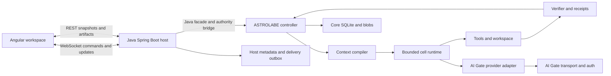
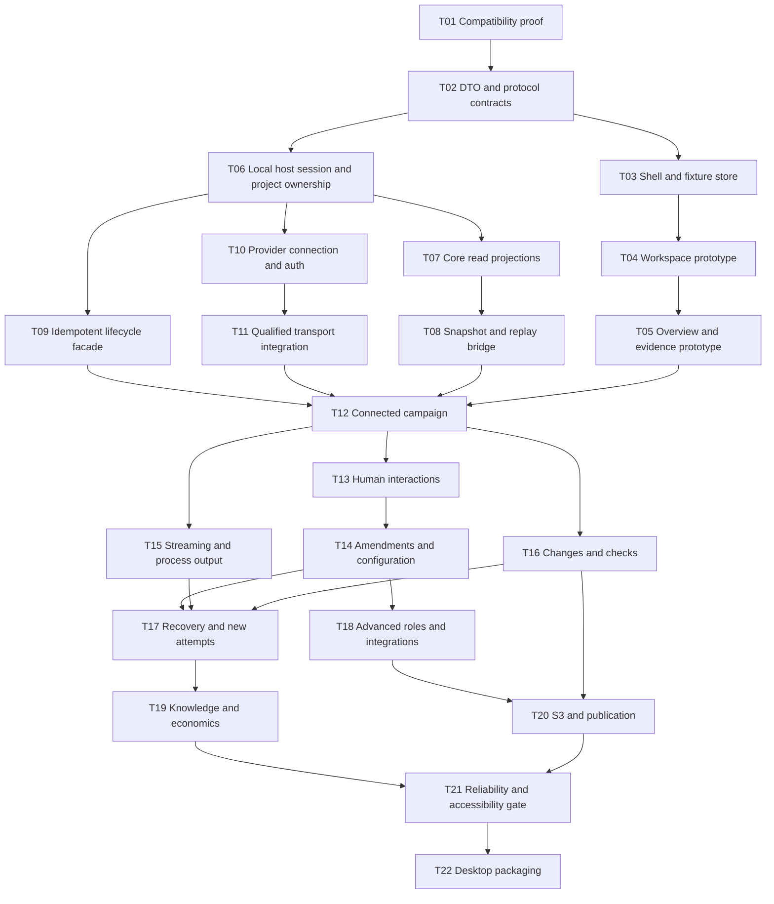

# ASTROLABE Workbench — UI specification and implementation plan

**Version:** mixed-1.0 · **Date:** 2026-09-29 · **Status:** proposed specification; selected integration claims checked against local source\
**Brief:** [ui_goals.md](ui_goals.md)  
**Deliverable:** a self-contained product concept, screen and interaction prototype, backend/frontend specification, implementation sequence, and ready-to-use implementation request.

This document combines the three UI proposals into one implementation contract. Section 0 explains the comparison; sections 1–18 define the merged design. The wireframes and scenarios are specifications for a later runnable prototype. This synthesis changes documentation only; it does not establish application or live-provider readiness.

**Reading routes:** product/design: 1, 4–7; integration/backend: 2–3, 8–12, 14; frontend: 6–7, 11–13; implementation: 15–17. Existing APIs are identified in section 2. Proposed `Host`/`Ui` APIs and G01–G10 are required work. A capability becomes available only after its owner implementation and acceptance checks exist.

## Contents

0. [Comparative assessment and merge decisions](#0-comparative-assessment-and-merge-decisions)
1. [Product direction and scope](#1-product-direction-and-scope)
2. [Architecture findings and integration gaps](#2-architecture-findings-and-integration-gaps)
3. [Domain model and ownership](#3-domain-model-and-ownership)
4. [Navigation and entry points](#4-navigation-and-entry-points)
5. [Primary workflows](#5-primary-workflows)
6. [Screens and interaction rules](#6-screens-and-interaction-rules)
7. [Visual design and prototype](#7-visual-design-and-prototype)
8. [Configuration specification](#8-configuration-specification)
9. [Provider connections and authentication](#9-provider-connections-and-authentication)
10. [Backend architecture](#10-backend-architecture)
11. [WebSocket protocol](#11-websocket-protocol)
12. [REST resources and DTOs](#12-rest-resources-and-dtos)
13. [Angular implementation](#13-angular-implementation)
14. [Security, durability, and operational behavior](#14-security-durability-and-operational-behavior)
15. [Implementation plan](#15-implementation-plan)
16. [Acceptance and verification](#16-acceptance-and-verification)
17. [Implementation request](#17-implementation-request)
18. [Sources and requirement coverage](#18-sources-and-requirement-coverage)

## 0. Comparative assessment and merge decisions

### 0.1 Ranking for this task

The criteria are implementation correctness, clear ownership and failure handling, coverage of the brief, usable visual design, and information per token. This is an editorial ranking for a compact implementation specification; it is not a measured product-quality score. Source size is UTF-8 bytes, expressed as decimal kB.

| Rank | Source | Size | Strongest contribution | Main weakness |
|---|---|---:|---|---|
| **1 — baseline** | [DESIGN](ASTROLABE_UI_DESIGN.md) | 159.0 kB | Compact structure; coherent workspace; candidate-bound evidence; explicit command, snapshot, ownership and delivery contracts | Its event table conflates declared events with emitted signals; role/settings descriptions need a stricter runtime-availability audit |
| **2** | [OPUS](ASTROLABE_UI_OPUS.md) | 248.2 kB | Most actionable code-level gap audit; detailed conversation/STATE behavior, evidence views, statistics and integration seams | Greater host coupling and UI density; 24-hour deduplication is insufficient for uncertain effects; blanket resumable-shutdown promises need qualification |
| **3** | [FABLE](ASTROLABE_UI_FABLE.md) | 261.9 kB | Rich architectural inventory, entity/source mapping, projection refresh model and screen-level acceptance detail | Event archival/cursor design and an inaccessible snapshot API undermine the read-model implementation; repeated catalogs make it costly to maintain |

**Assessment of the initial assumptions:** DESIGN is the most compact and easiest to navigate. It contains Mermaid diagrams and text wireframes; these are design artifacts, not measured analytical results. OPUS has the more explicit analytics specification. FABLE has substantial architectural depth, but that breadth does not make its engineering contracts the most reliable. OPUS is technically detailed and often more accurate about current integration gaps, while DESIGN is the stronger overall baseline for this brief.

### 0.2 Evidence behind the ranking

| Finding | Evidence | Decision in this merge |
|---|---|---|
| DESIGN handles delivery boundaries best | DESIGN §§10.4, 11.4–11.5 separates core commits, host outbox commits, snapshots and unknown command outcomes | Retain these contracts; add explicit source mappings |
| OPUS distinguishes definitions from working behavior | OPUS G-03/G-23/G-24; `Controller` constructs checkers/budgets without event sinks; `RoleTexts.worded` copies wording only | Correct event mapping and disable ineffective role/default controls |
| FABLE's durable event key is unsound | FABLE §§3.2, 9.5, 9.9 uses `(work, seq)` from the bus; `Events.counter` is per bus instance and restarts at zero; `Astrolabe` shares that bus | Use durable host stream cursors; retain `(busEpoch, sourceSeq)` only as diagnostic provenance |
| FABLE's atomic-read mechanism is unavailable to an ordinary external bridge | FABLE §§9.5, 13 calls `store.db.snapshot`; both `Db.snapshot` and `Views.snapshot` are Kotlin `internal` | Add a supported core snapshot API; do not assume a separate Kotlin module unlocks internal methods |
| OPUS's deduplication claim is too broad | OPUS §§27.1, 28.5 says a 24-hour key makes retries safe, without an atomic core mutation receipt | Keep command identities with history and reconcile uncertain effects; host dedup alone is insufficient |
| Resume/publication needs tighter bounds | `Controller.open` rejects a different attempt for existing work; lease expiry fences operations; publication consumes live run/finish state | Expose supported resume separately from new attempt, restart and publication; add owner APIs before enabling missing actions |

These findings were checked selectively in the current local repositories (section 2.1). They support the comparison but do not constitute an exhaustive code audit or runtime validation. Other source inventories are retained as navigation aids and must be checked when their implementation slice begins.

### 0.3 What was retained, imported or replaced

| Area | Selected material | Result |
|---|---|---|
| Structure, identity, protocol, security, responsive shell, delivery plan | DESIGN | One vocabulary: **Workbench**, **Conversation**, **Agent Overview**; one route and protocol scheme |
| Tool/turn rendering, STATE history, evidence layers, metric sources | OPUS §§8, 10, 13, 18 | Compact tables and progressive disclosure in section 6 |
| Entity-to-source mapping, journal/projection refresh, host-owned records | FABLE §§3, 9 | Explicit data contracts in sections 10–12, using DESIGN's cursor and snapshot guarantees |
| Dormant defaults, wording-only roles, lease and finish-record gaps | OPUS §2.7; FABLE Appendix B; local code | Current limitations stated at the point where they affect controls |
| Charts and workflow diagrams | All three | Keep DESIGN's layout/diagrams; add OPUS/FABLE metric and chart rules, with explicit missing-data semantics |
| Repeated inventories, kickoff prompts, competing names and fixed framework patch versions | Condensed or removed | One normative statement per behavior; versions verified during T01 |

The merged contract resolves disagreements explicitly. It does not combine competing bridges, event archives, navigation systems or visual palettes. Historical source documents remain unchanged.

## 1. Product direction and scope

### 1.1 The product

**ASTROLABE Workbench is a compact workspace for directing a coding campaign and inspecting the evidence behind its progress.** The familiar conversation is the default working surface. A dedicated Agent Overview exposes the campaign controller, current increment, active cells, tool activity, verification, and recovery.

At any point, the user should be able to answer:

1. What objective and constraints is the agent following?
2. What is working now, on which files, using which role and model?
3. What has been verified against the current candidate?
4. What needs my attention, and what will my response authorize?
5. What has this work consumed, including helpers and unsuccessful attempts?

The defining interaction is **select an activity → inspect its scope and evidence → act through the owning runtime component**. A check links to its receipt; a claim links to supporting observations; a changed file links to its preimage and current version; a blocked task links to the exact question or prerequisite.

### 1.2 Design decisions

| Decision | Why it fits ASTROLABE |
|---|---|
| One project sidebar and one main workspace | Preserves space for conversation, code, and dense technical details. |
| Conversation and Agent Overview are sibling views | Workflow inspection can use the whole workspace without a permanent third panel. |
| Progress is accepted requirements at a named candidate | Cell count, elapsed time, token use, and a model's completion statement do not prove completion. |
| Show the selected S0–S3 shape and its reason | The deterministic controller chooses the orchestration shape; a decorative agent graph would misrepresent execution. |
| Settings show effective value, source, and activation boundary | Attempt configuration is frozen. Saving a profile must not imply that a running cell changed model. |
| Use a small number of semantic colors | Developer attention should go to exceptions, active work, and verification gaps. |
| Keep advanced mechanisms discoverable in inspectors and settings | Context compilation, coherence, routing, and KB provenance are essential but need not occupy every screen. |
| Follow one fact across views using stable IDs | Conversation, graph, diff, logs, and receipts must describe the same operation. |

### 1.3 Scope and delivery levels

The complete target includes all the workflows in this document. Delivery is staged:

- **Prototype:** deterministic fixtures, complete navigation and state interactions, visibly marked “Demo data.”
- **Connected baseline:** real campaigns, current evidence, approvals, amendments, cancellation, provider setup, complete supported configuration, and recovery controls where qualified.
- **Advanced capabilities:** S3 worktree visualization, KB administration, optional integrations, publication beyond patch, and desktop packaging. Features appear as available only when their backend capabilities and tests exist.

Initial deployment is a **single-user local Java host on Windows or Linux**, serving Angular from the same origin. A browser is sufficient. A desktop package uses the same UI and backend contracts. Remote hosting is a separate deployment mode with explicit identity and filesystem boundaries. macOS runtime support is unqualified in the current core and must not be advertised as supported. [A02][A05]

### 1.4 Meaning of “configure everything”

Every supported public setting must have a documented UI location or an explicit explanation of why it is host-managed. This includes low-level settings in an Advanced section. It does **not** mean exposing arbitrary executable callbacks as JSON, allowing invented roles, or switching off mandatory correctness controls.

The backend publishes a versioned settings catalog with availability and validation metadata. Unavailable settings remain discoverable with an explanation such as “Requires a language-service adapter.” They must never be presented as working toggles.

## 2. Architecture findings and integration gaps

### 2.1 Inspection baseline

| Repository | Inspected HEAD | Finding |
|---|---|---|
| ASTROLABE | `25c297c281aa5016f55d71ae04ff418bc8a9bf76` | Core and Java facade now integrate AI Gate through `:provider-ai-gate`, including profile-aware estimators, cancellation settlement, and model progress. |
| llm-transport-sdk | `877a1a6fa5555d3b29e99addf679f317d5cba786` | AI Gate (`net.ai.gate`) includes call outcomes, partial usage, protocol features, preparation/counting, history policies, and UI descriptors. |

Both library working trees were clean during this inspection. The root ASTROLABE README still calls the repository architecture-only; that is stale as an inventory. Source code and `actual_state.md` establish implemented P0–P6 functionality plus the AI Gate transport. The recorded adapter verification is offline and local to Windows; its live smoke tests have not been run. Workbench host/UI implementation and live qualification remain separate work. [A01][A02][A33]

The architecture map links to the current subsystem documents. Its immutable `sources/` files are historical inputs, not the implementation authority. The integration analysis and both change plans explain the intended boundary; their old gap lists and illustrative APIs must be checked against the current source. In particular, the implemented `gate` schema and call lifecycle supersede the earlier adapter sketches. [A01][I01][I02][I03][A35]

### 2.2 What makes this UI specific to ASTROLABE

| Architecture property | UI consequence |
|---|---|
| A durable campaign and bounded cell have different lifetimes | Sidebar sessions resolve to campaigns; attempts and cell lineages appear inside a session. Rebuilds do not create a new user objective. |
| The controller owns contract, graph, ledger, and scheduling | Graph nodes are observed execution. Users propose changes through commands; dragging a node cannot rewrite the plan. |
| The verifier accepts completion | “Completed” requires the final supported state and finish receipt. Assistant prose cannot set the badge. |
| Result packets cross cell boundaries | Overview edges represent packets, checks, dependency relations, or actual dispatch; they do not imply agents share one conversation. |
| Four identities and workspace-qualified versions | Inspectors retain work, attempt, candidate, and context IDs plus workspace and generation qualifiers. |
| Five coherence horizons | Staleness is visible for reads, STATE claims, checks, notes, and delegated results. Historical evidence remains inspectable. |
| Context uses `[S][R][K][T][A]` | Context inspector separates compiled input, transcript, and volatile anchor, with rebuild history and coverage limitations. |
| Roles configure one runtime | The role editor exposes bounded configuration of declared roles, rather than an unrestricted agent builder. |
| Quality floors constrain routing | A cheap model selection can be refused; UI explains the floor and eligible alternatives instead of silently downgrading. |
| All children and retries spend the originating budget | Usage totals include probes, reviews, repair, extraction, retries, and integration. |
| Publication uses separate permission stages | Patch complete, committed, pushed, merged, and deployed are distinct outcomes and controls. |

These consequences follow the ownership, lifecycle, role, context, and evidence contracts. [A03][A04][A06][A11][A12]

### 2.3 Existing callable entry points

| Existing entry point | What the host can do now | Important limitation |
|---|---|---|
| `AstrolabeJava(Config, ProviderAdapter, JavaAuthority, EstimatorFactory, ...)` | Pass the existing `AiGateAdapter` and `adapter.estimators(new HeuristicEstimator())` directly from Java. | This overload accepts the provider module's object; the `JavaProviderAdapter` overload remains for Java-authored adapters. Ownership is explicit. |
| `open(Path)` | Acquire a project, store, and project lock. | Host must own and close the project; closing it during a campaign is invalid. |
| `campaign(project, request, policy, publication)` | Start a new campaign and obtain a future for its handle. | Public facade allocates a new work ID and first attempt; one active campaign per project. |
| `JavaCampaignHandle.await / isDone / cancel` | Observe terminal outcome and request cancellation. | Cancellation settles effects and usage; it is not a reversible pause. |
| `JavaCampaignHandle.amend(text)` | Add a user amendment visible to the running cell on a later turn. | No expected-revision or command-deduplication parameter; no structured requirement transformation through this signature. |
| `AstrolabeJava.subscribe(EventSink)` | Receive all runtime events. | References and metadata, not a durable token stream. Subscribe before starting work. |
| `JavaCampaignHandle.subscribe(EventSink)` | Receive events filtered to a work ID. | Filtering shared bus events does not create contiguous per-work sequence numbers. |
| `Project.views / handle.views` | Read contract, ledger, register, workset, checks, usage, receipts, and finish packet. | Typed wrappers contain `StoredRow` bodies; no complete UI DTO, cross-view public atomic snapshot, or full list/search API. |
| `JavaAuthority.ask / approve / resolve / review` | Await typed host responses through futures. | Pending items need host persistence, user ownership, revision checks, timeouts, and restart reconciliation. |
| `Controller.open` with existing IDs | Lower-level reopen and reconciliation, including resumable outcomes. | No equivalent public Java resume command; avoid duplicating the controller in Spring. |
| `AiGateAdapter.violations / warnings / estimators` | Validate profiles against the SDK, surface catalog warnings, and supply admission estimators. | Run alongside `Config.violations()`; core validation does not parse the adapter's `gate` settings. |
| `AiGateProfiles.draft / qualify` | Draft a profile from catalog/protocol facts; optionally probe an endpoint and return a narrowed profile. | Drafting is local; `qualify` makes billable calls and returns a proposal, never an active-attempt update. |
| `Llm.models / auth / start / features / prepare / countTokens / addListener / preview / test / describe` | Catalog, call lifecycle, protocol facts, admission support, telemetry, and diagnostics. | Campaign calls go through the adapter. Text streaming still needs a presentation bridge; auth stays private. |

Sources: [A07][A08][A09][A10][A13][A21][A33][A34][A42][S01][S02][S03].

The Java-specific methods and authority futures are defined in [AstrolabeJava][A21] and [JavaAuthority][A22]. In particular, `Contracts.amendByUser` appends a request and increments the revision; its default transformation is identity. `Contract.objective` returns the latest request text. Therefore an incremental message such as “also keep anonymous access” cannot by itself be treated as a fully rebuilt contract. G08 must preserve applicable prior obligations, derive a proposed structured change, and record the user's authorized amendment without silently dropping the original objective. [A24][A32]

### 2.4 Important implementation details

- `Events` retains **256** recent events and buffers **4096** per subscriber by default. Slow subscribers lose their oldest pending entries. It is an in-memory notification bus. The `AtomicLong` belongs to the bus instance shared by the facade, despite comments describing a per-campaign sequence. Do not persist that number as a globally durable UI cursor. [A09]
- `AgentEvent.Cell.ModelProgress` now reports `started / output / retrying`, invocation ID, character/token counts when available, and retry attempt. It carries no text. AI Gate's `ChatEvent.TextDelta` is not exposed by the adapter's `LlmCall` path; G06 still needs a presentation bridge. [A08][A33][S03][S18]
- `Project.kb` currently returns `EmptyKb`; the controller opens the campaign KB separately. A “Knowledge” page must use a supported read facade over the actual store, not this convenience property. [A07][A13]
- Declared role names are `implementing, plan, probe, review, qa, writer, repair, extractor`. Unknown role names fail `Config.violations()`. Overrides cannot widen the default tool mask or permission, change the packet kind, or re-grant denied note kinds. Persona text allows at most three lines. [A05][A06]
- `Confined` requires an external isolation backend. `TrustedLocal` is the working default and has no process sandbox. A label cannot supply confinement. [A14]
- Background processes are owned by the harness; the core does not supply detached jobs that survive host exit. After a crash, recovery can report `lost`. [A05]
- `CampaignOutcome` has `completed, waiting_for_process, waiting_for_input, blocked_external, budget_exhausted, cancelled, failed`. Cell `partial` or `replan` is not a campaign completion state. [A15]
- Settings and prices are frozen per attempt. Transport catalog refresh and configuration editing must not silently alter the active attempt. [A16]
- Event declarations are not an emission guarantee. In the inspected controller path, `Checker` and `CellBudget.of` receive no event bus. Their check/budget notifications therefore do not drive the normal campaign UI. Section 11.6 specifies durable fallbacks. [A13][A43][A44]
- Configured roles currently change `personaLines`, `duties` and `policyTextVersion` through `RoleTexts.worded`. Validated mask/permission/context overrides are not applied by that function. Show other role fields as read-only until their runtime binding is implemented and tested. [A45]
- The controller's default lease is one hour, acquired at open; the normal controller path has no periodic renewal. A long human wait can outlast it. Show lease expiry and a supported reopen action; increasing a timeout does not supply renewal. [A13][A46]
- `Views.finishReceipt` queries `packets.kind=finish_receipt`, while `FinishReceipts.export` writes a PACKET blob and `exports/<work>/finish-receipt.json`. Resolve the emitted digest or validated export; an empty view is not proof that no receipt exists. The export path is per work, so future multi-attempt history requires immutable attempt-qualified references. Cell result packets also need an explicit persistence/read contract; a boundary summary cannot reproduce an uncaptured full packet. [A10][A47]

### 2.5 Required additions and owners

All names prefixed `Host` or `Ui` below are **proposed**, not existing APIs. G01–G10 identify Workbench integration work; they are distinct from the adapter's `G-nn` change IDs in [I03].

| Gap | Required contract | Owner / dependency |
|---|---|---|
| G01 Transport host wiring and qualification | Compose the existing `AiGateAdapter`, estimators, validated profiles and resource ownership; qualify the host's selected profiles | Spring host + existing `:provider-ai-gate`; transport implementation is present [A21][A33][A34] |
| G02 Java recovery and controlled starts | Java facade operations for start with durable command identity, reopen by work/attempt ID, lease visibility/renewal policy, and a supported new attempt | Core; reuse `Controller`; current open rejects a different attempt on existing work |
| G03 Complete read projections | `HostSnapshot` in one read transaction with revision; enumeration; transcript/artifact, context, process/intent, KB, routing and integration projections; stable finish/result packet references | Core read API + host DTO mapper; current internal snapshot methods are not a host API |
| G04 Reliable UI delivery | Host outbox, replay, subscription cursor, snapshots, and explicit loss/resync semantics | Spring host; core durable change revision/read support |
| G05 Human interaction persistence | Pending question/approval/review store, single-use resolution, and recovery binding to current core requests | Spring authority bridge + core recovery support |
| G06 Token presentation | Add an opt-in text bridge to the existing call path, preserve one stream consumer and terminal outcome, link safe deltas to canonical messages | Adapter/SDK presentation seam + host; count/status progress already exists |
| G07 Idempotent core mutations | Stable command IDs and expected revisions at core mutation boundaries, with durable result lookup | Core; especially amendment, start, publication and new attempt |
| G08 Explicit user operations | Structured initial contract, check request, process cancellation, unknown-effect reconciliation, guarded revert, post-run publication and curator actions through owner APIs | Core facade additions; no direct SQL writes |
| G09 Complete configuration binding | Consumer audit for each field, role override enforcement, supported nested policies and host SPI registrations; capability metadata | Host + narrowly scoped core additions; a field passing validation does not establish that the runtime consumes it |
| G10 Desktop integration | Local launcher, project picker, external browser auth, packaged runtime, lifecycle notifications | Desktop host; same web contracts |

G02 does not make every terminal outcome resumable. Current core resumes external waits and reconciles interrupted activity. Completed/cancelled/budget-exhausted/failed runs require an explicitly supported new-attempt or follow-up path with preserved history and budget accounting.

### 2.6 Integration decision

Use the public Java facade for supported operations and add narrow owner APIs for G02/G03/G07/G08. This preserves the requested Java backend and keeps scheduling, authority, reconciliation and publication semantics inside core.

A thin Kotlin adapter is an optional interoperability detail when a necessary public API is suspending. It may convert futures/serialization, but it must not copy the controller loop, reach Kotlin `internal` methods, or turn direct SQL access into a second mutation path. A temporary read adapter needs pinned schema support and contract tests; it cannot claim atomic cross-view snapshots without a public transaction boundary. This resolves the bridge-first proposals in OPUS/FABLE in favor of the stronger ownership boundary in DESIGN.

Connected mode refuses unavailable prerequisites with their gap IDs. Demo mode is selected explicitly and labeled throughout; a missing adapter must not silently switch a real campaign to a fake provider.

## 3. Domain model and ownership

### 3.1 Vocabulary presented to users

| UI term | Runtime meaning | Lifetime |
|---|---|---|
| Project | Canonical repository + host project metadata + core store reference | Across sessions |
| Session / campaign | One logical objective, `work_id` | Across attempts and reconnects |
| Attempt | Execution under a frozen harness/profile configuration, `attempt_id` | Until its recorded outcome |
| Candidate | Exact artifact state and environment, `candidate_id` | Changes with relevant workspace state |
| Cell | Bounded execution of an increment or delegated role, `context_id` | Until its result packet |
| Increment | A unit in the requirement graph with acceptance and write scope | May span continuation cells |
| Check receipt | Immutable evidence about a check, candidate, scope, and environment | Retained with validity computed separately |
| Pending action | A question, effect approval, amendment proposal, or human review | Until resolved, superseded, or expired |
| Workspace | Primary repository or isolated worktree with its own identity | Qualified for all file/coverage references |

“Session” is a navigation label, not a second authority model. Renaming or archiving a session changes host metadata only. Deleting history or repository data is a separate operation.

### 3.2 State ownership



Core owns requirements, acceptance, ledger, workspace mutation, verification validity, accounting, and KB admission. Host owns authenticated users, projects, UI metadata, command tracking, delivery, and pending interaction presentation. Angular owns selection, layout, drafts, and rendering.

The host database stores references and rebuildable projections of core facts. It never updates core tables. SDK listeners are diagnostics; core accounting is the authority for campaign totals.

### 3.3 Read model rules

- Every campaign DTO carries `projectId, workId, attemptId, contractRevision, candidateId` when known.
- Cell-specific DTOs additionally carry `contextId, generation, workspaceId`. Unknown values are `null` with a reason, not synthetic IDs.
- Separate `phase`, `outcome`, `connectionStatus`, and `publicationStage`. A disconnected client can still have a running campaign.
- Keep `recordedOutcome` separate from `currentValidity`. A passing receipt can be stale now.
- `allowedActions` is computed by the backend, includes disabled reasons, and is revalidated on every command.
- Requirement progress is `acceptedCurrent / requiredCurrent` for a named contract revision and candidate. Show “0 requirements defined” instead of 0% or 100% when the denominator is zero.
- Budget usage, elapsed time, and context occupancy have their own units and labels; none is a completion percentage.
- Display source freshness: live, last synchronized, historical, or unavailable.

## 4. Navigation and entry points

### 4.1 Application structure

**Sidebar, top to bottom:**

1. ASTROLABE wordmark, collapse control, connection indicator.
2. Project switcher and “Open project.”
3. “New session” button and session search.
4. Sessions grouped by Active, Recent, and Archived; each row has title, status icon, and relative update time.
5. Project Knowledge and Activity links.
6. Settings and provider connection summary.

**Session workspace:** breadcrumb and campaign title; status and compact counters; tabs **Conversation / Agent Overview / Changes / Checks**. Contract, Context, Processes, Usage, and History are available through a single “Inspect” menu. A selected inspector expands inline or replaces the content area; it does not add a permanent column.

### 4.2 Routes

| Route | Entry / purpose |
|---|---|
| `/welcome` | Connect to host, choose theme, connect provider, open project |
| `/projects` | Recent projects; open/register repository on the host |
| `/p/:projectId` | Project summary and sessions |
| `/p/:projectId/new` | New request, scope, acceptance, budget, and profile |
| `/p/:projectId/s/:workId/conversation` | Default workspace |
| `/p/:projectId/s/:workId/overview` | Live execution and requirement graph |
| `/p/:projectId/s/:workId/changes` | Candidate diff and file history |
| `/p/:projectId/s/:workId/checks` | Current verification and historical receipts |
| `/p/:projectId/knowledge` | Notes, skills, provenance, admission queue |
| `/p/:projectId/activity` | Campaigns, processes, recovery, and history |
| `/settings/:section` | Appearance, connections, profiles, roles, policies, integrations, advanced |
| `/connections/:connectionId/auth/:flowId` | Private authentication interaction |

Use query parameters `attempt, context, candidate, inspect, ref` for durable deep links. Reloading a deep link loads its snapshot before subscribing. References remain authorized by project; possessing an ID is insufficient.

### 4.3 Entry-point behavior

- **Local open:** native picker where packaged; browser uses a server-side directory chooser within configured roots or a pasted host path. A browser upload is not a writable repository mount.
- **Remote open:** clearly label “Repository on <host>”; select an authorized server workspace. Do not imply that a browser-local folder can be executed by the remote server.
- **Reopen session:** attach to a running handle or load history. Resuming is a separate visible command when allowed.
- **Notification:** opens the exact pending item with its original project/work/revision.
- **CLI handoff, proposed:** launcher accepts a canonical project path and optional work ID, registers through the same host, then opens a local app route. It must not start a second controller.
- **External editor:** validated file/line links use the configured editor handler after user action; unavailable handlers offer Copy path.

## 5. Primary workflows

### 5.1 First useful run

1. Launch host; open Workbench; backend reports platform, SDK versions, integration availability, and authenticated session.
2. Open an existing repository. Show canonical path, branch, dirty-file count, project-lock status, detected commands, and execution mode.
3. Connect a provider or select an existing connection. Test configuration, connectivity, and model access using the SDK diagnostic contract; show stage-level results and limitations.
4. Select a qualified model profile. Display effective routing, token/cost limits, price date, and any unknown capabilities.
5. Enter the task. Expand “Task controls” only when needed: scope, protected paths, constraints/exclusions, acceptance, budget, expected resume, publication ceiling, rules binding.
6. Review the concise start summary; click **Start campaign**. Start is disabled with actionable errors if transport, model, project lock, budget, or settings are invalid.
7. The backend commits the command identity, opens the campaign, and returns its IDs. The UI clears the draft only once creation is durably confirmed.

The current facade accepts request text plus campaign policy, rather than a structured contract. Structured controls depend on G08; until implemented, the connected UI must clearly identify which controls are supported and must not hide structured settings in prompt prose as a substitute for enforcement.

### 5.2 Directing an active campaign

The composer has explicit modes:

- **Amend objective**: updates authoritative user instruction. Show a preview against current contract and require an expected revision. Preserve the original request in history.
- **Answer pending question**: bound to a question ID and revision; choices and free text; distinguish factual response from a requirement change.
- **Draft follow-up**: saved without dispatch while the current work continues; after completion, creates a new work item with links to relevant artifacts.

Do not send arbitrary “chat” directly to AI Gate outside the campaign; that would create an untracked second coding loop. Rich attachments are versioned file references or sanitized text artifacts with scope/provenance, admitted into core context through a supported host API.

For a short incremental amendment, the preview shows the resulting full objective and a diff of requirements, acceptance, scope and authority. The user confirms that concrete revision before dispatch. Preserve the short original message as provenance. Text-only amendment and structured amendment are distinguished in the backend capability contract; neither can claim the other's enforcement.

During an active run, the composer shows “Applies on next turn” for an amendment. An immediate **Stop** command cancels through the campaign handle. After acceptance of the command, show **Stopping · settling effects and usage** until the core reaches a terminal outcome. If `providerTerminalWaitSeconds` expires, retain an explicit “Usage unreconciled” state and the core's conservative charge; a terminal campaign outcome does not prove provider billing stopped. [A19][A20]

### 5.3 Questions, permissions, and human review

Pending actions appear inline above the composer and increment an attention counter in the sidebar. Each displays:

- requesting role and current task;
- exact question or action, effect class, arguments, working directory, paths and expected effect;
- applicable contract revision and candidate;
- choices or Allow once / Deny, with an optional reason;
- whether the answer changes requirements or authority.

A D-class approval is scoped to that request and revision. “Always allow” is not an incidental button; persistent policy changes go through settings/contract authorization. Human review displays the evidence packet and allows Accept, Reject, or Insufficient evidence using the runtime verdict vocabulary. A review does not rewrite test results.

The current `resolve` type also carries plan acceptance and knowledge-admission proposals. Add a typed proposal kind/provenance through G08 before offering specialized actions. Reason-text prefixes may help display diagnostics, but cannot decide authority or silently classify an unknown proposal. Unknown kinds open a generic inspection state until the owner supplies a supported resolution path.

Browser disconnect keeps a valid pending item available. An explicit timeout resolves through policy into a supported blocked/denied outcome; it never counts as consent. Reconnect shows the current item. A stale response gets a revision conflict and a refreshed preview.

### 5.4 Completion and publication

Completion presents a compact receipt summary: objective, accepted requirements, current checks, remaining gaps, candidate, changed files, cost completeness, and highest publication stage.

- **Review changes** is always available when artifacts exist.
- **Export patch** produces a candidate-bound artifact.
- **Commit / Push / Merge / Deploy** appear only when supported, within the contract ceiling, and authorized for their exact stage and target.
- Changing workspace contents invalidates the publication preview and requires revalidation.
- Deployment requires a supplied host deployer. Do not render a functional deployment switch merely because `Stage.Deploy` exists.

The current facade accepts publication at campaign start and exposes results afterward. Interactive post-run publication is G08. The planned UI must not bypass it with ad hoc Git commands. [A17]

### 5.5 Reconnect, recover, and change profile

**Reconnect** restores display from snapshot plus stream replay; it never restarts the campaign.

**Resume** asks core to reopen eligible existing work, reconcile pending effects, inspect external changes, and recover checkpoints. With the default `unknownOutcomeReconciliation=Host`, unresolved effects require an evidence-backed host action through G08 before the fence can lift; a Resume acknowledgment alone is insufficient. A lost process is shown as lost, not silently relaunched. [A36][A41]

An expired lease or reply is shown with its original request and current disposition. Reopen may produce a new authority request; a late answer is retained as context and must be rebound and revalidated before use. Do not auto-resume merely because an old answer arrived. After host restart or lease expiry, post-run publication stays unavailable until the publisher can reconstruct and validate the finish evidence through G08.

**New attempt** uses the same logical work when supported, a new attempt ID, and a newly frozen policy. The UI shows prior outcomes and accumulated cost. Budget changes require an explicit authorized amendment; a model change cannot reset expenditure.

Profile edits made while running show “Saved for future attempts.” Provide a deliberate “Stop and prepare new attempt” flow when G02/G07 support it. Do not label cancellation as Pause or promise that an in-flight model call can resume.

## 6. Screens and interaction rules

### 6.1 Conversation

Use a chronological, selectable transcript with stable message anchors:

- User requests and authorized amendments retain their original text.
- Agent responses use readable Markdown with sanitized links and code blocks.
- Each turn begins with a short observable intent/status line when supplied: “Tracing the cache invalidation callers.”
- Consecutive read/search operations collapse to a row such as “Inspected 4 files · 2 searches.” Expanding lists each operation, scope, output completeness, and artifact link.
- Edits show paths, additions/deletions, candidate transition, and a diff link.
- Checks show absolute current status as well as the latest delta: “24 passed, 1 failed · 1 new failure.”
- Rebuilds, routing changes, recovery, and delegation appear as concise boundary rows.
- Interrupted output is marked Partial; it cannot masquerade as the final assistant response.

Do not auto-scroll when the user has scrolled away from the bottom. Show “12 new events · Jump to live.” Preserve text selection, expanded rows, and scroll position when updates arrive. Virtualize or page old activity while retaining accessible navigation and search.

Group the conversation by **campaign → cell → turn**, with child cells linked under their delegation. A collapsed turn shows its number, first response line or “Tool calls only,” operation counts, duration and output usage. Expanded turns preserve the dispatcher's **Read → Edit → Execute → Metadata** order. Live model progress shows observed stage/counts; canonical text appears when the journal response is available. Completed cells collapse unless the user pinned them open.

| Tool family | Collapsed row | Expanded detail |
|---|---|---|
| `look` | Operation, path/range, result count | Versioned captured content; search coverage, truncation, retrieval tier and recall refs |
| `edit` | Paths, diffstat, before/after versions, outcome | Diff, syntax result, scope and test-integrity flags, transform receipt |
| `run` | Redacted argv, effect class, status, duration | cwd, deadlines, observed/unknown effects, process handle, parsed counts and bounded log |
| `verify` | Check/acceptance ID, outcome and current validity | Candidate, receipt, closure/reuse proof and evidence refs |
| `state` | Register version and changed-section count | Validated patch and register diff |
| `task` | Question, delegation, collection or proposal | Typed request, authority response, child lineage and packet availability |
| `kb` | Search/get/propose/skill action | Note kind, scope, provenance, admission status and freshness |

Use result-envelope status; model commentary cannot overwrite it. Surface `truncated`, `redacted`, `effects unknown`, stale-version and instruction-shaped-content flags where supplied. Filters cover Conversation, Tools, Checks, Decisions, Problems and role. Loaded-item search reports its range; whole-campaign search is paged and reports completeness. All items support Copy link.

### 6.2 Agent Overview

The top strip contains:

`Shape S2 · Increment 2 of 4 selected · implementing · main-profile · Verify · Turn 8/40`

Under it: **2/5 requirements accepted at candidate c42**, elapsed time, budget used/reserved, and current attention item. “2 of 4” is the selected increment index, not a guarantee that the plan is fixed.

Two modes share one selection:

1. **Execution** — the default, focused on what is running.
2. **Requirements** — dependency graph with increment scope, acceptance, blockers, and evidence.

Execution view uses stable left-to-right lanes:

`Contract → Select increment → Compile → Active cell → Verify → Accept`

The active cell expands in place to show `model → tool batch → observation`. Probe and review cells branch only when dispatched. The KB/context source is a small attachment, not an always-expanded constellation. Recovery returns to an appropriate boundary; finalization is visibly separate from increment acceptance.

| Shape | Graph behavior |
|---|---|
| S0 | Compact single-cell path; keep verification and lifecycle nodes. |
| S1 | Increment sequence, plan cell, continuation cells, and compile boundaries. |
| S2 | Explicit probe/review branches, returned packets, routing/refusal and recovery edges. |
| S3 | Writer lanes by workspace and scope; completed packets enter one integration queue; combined-candidate checks precede acceptance. |

**Nodes:** label, role/function, status word/icon, scope summary, duration, and profile if model-backed. Deterministic controller/compiler/verifier nodes do not get a model avatar. Each live node retains its ID across rerenders. Selecting one opens details below the graph: inputs, outputs, scope, event trail, receipts, and limitations.

**Edges:** typed as dependency, dispatch, tool result, packet return, verification, or integration. Animate an edge only on an observed transition. An active node may have a subtle indicator; do not fabricate continuous “information exchange.”

**High-level reasoning progress:** show declared intent, recorded hypotheses and their evidence state, decisions with rationale, rejected alternatives, and verified outcomes when those records exist. Do not claim to reveal private chain-of-thought or infer thoughts from token timing. Provider-exposed reasoning content is optional, capability-dependent, collapsed, and governed by the adapter's display policy; opaque reasoning/signature artifacts remain server-side.

**Graph controls:** Fit, Follow active, selected lineage, time range, and list view. Default shows current increment and immediate dependencies; expand completed groups. Disable Follow active when the user pans or selects history. S3 exposes “3 active cells” instead of suggesting one active agent.

**Visual grammar:** deterministic services use squared outlines; model cells use rounded outlines; stores use a double top rule. Labels and icons remain authoritative. Keep topology stable within a shape and reserve child slots to prevent movement when events arrive. At most three expanded child lanes are shown initially; the rest are listed. A selected cell can show a small Model/Read/Edit/Execute/Metadata strip and its last 12 turns. Turns and context meters indicate consumption, not completion.

**Working register (STATE):** a tab below the graph shows the latest captured register, its source version, and history. It shares space with Activity rather than creating a permanent extra panel.

| Register section | Presentation |
|---|---|
| Plan | Done/current/pending/cancelled marks, dependencies and acceptance refs |
| Facts | Hypothesis / recorded verified / refuted; anchors, evidence refs and staleness |
| Decisions and dead ends | Decision, recorded rationale, rejected option and reopen condition |
| Open, Focus, Amendments, Next | Unresolved question, current scope, pending proposal and next recorded action |

STATE is a model-maintained, validated artifact. A fact tagged verified in STATE is not independently accepted by the verifier; distinguish that tag from check receipts and requirement acceptance. Show exact captured records and their evidence instead of generating an extra model summary. Historical missing fields stay “Not captured.”

**Replay:** use the same pure projection reducer for live and retained normalized events. A historical position reproduces captured state at its recorded revision; it cannot reconstruct unrecorded thoughts, transient events or text. Store periodic reducer checkpoints only when replay cost warrants them. Jump to live replaces historical selection without mutating the campaign. Gaps are visible and never filled with fabricated animations.

### 6.3 Contract and requirements

An inspector shows verbatim objective and amendment history; constraints and exclusions; write/protected scopes; acceptance items `run / check / review`; dependencies; ledger status; and source authority.

Each acceptance item displays its own obligation version and current evidence. A proposed weakening has a before/after comparison and the obligations it would retire. A model proposal never becomes a user amendment merely because it appeared in conversation.

### 6.4 Changes

Main view: compact file list and diff content within the same workspace. Offer unified and side-by-side diff where width allows. Show pre-existing dirty changes separately from campaign changes using the core's baseline snapshot.

Per file show workspace, candidate, content version, origin (agent edit / command / external), and applicable checks. Large files load by bounded chunks; binary/non-UTF-8 files show metadata and the core limitation.

User actions: inspect, copy path, open in editor, export patch, request guarded revert. A revert preview names the expected current version, target edit/snapshot, affected files, and preserved user changes. Revalidate before applying through core; a conflict opens a comparison. Browser editing is a later optional capability requiring the same versioned edit path; the baseline diff is read-only.

### 6.5 Checks and evidence

Default table columns: Check, Scope, Outcome, Current validity, Candidate, Counts, Duration, Last updated.

Filters: Required, Failed, Stale, Running, All. An empty run that discovered no tests must be distinct from a passing suite. Show pre-existing failures only with linked baseline evidence. Refactor mode exposes `red_ok_until` and its expiry; temporary red does not remove final acceptance.

Receipt detail includes command/argv, cwd, environment, verifier/check definition versions, contract revision, input closure, before/after stamps, parsed counts, raw-output reference, redaction/capture limits, and any reuse proof. Retain older results; do not repaint an old receipt green for the new tree.

Provide an **Acceptance matrix** linking requirement → obligation version → receipt/review → candidate → current validity. Separate executable checks, evidence assessments and signed reviews. An acceptance run passing does not independently close an increment; the ledger transition comes from core.

| Evidence layer | Detail shown when produced |
|---|---|
| L0 | Syntax, types and lint; absolute counts and deltas |
| L1 | Unit, impact/blast and acceptance runs |
| L2 | Integration, full suite, quality gates and combined S3 candidate |
| L3 | Product-use cases, expected/observed behavior and artifacts |
| L4 | Measurement workload, environment, variability and limits |
| L5 | Independent review, signer, coverage and findings |

Unavailable layers remain labeled by capability. Review outcomes retain the core vocabulary, including insufficient evidence. An Integrity inspector pairs each test deletion, assertion weakening, skip/config/snapshot change or unknown weakening risk with the original obligation, justification and resolving verdict. A failed required check remains failed regardless of review prose.

### 6.6 Context and knowledge

**Context inspector** is read-only:

- `S` system/role and tool schema identity;
- `R` repository orientation, rules binding, project knowledge;
- `K` increment contract slice, notes, seeds, skill modules and carry-forward;
- `T` transcript residency, stubs, retained history;
- `A` current anchor/register summary and gauge, only if a supported runtime projection exposes it.

Show context occupancy, output headroom, estimator version/confidence, compile manifest, known/unseen regions, current file versions, and rebuild reason/generation. The volatile anchor is not an existing persisted artifact; historical views must say “not captured” rather than fabricate it.

**Knowledge** has Notes, Skills, and Admission tabs. Search by kind, scope, freshness, source, and status. Detail shows anchors, evidence refs, confidence, provenance, validity dependencies, supersession, and role visibility. A user edit creates a proposal through the curator; it does not write a Markdown export or promote a claim directly. Stale notes stay inspectable but are not represented as eligible live context.

Skills promotion, dense retrieval, behavior maps, and calibration data expose their availability and measured status. Configuration experiments and evaluation-only arms are not everyday task presets.

### 6.7 Processes

Accessible from an active-process counter and Activity. List process handle, campaign/cell, command, cwd, effect class, status, start time, timeout, output cursor, capture completeness, and exit code.

Selecting a process opens a bounded log viewer with stdout/stderr labels, Follow output, Copy, Download redacted log, and Cancel if authorized. User cancellation is an explicit handle-specific core command, not an arbitrary shell kill. Network disconnect leaves the process running; backend exit follows core process ownership rules.

A process can be `running, exited, cancelled, timed out, lost, unknown` according to its projection. Preserve the raw status when the core vocabulary differs. “No new output” is not a terminal status.

### 6.8 Usage and routing

Overview totals: exact known cost or “Known cost … · usage incomplete,” tokens, elapsed/tool time, invocation count, and remaining/reserved budget. Expand by attempt → role → invocation and by phase.

Keep these quantities separate:

1. model-visible context occupancy;
2. estimated admission/reservation;
3. provider-reported billable dimensions;
4. priced cost using a dated price table.

Price uncached input, cache reads, each cache-write class, and output once each. Do not add diagnostic total-input or reasoning-in-output a second time. Do not sum currencies without an explicit dated conversion policy. Cost per accepted task is undefined at zero accepted tasks. [A18]

Progress counts are provisional. AI Gate `Usage.finalForCall() == false` means output may still grow; the adapter maps that output dimension to unknown. Render core `BillableUsage` and its frozen price table for campaign totals. SDK retry attempts belong inside one invocation and must remain distinct from campaign `attemptId`; correlate transport diagnostics using `astrolabe.invocation` and `astrolabe.profile` tags. [A33][A39][S19][S21]

Routing inspector shows function, required tier, selected profile/effort, price/calibration date, risk floor, excluded alternatives and refusal reason where captured. Missing traces display “Not captured in this runtime version”; a profile switch is recorded, not silently animated.

**Analytics:** default to this campaign, with project/time-range aggregation available. Every aggregate states its covered attempts, observation window and completeness. Use core invocation accounting for spend; SDK request telemetry supplies provider diagnostics.

| View | Metric/source | Display and limitation |
|---|---|---|
| Spend | `Accounting.calls/totals`, dated prices | Known cost over time and disjoint token-dimension bars; coverage such as “118 of 121 calls fully priced” |
| Outcome economics | Ledger + accounting | Cost per currently accepted requirement with explicit numerator scope; undefined at zero acceptance; incomplete if any included cost is unknown |
| Cell behavior | Captured cells, turns, rebuilds and boundary records | Turns/cell, continuations/increment and rebuild reasons; report denominator and sample count |
| Verification | Receipts + journal | Outcomes by layer and candidate; current/stale/inconclusive separated |
| Recovery and routing | Recovery boundaries + `routing_log` | Failure classes, repairs, escalation and selected profiles; unavailable traces labeled |
| Human interventions | Host interaction records | Pending count and response latency; unanswered items excluded from latency distributions and counted separately |
| Execution timing | Captured `span.*` + trace projection | Indented duration bars; wall time separate from summed worker time; exclusive cost for totals, inclusive cost for inspection |
| Provider health | Correlated SDK listener telemetry | Latency, first-output time, retry count and error category; coverage and provider-retry identity shown |
| Knowledge | Supported KB health projections | Admission, citation and freshness counts; missing producers yield “Not measured” |

Chart rules: lines for time, horizontal/stacked bars for known quantities, indented bars for spans. Use the accent for selection/primary series and neutrals for the rest; failure/stale markers retain text labels. No 3-D or pie charts. Every chart has a table and explicit units/timezone. An unknown amount has no numerical segment width: show a separate unknown badge/region and known subtotal. Do not fabricate a total or proportional share. Cache-hit rate is diagnostic; it does not establish lower cost or better outcomes. Critical-path/concurrency claims require sufficiently complete span capture.

### 6.9 State and error treatments

| Situation | Main presentation | Available next action |
|---|---|---|
| No project | Short explanation and Open project | Register repository |
| No qualified model | Setup checklist with exact failing capability | Connect / configure profile |
| Project busy | Existing work and lock owner if known | Open active session |
| Waiting for input | Inline pending item, attention badge | Answer / deny / cancel |
| Waiting for process | Handle, command, latest output time | Inspect / permitted cancel |
| Blocked external | Reason and reconciliation status | Resolve prerequisite, then supported resume |
| Budget exhausted | Consumption, reserves, unfinished obligations | Authorized budget/new-attempt flow |
| Routing refused | Unsatisfied floor, unavailable/unaffordable profiles | Configure eligible profile or revise task |
| Provider error | Retry state, delay, response category, known/unknown outcome | Inspect; retry only if policy permits |
| Cancelling | Settlement progress and active effects | Inspect; no second start until settled |
| Disconnected | Last synchronized time; current state marked stale | Reconnect; preserve drafts |
| Backend restarted | Recovering snapshot and command outcomes | Inspect unknown effects before resuming |
| Unsupported capability | Named missing adapter or gate | Configure prerequisite |
| Completed | Final receipt and publication stage | Review / export / authorized publication |

## 7. Visual design and prototype

### 7.1 Visual direction

Use a quiet graphite and warm-neutral interface with restrained teal as the action/active accent. Flat surfaces, clear typography, hairline dividers, and compact aligned rows should carry hierarchy. Avoid decorative gradients, glowing nodes, glass effects, giant metrics, and nested cards. The ASTROLABE mark can be a simple geometric instrument symbol; the workspace is the visual focus.

| Token | Dark | Light |
|---|---|---|
| App background | `#111416` | `#F5F6F4` |
| Sidebar | `#15191C` | `#ECEFEC` |
| Main surface | `#1B2024` | `#FFFFFF` |
| Hover / selected-neutral | `#252C31` | `#E6EBE8` |
| Decorative divider | `#353E44` | `#CCD4CE` |
| Primary text | `#E9EDEA` | `#202925` |
| Secondary text | `#A7B2AC` | `#526158` |
| Accent / focus | `#78C7B0` | `#176B55` |
| Success text | `#9ACCAE` | `#28613C` |
| Attention text | `#E0BC7A` | `#77501B` |
| Failure text | `#E6A1A1` | `#973B3B` |

These are initial design tokens, to be contrast-tested in implementation. Controls need a separately validated border/focus contrast; a decorative divider is not an adequate focus indicator. All status meaning also uses words and icons.

- Typography: system UI font stack; 14px body, 13px dense rows, 12px metadata minimum, 18–20px workspace headings. Monospace stack for code, IDs, and numeric details.
- Spacing: 4px base; 8/12px row gaps, 16px section padding, 24px major separation.
- Sidebar: 240px default, resizable 208–320px; collapsed rail 52px.
- Header: 48px; tabs: 40px; dense rows: 32–36px; interactive controls at least 32px high with sufficient spacing.
- Composer: 3 lines initially, grows to 8; a compact metadata row for mode/profile/budget; remains visible using layout grid and `min-height: 0`.
- Corners: 6px controls, 8px popovers; no oversized pill containers.
- Motion: 120–180ms feedback transitions; graph activity restrained and event-driven. Honor `prefers-reduced-motion` with static active markers.

### 7.2 Responsive behavior

- **1440×900:** full sidebar; conversation width capped near 960px and centered within the main region; graph/diff can use available width.
- **1280×720 / 1366×768:** full core workflow fits; details collapsed, composer visible, no body-level horizontal scroll.
- **900–1199px:** sidebar collapsed by default; side-by-side diffs switch to unified.
- **Below 900px:** project/session navigation is an overlay; Overview defaults to an ordered activity list with an optional scrollable graph. Inspectors occupy the workspace.
- **390px mobile:** monitoring, approval, conversation and unified diff remain usable; writing code is not the optimization target.
- **200% zoom:** reflow like a narrow viewport; actions remain reachable without clipped text.

### 7.3 Prototype A — active campaign, conversation

```text
┌───────────────────────┬───────────────────────────────────────────────────────┐
│ ◉ ASTROLABE        ‹  │ payments / Fix stale cache             Running   Stop │
│ payments          ▾  │ S2 · Implementing · main · 2/5 accepted @ c42          │
│ + New session         ├───────────────────────────────────────────────────────┤
│ Search sessions       │ Conversation   Agent Overview   Changes 3   Checks 4 │
│                       ├───────────────────────────────────────────────────────┤
│ ACTIVE                │ YOU                                                   │
│ ● Fix stale cache     │ Fix invalidation after account preferences change.   │
│                       │                                                       │
│ RECENT                │ IMPLEMENTING · Increment 2 · Turn 8                   │
│ ✓ Add retry policy    │ The write path updates the record but keeps the      │
│ ◷ Trace slow query    │ earlier cache key. I’m checking both callers.         │
│                       │                                                       │
│                       │ ▸ Inspected 4 files · 2 searches                     │
│                       │ ▸ Changed cache.ts +18 −6 · candidate c42            │
│                       │ ▾ verify.tests  Running · 12s                        │
│                       │   cache.spec.ts · 24 passed · 1 failed               │
│                       │   Receipt pending · Open process                     │
│                       │                                                       │
│ Knowledge             ├───────────────────────────────────────────────────────┤
│ Activity       1      │ Amend objective ▾       Applies on next turn          │
│                       │ Also preserve behavior for anonymous accounts.       │
│ Settings              │ Attach context           Draft saved      Send ↑     │
│ ● Local host          │ 41k tokens · known $0.42 · 1 process · Inspect ▾      │
└───────────────────────┴───────────────────────────────────────────────────────┘
```

All names, costs, counts, and IDs in the prototype are fictional fixtures. The failed test counts are provisional output until a receipt is recorded; the UI must not preemptively claim verification.

### 7.4 Prototype B — Agent Overview, S2

```text
┌───────────────────────┬───────────────────────────────────────────────────────┐
│ Projects / sessions   │ Fix stale cache                         Running Stop │
│                       │ Conversation  [Agent Overview]  Changes 3  Checks 4  │
│                       ├───────────────────────────────────────────────────────┤
│                       │ Execution  |  Requirements           Follow active ● │
│                       │ 2/5 accepted @ c42 · S2 · Turn 8/40 · Reserve intact │
│                       │                                                       │
│                       │ Contract ── Select I2 ── Compile ── Implementing     │
│                       │    v1          ✓            ✓             ●           │
│                       │                                          │            │
│                       │                         Probe ✓ ─packet───┤            │
│                       │                                          ▼            │
│                       │                                      Verify ●         │
│                       │                                          │            │
│                       │                                     Review queued     │
│                       │                                          │            │
│                       │                                     Accept pending    │
│                       ├───────────────────────────────────────────────────────┤
│                       │ SELECTED: Verify · I2                                 │
│                       │ cache.spec.ts · current candidate c42 · 12s           │
│                       │ Input scope: src/cache/**, account update callers     │
│                       │ 24 passed · 1 failed · receipt pending               │
│                       │ Open output     View changed files     Show evidence │
│                       ├───────────────────────────────────────────────────────┤
│                       │ Amend objective…                             Send ↑  │
└───────────────────────┴───────────────────────────────────────────────────────┘
```

The graph renders real dispatched nodes; “Review queued” requires an actual required review obligation. In an S0 fixture, remove unused branches and retain the compact lifecycle.

### 7.5 Prototype C — approval with concrete effect

```text
┌───────────────────────────────────────────────────────────────────────────────┐
│ ACTION NEEDED · implementing · I2 · contract v3                              │
│ Install the test dependency                                                 │
│                                                                             │
│ Command       npm install --save-dev example-test-helper                     │
│ Directory     payments/                                                     │
│ Effect        D · network access + package installation                      │
│ Expected      package.json and lockfile may change                           │
│ Reason        Required to run the agreed integration check                   │
│                                                                             │
│ Approval applies to this request under contract v3.                         │
│ Optional reason…                                      Deny   Allow once     │
└───────────────────────────────────────────────────────────────────────────────┘
```

Fixture only; it does not recommend this dependency. On a revision change, replace the buttons with “Request superseded · Review current request.” The stale button must not remain actionable after refresh.

### 7.6 Prototype D — settings with effective configuration

```text
┌──────────────────────┬────────────────────────────────────────────────────────┐
│ Settings             │ Roles / implementing                                  │
│ Appearance           │ Project: payments · Override inherited settings       │
│ Connections          │                                                        │
│ Model profiles       │ Tier prior         High                 Declared role  │
│ Roles                │ Permission         Local commit         Read-only     │
│ Execution            │ Effective ceiling  Patch                Task contract │
│ Verification         │ Tool operations    Declared role mask       Inspect    │
│ Context & knowledge  │ Persona            2 of 3 lines                       │
│ Integrations         │ Policy text        roles/project-payments/1            │
│ Advanced             │                                                        │
│                      │ Effective operations = role ∩ shape ∩ authorization   │
│                      │ Active attempt a1 uses the previous snapshot.         │
│                      │ Saved changes apply to future attempts.               │
│                      │                           Reset override   Save        │
└──────────────────────┴────────────────────────────────────────────────────────┘
```

Values are illustrative. The current role editor changes wording only; permission and tool-mask rows are inspections. A later narrowing editor requires G09 runtime enforcement. Active values must come from the backend's effective role projection.

### 7.7 Reproducible prototype scenarios

Implement the later clickable prototype with these fixtures, each switchable from a clearly separate demo control:

| Fixture | Interaction sequence | Required result |
|---|---|---|
| P01 Local correction, S0 | Start → inspect edit → check passes → finish | Compact graph; finish receipt; patch stage |
| P02 Investigation, S2 | Open Overview → select probe → inspect packet → review | Fresh role contexts and packet edges; requirement links |
| P03 Approval | Receive action → deny; reset → allow once | One resolution per request; transcript records outcome |
| P04 Stale evidence | Passing receipt → external file change | Receipt stays historically passed; current validity becomes stale |
| P05 Disconnect | Drop socket during run → type draft → reconnect | Draft preserved; snapshot/replay; no second campaign |
| P06 Cancellation | Stop during model/tool activity | Stopping → settlement → cancelled; no fake success |
| P07 Incomplete usage | Invocation ends without a billed dimension | Known subtotal and unknown marker; no $0 substitution |
| P08 Settings | Change main profile during run → save → inspect active attempt | Active snapshot unchanged; new value marked future |
| P09 S3 | Two writers finish → candidate moves → integration rejects one | Workspace-qualified lanes; revalidation before merge |
| P10 Superseded answer | Open approval v1 → amend to v2 → submit v1 response | Conflict; no authorization effect |
| P11 Recovery | Restart host with an unknown process effect | Honest unknown/lost state; no automatic repeat |
| P12 Layout/accessibility | Dark/light; reduced motion; keyboard-only; 720px height | Reachable composer, focus, legible data and list alternative |
| P13 Signal coverage | Suppress check/budget bus events; interleave two works; restart bus numbering | Journal/projections converge; no false per-work gap or cursor collision |
| P14 Lease and publication | Wait past lease expiry; submit an old answer; restart before publishing | Expiry remains explicit; reply revalidated against a recovered request; unsupported publication stays disabled |
| P15 Configuration honesty | Inspect dormant Defaults and role permission; edit allowed role wording | Ineffective controls are read-only; actual wording change applies at the next attempt |

### 7.8 Accessibility and keyboard behavior

Use semantic landmarks, buttons, headings, tables and labeled fields. Dialogs move and trap focus, close with Escape, and return focus to the trigger. Tooltips supplement visible labels. Live announcements summarize significant state changes and pending actions; never announce every token.

Default shortcuts: `Ctrl/Cmd+K` command palette, `Ctrl/Cmd+Enter` submit, `Escape` close current overlay, configurable shortcut to focus composer. Use multiline Enter by default to avoid accidental submission. Do not override browser refresh, tab management, or common text-editing shortcuts. All graph details and commands are reachable through the list view.

## 8. Configuration specification

### 8.1 Scopes and activation

Resolve core values as **ASTROLABE defaults → host defaults → project overrides → explicit task overrides**, then validate and freeze the attempt. This is the proposed host merge policy; ASTROLABE currently consumes one resolved `Config`. Resolve AI Gate call-option inheritance separately and apply the adapter constraints in section 8.7.

- Scalars replace; lists replace as a unit; maps merge by declared key. A separate Reset override removes an override. Explicit `null` is allowed only for schema-nullable fields; it is not synonymous with inherit.
- `Config.defaults` and top-level fields can overlap. Resolve `mode, executionMode, dClass, integrityApproval, unknownOutcomeReconciliation, ceiling, profileRoles` once and serialize the effective top-level values; avoid two contradictory form controls.
- Save uses an expected configuration revision and reports field-specific errors.
- Show **effective value / inherited from / applies when / supported by** for each setting.
- UI preferences apply immediately. Core, role, routing, provider endpoint and model-call settings apply to a new attempt. Host bind address, state-root migration, and transport infrastructure may require restart.
- Credentials rotate through the credential store. Rotation changes auth material, not provider identity or the frozen model policy. Expose revoked/expired credentials as failures; do not switch identities silently.
- Task budget or authority amendments require dedicated validated core operations. They are not general mutable settings.

Each settings descriptor contains `key, type, label, group, unit, default, enum/range, secret, nullable, scope, activation, sourceSymbol, consumerSymbol, availability, unavailableReason`. Availability is `editable | read_only | host_managed | declared_unwired | unsupported`. Validate using `Config.violations()`, `AiGateAdapter.violations(llm, profiles)`, `ProvidersConfig.validate(...)` and SDK builders; surface `adapter.warnings()` separately. Frontend constraints are early feedback. A schema coverage test accounts for every serializable public field of `Config, Defaults, Flags, ShapePolicy, ProfileRoles, Role, Profile`, supported nested values and the versioned `gate` block. A consumer/behavior test is required before a field becomes editable. [A33][A35][S20]

### 8.2 Main settings pages

| Page | Fields and behavior | Source / activation |
|---|---|---|
| Appearance | System/dark/light, font size, comfortable/compact density, sidebar width, motion, diff mode, follow-output preference | Host/UI; immediate |
| Notifications | Pending questions, terminal outcomes, failures, desktop notifications after user permission | Host/UI; immediate |
| Connections | Provider preset/custom endpoint, protocol, auth method, credential status/source, permitted headers, diagnostics | AI Gate; new runtime/attempt as applicable |
| Profiles | ID, provider, model, wire API, options, capability evidence, limits, price table/date/currency, latency, calibration outcomes | `Config.profiles` + adapter configuration |
| Routing | Main/helper/escalation profile IDs; tier profile lists and calibration date | `profileRoles, tierTable` |
| Roles | Declared role selection; configuration below; defaults/effective comparison | `Config.roles` |
| Execution | Interactive/autonomous; TrustedLocal/confined availability; Ask/Deny D-class policy; unknown-effect reconciliation; publication ceiling | `mode, executionMode, dClass, unknownOutcomeReconciliation, ceiling` |
| Project/task | Rules binding, write/protected scope, acceptance commands, exclusions, budget, resume expected | `Config.rulesFile`; contract; `CampaignPolicy` |
| Verification | Quality-gate argv/cwd; checker policy, cadence, reserves; integrity approval authority; refactor obligations | `qualityGates, integrityApproval, Defaults`; contract |
| Context & knowledge | Residency bounds, seed/injection limits, note admission, KB mode, optional retriever | `Defaults, Flags, OptionalLayers` |
| Integrations | MCP mounts, outline index, dense retriever, generated tool registry; adapter health | `OptionalLayers`; host Java SPI implementations |
| Advanced | Full validated values, import/export redacted config, snapshot diff, policy availability | No raw executable code or secret export |
| Storage & diagnostics | State-root location, export/retention policy, logs, runtime/SDK versions, graceful shutdown | Host-managed; migration/restart where required |

Default profile-role IDs are `main="main", helper="helper", escalation=null`. Referenced non-null IDs must exist; the default empty profile map is not a runnable configuration. A null helper declaration avoids a dangling profile reference. The inspected `profileRoles.helper/escalation` reads are validation-only, while `main` selects the facade's main profile. Keep helper/escalation assignments read-only until a runtime consumer is qualified; do not describe null as disabling all helper cells. Effective routing comes from the controller/router projection, not those labels. [A05][A07]

### 8.3 Role editor

The current runtime applies wording overrides through `RoleTexts.worded`. Show the full role schema, with this disposition:

| Field | Control / constraint |
|---|---|
| `name` | Read-only declared identity; no arbitrary new runtime duties |
| `contextView, noteScope, skillFilter` | Read-only declared inputs; configured structural overrides are not consumed by the current wording path |
| `toolMask.allowed, permission, deniedNoteKinds` | Read-only effective restrictions; validation of proposed narrowing is insufficient to enable editing |
| `tierPrior, askBack` | Read-only declared role behavior; routing floors shown separately |
| `duties` | Editable wording subject to core validation; preserve required operational duties |
| `packetKind` | Read-only; override cannot change it |
| `personaLines` | Zero to three concise lines; inline validation |
| `policyTextVersion` | Host-generated version on saved text changes; included in snapshot |

G09 may enable structural narrowing after proving the runtime uses it. It must never widen a default mask, raise permission, change packet kind or re-grant denied notes. Preserve the role kernel and independent review context; wording cannot grant authority, accept work or bypass gates. Curator admission remains deterministic ownership. [A06][A45]

### 8.4 Complete current Defaults inventory

Values below are the inspected source defaults, not performance recommendations. Every numeric UI field names its unit. Cross-field validation is required, including reserve sums, profile limits, and shape thresholds. [A19]

| Group | Fields = default |
|---|---|
| Cell bounds | `turnsPerCell=40`; `turnNudgeFraction=0.80`; `campaignCells=12`; `providerTerminalWaitSeconds=60` |
| Context pressure/residency | `alpha=0.65`; `k=8` eviction batch; `m=6` retained rebuild turns; `rMaxTokens=16000`; `anchorMaxTokens=2500`; `immediateStubTokens=800` |
| Tool view budgets | `lookBudgetTokens=1500`; `runBudgetTokens=1200` |
| Register/digest/patch | `registerCapTokens=1200`; `digestCapTokens=150`; `digestTokensPerRequirement=8`; `digestCapCeilingTokens=2000`; `patchCapTokens=400` |
| Fact/note limits | `factLineMaxChars=240`; `noteBodyMaxTokens=120`; `noteSummaryMaxChars=200` |
| Context inputs | `seedsMaxTokens=4000`; `injectionMaxNotes=8`; `injectionMaxTokens=1500`; `focusNotesMaxTokens=300`; `focusZoomMaxTokens=300`; `touchedInAnchor=10` |
| Verification scheduling | `checkerTimeBoxSeconds=20`; `checkerFallbackTimeBoxSeconds=120`; `theta=40` risk threshold; `fullSuiteCadence=5`; `flakyIsolatedReruns=1` |
| Reserves | `reserveVerification=0.15`; `reserveRecoveryAndPersist=0.05`; `campaignRecoveryReserve=0.10` |
| Stall/recovery | `stallTurns=3`; `loopIdentical=2`; `repeatedSignatureRepairs=2`; `doomLoopSameCalls=3`; `repairCalls=2`; `attemptsPerIncrement=2` |
| Probe | `probeTurns=15`; `probeTokens=40000`; `probeTier=Medium` |
| Review | `reviewLookMax=10`; `reviewIncrementTokens=30000`; `reviewCampaignTokens=60000`; `reviewTier=High`; `reviewRoutineTier=Medium` |
| Delegation | `writerDepth=1`; `probeDepth=2`; `parallelCells=3` |
| Knowledge | `admissionConfidenceMax=0.6` |
| Commands | `runTimeoutSeconds=120`; `gitDeadlineSeconds=600` (maximum 3600) |
| Default policies | `mode=Interactive`; `executionMode=TrustedLocal`; `dClass=Ask`; `integrityApproval=Autonomous`; `unknownOutcomeReconciliation=Host`; `ceiling=Patch`; `profileRoles` as above |
| Shape policy | `shapePolicy.smallMaxFiles=3`; `smallMaxRequirements=1`; `largeMinFiles=11`; `largeMinRequirements=4`; `s3Enabled=false`; `slackFactor=1.5` |

Never equate `alpha` (context pressure) with overall task progress. All reserves remain positive and cell reserves must leave room for work. Integer positivity/nonnegativity and fraction constraints come from `Defaults.violations()`; the host additionally rejects non-finite values.

The effective digest cap is `min(base + perRequirement × count, max(base, ceiling))`; zero per-requirement growth pins the base. The fallback checker deadline applies when a touched-file selector expands to project scope. Provider terminal wait is a settlement bound, separate from AI Gate's connect/idle/total deadlines.

**Declared but unwired at this source baseline:** a property-read scan outside `Defaults.kt` found no reads of `probeTurns, probeTier, reviewTier, reviewRoutineTier, reviewLookMax, reviewCampaignTokens, runTimeoutSeconds, flakyIsolatedReruns, injectionMaxNotes, injectionMaxTokens, noteBodyMaxTokens, noteSummaryMaxChars, seedsMaxTokens, factLineMaxChars, campaignRecoveryReserve, admissionConfidenceMax, m`. Keep them visible as read-only declarations with “No runtime consumer found”; do not claim their displayed values control execution. A static scan is a warning, not a behavior proof: recheck direct/indirect consumption and add a focused behavior test before enabling each field. Some runtime modules use their own constants. This qualification applies to the inventory above and imported settings.

### 8.5 Optional flags and integration prerequisites

All Boolean flags below default to `false`; `kbInjection` defaults to `Off`. Show enabled, installed, qualified, and active-for-this-attempt as separate facts.

| Flag | Purpose / prerequisite |
|---|---|
| `precompile` | Boundary context preparation; needs its runtime path and evaluation evidence |
| `calibrationPrior` | Prior sizing/recovery information in context |
| `treeSitterIndex` | Supplied `OutlineIndex`, e.g. optional `index-treesitter` module |
| `languageService` | Qualified language-service host adapter; flag alone is insufficient |
| `denseRetrieval` | Supplied `Retriever`; show lexical fallback |
| `generatedTools` | Supplied `ToolRegistry` frozen at boundary |
| `skillsPromotion` | Controlled promotion path with independent evidence |
| `asyncChecker` | Qualified watcher/checker integration |
| `qaCell` | Isolated QA driver/product entry points |
| `l4Gates` | Measurement contract and instrumentation |
| `s3Writers` | Worktrees, ownership, stable interfaces, budget slack, S3 shape policy and qualification |
| `otelExport` | Host telemetry exporter and redaction |
| `worthTestEstimate` | Advisory delegation economics; not dispatch authority |
| `kbInjection` | `Off / Frozen / Live`; does not remove mandatory in-scope contract knowledge |

`OptionalLayers` currently takes `outlines, dense, tools, mounts`. The source proposals identify `languageService`, `asyncChecker`, `l4Gates`, `skillsPromotion` and `worthTestEstimate` as absent or limited in the controller path; verify their consumers individually in T18. MCP catalog presence does not supply an `McpClient` to `Run`. QA, curator and some telemetry/export operations are host-invoked; the host must provide their execution path. Other flags may have lower-level seams without facade wiring. G09 tracks each binding and qualification separately.

### 8.6 Policies, authority, and settings limits

- **Rules file:** canonical project-relative path, approved content digest, provenance, changed-content reapproval. Discovery alone does not authorize repository instructions.
- **Redaction:** `patterns(kind, regex), envAllowlist, maxBytes=262144`, with preview against synthetic examples and validation. Export patterns/policy without captured secrets.
- **Quality gates:** command as argv list plus optional cwd; display executable and arguments clearly. No inferred weakening when a command fails.
- **Campaign budget:** tokens, optional decimal money/currency, `resumeExpected`. Show the public facade's fallback budget calculation if no explicit policy is supplied: main profile context limit × `campaignCells`. Prefer an explicit displayed policy in the UI.
- **Mandatory controls:** `reserve, testIntegrityGuard, deltaPlusAbsolute, floors, lifecycleControls` are read-only enabled. Research arms cannot be enabled through production settings.
- **Integrity approval:** `Autonomous` permits the core's review-cell path for eligible integrity flags, with human fallback; `Human` requires `Authority.review`. This policy never disables the integrity guard or authorizes weaker acceptance. [A36]
- **Unknown effects:** `Host` requires recorded host reconciliation. `Automatic` permits only the controller's supported read-only/workspace-confined foreground reconciliation; D-class, external and background effects retain their fence. Saving this policy does not authorize repeating an unknown effect. [A36][A41]
- **MCP mounts:** server, tool descriptors and schemas, local approvals, effect overrides, capabilities; show the frozen catalog and changed-descriptor diff. Remote “read only” hints are not authorization. MCP transport is a separate integration from AI Gate.
- **Publication:** ceiling plus concrete requested stage/remote/branch/deployer; reaching a ceiling does not grant every action.
- **State root:** migration requires idle projects, checked resolved paths, backup/restore validation, and backend restart. Never edit a path while a store is open.

Lower-level `RoutingPolicy` supports function tables, configured effort, authorized/available profile sets, pins, quality floor, attempt policies and limits. `EffectPolicyConfig` supports command classification lists, temporary path prefixes, install policy and path-case behavior. These are **not all current top-level Config knobs**. Catalog them as host-managed or unavailable pending G09; expose only bindings actually consumed by the facade. Path-case semantics must follow the host filesystem.

### 8.7 AI Gate settings coverage

| Area | Exposed settings / treatment |
|---|---|
| Provider | ID, display name, preset, base URL, available/default wire API, permitted headers, compatibility settings, default call options, declared models |
| Authentication | Supported method, credential-store namespace, connection status/source, login/logout/revoke; secret fields are write-only |
| Generation | `temperature, topP, topK, maxTokens, stop, seed, reasoning` where model/protocol descriptors support them |
| Tool/output options | `toolChoice, parallelToolCalls, output, strict, strictCodes` are adapter-owned or restricted; cannot override core tool masking, packet or output requirements |
| History/cache | `gate.reasoningHandoff`, prompt `cacheRetention`, `prefixRetention`, and host-generated `sessionId`; `responseCache` is fixed to `BYPASS`; `historyPolicy` is derived by the adapter |
| Deadlines | Connect, stream idle, total; inherited call → provider → runtime. Source defaults 10s / 5min / 10min; local preset defaults can differ |
| Retry | SDK retry limit/backoff parameters and explicit unknown-outcome behavior; separate from core recovery attempts |
| Catalog | Offline mode, background refresh, interval, feeds/live listings, snapshot path, custom model provenance |
| Network | Proxy, HTTP version, trust store/client certificate refs, user-agent suffix; secret material server-side |
| Diagnostics | Redacted request preview, `describe`, connection report, event listener health; raw wire logging disabled by default |
| Per-call metadata | Correlation tags, listeners, cancellation token; host-owned, not editable arbitrary callbacks |
| Expert extension | Provider options via typed schema; payload transforms/transport/SSLContext callbacks require host code, not UI-uploaded scripts |

SDK `FieldDescriptor` supports `TEXT, SECRET, URL, INTEGER, DECIMAL, BOOLEAN, CHOICE, DURATION, JSON` with labels, groups, units, ranges and choices. Use `Provider.fields()`, `ApiCompat.fields()` and `ChatOptions.fields(model)` for forms, supplemented by adapter constraints and host activation metadata. Unsupported fields remain disabled with reasons. “Inherit” differs from explicit false, empty list, or zero. [S04][S05][S11]

Display effective adapter values rather than copying generic SDK defaults into profiles: `strict` defaults to true, billing/limit adaptations remain fatal through mandatory `strictCodes`, response caching is bypassed, and history policy follows `gate.reasoningHandoff`. Core supplies each request's output reservation and, with `gate.effort=map`, its reasoning effort. [A35]

### 8.8 Nested profile and host policy fields

The complete inventory also includes these nested values; human-friendly labels must retain their source keys in Advanced details.

| Source type | Fields / binding |
|---|---|
| `Config` storage | `stateRoot`: nullable host filesystem location; null selects the core OS state directory. Host-managed with an idle migration/restart flow |
| `Profile` | `id, provider, model, capabilities, priceTable, config, latency, stratumOutcomes` |
| `Profile.capabilities` | `toolSchemaValidation, parallelToolCalls, streaming, outputLimitTokens, contextLimitTokens, nativeCompaction, continuation, cancellation, hostedExecution, caching, usageFields, schemaDialects` |
| `CacheCapability` | `breakpoints, maxBreakpoints, minimumTokens, writeClasses` |
| `PriceTable` | `date, currency, perMillion`; retain exact decimal rates and dimension IDs |
| `StratumOutcome` | `stratum, trials, accepted`; calibration evidence is imported with provenance, not an unchecked confidence slider |
| `TierTable` | `version, calibrationDate, profiles`; tiers `Low, Medium, High, ExtraHigh`; `Deterministic` never selects a model |
| `RulesBinding` | `path, digest, provenance`; approved bytes and authority are explicit |
| `CampaignPolicy` | `tokens, cost, resumeExpected`; explicit task summary before start |
| `Scope` / `Authorization` | `writePaths, protectedPaths`; `ladderCeiling, dClass, capabilitySet, dClassAllowlist` through structured contract APIs |
| `AutonomousPolicy` | `acceptNonWeakening=false`, optional `reviewer`; neither accepts weakening nor creates an actual reviewer implementation |
| `EffectPolicyConfig` | `privilegeCommands, networkCommands, packageInstallCommands, gitRefMutations, destructiveFileCommands, writingCommands, scriptInterpreters, tmpPrefixes, packageInstallIsDClass, caseInsensitivePaths`; host-managed until explicitly bound |

Capability edits declare configuration; they do not prove a remote endpoint supports it. The profile editor separates catalog claims, administrator declarations, and dated conformance evidence. Unknown capabilities stay unknown and cannot qualify a required feature. Limits must satisfy output ≤ context, and actual admission includes output headroom and the estimator margin.

The current adapter rejects `continuation=true`, `nativeCompaction=true`, and `hostedExecution=true`, even where `Llm.features(model)` advertises SDK support. Show these as unavailable for ASTROLABE campaigns until the adapter implements and qualifies them. [A35][S17]

The implemented `Profile.config.gate` version 1 accepts the following members. `GateSettings`/`ProfileBinding` are internal implementation types; the host validates through `AiGateAdapter.violations` and owns the form schema. [A33][A35]

| Member | Meaning / default |
|---|---|
| `v`, `api` | Version 1; optional API must match the model's resolved wire API, not select a different protocol |
| `options` | `ChatOptions` JSON template; omitted means inherit. `timeouts`, `retry`, `sessionId`, and `providerOptions` belong inside this object |
| `reasoningHandoff` | `reject` (default) or `drop` for foreign reasoning; opaque artifacts stay server-side |
| `outputCap` | `enforced` or `unsupported`; normally derived from API facts, but unsupported APIs require an explicit `unsupported` declaration |
| `catalogCheck` | `fail` (default), `warn`, or `off`; relaxing catalog checks does not establish capability evidence |
| `prefixRetention` | Optional `short / long` for S/R/K cache markers; omitted inherits call retention; T uses call retention |
| `tokenCount` | `local` (default) or `endpoint`; endpoint counting can add a network request per estimate and falls back to a local estimate when unavailable |
| `effort` | `map` (default) maps core effort to a supported reasoning level; `off` retains the template's reasoning setting |

Unknown `gate` members are rejected. Do not copy the earlier change plan's top-level `gate.timeouts`, `gate.retry`, `gate.sessionId`, or `gate.provider` into saved profiles. Show `Estimate.exact`, estimator/version and margin from actual admission; endpoint mode alone does not guarantee exact counting. [A35][A38]

`Model.parameters()` supplies model-specific fields; `ChatOptions.fields(model)` adds common options. Neither descriptor list proves that an endpoint honors every field or covers the entire nested JSON schema. Supplement them with the adapter's effective policy and validation. No unsupported parameter should be accepted and silently discarded.

Advanced SDK retry fields are `maxAttempts=3`, `retryOnStatus={408,409,429,503,529}`, `initialBackoff=500ms`, `backoffMultiplier=2`, `maxBackoff=8s`, `maxRetryAfter=60s` in the inspected defaults. The SDK limits retries after visible streaming and ambiguous post-send failures; customizing statuses must not disable the core unknown-outcome policy. [S14]

## 9. Provider connections and authentication

### 9.1 Separate connection, model, and profile

- A **connection** identifies one configured provider endpoint, protocol family, and credential scope.
- A **model** is a catalog or explicit model entry under that connection, with capability provenance and freshness.
- An **ASTROLABE profile** binds that model to validated harness capabilities, call settings, dated prices, and routing evidence.

Connections with the same vendor can have different accounts/endpoints; use distinct provider IDs. A valid key, a catalog entry, and a qualified coding-agent profile are three different readiness checks.

### 9.2 Connection wizard

1. Choose a shipped SDK preset or a custom compatible endpoint.
2. Enter endpoint-specific fields and select an explicit wire API.
3. Choose a supported auth method using `Auth.methods(providerId)`.
4. Complete authentication through the appropriate interaction below.
5. Run the default, non-inference `Llm.test(model)`; show configuration, network, auth, and model-access results, including skipped/unsupported stages. `report.ok()` means no failed step; an unsupported auth/model probe is not verified access. [S22]
6. Draft a profile with `AiGateProfiles.draft(...)`, review its limits/prices/API facts, and validate it locally. Missing catalog limits require an explicit model definition. Offline adapter fixtures qualify implementation behavior, not the user's endpoint.
7. Offer **Qualify endpoint (billable)** separately. `AiGateProfiles.qualify(...)` runs tool/usage calls and optional cache probes, returning `Qualification.profile/report/problems/notes`. Show the proposed capability changes before saving for future attempts. SDK inference/usage/tool/cache probes are also explicitly billable. These probes use SDK call settings; a live campaign smoke with the resolved profile remains a separate qualification step. [A34][S22]

The SDK supplies presets for OpenAI, Anthropic, Google, several compatible gateways, and local servers such as Ollama/LM Studio/vLLM. Populate the UI from the installed registry and `Llm.features(model)`. The Codex preset requires `gate.outputCap="unsupported"` and no `gate.options.maxTokens`; its output limit is a planning/reservation bound, so show “Output cap not enforced by provider.” Unknown prices remain unknown. Its offline adapter fixture does not establish live qualification or other vendors' subscription support. [S06][S17][A34][A35]

### 9.3 Authentication interactions

| Mode | UI | Backend behavior |
|---|---|---|
| API key | Password field, source label, Save and test | `Auth.save` with typed credential; never echo secret |
| Environment / supplied token | “Provided by host” with status | Host-controlled source; never return environment values |
| Browser OAuth | Open sign-in action, waiting state, Cancel | SDK login + `AuthInteraction`/`RedirectInteraction`; flow bound to initiating user |
| Device code | Verification URL, short code, expiry, copy control | Private interaction channel; SDK owns polling |
| Additional prompt | Text, secret text, or choice from `AuthPrompt` | Typed response only to the waiting login thread |
| Expired / revoked | Reconnect action and specific auth error | No silent fallback to another account/key |

Run blocking login and prompt waits on dedicated workers/virtual threads, never a servlet or WebSocket callback thread. `AuthNotice` goes only to its flow owner. `RedirectInteraction.complete(callbackUri)` is invoked only after validating session ownership; preserve SDK OAuth validation of state and PKCE. A provider that requires a registered loopback callback may not support an arbitrary remote redirect: capability-gate the flow instead of substituting an unregistered callback.

Keep flow IDs, cancellation, expiry, and completion state in the host. After backend restart, unfinished SDK login calls are expired and offered a fresh login; do not claim to restore an in-memory OAuth stack. Logout removes local credentials; Revoke additionally invokes remote revocation when available. Ask whether to stop affected active calls as part of the concrete action.

### 9.4 Credential storage

AI Gate exposes `CredentialStore` with memory/file implementations and scoped views; the existence of a file store is not an encryption guarantee. For the local product, supply an OS-protected or encrypted credential-store adapter with its unlock policy. For remote mode, require a host secret store and user-scoped `Llm.withCredentials`; use `Environment.none()` to avoid cross-user environment-key fallback.

Secrets do not enter URLs, browser local storage, exported settings, transcripts, general WebSocket replay, analytics, error text, or logs. Secret entry uses a private HTTPS/loopback POST; the response returns only status/credential reference. Auth notices and device codes use a private, bounded, non-replayed channel and expire with the flow.

If the OS secret store is unavailable, offer session-only credentials or an explicitly unlocked encrypted store with a separately protected key. Do not describe encryption as a fallback while requiring the missing vault to hold its key. Persisted-secret availability is a host capability with an explicit failure state.

## 10. Backend architecture

### 10.1 Stack and packaging

Use the latest stable Angular available when T01 begins and a stable Spring Boot release compatible with the libraries' **Java 26** target. Pin Angular/CLI/Node/TypeScript and Spring/Java/Gradle as a tested set, record the resolution date, and compile a Java consumer before selecting the stack. This synthesis does not revalidate the original documents' framework patch-version claims. Check [Angular compatibility](https://angular.dev/reference/versions) and [Spring Boot requirements](https://docs.spring.io/spring-boot/system-requirements.html) during T01.

Both inspected libraries target JDK 26, so a Java 21 host cannot simply load them. Keep Kotlin inside ASTROLABE and the adapter where needed; author the Spring backend in Java as requested. Spring Boot's documented Gradle 9.x support fits the current builds; prove dependency/bytecode compatibility in the first implementation slice.

Proposed new application layout:

```text
ASTROLABE-UI/
  backend/                 Java Spring Boot application
  frontend/                Angular application
  contracts/               Versioned OpenAPI + WebSocket JSON schemas
  fixtures/                Safe deterministic UI/protocol fixtures
  desktop/                 Launcher/packaging, introduced in the final phase
```

Reuse ASTROLABE's existing optional `:provider-ai-gate` module. Its build currently includes the sibling `../llm-transport-sdk/llm`, or `-Pastrolabe.aiGateBuild=<path>`, and skips the adapter module when that build is absent. T01 must assert that the adapter is actually included. AI Gate now has publishing support, but the inspected integration still uses the composite; pin the checkout/artifact used. `provider-api` and core retain no SDK dependency. [A37]

### 10.2 Host components

| Component | Responsibilities |
|---|---|
| `Projects` | Canonical path registration, root authorization, locks, host metadata |
| `CampaignHost` | Runtime/project ownership, active handles, serial command dispatch, start/reopen/stop |
| `HostAuthority` | JavaAuthority implementation, pending interactions, policy and human resolutions |
| `Projections` | Core read facade → stable, redacted DTOs; candidate validity and action availability |
| `EventBridge` | Fast core/transport callback capture, projection refresh, durable UI outbox, delivery |
| `Commands` | Validation, authorization, idempotency, preconditions and durable operation result |
| `Connections` | AI Gate runtimes, catalog/auth flows, diagnostic jobs, credential scopes |
| `Artifacts` | Authorized, bounded content retrieval; diff/log/download shaping |

These are application boundaries, not a request for microservices. Use one JVM and explicit SQL. The host needs its own small SQLite database for metadata, command records, pending interactions, and UI delivery. Core databases/blobs remain canonical for agent state.

Maintain one opened project owner and one active campaign per canonical repository. One runtime per project/config snapshot is a practical starting point because `Config` is fixed at construction; reuse/ref-count AI Gate resources under their documented ownership rules. Different projects may run concurrently subject to a host quota. A second tab shares the same host; it never opens another SDK project lock.

### 10.3 Threading and shutdown

- WebSocket callbacks parse, authenticate, validate, enqueue, and return.
- A bounded queue serializes commands affecting a given work/project. Lifecycle/approval commands must not wait behind expensive diff generation.
- ASTROLABE `EventSink` and AI Gate `LlmListener` callbacks only copy bounded metadata into the bridge queue. Blocking persistence or network sends in callbacks risks event loss.
- Blocking SDK auth, catalog and stream operations use bounded worker admission; virtual threads do not remove the need for queue limits.
- Serialize outbound sends per WebSocket session; Spring documents this requirement and provides `ConcurrentWebSocketSessionDecorator` as one option. [Spring WebSocket API](https://docs.spring.io/spring-framework/reference/web/websocket/server.html)
- On shutdown: stop admission; request cancellation; await recorded settlement within a configured deadline; mark unresolved operations for reconciliation; close subscriptions/runtimes; then close projects/stores and borrowed resources according to ownership. Do not close a project while its campaign still uses it.

Normal **Quit and stop tasks** follows this cancellation contract. A separate **Interrupt for later recovery** action is unavailable until core exposes and tests it. Cancelling an internal coroutine is not by itself a durable pause protocol; unplanned crashes may leave lost cells, processes or unknown effects. Browser close only disconnects the viewer. A publication window also keeps its owning resources alive until published, dismissed or safely invalidated.

`AstrolabeJava`'s provider-module overload defaults `ownsAdapter=false`; `AiGateAdapter` defaults `ownsLlm=false`. Assign each resource one closer. `ownsAdapter=true` makes core wait up to `providerTerminalWaitSeconds` before closing the adapter; deadline expiry still requires incomplete-usage reporting. [A07][A21][A33]

### 10.4 Durable facts and delivery

The host outbox is a **delivery record**, not a second ledger. It stores safe normalized UI events and references. A received runtime notification prompts a read of authoritative core state; it does not itself prove that every referenced artifact is ready.

G03 adds a public atomic read snapshot and a durable core change revision. Individual current `Views` methods do not provide a cross-view transaction to external Java hosts. A host must not construct a supposedly atomic snapshot by independently querying contract, ledger, checks, and budget.

A database transaction is not a filesystem snapshot. Include `observedAt`, the reconciled candidate, and workspace observation status; external changes may occur afterward. Mutating or publishing commands revalidate workspace/version preconditions through core. Background observation refreshes the display without claiming the UI has locked out external editors.

The bridge stores its projection and corresponding outbox event in one host transaction. Core commits and host commits are separate:

1. Read core at revision R.
2. Update host projection and outbox in one transaction.
3. Deliver the committed event.
4. On a bus gap, restart, or periodic reconciliation, compare core revision and rebuild from a new snapshot.

This can restore authoritative state even if transient notifications were missed. Missing live animation/token history is reported as a presentation gap. A host outbox alone cannot recover an event never captured from the core bus. Do not claim exactly-once delivery across the two databases.

### 10.5 Adapter responsibility

The existing adapter starts calls with `Llm.start(...)`; the SDK consumes the stream and settles `LlmCall.outcome()`, which `AiGateInvocation` translates into core `Response`/`Terminal`. `ObservableAdapter` relays content-free progress into `cell.model_progress`. The current path exposes no text-delta subscription. G06 must add a presentation seam to this same call, preserving one stream consumer and terminal settlement; it must never issue a second model request to obtain text. Presentation deltas carry invocation/part IDs and offsets. [A20][A33][A40][S18]

Before the UI marks an assistant message final, link it to the persisted canonical response/journal reference. Replace provisional text with canonical text on finalization or reconnect. Complete tool calls go through core journaling, validation, permissions, and dispatch; partial tool-call JSON never executes.

Cancellation uses the existing terminal reconciliation path. Cancelling an SDK reply future is not evidence that billing or server computation stopped; `LlmCall.outcome()` survives cancellation. Preserve late usage and output for accounting without executing late calls, and retain unknown usage when the core's settlement deadline expires. Keep errors, refusals, truncation, and unknown outcomes distinct. [A20][A39][A40][S18]

### 10.6 Projection and narrative sources

Use the event bus for liveness, the journal for durable narrative, and owner projections for current state. Their cursors and lifetimes differ. The following source map defines G03's required read coverage; raw table names describe provenance, not a browser API or authorization to write core SQL.

| Projection | Canonical source | Refresh / missing-data rule |
|---|---|---|
| Campaign and contract | Campaign/attempt records, contract/requests, graph and ledger | Lifecycle/contract invalidation; keep attempts separate |
| Conversation | Journal `call, result, edit-intent, edit-outcome, check, nudge, boundary, intent, reconcile`; authorized requests and host interactions | Incremental journal read plus typed markers; load bodies by safe artifact reference |
| Cells and STATE | Cells/turns, `register_versions`, workset exports and manifests | Cell/register/workset/rebuild signals; no invented historical anchor |
| Changes | Edit outcomes, recorded snapshots/checkpoint touched paths, permitted diff artifacts | Tool result/journal update plus candidate refresh; reconcile external changes |
| Checks and acceptance | Checks, receipts, contract obligations and ledger | Journal check/receipt updates and candidate changes; validity computed by the verifier |
| Processes and intents | Handles, intent records, core-owned logs/status | Tool results plus bounded active-process refresh; silence does not mean exit |
| Delegation/integration | Dispatch/collection records, captured child packets and integration/review packets | Missing packet body is explicit; stale result never enters acceptance by UI inference |
| Routing/recovery | `routing_log`, typed recovery/attempt journal boundaries | Journal refresh; show only captured decisions |
| Knowledge | Notes, queue, revisions, usage and supported curator reads | Host operation completion and KB invalidation; `Project.kb=EmptyKb` is insufficient |
| Usage and traces | Core invocation usage + captured spans; SDK diagnostics joined by invocation | Responses/terminal reconciliation; missing spans limit timing claims |
| Finish and publication | Digest-linked finish PACKET/export, publication journal and owner state | Validate work/attempt/candidate; empty `Views.finishReceipt` is not authoritative absence |

Each timeline item has a stable `itemId` and typed source reference. Journal rows use `(projectId, workId, journalSeq)`; interaction and request items retain their own IDs. Multiple items may relate to the same journal position. Order presentation by committed host stream cursor with causal source links; do not deduplicate different sources using journal sequence alone or claim exact cross-source wall-clock order.

Coalesce reads after event batches and reconcile active work periodically to discover durable changes that emit no event. Keep transactions short; large diffs and log shaping run outside the core read lock against captured refs. The reconciliation interval is bounded and configurable, not a tight polling loop. Persist the source checkpoint only with the corresponding host projection/outbox update. Mark derivations `recorded | derived | reconstructed` and record missing capture.

### 10.7 Minimal host persistence

One small host SQLite database is sufficient. These records define ownership and recovery needs; do not create extra services or duplicate canonical evidence.

| Record / key | Contents |
|---|---|
| Project / canonical repository identity | Host ID, display metadata, authorized root, core state location |
| Campaign index / project + work | Rebuildable summary, title/archive metadata and core refs |
| Projection / stream | Snapshot body, core revision, source checkpoints and matching cursor |
| Outbox / stream + cursor | Safe normalized events, event ID, provenance and optional bus epoch/sequence |
| Command / principal + command ID | Canonical request hash, target/preconditions, operation state, safe result and owner receipt ref |
| Interaction / request ID | Typed request, work/attempt/candidate/revision, lifecycle, actor/reply and recovered binding state |
| Settings / scope + revision | Secret-free values, override provenance and fingerprint |
| Draft / owner + draft ID | Request/controls, revision and retention preference |
| Connection/profile / ID + revision | Secret-free definitions, credential reference, validation and qualification evidence |

Auth workers, futures and notice buffers are ephemeral; only safe flow status may persist. Restart expires unfinished flows. Event retention may prune delivery rows, but command tombstones and core evidence follow their own retention rules. Migrations and backup/restore cover host data separately from the core stores. Refuse incompatible core schemas with a clear diagnostic.

## 11. WebSocket protocol

### 11.1 Transport choice

Use a **plain JSON WebSocket** at `/api/v1/ws` with subprotocol `astrolabe.ui.v1`. Spring's raw WebSocket handler and the browser WebSocket API are sufficient. The first version does not need a broker or STOMP; add those only for a demonstrated deployment need.

WebSocket is the primary path for live updates, commands, command results, human interactions, and authentication progress. REST supplies bootstrap/snapshots, paged resources, private secret submissions, and large artifacts.

All frames use a discriminated `type` and negotiated protocol version. IDs and cursors are strings; Java `long` sequence values must not lose precision in JavaScript. Timestamps are UTC ISO 8601. Decimal money uses strings plus currency and completeness.

### 11.2 Session handshake and subscriptions

1. Browser obtains an authenticated same-origin session and bootstrap via REST.
2. Host validates Origin, session and authorization during upgrade.
3. Host sends `hello`: protocol/schema versions, connection ID, server epoch, heartbeat/limits, capabilities.
4. Client subscribes to authorized `project:{id}`, `work:{id}`, or its private `user` stream with the last cursor.
5. Server either replays after that cursor or sends `resync.required`.

Each delivery stream has its own contiguous host cursor, scoped to a stable authorization audience. An outbox row is committed before cursor publication. If filtering would hide rows from one user, use a separate authorized stream or require resync; do not interpret intentionally filtered shared-bus gaps as packet loss.

Example subscribe and domain event:

```json
{
  "v": 1,
  "type": "subscribe",
  "requestId": "req-1",
  "stream": "work:w-123",
  "after": "481"
}
```

```json
{
  "v": 1,
  "type": "event",
  "stream": "work:w-123",
  "seq": "482",
  "eventId": "evt-482",
  "at": "2026-09-28T10:30:00Z",
  "source": "derived",
  "name": "projection.changed",
  "ids": {
    "projectId": "p-1",
    "workId": "w-123",
    "attemptId": "a1",
    "candidateId": "c42",
    "contextId": "ctx-8",
    "workspaceId": "ws-main",
    "generation": 0
  },
  "contractRevision": 3,
  "projectionRevision": "77",
  "payload": {
    "projection": "checks",
    "checkId": "CHK-cache",
    "receiptRef": "receipt-17",
    "outcome": "passed",
    "currentValidity": "current"
  }
}
```

IDs in examples are readable stand-ins; real candidate IDs must use the core's exact typed serialization. `sourceSeq`, if retained for diagnostics, is scoped by core bus instance/epoch and is not `seq`.

### 11.3 Commands and results

```json
{
  "v": 1,
  "type": "command",
  "commandId": "2fd89b14-0764-4e12-94d7-0d35b272e0cd",
  "name": "interaction.answer",
  "target": { "projectId": "p-1", "workId": "w-123", "attemptId": "a1" },
  "expected": { "contractRevision": 3, "interactionRevision": 1 },
  "payload": {
    "interactionId": "q-8",
    "text": "Anonymous users retain the previous behavior.",
    "chosenOption": null,
    "changesRequirements": false
  }
}
```

Response: `command.result` with `commandId, status, operationId, result?, error?`. Status is `accepted | running | succeeded | rejected | unknown`. “Accepted” means durably queued, not executed or completed. The durable terminal result is available after reconnect and via REST.

| Command | Essential payload/preconditions | Runtime path |
|---|---|---|
| `campaign.start` | Draft ID/revision, resolved config revision, explicit policy, project idle | Existing campaign + G02/G07/G08 |
| `campaign.cancel` | Work/attempt, reason | Handle.cancel; settlement observed |
| `campaign.amend` | Full proposed user instruction, reason, expected contract revision | G07 revision-aware amendment |
| `campaign.resume` | Work/attempt, expected state revision, reconciliation acknowledgment if needed | G02 core reopen |
| `effect.reconcile` | Unknown intent ID, expected state revision, recorded disposition and evidence/authority ref | G07/G08 validated host action → `IntentJournal.reconcile`; never automatic command replay |
| `campaign.newAttempt` | Work, source attempt, approved config/budget revision | G02/G07; accumulated accounting |
| `interaction.answer` | Question ID/revision, text/option, requirement-change flag | JavaAuthority ask future |
| `interaction.decide` | Request ID/revision, approved, reason | JavaAuthority approve future |
| `interaction.resolveAmendment` | Proposal/revision, accepted/rejected, reason | JavaAuthority resolve future |
| `interaction.review` | Review request, verdict, evidence refs, candidate and revision | JavaAuthority review future |
| `check.request` | Check IDs, candidate, contract revision | G08 scheduler owner |
| `process.cancel` | Handle, workspace, expected process version | G08 runner owner |
| `workspace.revert` | Preview ID, current candidate, target edit/snapshot | G08 guarded edit owner |
| `publication.request` | Candidate-bound preview, requested stage and exact targets | G08 controller/publisher |
| `knowledge.propose` | Kind, content, scope, anchors, evidence refs | G08 curator queue |
| `settings.save` | Scope, expected config revision, typed changes | Host validation/freeze policy |
| `session.update` | Work ID, expected metadata revision, title and/or archived | Host metadata only; never deletes core evidence |
| `draft.save` | Draft ID, expected revision, structured request/controls | Host draft validation; no agent dispatch |
| `connection.update` | Connection ID/revision, secret-free definition | Rebuild future runtime configuration; active attempt remains frozen |
| `connection.logout / connection.revoke` | Connection, expected revision, affected-call disposition | SDK auth operations; report local removal versus remote revocation |
| `auth.start / auth.cancel` | Connection, method, flow ID as applicable | SDK login/cancel on private stream |

Unknown commands are rejected. Capability-gated commands return `UNSUPPORTED_CAPABILITY` with prerequisites, never a placeholder success.

### 11.4 Idempotency and concurrency

- Generate one `commandId` per user intent and reuse it for retries of that intent.
- Atomically claim `(principalId, commandId)` with a unique constraint and canonical payload hash. Same key/different payload returns `IDEMPOTENCY_CONFLICT`.
- Duplicate pending command returns its existing operation state; completed duplicate returns the same result.
- Commands are ordered per project/work and validated against current revision immediately before mutation. Two tabs resolving the same interaction cannot both win.
- Persist intent before a consequential effect. Core-owned mutation and its command receipt must share the appropriate core transaction/intent journal through G07. A host SQL transaction cannot make an external Git operation or model call atomic.
- If a crash leaves execution uncertain, reconcile against core command/intent records. Until resolved, return `unknown` and forbid automatic repeat.
- Retain command identity tombstones with campaign history. If history is purged, old keys are explicitly expired and rejected, not silently reused.
- Cancelling is idempotent; cancelling one HTTP/WebSocket request must not accidentally cancel the campaign await future.

### 11.5 Reconnect and resynchronization

1. Client detects heartbeat timeout or socket loss; marks live data stale and freezes graph animation.
2. Retry with jittered exponential backoff, initially 0.5s and capped at 15s; stop on explicit authentication failure.
3. Reconnect and replay from the last **applied** durable cursor. Deduplicate by stream/sequence/event ID.
4. If cursor expired, epoch changed incompatibly, or projection is invalid: obtain a complete snapshot with `stream, cursor, projectionRevision`.
5. Snapshot and its cursor come from one host transaction; events after its cursor are buffered/replayed. Replace state atomically, then apply newer events.
6. Read command statuses by command ID for unconfirmed actions. Do not replay unknown mutations blindly.
7. Restore selected IDs, expanded inspectors, scroll anchors, and drafts where those IDs still exist.

Server snapshot refresh is reconciled with the core revision as described in section 10.4. The browser must not implement receipt validity itself to “catch up.”

### 11.6 Signal availability and refresh mapping

This table distinguishes **emitted in the inspected controller path**, **host-invoked**, and **declared/optional**. The wire protocol carries normalized projections and provenance. Adding a producer later must not duplicate an existing derived timeline item.

| Signal/source | Baseline availability | UI refresh |
|---|---|---|
| `campaign.opened / shape_selected / increment_selected / increment_closed / finished` | Emitted | Campaign/graph/ledger; resolve finish artifact |
| `contract.amended / amendment_proposed / amendment_resolved` | Emitted when that operation runs | Contract, proposal state and composer revision |
| `cell.started / turn_started / model_requested / model_progress / model_responded / ended` | Emitted; progress has counts/status only | Cell/turn/invocation, usage and canonical response; missing packet refs remain missing |
| `cell.tool_called / tool_resulted` | Emitted | Relevant tool family and journal tail; use result status, not inferred success |
| `cell.gate_fired / register_patched / workset_changed / rebuilt` | Emitted | STATE, context, coherence and boundary rows |
| `ask.question / answered`, `blocked`, `warning` | Emitted | Attention/status; full typed request comes from the authority bridge |
| `delegation.dispatched / collected / rejected` | Emitted on supported delegation paths | Children and returned records; refresh integration state separately |
| `run.reconciled` | Emitted on reconciliation | Intent outcome and recovery state |
| `kb.proposed` | Controller path | Knowledge proposal/queue |
| `kb.admitted / invalidated` | Host-invoked curator with the event bus | Knowledge freshness and admission; refresh after all curator commands even without an event |
| `span.started / ended` | Emitted where spans are instrumented | Trace projection; no assumption that every phase has a span |
| `check.started / finished`, `budget.reserved / exhausted` | Optional producers exist; controller-created Checker/CellBudget omit their event sink | Read journal checks/receipts, usage/reserves and campaign outcome; never wait for these signals |
| `edit.applied / rejected / reverted / transformed` | Declared; no producer established in inspected normal path | Derive safe summaries from edit outcomes/snapshots |
| `run.started / output / finished` | Declared; no producer established in inspected normal path | Handles, logs, tool results and active-process refresh |
| `check.scheduled / stale` | Declared | Owner check/validity projection; relevant workspace change triggers refresh |
| `routing.decided`, `recovery.classified / repaired / escalated`, `budget.reconciled` | Declared; no producer established in inspected normal path | Routing/journal/usage projections and explicit unknowns |

`Checker.Finished.receiptRef`, when emitted, currently receives `result.resultId`; do not assume it is the receipt primary key. Resolve through the check/receipt projection. [A43] Track bus gaps before work filtering and include a bus epoch: sequence discontinuities in a filtered campaign stream may simply belong to other work. Host durable stream cursors are independent (section 11.2).

Proposed host messages are `projection.changed`, `interaction.pending/resolved/superseded`, `command.result`, `connection.status`, `settings.saved` and `resync.required`. Auth notices/prompts stay on a private non-replayed channel. Proposed text presentation messages are `model.text.delta/final/interrupted`; they are not existing core events. Future unknown event variants trigger safe refresh rather than invented status or actions.

### 11.7 Flow control

Initial configurable limits: 64KiB command/event frames, 256KiB prompt via bounded REST draft upload if needed, 100 subscriptions/socket, 1MiB or 1000 queued durable delivery messages/socket, heartbeat every 20s with 60s timeout. Validate exact limits in load tests.

Coalesce presentation text updates at roughly 30–50ms; never coalesce distinct approvals, terminal results, or receipt transitions. Current SDK progress carries only counts/status and is throttled to at most one update per 250ms. Token deltas use a separate ephemeral sequence/part offset, so dropping them does not create a false durable-stream gap. On overflow, mark the partial message incomplete and recover the canonical artifact. Slow durable consumers get `resync.required` and a clean reconnect. [S19]

Logs and diffs use artifact cursors/chunks rather than unlimited WebSocket bodies. A UI client cannot backpressure the coding loop indefinitely. Unknown additive event variants trigger a safe refresh/compatibility notice; an unsupported protocol major requires upgrade.

## 12. REST resources and DTOs

### 12.1 Common contract

All routes are under `/api/v1` and require the authenticated host session except the minimal health/liveness route. Return JSON DTOs, not Kotlin serialized internals or database rows.

List envelope: `{items: T[], nextCursor: string|null}`, default 50, maximum 200. Cursors bind to sort/filter and stable ID ordering. For mutable lists, include snapshot revision or explicit best-effort pagination semantics.

Errors follow one shape:

```json
{
  "code": "REVISION_CONFLICT",
  "message": "This approval belongs to contract revision 3; revision 4 is current.",
  "requestId": "req-17",
  "retryable": false,
  "fieldErrors": [],
  "currentRevision": 4,
  "detailsRef": null
}
```

Use 400 malformed input; 401 expired session; 403 forbidden; 404 absent/inaccessible resource; 409 revision/project-lock/idempotency conflict; 410 expired cursor/flow; 413 excessive payload; 422 valid JSON with invalid settings/capability request; 429 rate limit; 503 unavailable runtime. Match the same `code` in WebSocket errors. Include no secret, stack trace, or unredacted command output.

### 12.2 Resource inventory

| Method/path | Input | Result / purpose |
|---|---|---|
| `GET /bootstrap` | Session | `BootstrapDto`: host/platform/runtime versions, capabilities, settings schema revision, session/CSRF data |
| `GET /projects` | Cursor/filter | `Page<ProjectDto>` |
| `POST /projects` | `{path, displayName?}` + idempotency key | Registered `ProjectDto` after canonicalization/authorization |
| `GET /projects/{p}` | Project ID | Lock, branch, dirty summary, capabilities |
| `GET /projects/{p}/campaigns` | Cursor/status/query | `Page<CampaignSummaryDto>` |
| `POST /projects/{p}/drafts` | `CampaignDraftInput` + idempotency key | Draft ID/revision, resolved preview, validation issues |
| `GET /campaigns/{w}/snapshot` | Optional attempt; authorized project binding | `CampaignSnapshotDto` with cursor/revision |
| `GET /campaigns/{w}/timeline` | Attempt/cursor/filter | `Page<TimelineItemDto>` |
| `GET /campaigns/{w}/contract` | Optional historical revision | `ContractDto` and amendment history |
| `GET /campaigns/{w}/checks` | Candidate/filter/cursor | `Page<CheckDto>` with computed validity |
| `GET /campaigns/{w}/changes` | Candidate/workspace/cursor | `Page<ChangedFileDto>` plus baseline |
| `GET /campaigns/{w}/processes` | Cursor/status | `Page<ProcessDto>` |
| `GET /campaigns/{w}/usage` | Attempt/group filters | `UsageDto` with completeness and provenance |
| `GET /campaigns/{w}/cells/{c}` | Context/generation | `CellDto`, manifest, packet and context refs |
| `GET /campaigns/{w}/interactions` | Pending/history cursor | `Page<InteractionDto>` scoped to user rights |
| `GET /projects/{p}/knowledge` | Query/kind/status/cursor | `Page<KnowledgeDto>` |
| `GET /artifacts/{id}` | Offset/limit or bounded byte range | Authorized redacted content/metadata; no arbitrary filesystem path |
| `POST /campaigns/{w}/previews` | `{kind, target, expectedCandidate}`; kind is `revert` or `publication` | Immutable preview ref, affected scope, expiry |
| `GET /settings/schema` | Scope/runtime version | Field and availability descriptors |
| `GET /settings` | Scope/project | Effective values, overrides, revision, provenance |
| `GET /connections` | Cursor | `Page<ConnectionDto>`, safe auth state |
| `POST /connections` | Secret-free provider definition + key | Connection ID/revision and validation |
| `GET /connections/{id}/models` | Query/cursor | `Page<ModelDto>` with descriptor/provenance |
| `POST /connections/{id}/credentials` | Typed secret input + private request key | Auth status only; never credential body |
| `POST /connections/{id}/diagnostics` | Model/profile ref, diagnostic or qualification mode, explicit consent for billable probes + key | Command/operation IDs; staged results and any proposed profile changes |
| `POST /auth/flows/{id}/answers` | Prompt ID and private response | Accepted/expired status; redacted audit |
| `GET /auth/callback/{flowId}` | Provider redirect query | Validated session-bound SDK callback, then safe app redirect |
| `GET /operations/{commandId}` | Owner-bound command ID | Durable operation status/result |
| `POST /commands` | Same typed command envelope + key | Optional HTTP fallback using the identical dispatcher |

Every state-changing POST uses the common command/idempotency contract. Asynchronous responses return both `commandId` and `operationId`; `/operations/{commandId}` uses the former for durable lookup. Credential/auth POSTs retain only safe result metadata and a protected keyed request digest, never a replayable plaintext request body. OAuth callback state is single-use. No generic “execute shell” REST endpoint is provided.

### 12.3 Core DTO definitions

These are minimum required fields; publish machine-readable schemas in the first implementation phase.

| DTO | Fields |
|---|---|
| `ProjectDto` | id, displayName, canonicalRoot display, hostId, branch, dirtySummary, lockState, capabilities |
| `CampaignDraftInput` | requestText, contextRefs, constraints, exclusions, scope, acceptance proposals, configRevision, policy, publication intent |
| `CampaignSummaryDto` | project/work IDs, title, currentAttempt, phase/outcome, accepted/required counts, attentionCount, updatedAt |
| `CampaignSnapshotDto` | stream/cursor/projectionRevision/coreRevision, IDs, contract, graph, cells, checks summary, budget, processes, unresolved intents, pending items, allowedActions, capture gaps |
| `ContractDto` | original requests, current objective, revision, requirements, constraints/exclusions, acceptance and obligation versions, scope, authority, amendments |
| `TimelineItemDto` | stable ID, type, IDs, timestamp, source, summary, canonical artifact refs, partial/completeness flags |
| `CellDto` | context/generation/workspace, role, increment, profile, phase/status, turn/bounds, input/output refs, parent/child refs |
| `CheckDto` | check ID, acceptance IDs, receipt ID, recorded outcome, current validity/reason, stamps/environment, parsed counts, closure/reuse refs, capture limits |
| `ChangedFileDto` | workspace/path, baseline/current versions, origin, added/deleted counts or unknown, diff artifact, candidate |
| `ProcessDto` | action/handle, IDs, redacted argv/cwd, effect class, status, output cursor, deadline, exit, completeness, allowedActions |
| `InteractionDto` | ID/type/revision, requester, IDs, contract/candidate preconditions, typed question/action/evidence payload, expiry/status, allowed responses |
| `UsageDto` | by-invocation billable dimensions, unknown dimensions, price date/currency, decimal known subtotal, reservations, total completeness, elapsed/tool durations |
| `KnowledgeDto` | note ID/version/kind, scope/status/freshness, summary, anchors, provenance, evidence, supersession and module refs |
| `ConnectionDto` | ID/preset/endpoint, protocol, credential status/source label, available methods, last diagnostic, qualification |
| `ModelDto` | provider/model/API, limits, protocol features including output-cap enforcement, adapter availability, supported/unsupported/unknown capabilities, reasoning levels, field descriptors, catalog source/date |
| `RegisterDto` | IDs, register version, capturedAt, typed plan/facts/decisions/deadEnds/open/focus/amendments/next, evidence refs, token count and completeness |
| `MetricDto` | metric ID, value or null, unit, population/denominator, time window, included attempts, source refs and known/partial/unmeasured state |
| `CapabilityDto` | ID, implemented/installed/qualified state, enabled for attempt, prerequisites, reason and supported actions |

Unknown enum values must be handled without crashing older clients. However, unknown authority or completion values fail closed: render “Unsupported state” and refresh capabilities rather than enabling an action.

## 13. Angular implementation

### 13.1 Structure

Use standalone components and route-level lazy loading. Organize by product responsibility:

```text
app/
  shell/             navigation, theme, command palette, connection banner
  projects/          project chooser, project activity
  campaign/          workspace, conversation, composer, contract
  overview/          execution graph, requirement graph, activity list
  changes/           diff, file list, revert preview
  checks/            receipt table, evidence inspector
  knowledge/         note search, provenance, proposal workflow
  settings/          connections, profiles, roles, policies, descriptors
  auth/              private authentication flow
  data/              generated DTOs, REST client, socket, projection reducers
  shared/            small accessible controls, status, code/log rendering
```

Use Angular signals for local/derived UI state and a small injected campaign store. Use RxJS for socket lifecycle, batching, retries and cancellation. Prefer typed reactive forms for configuration editors and dynamic descriptors. These are implementation choices supported by Angular's [signals](https://angular.dev/guide/signals) and [reactive forms](https://angular.dev/guide/forms/reactive-forms) APIs.

One normalized store owns each active snapshot. Components cannot each create independent WebSocket connections or derive contradictory completion state. Keep draft/layout state separate from authoritative campaign state.

### 13.2 Rendering and graph

- Track lists by stable IDs; update affected records only.
- Lazy-load diff/highlighting and graph detail code.
- Render a bounded graph with HTML/SVG and predictable lanes first; measure before adding a graph-layout dependency.
- Cap visible history, group completed cells, and use paged/virtualized lists for logs and timelines.
- Preserve accessibility tree semantics; SVG graph nodes need the equivalent ordered list and keyboard selection.
- Sanitize Markdown and render tool output as text. No script-capable HTML from the repository, model or provider.
- Keep application-wide shared controls small. Avoid building a generic schema designer or workflow editor.

### 13.3 Offline and draft behavior

Persist drafts by host/project/work/mode, with a visible retention preference. Default to memory/session storage for sensitive request text; opt-in durable local drafts must support Clear drafts. Never persist credentials or raw auth notices there.

Read-only cached presentation can remain visible offline with a timestamp. Mutating actions are disabled while disconnected except saving a local draft. If an action was already submitted, show its pending/unknown operation status until the host confirms it; do not offer an apparently fresh duplicate.

### 13.4 Performance targets

These are proposed acceptance targets, not measured results:

- At 1280×720, composer and primary campaign controls visible without page scrolling.
- Selection, tab change, and local form feedback within 100ms at p95 on the documented reference machine.
- Under a fixture producing 100 small events/s for 60s, main interactions remain responsive and projection converges to the final snapshot.
- Render fewer than 200 timeline/log rows at once; load older content on demand.
- No unbounded memory growth during a 30-minute stream fixture.
- Reconnect restores a 10k-event history from snapshot/replay without rendering every historical delta.

Measure with fixtures, not billable provider load. Revisit numerical targets only through a documented requirement change.

## 14. Security, durability, and operational behavior

### 14.1 Local and remote trust boundaries

Local host binds to loopback by default and validates Host/Origin to prevent unrelated websites from driving the agent. First launch uses a short-lived pairing secret delivered by the launcher, then exchanges it for an HttpOnly session; do not leave bearer credentials in URLs. State-changing REST requests require CSRF protection. WebSocket upgrade and commands require the same authenticated principal and exact permitted origin.

Remote deployment requires TLS, an established identity mechanism, project-level authorization, protected credential stores, and explicit repository roots. It is a separate capability, not enabled by changing bind address to `0.0.0.0`.

Provider endpoints, catalog URLs, and MCP servers can cause server-side network access. Validate schemes, destinations, redirect behavior, and configured allowlists; allow loopback local-model endpoints only where the host policy explicitly supports them. Reject credential-bearing custom headers. Secret redaction precedes persistence/export.

### 14.2 Files, tools, and authority

All file reads, diffs, and mutation requests resolve through canonical project/workspace identities and core path policies. Check traversal, symlinks/junctions, case aliases, and user baseline protection on Windows and Linux. Artifact IDs are not filesystem paths.

Keep trusted rules separate from repository/model/tool text. A knowledge note or streamed assistant sentence cannot grant a permission. Approval binding includes user, pending request, work, attempt, revision, and where relevant candidate, target and expiry.

Artifact reads use an allowlist and content policy. Recovery preimages and opaque native provider replay state are never served directly, even when a digest is known. Server-side diff generation may use protected source material internally and returns a bounded, redacted presentation. Logs use opaque cursors over source positions; account for UTF-8 boundaries and secrets split across chunks before returning text. Redacted text length is not a source byte offset.

Stopping a campaign must prevent new tool dispatch and publication while settling prior effects. Error dialogs must not offer an unsafe “Retry anyway” for an unknown external effect.

### 14.3 Recovery and multi-tab behavior

The host serializes competing mutations. A tab is a viewer, not the owner of a campaign. Closing a tab leaves the host campaign running; the desktop launcher explicitly states whether closing its window leaves the host running and provides Quit and stop tasks.

On restart, discover projects and command intents, reopen only under authorized policy, reconcile core state, reconstitute pending items from supported core recovery paths, and invalidate expired UI/auth requests. Do not complete an old JavaAuthority future from a reconstructed row; that future no longer exists. Rebind via the recovered runtime request or present a supported blocked state.

### 14.4 Retention, exports, and diagnostics

Default host durable event replay retention: 7 days, configurable; snapshot fallback is always required. Core evidence retention is governed separately and cannot be shortened by clearing the UI event cache. Archive hides sessions; it does not delete their evidence or workspaces.

Exports contain redacted contract, config fingerprint, IDs, requirement/check summaries, provenance, and chosen artifacts. Exclude credentials and opaque native provider state by default. Exporting more sensitive artifacts requires an explicit scoped action.

Expose host queue depth, dropped event counts, resync count, command age, pending interactions, active handles, transport status, and projection revision lag. Log correlation IDs and error categories. Avoid duplicate accounting through SDK and core listeners.

### 14.5 Desktop delivery

First ship the browser-served application and a local launcher with a packaged Java 26 runtime. Validate that packaging includes SQLite and any FFM/native requirements on Windows and Linux. The launcher handles a single backend instance, secure pairing, project-open requests, crash logs, and graceful quit.

A dedicated embedded webview shell is a later packaging choice after proving file picker, OAuth external-browser callbacks, updates, accessibility, and process lifecycle. It must load the same Angular bundle and call the same backend. Do not introduce Electron/Tauri or another shell into the first functional slice solely for window chrome.

## 15. Implementation plan

### 15.1 Implementation rules

T01-T22 are the implementation sequence. Before coding, reconcile their scope with `tasks/plan.md` and `tasks/todo.md`; this synthesis does not modify those files or mark implementation complete. Keep proposed APIs and unsupported capabilities explicit.

Deliver thin slices with a visible result, deterministic fixture and focused verification. Follow repository conventions for library changes. Pin dependencies and justify additions. Existing AI Gate integration is reused; G01 covers host wiring and qualification. Protocol/schema changes update fixtures and generated types together. A release claims only capabilities whose owner APIs and acceptance gates pass.

### 15.2 Dependencies



### 15.3 Phase A - contracts and reviewable prototype

| Task | Depends | Deliverable | Verification |
|---|---|---|---|
| T01 Compatibility proof | - | Pinned compatible toolchain; Java consumer of the actual facade/AI Gate adapter and estimator overload; assert the conditional adapter module is included | Java classpath/compile smoke and Angular production build; no provider calls |
| T02 Schemas and fixtures | T01 | Versioned commands, REST/WS schemas, DTO types and P01-P15 fixtures; capability/availability metadata | JSON round trips, unknown variants, decimal/64-bit cursor preservation, invalid/unscoped command rejection |
| T03 Responsive shell | T02 | Routes, project/session navigation, theme, persistent composer, empty/busy/disconnected states | Browser layout at desktop/narrow sizes, keyboard/focus and production build |
| T04 Conversation and attention prototype | T03 | Stable turn/tool rows, draft modes, answer/deny/amend fixtures, supersession and settlement | P01/P03/P06/P10; reload, selection and scroll-anchor preservation |
| T05 Overview and evidence prototype | T04 | S0/S2/S3 topology, STATE history, list alternative, graph-to-evidence navigation and chart tables | P02/P04/P07/P09/P12; dark/light screenshots at 1440x900, 1280x720 and 390x844 |

**Gate A:** complete navigation and interaction fixtures, visibly labeled Demo data. Review the core workflow before expanding visual detail.

### 15.4 Phase B - a real observable campaign

| Task | Depends | Deliverable | Verification |
|---|---|---|---|
| T06 Local session and project ownership | T02 | Host persistence, secure pairing/session, canonical path registry, one project owner and lifecycle | Unauthorized socket/CSRF rejection; path aliases, locks and close order on Windows/Linux |
| T07 Core read projections | T06 | G03 public atomic snapshot/revision; typed contract/ledger/check reads, safe artifacts, stable finish refs; extend to process/KB detail in later slices | Concurrent amendment/check consistency, stale receipts, attempt filtering, cross-project denial; Java consumer compile |
| T08 Replay and reconnect | T07 | EventBridge, source checkpoints, transactional host projection/outbox, bounded gateway and client reducer | Snapshot-subscribe race, bus loss, epoch changes, overflow, core commit before host crash, two-tab convergence and P13 |
| T09 Idempotent lifecycle | T06 | G02/G07 durable start identity, ordered dispatch, core receipts and cancellation settlement | Same-key duplicate/conflict, concurrent start, crash around mutation, unknown reconciliation, repeated stop |
| T10 Connections and auth | T06 | Credential adapter, private expiring auth flows, model descriptors and staged diagnostics | Fake provider/OAuth issuer, wrong-session callback, expiry/revocation, redaction and unavailable credential-store behavior |
| T11 Transport wiring and qualification | T10 | Existing adapter, estimators, validated frozen profiles, resource ownership and qualification state | Existing offline adapter fixtures plus host pairing/truncation/usage/cancellation/routing tests; liveTest separately opt-in |
| T12 First connected campaign | T05, T08, T09, T11 | Real HTTP/WS campaign through fake-provider core, current evidence and finish; minimal JavaAuthority request/response support before any interactive run | Success and failed acceptance; pending ask/deny; second viewer/reconnect; model prose cannot manufacture completion |

**Gate B:** a real offline campaign reaches the correct outcome through the integrated host. Basic authority handling is required here; T13 adds complete persistence/recovery behavior. Live provider readiness remains separately qualified.

### 15.5 Phase C - daily use and recovery

| Task | Depends | Deliverable | Verification |
|---|---|---|---|
| T13 Complete authority lifecycle | T12 | Typed questions, effect decisions, proposals and reviews; durable single-use responses; cancellation, expiry and recovered request binding | Simultaneous replies, wrong revision/owner, late reply, restart while awaiting authority; no text-prefix authorization |
| T14 Amendments and settings | T13 | G08 structured contracts; preservation preview; complete settings catalog with consumer/activation audit; wording-only role editing until G09 qualifies more | Coverage/round-trip/merge tests, missing profiles, invalid reserves, dormant controls, role widening rejection, frozen attempt unchanged |
| T15 Model progress and processes | T12 | Content-free progress, bounded redacted log cursors and core process cancellation; optional G06 text seam in the existing call path | Lost/truncated process output, redaction across chunks, dropped/interleaved deltas, cancellation, partial/late tool-call rejection |
| T16 Changes and verification actions | T12 | Baseline/agent/external attribution, check request and guarded revert through G08 | Dirty-user-tree preservation, preview/apply race, related/unrelated edit validity, zero tests, refactor-red and reuse proofs |
| T17 Recovery and new attempts | T14, T15, T16 | Supported reopen/reconciliation, lease visibility, history; new attempts only after owner implementation | Restart during run/finalization, lost process, stale/unknown effects, Host/Automatic boundaries, lease expiry, no duplicate effect or budget reset |

**Gate C:** configure, start, inspect, intervene, verify and recover work together. Ineligible terminal states offer a linked follow-up while new-attempt support is unavailable. Text deltas are optional; accurate progress and canonical messages satisfy the baseline conversation requirement.

### 15.6 Phase D - advanced capabilities and delivery

| Task | Depends | Deliverable | Verification |
|---|---|---|---|
| T18 Optional integrations | T14 | One qualified binding at a time: role narrowing, MCP, indexes/retrievers, QA, telemetry and other flags; frozen catalogs | Missing adapter refusal, consumer behavior, scope/mask/ceiling enforcement, changed schema approval and fallback behavior |
| T19 Knowledge and economics | T17 | Supported curator/provenance workflows and metric projections with explicit coverage | Stale-note treatment, unauthorized admission, incomplete/mixed-currency usage, zero denominator, missing spans, child/retry accounting |
| T20 S3 and publication | T16, T18 | Workspace-qualified writer lanes, integration queue and combined checks; G08 candidate-bound post-run publication | Stale packet/read dependency, integration failure, dirty baseline protection, stage denial, stop-before-push, expired lease/restart; fake/local remotes |
| T21 Reliability and accessibility | T19, T20 | Applicable AC01-AC30 pass for claimed capabilities; recorded unsupported cases | Production builds, browser console/network, keyboard/screen-reader/reduced-motion/zoom, bounded stream soak and reference-machine performance |
| T22 Desktop package | T21 | Same Angular/host contract, packaged runtime/native dependencies, single instance, picker, external auth and explicit quit behavior | Windows/Linux clean-machine install/start/upgrade/quit; paths with spaces/non-ASCII; offline UI; license/dependency inventory |

**Release gate:** runnable instructions, capability matrix and recorded verification for the shipped scope. Advanced integrations may remain unavailable with reasons; connected behavior cannot substitute mock success. A future resume-after-interruption feature requires its own qualified core lifecycle contract.

### 15.7 Risk register

| Risk | Consequence | Resolution |
|---|---|---|
| Treating public Views as a full host API | Inconsistent snapshots and improvised SQL coupling | T07 before connected evidence claims |
| Treating bus replay as durable history | Missing transitions after restart or slow client | T08 snapshot/outbox/reconciliation |
| UI retries around an uncertain core mutation | Duplicate effects or duplicated campaigns | T09 core command identity and reconciliation |
| Huge generic settings form | Unusable defaults and ineffective controls | Main pages + complete Advanced catalog with ownership metadata |
| Overpromising live reasoning or streaming | Misleading graph and incomplete protocol handling | Observable records; adapter bridge and canonical final message |
| Enabling every optional mechanism | Complexity, cost, and unmeasured behavior | Preserve default-off flags and capability qualification |
| Extending user-facing controls beyond the facade | Host reimplements the scheduler or verifier | G02/G03/G07/G08 additive owner APIs |
| Desktop shell chosen before lifecycle proof | Packaging complexity obscures runtime gaps | Local browser/launcher first |

Remaining implementation choices are narrow: exact credential-store backend per platform, packaged launcher technology, eventual remote identity provider, and optional graph/diff renderer after measurement. The local single-user product and all core UI behaviors do not depend on choosing a remote identity provider.

## 16. Acceptance and verification

### 16.1 Product acceptance scenarios

| ID | Required observable result | Owning tasks |
|---|---|---|
| AC01 | Open a canonical project, see branch/dirty state, and prevent a second controller on the same repo | T06, T09 |
| AC02 | Connect through supported auth; distinguish credential, model-access and agent-profile readiness | T10, T11 |
| AC03 | Start from an explicit objective, acceptance/scope and budget; retain authoritative original text | T12, T14 |
| AC04 | S0 and S2 show different execution structures; required lifecycle/verification remains visible in S0 | T05, T12 |
| AC05 | Progress changes only with supported requirement/candidate evidence | T07, T12 |
| AC06 | Trace a graph node to its tools, result packet, changed file and receipt | T05, T16 |
| AC07 | Answer/deny/review exactly one current pending item; stale reply cannot authorize an effect | T13 |
| AC08 | Amendments retain history and invalidate/recompile affected authority/context through core | T14 |
| AC09 | A saved setting shows its effective source and activation boundary; active snapshot is unchanged | T14 |
| AC10 | Every inspected configurable field has a UI/catalog disposition and validation | T14, T18 |
| AC11 | Unsupported roles, widened tool masks and disabled mandatory controls are rejected | T14 |
| AC12 | Partial streamed calls are never dispatched; canonical response replaces provisional text | T11, T15 |
| AC13 | Stop shows settlement before cancellation and prevents new dispatch/publication | T09, T15 |
| AC14 | A passed check becomes stale after a relevant edit; zero discovered tests is not success | T16 |
| AC15 | Revert refuses changed preimages and preserves pre-existing user edits | T16 |
| AC16 | Process status distinguishes running, no output, terminal, lost and unknown; logs are bounded | T15, T17 |
| AC17 | Reconnect/double submit cannot create duplicate campaigns or approvals | T08, T09, T13 |
| AC18 | Snapshot/cursor race, bus drop and backend restart converge to authoritative state | T07, T08, T17 |
| AC19 | Resume preserves identity/evidence and reconciles unknown effects under policy; new attempts preserve prior outcomes and accumulated cost | T17 |
| AC20 | KB claims show provenance/freshness and admission ownership; unseen remains unseen | T19 |
| AC21 | Usage includes helpers/retries and marks unknown billing dimensions without false exact totals | T19 |
| AC22 | S3 has scoped writers, one integrator, stale-packet handling and combined verification | T20 |
| AC23 | Publication reports actual stage and requires current evidence and stage-specific authorization | T20 |
| AC24 | Unauthorized project/artifact access and credential leakage through replay/export/logs fail | T06, T10, T21 |
| AC25 | Compact two-pane workspace works in both themes, keyboard-only, reduced motion, 200% zoom | T03, T21 |
| AC26 | Each protocol error and unsupported capability has a useful explanation and recovery action | T02, T21 |
| AC27 | Windows/Linux launcher lifecycle follows actual process ownership; no hidden detached execution | T22 |
| AC28 | Missing check/budget notifications, interleaved bus records and source epoch reset still converge through authoritative projections without false cursor gaps | T07, T08 |
| AC29 | Dormant defaults and structural role overrides cannot be presented as effective edits; each enabled field has a verified consumer | T14, T18 |
| AC30 | Expired leases, late answers and restart-before-publication cannot silently resume work, restore dead futures or bypass current publication evidence | T13, T17, T20 |

### 16.2 Test strategy

1. **Pure contracts:** serialization, descriptor coverage, configuration merge, event reducers, unknown variants, decimal/cursor round trips.
2. **Core owner APIs:** revision checks, idempotent receipts, atomic snapshot, approval/recovery, candidate-bound mutation. Use existing fake provider and fixtures.
3. **Host integration:** real Spring HTTP/WebSocket + temporary stores/repos; multiple viewers; restart at controlled effect boundaries; expired cursors and slow clients.
4. **Browser:** use the available browser tooling; if unavailable, use Playwright. Exercise product behavior against the host with deterministic fake provider. Capture screenshots for layout and inspect console/network failures.
5. **Platform:** Windows and Linux path, process, credential-store and packaging smoke. Do not claim macOS support based only on browser rendering.
6. **Live provider:** optional, separately authorized test with explicit cost/credential requirements; record the exact provider/model/API configuration and date. Offline tests remain the normal CI path.

Proposed application commands once scaffolded:

```text
# backend directory, Windows
.\gradlew.bat test
.\gradlew.bat bootJar

# frontend directory
npm ci
npm run build
npm run test:ci
npm run e2e
```

Define these frontend scripts during T01/T02; they do not exist in the current workspace. Use each library's existing focused tests and Java consumer compilation when changing its API. Run its required ABI checks before publishing updated library artifacts.

### 16.3 Verification scope of this synthesis

The three documents were compared against the brief by topic, with targeted local-source checks for disputed claims. Both local repository HEADs match section 2.1. Checks covered bus sequence lifetime, checker/budget event injection, role wording application, dormant Defaults reads, snapshot visibility, amendment objective behavior, lease fencing, new-attempt refusal and finish-receipt persistence. A property-read scan does not prove every possible indirect consumer; T14/T18 must establish behavior before enabling controls.

Document validation covers UTF-8 byte size, local source links/internal anchors, reference definitions, fenced JSON, table structure, task/acceptance IDs and retained source-file hashes. The three input documents remain unchanged. No application build, browser/contrast test, library runtime suite or live-provider test is claimed. Current framework versions were not externally rechecked; T01 owns that verification.

## 17. Implementation request

```text
Implement ASTROLABE Workbench using BEST_CONCEPTS_MIXED.md mixed-1.0.
Sections 1-18 are the product and acceptance contract; section 0 explains provenance.

First inspect repository instructions, the architecture entry map, current code
and integration status. Resolve a supported Angular + Java 26/Spring toolchain
in T01. Follow T01-T22 dependencies, beginning with schemas and a clearly labeled
fixture prototype. Record completed checks and capability gaps in the task index.

Keep scheduling, contract, acceptance, workspace effects, KB admission and
accounting in their core owners. Reuse AstrolabeJava, JavaAuthority, AiGateAdapter
and AiGateProfiles. Add the narrow G02/G03/G07/G08 owner APIs before enabling their
controls. Use the event/journal/projection mappings and availability audit;
declared events and validated settings are not proof of working behavior.

Build the compact two-pane Angular workspace, persistent composer, evidence-linked
Conversation and Agent Overview, settings, authentication, processes, usage,
recovery and staged publication. Follow section 7 tokens, wireframes and fixtures.
Apply section 11 command identity, cursor, snapshot and unknown-effect rules.
Preserve frozen attempts, scoped approvals, current evidence, honest missing data,
secret boundaries and cancellation settlement. Text streaming is optional and
must share the existing provider call and canonical response path.

Deliver runnable instructions, focused test/build/browser/platform evidence,
and the capability matrix for each release. Pass applicable AC01-AC30 before
claiming support. Keep live billable qualification separately authorized and
reported. A connected run must never silently fall back to demo behavior.
```

## 18. Sources and requirement coverage

### 18.1 Local source register

Source links are relative to this document. Symbols identify the contracts. DESIGN's source register is retained for implementation navigation; section 16.3 distinguishes the targeted checks performed for this synthesis from inherited coverage.

| Ref | Source / relevant symbols |
|---|---|
| A01 | [Architecture entry map][A01] — current subsystem authority and preserved commitments |
| A02 | [Implemented-state snapshot][A02] — P0–P6 status and P7 limits |
| A03 | [Components and identities][A03] — controller ownership and four identities |
| A04 | [Campaign/cell lifecycle][A04] — compile/run/verify/accept and packet boundaries |
| A05 | [Config.kt][A05] — Config, Flags, RulesBinding, platform and process limitations |
| A06 | [Role.kt][A06] — Role, Roles.defaults, effectiveOps and packet restrictions |
| A07 | [Astrolabe.kt][A07] — project/handle lifecycle, campaign start, amendments, EmptyKb |
| A08 | [AgentEvent.kt][A08] — actual event variants, phase tags and EventRecord |
| A09 | [Events.kt][A09] — sequence implementation, replay/buffers, loss semantics |
| A10 | [Views.kt][A10] — current public read projections and transaction scope |
| A11 | [Context layout][A11] — S/R/K/T/A and volatile anchor |
| A12 | [Evidence/coherence][A12] — five horizons, candidate-bound receipts |
| A13 | [Controller.kt][A13] — CampaignRequest/Policy, open/run/publish and reconciliation |
| A14 | [ExecutionMode.kt][A14] — TrustedLocal versus required external confinement |
| A15 | [Lifecycle.kt][A15] — CampaignOutcome, CampaignPhase and supported transitions |
| A16 | [AttemptConfig.kt][A16] — frozen snapshots and mandatory Controls |
| A17 | [Publications.kt][A17] — PublicationRequest, stages and publication fencing |
| A18 | [Usage.kt][A18] — billable dimensions, unknown money, dated pricing |
| A19 | [Defaults.kt][A19] — complete default values, ProfileRoles and ShapePolicy |
| A20 | [ProviderAdapter.kt][A20] — validation, invocation lifecycle and terminal reconciliation |
| A21 | [AstrolabeJava.kt][A21] — Java constructor, futures, handles and subscriptions |
| A22 | [JavaAuthority.kt][A22] — asynchronous inbound host SPI |
| A23 | [OptionalLayers.kt][A23] — currently supplied optional facade layers |
| A24 | [Contract.kt][A24] — scope, acceptance, constraints, amendments, increment statuses |
| A25 | [Mount.kt][A25] — MCP catalog, tool descriptors, effects and authority |
| A26 | [Authority.kt][A26] — question/answer/decision/resolution and stale reply contract |
| A27 | [Router.kt][A27] — floors, affordability, RoutingPolicy and refusal |
| A28 | [Capabilities.kt][A28] — Profile and explicit provider capabilities |
| A29 | [ToolFamily.kt][A29] — seven families, operation masks and effects |
| A30 | [Redaction.kt][A30] — pattern/env/capture policy |
| A31 | [EffectPolicy.kt][A31] — lower-level command policy configuration |
| A32 | [Contracts.kt][A32] — current append/revision amendment behavior and proposal resolution |
| A33 | [AiGateAdapter.kt][A33] — existing transport, profile validation, estimators, progress and ownership |
| A34 | [AiGateProfiles.kt][A34] — local profile drafts and billable endpoint qualification proposals |
| A35 | [ProfileBinding.kt][A35] — internal `GateSettings` schema, effective options and rejected capabilities |
| A36 | [Mode.kt][A36] — mode, D-class, integrity approval and unknown-outcome reconciliation policies |
| A37 | [settings.gradle.kts][A37] — conditional AI Gate composite and adapter module inclusion |
| A38 | [AiGateEstimator.kt][A38] — prepared-body estimate, optional endpoint count and fallback |
| A39 | [ResponseTranslator.kt][A39] — response parts, stop reasons and `UsageMapper` completeness |
| A40 | [AiGateInvocation.kt][A40] — `LlmCall` terminal settlement, cancellation and error mapping |
| A41 | [Intent.kt][A41] — intent status and evidence-backed `IntentJournal.reconcile` |
| A42 | [HeuristicEstimator.kt][A42] — local planning estimator supplied to the adapter factory |
| A43 | [Checker.kt][A43] — optional event sink and check result/receipt references |
| A44 | [CellBudget.kt][A44] — optional event sink and reservation producers |
| A45 | [RoleTexts.kt][A45] — wording-only application of configured roles |
| A46 | [Controls.kt][A46] — lease generation, expiry and publication authority |
| A47 | [FinishReceipt.kt][A47] — finish receipt construction and blob/export persistence |
| A48 | [Db.kt][A48] — internal snapshot boundary and read locking |
| S01 | [Llm.java][S01] — runtime, catalog/auth, streams, diagnostics, scoped credentials |
| S02 | [Auth.java][S02] — status/methods/login/save/logout/revoke |
| S03 | [ChatEvent.java][S03] — deltas, part ends, aggregate Done |
| S04 | [FieldDescriptor.java][S04] — shared auth/model form metadata |
| S05 | [ChatOptions.java][S05] — option inheritance, generation/history/cache and host callbacks |
| S06 | [Providers.java][S06] — installed SDK provider/preset factories |
| S07 | [ChatStream.java][S07] — single consumer, partial/result and cancellation |
| S08 | [AuthInteraction.java][S08] — blocking prompts/private notices |
| S09 | [RedirectInteraction.java][S09] — host-owned callback completion |
| S10 | [CredentialStore.java][S10] — store SPI, memory/file/scoped forms |
| S11 | [Provider.java][S11] — secret-free provider definition and builders |
| S12 | [Model.java][S12] — catalog identity, limits, capabilities, parameter descriptors |
| S13 | [TimeoutPolicy.java][S13] — deadline defaults and inheritance |
| S14 | [RetryPolicy.java][S14] — transport retry configuration |
| S15 | [HttpOptions.java][S15] — HTTP/TLS/proxy/wire diagnostics |
| S16 | [CatalogOptions.java][S16] — offline/feed/live-listing controls |
| S17 | [ApiFeatures.java][S17] — protocol facts, cache markers, output enforcement and SDK capabilities |
| S18 | [LlmCall.java][S18] — reply/cancel/outcome lifecycle; no text subscription |
| S19 | [RequestEvent.java][S19] — content-free progress, retry and terminal transport diagnostics |
| S20 | [ProvidersConfig.java][S20] — secret-free provider import/export and validation |
| S21 | [Usage.java][S21] — disjoint optional buckets, retention classes and `finalForCall` |
| S22 | [ConnectionTest.java][S22] — default non-inference diagnostics and opt-in billable probes |
| I01 | [Earlier integration analysis][I01] — rationale and original gaps; current source takes precedence |
| I02 | [SDK integration change plan][I02] — S-01–S-17 design intent; verify status in current SDK |
| I03 | [ASTROLABE integration change plan][I03] — A/G adapter design intent; implemented APIs may differ |

Architecture companion documents informing the UI are [roles and shapes](ASTROLABE/docs/architecture/roles-shapes.md), [principles](ASTROLABE/docs/architecture/principles.md), [verification](ASTROLABE/docs/verification/scheduler.md), [acceptance](ASTROLABE/docs/verification/acceptance-review.md), [workspace editing](ASTROLABE/docs/runtime/workspace-editing.md), [security](ASTROLABE/docs/platform/security.md), and [routing](ASTROLABE/docs/operations/routing.md). Where design intent and exposed facade differ, section 2 records the gap.

### 18.2 Brief-to-spec traceability

| Requirement from ui_goals.md | Covered by |
|---|---|
| Understand architecture/philosophy/current implementation | Sections 2–3; source register; explicit integration gaps |
| Self-contained structured specification and implementation prompt | Sections 1–18; section 17 handoff |
| Backend requirements, APIs, entry points | Sections 9–12, 14; G01–G10 |
| Angular + Java Spring Boot, WebSocket primary | Sections 10–13; T01 compatibility gate |
| Project selection and main coding workflow | Sections 4–6 |
| Roles, agents, configurable settings | Section 8 complete source inventory and activation rules |
| LLM connections/auth/multiple models | Sections 8.7 and 9 |
| Statistics/background processes | Sections 6.7–6.8; protocol and DTOs |
| Animated Agent Overview with high-level progress | Section 6.2; prototypes B/P02/P09 |
| Familiar sidebar/workspace with persistent composer | Sections 4, 6.1, 7.3 |
| Compact restrained modern design, dark/light | Section 7 tokens/layout/accessibility |
| Prototype description and implementation plan | Section 7 wireframes/scenarios; sections 15–17 |
| Build the UI above ASTROLABE + transport | Existing adapter in section 2; G01 host wiring, section 10.5 and T11; text presentation remains G06 |

[A01]: ASTROLABE/SOTA-BEST-MIXED-AGENT.md
[A02]: ASTROLABE/actual_state.md
[A03]: ASTROLABE/docs/architecture/components.md
[A04]: ASTROLABE/docs/architecture/lifecycle.md
[A05]: ASTROLABE/core/src/main/kotlin/io/astrolabe/Config.kt
[A06]: ASTROLABE/core/src/main/kotlin/io/astrolabe/cell/Role.kt
[A07]: ASTROLABE/core/src/main/kotlin/io/astrolabe/Astrolabe.kt
[A08]: ASTROLABE/core/src/main/kotlin/io/astrolabe/event/AgentEvent.kt
[A09]: ASTROLABE/core/src/main/kotlin/io/astrolabe/event/Events.kt
[A10]: ASTROLABE/core/src/main/kotlin/io/astrolabe/event/Views.kt
[A11]: ASTROLABE/docs/runtime/context-layout.md
[A12]: ASTROLABE/docs/state/evidence-coherence.md
[A13]: ASTROLABE/core/src/main/kotlin/io/astrolabe/campaign/Controller.kt
[A14]: ASTROLABE/core/src/main/kotlin/io/astrolabe/auth/ExecutionMode.kt
[A15]: ASTROLABE/core/src/main/kotlin/io/astrolabe/campaign/Lifecycle.kt
[A16]: ASTROLABE/core/src/main/kotlin/io/astrolabe/AttemptConfig.kt
[A17]: ASTROLABE/core/src/main/kotlin/io/astrolabe/campaign/Publications.kt
[A18]: ASTROLABE/provider-api/src/main/kotlin/io/astrolabe/provider/Usage.kt
[A19]: ASTROLABE/core/src/main/kotlin/io/astrolabe/Defaults.kt
[A20]: ASTROLABE/provider-api/src/main/kotlin/io/astrolabe/provider/ProviderAdapter.kt
[A21]: ASTROLABE/core/src/main/kotlin/io/astrolabe/java/AstrolabeJava.kt
[A22]: ASTROLABE/core/src/main/kotlin/io/astrolabe/java/JavaAuthority.kt
[A23]: ASTROLABE/core/src/main/kotlin/io/astrolabe/campaign/OptionalLayers.kt
[A24]: ASTROLABE/core/src/main/kotlin/io/astrolabe/contract/Contract.kt
[A25]: ASTROLABE/core/src/main/kotlin/io/astrolabe/tool/Mount.kt
[A26]: ASTROLABE/core/src/main/kotlin/io/astrolabe/event/Authority.kt
[A27]: ASTROLABE/core/src/main/kotlin/io/astrolabe/route/Router.kt
[A28]: ASTROLABE/provider-api/src/main/kotlin/io/astrolabe/provider/Capabilities.kt
[A29]: ASTROLABE/core/src/main/kotlin/io/astrolabe/tool/ToolFamily.kt
[A30]: ASTROLABE/core/src/main/kotlin/io/astrolabe/auth/Redaction.kt
[A31]: ASTROLABE/core/src/main/kotlin/io/astrolabe/auth/EffectPolicy.kt
[A32]: ASTROLABE/core/src/main/kotlin/io/astrolabe/contract/Contracts.kt
[A33]: ASTROLABE/provider-ai-gate/src/main/kotlin/io/astrolabe/provider/aigate/AiGateAdapter.kt
[A34]: ASTROLABE/provider-ai-gate/src/main/kotlin/io/astrolabe/provider/aigate/AiGateProfiles.kt
[A35]: ASTROLABE/provider-ai-gate/src/main/kotlin/io/astrolabe/provider/aigate/ProfileBinding.kt
[A36]: ASTROLABE/core/src/main/kotlin/io/astrolabe/Mode.kt
[A37]: ASTROLABE/settings.gradle.kts
[A38]: ASTROLABE/provider-ai-gate/src/main/kotlin/io/astrolabe/provider/aigate/AiGateEstimator.kt
[A39]: ASTROLABE/provider-ai-gate/src/main/kotlin/io/astrolabe/provider/aigate/ResponseTranslator.kt
[A40]: ASTROLABE/provider-ai-gate/src/main/kotlin/io/astrolabe/provider/aigate/AiGateInvocation.kt
[A41]: ASTROLABE/core/src/main/kotlin/io/astrolabe/evidence/Intent.kt
[A42]: ASTROLABE/core/src/main/kotlin/io/astrolabe/budget/HeuristicEstimator.kt
[S01]: llm-transport-sdk/llm/src/main/java/net/ai/gate/Llm.java
[S02]: llm-transport-sdk/llm/src/main/java/net/ai/gate/auth/Auth.java
[S03]: llm-transport-sdk/llm/src/main/java/net/ai/gate/chat/stream/ChatEvent.java
[S04]: llm-transport-sdk/llm/src/main/java/net/ai/gate/config/FieldDescriptor.java
[S05]: llm-transport-sdk/llm/src/main/java/net/ai/gate/chat/options/ChatOptions.java
[S06]: llm-transport-sdk/llm/src/main/java/net/ai/gate/providers/Providers.java
[S07]: llm-transport-sdk/llm/src/main/java/net/ai/gate/chat/stream/ChatStream.java
[S08]: llm-transport-sdk/llm/src/main/java/net/ai/gate/auth/interaction/AuthInteraction.java
[S09]: llm-transport-sdk/llm/src/main/java/net/ai/gate/auth/interaction/RedirectInteraction.java
[S10]: llm-transport-sdk/llm/src/main/java/net/ai/gate/auth/CredentialStore.java
[S11]: llm-transport-sdk/llm/src/main/java/net/ai/gate/Provider.java
[S12]: llm-transport-sdk/llm/src/main/java/net/ai/gate/model/Model.java
[S13]: llm-transport-sdk/llm/src/main/java/net/ai/gate/config/TimeoutPolicy.java
[S14]: llm-transport-sdk/llm/src/main/java/net/ai/gate/config/RetryPolicy.java
[S15]: llm-transport-sdk/llm/src/main/java/net/ai/gate/config/HttpOptions.java
[S16]: llm-transport-sdk/llm/src/main/java/net/ai/gate/catalog/CatalogOptions.java
[S17]: llm-transport-sdk/llm/src/main/java/net/ai/gate/spi/protocol/ApiFeatures.java
[S18]: llm-transport-sdk/llm/src/main/java/net/ai/gate/LlmCall.java
[S19]: llm-transport-sdk/llm/src/main/java/net/ai/gate/event/RequestEvent.java
[S20]: llm-transport-sdk/llm/src/main/java/net/ai/gate/providers/ProvidersConfig.java
[S21]: llm-transport-sdk/llm/src/main/java/net/ai/gate/metadata/Usage.java
[S22]: llm-transport-sdk/llm/src/main/java/net/ai/gate/diagnostics/ConnectionTest.java
[I01]: TRASPORT_INTEGRATION_ANALYZE_01.md
[I02]: LLM_TRANSPORT_SDK_CHANGES_FOR_ASTROLABE.md
[I03]: ASTROLABE_CHANGES_FOR_LLM_TRANSPORT_SDK.md

[A43]: ASTROLABE/core/src/main/kotlin/io/astrolabe/verify/Checker.kt
[A44]: ASTROLABE/core/src/main/kotlin/io/astrolabe/budget/CellBudget.kt
[A45]: ASTROLABE/core/src/main/kotlin/io/astrolabe/cell/RoleTexts.kt
[A46]: ASTROLABE/core/src/main/kotlin/io/astrolabe/campaign/Controls.kt
[A47]: ASTROLABE/core/src/main/kotlin/io/astrolabe/campaign/FinishReceipt.kt
[A48]: ASTROLABE/core/src/main/kotlin/io/astrolabe/store/Db.kt
