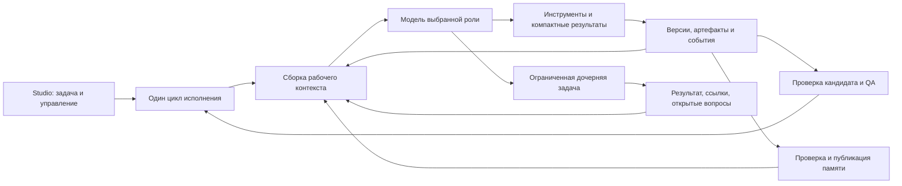

**ASTROLABE: критический архитектурный вердикт**

Дата проверки: 2026-10-04. Предмет: исходные идеи, ASTROLABE + AI Gate + Studio, изменения сессий S1–S3 плана 2.0 и текущее рабочее дерево.

**Критерий оценки — исходная философия, повторно уточнённая владельцем: не накапливать бесконечно контекст и затем терять знания при его сжатии; умно организовывать взаимодействие агентов по ролям; помогать LLM, забирая у неё работу, которую надёжнее выполнить самому harness.** Это три главных обещания продукта. Проверки, лимиты, receipts, схемы и количество тестов — средства их достижения, а не самостоятельная замена цели.

**Мой вердикт: продолжать нынешний план как достаточный путь к исходной цели я не рекомендую. Нужна замена центрального протокола работы и принципа сборки контекста, с сохранением пригодной инфраструктуры. Переписывать все три репозитория с нуля оснований нет.**

Ваше главное возражение подтверждается: пользователь несёт издержки сложного harness, но не получает доступного, измеренного сочетания разделения контекстов, разных моделей по ролям, памяти, восстановления и QA. Значительная часть обещанной ценности существует в виде отдельных реализаций, контрактов и тестов, а не работающей функции Studio. Преимущество всей архитектуры перед простым агентным циклом не доказано. Выполненные карточки и зелёные тесты такого доказательства не заменяют.

Но объяснение «здесь реализованы только проверки, остальное отсутствует» неточно. В коде есть содержательные механизмы поиска, экономии контекста, изоляции, маршрутизации и делегирования. Их нужно оценивать по составному поведению. Текущая проблема — сочетание неполного продукта, неудачного протокола взаимодействия с моделью и отсутствия убедительного сравнительного доказательства полезности. Добавление переключателей само по себе этого не исправит.

Если выбирать строго между «развивать всё как сейчас» и «начать заново», я выберу **заново спроектировать агентный runtime**. Если доступен инженерно более точный выбор, я выберу **новый небольшой цикл исполнения на существующих проверенных примитивах**, с заранее ограниченным экспериментом. При отрицательном результате эксперимент нужно остановить; уже вложенный труд не является аргументом за продолжение.

| Главное обещание | Что считается успехом | Вердикт о текущем состоянии |
|---|---|---|
| Контекст не превращается в линейно растущую историю и не теряет накопленное знание при очистке | Растёт внешний архив знаний; рабочий контекст выбирается под текущую задачу. После освобождения окна решения, причины отказа от гипотез и подтверждённые факты остаются находимыми и применимыми. | Есть необходимые примитивы, но история всё ещё растёт по нескольким каналам; обрезка/rebuild не доказывают сохранность и повторную применимость знания. Главное обещание не выполнено как свойство продукта. |
| Умная оркестрация ролей и их взаимодействия | Harness выбирает полезное разделение работы, передаёт достаточный контекст и общие контракты, собирает результаты без потерь и лишнего дублирования; модели действительно можно назначать ролям. | Механика S2/S3 и role views есть; обычный Studio сужает запуск до одной модели и не предоставляет полноценного управления. Общая польза взаимодействия ролей не доказана. |
| Harness помогает и разгружает LLM | Runtime сам учитывает выполненные действия, ждёт процессы, отбирает вывод, сохраняет версии/результаты и проводит понятные проверки; модель сосредоточена на задаче и решениях. | Частичное облегчение есть, но обязательная STATE-хореография, противоречивые affordances и часть gates возвращают модели административную работу и порождают новые ходы. |

Эти обещания связаны. Хорошее разделение ролей изолирует исследовательский шум; хорошие инструменты не создают лишний вход; память сохраняет результат после завершения роли; runtime снимает обслуживание этой системы с модели. Если оставить только ограничение контекста, знания можно потерять. Если оставить только много агентов, можно умножить расход. Если оставить только контролирующие gates, модель будет обслуживать harness. Оценивать нужно весь этот цикл.

**На чём основан вывод.** Проверены исходные `ASTROLABE/sources/source-original.txt`, реестр O01–O33 и архитектура в `merged-best-harness-ideas.md`, план 2.0, текущие исходники трёх репозиториев, отчёты `plan2/reports`, сохранённые результаты benchmark и экспорт проблемной задачи. Анализ разделён на контекст/инструменты, роли/память/оркестрацию и Studio/валидацию; существенные выводы сопоставлены между направлениями. Навык `codebase-design` использован для оценки того, сколько сложности скрывают интерфейсы и сколько перекладывают на вызывающий код и модель.

Срез: root `9eaf8f9` **плюс имеющиеся незакоммиченные изменения Studio**, core `7b402d3`, transport `fdbd733`. Локальный core уже содержит hotfix D-407–D-413. Поэтому ниже строго различаются поведение записанного запуска до hotfix и нынешние ограничения кода. Карта `.llm-memory` при проверке дала 34 изменившиеся записи: она использовалась для навигации, не как доказательство текущего поведения.

Новых платных LLM-прогонов, браузерной приёмки, полного build и проверки удалённого CI в этом аудите не было. Это архитектурная оценка по коду и существующим данным, а не сертификация исправленного продукта. Длительность набора «около 45 минут» остаётся сообщением владельца; сам план указывает примерно 35 минут на Windows. Повторный полный запуск не ответил бы на главный вопрос о преимуществе архитектуры.

**Где разошлись первоначальная цель и план.** В оригинале центральной идеей было не контролировать каждый шаг модели, а не создавать лишний контекст: отдельные рабочие области знаний, компактный индекс, извлечение подробностей по необходимости, завершение и освобождение локальных контекстов. Роли, уровни моделей, инструменты и обучение должны были усиливать этот цикл.

Объединённый документ сохранил это вполне ясно: §18.2 называет несущим сочетание O01, O08–O10, O12 и O03; §0.1 требует сравнивать каждый механизм с простым циклом. При этом он разумно оспорил некоторые абсолютные идеи: много агентов не обязательно лучше; строгие информационные перегородки вредят общим контрактам; маленькое окно не гарантирует меньшую суммарную цену.

План 2.0 изменил приоритет. Его §0.2 объявляет главным рычагом число запросов и выход, §12 замораживает S2/S3, review/judge, QA, значительную часть KB, восстановление, generated tools, MCP и обучаемую маршрутизацию. G1/G2 с экстракцией, куратором и памятью между задачами помещены в резерв после D/E и не блокируют выпуск. В текущем `TODO.md` P8 имеет 27 DONE и 14 TODO; direct ещё не реализован. Сессии **S1–S3 плана** и формы исполнения **S0–S3 runtime** — разные обозначения.

Такое сужение могло быть разумным краткосрочным способом стабилизации. Как стратегия реализации исходного продукта оно не годится: свойства, ради которых создавался harness, перестали быть условиями его выпуска. Более того, требование «разморозить только после измеренной пользы» образует тупик, если продукт не позволяет собрать соответствующий эксперимент. Нужен доступный экспериментальный путь, а не декларация, что когда-нибудь будут доказательства.

Это не обвинение в том, что все отложения были тайными: журнал плана фиксирует решения и согласования. Но документированное отложение не означает, что исходная цель достигнута. Фраза исходного реестра «Nothing was discarded» означает сохранность идей **в документе**, а не их доступность пользователю.

Источники: [исходный запрос идей](ASTROLABE/sources/source-original.txt), [реестр и его интерпретация](ASTROLABE/sources/merged-best-harness-ideas.md#L967), [план: цель](ASTROLABE-2-PLAN.md#L14), [заморозка](ASTROLABE-2-PLAN.md#L713), [handoff после hotfix](ASTROLABE/CONTINUE-TASK.md).

**Что фактически стало с исходными идеями.** В таблице «есть» означает найденную реализацию, а не доказанное преимущество. «Недоступно» относится к обычному текущему пути Studio, а не ко всем возможностям SDK.

| Исходные идеи | Фактическое состояние | Оценка |
|---|---|---|
| O01, O03: переключаемые контексты, последовательные роли | Компилятор контекста, планирующие/исполняющие/дочерние ячейки и перенос состояния существуют. Общая пользовательская модель задач и ролей существенно уже исходного замысла. | Частично реализовано; изоляция есть, обещание медленного роста целиком не выполнено. |
| O02, O04, O26: команда и параллельные исполнители | S2/S3, worktrees, владение путями, интегратор существуют. S3 требует флагов и подходящих контрактов; универсальная команда аналитик/архитектор/frontend/backend не предоставлена. | Это реальный задел, но не работающий штатный продукт Studio. Прогноз «multi-agent победит» доказательством не является. |
| O05, O06, O07, O17, O20: модели, reasoning, метаданные сложности, tiers | Есть профили, таблицы tiers/functions, маршрутизация и эскалация. Studio при запуске привязывает одну выбранную модель и обнуляет helper/escalation. | Политики SDK есть; пользовательская система назначения разных LLM ролям отсутствует. |
| O08: не накапливать мусор | Есть ограниченные ответы, указатели, eviction, rebuild и новый call bound. История аргументов инструментов и закреплённые сообщения имеют отдельные пути роста. | Это управление частью накопленного контекста, не полная профилактика его разрастания. |
| O09, O10: компактный индекс и подробности по ссылке | Есть blob store, журнал, notes/index, версии и recall. Их наличие не означает, что все нужные знания автоматически попадают в индекс. | Сильная инфраструктурная часть; продуктивный цикл публикации знаний не замкнут. |
| O11, O12: сохранить ценное и освободить рабочий контекст | Carry-forward, seeds, фиксация результатов и смена ячеек реализованы. Политика ценности и полноты переноса ограничена текущими правилами и регистрами. | Частично; нужны проверки сохранения требований и неповторения уже выполненного исследования. |
| O13, O14: роль/область знаний плюс глобальные контракты | KB умеет scope/ranking; существенные CON/ADR/CAL могут включаться и при Off. Абсолютной изоляции знаний по должностям нет. | Отказ от абсолютных перегородок разумен. Проблема — доступность и наполнение памяти, а не недостаточная строгость изоляции. |
| O15, O16: малое окно и разные модели автоматически улучшают кэш | Стабильные сегменты и учёт provider usage есть. Разные модели не образуют общий кэш; короткий контекст может потребовать повторных чтений. | Исходные абсолютные утверждения справедливо требуют проверки. Ни общее ускорение, ни экономия не следуют из них автоматически. |
| O18: отдельный координатор и свежий judge | ReviewCell, evidence packets и campaign judge реализованы для соответствующих форм. Studio имеет также собственный ReviewPass, отдельный от QA runtime. | Частично работает; review, независимая приёмка и QA нельзя считать одним механизмом. |
| O19: фильтрованные skills | Модули skills, role views, разрешение конфликтов и выбор в компиляторе есть. | Реальный код, но не доказана эффективность всей цепочки наполнения/выбора через Studio. |
| O21: композиция инструментов | Нативные вызовы, порядок, условия `op:N`, обработка частичных отказов существуют. | Реализовано; сложность семантики и удобство для модели требуют отдельной оценки. |
| O22: OS-independent инструменты | JVM-поиск и backend ripgrep, чтение, дерево, редактирование, управление процессами существуют. В продуктовом `Controller` поиск подключён через `Searches.jvm()`. | Неверно говорить, что portable search отсутствует. Полноценные встроенные аналоги awk/sed не найдены; `transform` запускает внешние команды. |
| O23: компактный полезный вывод | Есть shapers, бюджеты, scope/complete, recall и квитанция create вместо повторения файла. | Реализовано частично; обрезка и head/tail не равны целевому отбору информации, а общего бюджета всех каналов пока нет. |
| O24: дешёвое локальное восстановление | Есть guards, failure classes, capsules и repair-ячейка. | Механизмы существуют, но нормальный Studio-путь не реализует обещанную полноценную многоуровневую маршрутизацию восстановления. |
| O25: созданные агентом инструменты | Есть registry, lifecycle и optional wiring; каталог замораживается на границе попытки. Studio не поставляет соответствующие OptionalLayers. | SDK-задел; не пользовательское создание и применение инструментов в текущем продукте. |
| O27: обучение по опыту | Есть Queue, Extractor, Curator, promotion proposals. Studio оставляет Extraction.NONE; production-вызов Curator не найден. | Полного цикла «задача → проверенное знание → следующая задача» нет. Нельзя называть это работающим самообучением. |
| O28: использовать продукт и замкнуть QA | Есть проверки, QaCell/QaDriver и отдельные интеграционные тесты. QaDriver требует wiring host; browser-поверхности явно не поддерживает. | Флаг QA не создаёт browser QA. Исходная продуктовая цель остаётся незавершённой. |
| O29: автономная публикация после проверки | В core есть Publisher и режимы публикации, в Studio — Changes/Landing. Обычные git ref mutations моделью ограничены. | Условная возможность через полномочия host; не доказанная политика автономной доставки произвольной задачи. |
| O30, O31, O32, O33: современные provider API и их экономика | AI Gate содержит отдельные кодеки Responses, Messages и Completions; адаптер переносит профиль, items и usage. | Это реализованная инфраструктура. Новое API само по себе не доказывает меньший model-visible контекст или стоимость. |

Таблица покрывает все O01–O33, включая идеи, которые исходный merged-документ оспаривает. Его расширения E01–E16 также не исчезли: packets/receipts, compiler/rebuild, KB, routing, judge, tool envelopes, recovery, skills, worktrees, verification, telemetry и eval представлены в коде. Недостающее свойство — их проверенная совместная работа в доступном продукте, а не ещё один реестр названий модулей.

**Studio существенно сужает возможности ядра.** В текущем frontend определены 19 основных настроек; управления S2/S3, KB, QA и моделью каждой роли среди них нет. Старый `SettingsSchema` содержит соответствующие поля, а backend сохраняет расширенные настройки, но это не доказывает наличие рабочего пользовательского сценария. План §12, утверждающий наличие в Studio «Knowledge → Note injection», не соответствует текущему V2 экрану настроек.

При подготовке запуска `TaskService` задаёт `profileRoles.main`, сбрасывает `helper` и `escalation`, возвращает default tier table; `SettingsService` оставляет привязанный профиль. `StudioHost` создаёт `Controller`, не передавая extraction и optional layers. У `Controller` остаются `Extraction.NONE` и пустые подключения. Поэтому даже сохранённый advanced-флаг не создаст отсутствующего исполнителя куратора, browser QA, dense retriever или MCP mount.

S2 при этом **не запрещён глобально**: dispatch в `Controller.run` существует. Но обычный новый проект получает контракт без нужных сигналов риска/review; в S2-тестах они заданы явно. S3 дополнительно требует пригодной декомпозиции, непересекающегося владения, оценённого изменения интерфейсов, бюджетов и включения writers. Корректная формулировка: возможности ядра есть, но воспроизводимый управляемый путь их использования в Studio не предоставлен.

Источники: [настройки frontend](ASTROUI/frontend/src/app/features/settings/setting-list.ts#L6); [привязка единственного профиля](ASTROUI/backend/server/src/main/java/io/astrolabe/studio/tasks/TaskService.java#L663); [фильтрация профилей](ASTROUI/backend/server/src/main/java/io/astrolabe/studio/settings/SettingsService.java#L103); [создание Controller](ASTROUI/backend/bridge/src/main/kotlin/io/astrolabe/studio/bridge/StudioHost.kt#L254); [defaults подключений](ASTROLABE/core/src/main/kotlin/io/astrolabe/campaign/Controller.kt#L462); [OptionalLayers](ASTROLABE/core/src/main/kotlin/io/astrolabe/campaign/OptionalLayers.kt); [ShapeSelector](ASTROLABE/core/src/main/kotlin/io/astrolabe/campaign/ShapeSelector.kt); [S3 intake](ASTROLABE/core/src/main/kotlin/io/astrolabe/campaign/S3Run.kt#L163).

Отдельные первичные точки проверки возможностей: [Role и фиксированный набор ролей](ASTROLABE/core/src/main/kotlin/io/astrolabe/cell/Role.kt#L23), [QaDriver и требуемые подключения](ASTROLABE/core/src/main/kotlin/io/astrolabe/delegate/QaDriver.kt#L113), [ограничения конфигурации ролей](ASTROLABE/core/src/main/kotlin/io/astrolabe/Config.kt#L163).

**Почему контекст всё равно разрастается.** Внутри ячейки есть содержательная архитектура: стабильные `[S][R][K]`, рабочая история `[T]`, изменяемый хвост `[A]`, версии известных файлов, eviction результатов и перенос seeds. Это лучше полного отсутствия управления. Но размеры разных частей контролируются разными правилами, и локальный лимит выдаётся за более сильное свойство, чем он обеспечивает.

`R_max` задаёт цель для вытеснения живых результатов, а не жёсткий предел всего запроса; даже эта цель может превышаться из-за текущих, закреплённых или невосстанавливаемых результатов. Аргументы tool calls остаются в native history; большие создаваемые файлы и патчи уже являются входом следующего запроса, даже если ответ инструмента короткий. Закреплённые user/review/answer сообщения живут отдельно. Rebuild по давлению оставляет обязательную часть и хвост истории; при повторном давлении ячейка заканчивается partial. Поэтому наличие eviction не доказывает ни малого окна, ни низкой суммарной стоимости, ни сохранения достаточного знания после пересборки.

В записанном проблемном запуске это проявилось не теоретически. Я повторно прочитал raw JSONL: максимум `estimatedTokens` — **621 606** (строка 8380), максимум provider `prompt_tokens` — **488 771** (8383). Сумма известных input — **4 478 744**, output — **191 158**; usage присутствует у 30 из 31 ответа. Это сотни тысяч токенов в одном запросе и миллионы повторно обработанного входа, а не 600 миллионов в одном окне.

Hotfix уже добавил максимум 24 вызова в ответе, отсечение повторяющегося хвоста и порог давления с номинальным потолком 128K. Это полезные исправления аварийного поведения. Но 128K не является безусловным потолком всего запроса: эффективный ceiling вычисляется как `max(128000, fixed[S,R,K] + pinned + 2×R_max + A_max)`, то есть при defaults второй член равен `fixed + pinned + 101000`. Отдельная проверка допуска в физическое окно модели сохраняется. Нет общего бюджета выдачи `run`/`verify` на ход; 24 ответа по 4K могут принести около 96K только этой выдачи, до прочих частей. Устойчивый медленный рост не следует из новых ограничителей и ещё не подтверждён повторным live-запуском.

Источники: [Layout и Transcript](ASTROLABE/core/src/main/kotlin/io/astrolabe/cell/Layout.kt#L153), [Cell: eviction/rebuild](ASTROLABE/core/src/main/kotlin/io/astrolabe/cell/Cell.kt#L1128), [Gates](ASTROLABE/core/src/main/kotlin/io/astrolabe/cell/Gates.kt), [CallBound](ASTROLABE/core/src/main/kotlin/io/astrolabe/cell/CallBound.kt), [решения D-407–D-413](ASTROLABE/TODO.md#L669), [raw события](diags/tasks/W-uyorz7p4tivk7xvm7iaq/W-wzzpswxif6dzrqdxkoiq.events.jsonl#L8380). Полная предшествующая диагностика: [ASTROLABE-DIAGNOSTICS-2026-10-04.md](ASTROLABE-DIAGNOSTICS-2026-10-04.md); её старые дефекты нельзя автоматически приписывать коду после hotfix.

**Найдены и конкретные разрывы между модулями, не только спорные архитектурные предпочтения.** Например, `Controller` передаёт настроенный `lookBudgetTokens` в `Look`, который умеет возвращать его через `defaultReadTokens`. Но `Cell.recording` оборачивает исполнитель в lambda, реализующую только `execute`. Метод бюджета возвращается к default `null`; `Dispatcher` подставляет новый `Defaults().lookBudgetTokens`, то есть 4000, и записывает этот бюджет в аргумент вызова. Так нестандартная host-настройка теряет своё действие для чтения без явно указанного бюджета. Отдельный тест Dispatcher с исполнителем, переопределяющим метод, не проверяет эту композицию. Это сильный статический вывод из текущего кода; отдельный новый runtime-тест в данном аудите не запускался.

Второй пример: схема и описание `look.find` обещают `in=kb`, однако этот путь отвечает «knowledge base arrives in P2.6», хотя отдельный `kb.search` давно есть. Аргумент `since` принимается схемой Look, но не участвует в данном workspace-поиске. Пользователь видит зрелый набор возможностей, а модель получает интерфейс с частично ложными обещаниями. Это воспроизводимая причина бессмысленных ходов, которую нельзя лечить требованием к модели внимательнее соблюдать правила.

Третий пример — `Defaults.m` и `seedsMaxTokens`: декларации настроек есть, но текущие пути pressure rebuild и carry не используют их как можно ожидать. `Pressure.tailTurns` задаёт 6, а вызовы `CarryForward.carry` не передают `seedCapTokens` и получают константу 4000. Наличие параметра и тестируемого низкоуровневого механизма опять не гарантирует управляемое поведение всей цепочки.

Источники: [Controller: Look](ASTROLABE/core/src/main/kotlin/io/astrolabe/campaign/Controller.kt#L2262), [Look: бюджет](ASTROLABE/core/src/main/kotlin/io/astrolabe/tool/look/Look.kt#L130), [Cell: recording](ASTROLABE/core/src/main/kotlin/io/astrolabe/cell/Cell.kt#L1456), [Dispatcher: бюджет](ASTROLABE/core/src/main/kotlin/io/astrolabe/tool/Dispatcher.kt#L238), [ToolSchemas](ASTROLABE/core/src/main/kotlin/io/astrolabe/tool/ToolSchemas.kt#L76), [Look: find](ASTROLABE/core/src/main/kotlin/io/astrolabe/tool/look/Look.kt#L333), [Rebuild](ASTROLABE/core/src/main/kotlin/io/astrolabe/context/Rebuild.kt#L26), [CarryForward](ASTROLABE/core/src/main/kotlin/io/astrolabe/context/CarryForward.kt#L91).

**Инструменты нельзя оценивать только по наличию реализации.** Portable поиск реально сделан: есть JVM backend и вариант ripgrep. Однако обычный Look фиксирует regex-поиск и не предоставляет всю полезную управляемость backend: literal/maxHits не представлены соответствующими переключателями текущего LookArgs, а принятый `since` не передаётся в workspace SearchRequest. Удобные режимы count и выбор контекстных строк потребовали бы дополнительной реализации, а не только открытия существующих параметров backend. `transform` запускает argv или shell, поэтому не является встроенной переносимой заменой awk/sed. Я не рекомендую теперь переписывать все три Unix-утилиты целиком: нужен небольшой набор операций над исходниками и артефактами, закрывающий реальные рабочие сценарии.

Особенно ценны операции вида «покажи места совпадений с ограниченным контекстом», «выбери строки/поля из сохранённого результата», «сгруппируй одинаковые ошибки», «замени известный текст в заданной области с проверкой версии». Они должны выполнять большую часть работы вне окна модели и возвращать итог, пропуски и ссылку на полный материал. Это даёт проверяемую пользу. Новая универсальная DSL с десятками условий даст ещё одну поверхность ошибок.

Изоляцию процесса и разрешения при этом необходимо отличать от классификации текста команды: `EffectPolicy` не превращается в OS sandbox. Hotfix разрешил обычную разработку шире, включая зависимости, что снимает часть прежних тупиков. Безопасность и удобство должны проектироваться вместе; странный отказ `npm install` с последующим обходом через другую команду не является успешным контролем.

Источники: [поисковые backend](ASTROLABE/core/src/main/kotlin/io/astrolabe/os/search/Search.kt#L208), [LookArgs](ASTROLABE/core/src/main/kotlin/io/astrolabe/tool/Args.kt), [Transform](ASTROLABE/core/src/main/kotlin/io/astrolabe/tool/edit/Transform.kt#L177), [EffectPolicy](ASTROLABE/core/src/main/kotlin/io/astrolabe/auth/EffectPolicy.kt), [ограничения hotfix](ASTROLABE/CONTINUE-TASK.md#L17).

**Как этот harness ощущается со стороны модели.** Модель должна не только решить задачу, но и поддерживать внутренний регистр: typed STATE-операции, ссылки на свидетельства, корректный Next, отметки плана, обработку удерживающих завершение красных/неопределённых результатов, актуальность якорей и условия завершения. Часть этого защищает реальные инварианты. Другая часть заставляет модель вручную сопровождать состояние, которое runtime уже наблюдает. Последние изменения частично снимают нагрузку: C1b автоматически записывает необязательные красные проверки, C10 различает прежние, новые и неизвестные регрессии; нельзя приписывать нынешнему коду обязанность вручную оформлять любой красный результат.

Типичная неудачная последовательность выглядит так: модель запускает полезную проверку → результат не классифицирован так, как ожидает gate → нужно отразить его в STATE → patch регистра отклонён → модель чинит административную запись → её ходы и отказы попадают в контекст → возникает stall/pressure → запускается перенос или новое планирование. Даже правильно работающие локальные правила могут вместе ухудшать решение пользовательской задачи. В предыдущей диагностике и текущем handoff зафиксированы 58 отклонённых register patches в записанных запусках; hotfix не устранил саму эту модель взаимодействия.

В таком протоколе дополнительные слабые модели не обязательно экономят деньги. Они могут тратить больше ходов на обслуживание DSL. Сильная модель тоже оплачивает этот налог, если обязана изображать диспетчер состояния вместо инженерной работы. Direct мог бы уменьшить налог, но пока является спецификацией. Одного переименования операций недостаточно: необходимо перераспределить ответственность — исполненные команды, версии, статусы проверок и попытки завершения должен учитывать runtime; модель сообщает решения, гипотезы, планы и намерение закончить.

Это не аргумент отключить проверки. Проверять актуальность патча, полномочия, завершение процессов и происхождение результата необходимо. Но зависимость части продвижения и завершения от корректного ручного обновления STATE нуждается в доказательстве пользы, особенно когда необходимое наблюдение уже есть в журнале.

Источники: [kernel/error policy](ASTROLABE/core/src/main/kotlin/io/astrolabe/cell/Layout.kt#L22), [progress/gates](ASTROLABE/core/src/main/kotlin/io/astrolabe/cell/Gates.kt#L31), [план direct](ASTROLABE-2-PLAN.md#L336), [текущие хвосты](ASTROLABE/CONTINUE-TASK.md#L17).

**Нельзя честно сказать, что алгоритмов нет; можно сказать, что их полезность переоценена.** В KB есть FTS5/BM25, учёт scope, зависимостей, свежести и использования; есть risk floors в маршрутизации, проверка владения при параллельной записи и перенос version-bound seeds. Это инженерные решения, а не одни заглушки. Но конкретная эвристика residency в основном использует класс результата, возраст и размер: вероятность повторного использования оценивается как `1/(1+age)`, для stale — ноль. Она не знает, что этот кусок содержит единственный ответ на открытую гипотезу или контракт ближайшей правки. В компиляторе optional units получают `gain=1`; сортировка по gain/token внутри приоритета во многом превращается в предпочтение более короткого материала. Это разумные первые эвристики, но не реализованный интеллектуальный выбор контекста по полезности задаче.

Недостающая работа здесь не обязательно требует нейросетевого классификатора. Достаточно начать с проверяемых сигналов: текущая цель, область ближайшей правки, незакрытая гипотеза, подтверждённая зависимость, актуальность версии, стоимость повторного получения. Нужно сравнить их с возрастной эвристикой. Если усложнение не уменьшает перечитывания и стоимость принятого результата, его следует удалить.

Источники: [Injection](ASTROLABE/core/src/main/kotlin/io/astrolabe/kb/Injection.kt#L81), [StoreKb](ASTROLABE/core/src/main/kotlin/io/astrolabe/kb/StoreKb.kt#L35), [Residency](ASTROLABE/core/src/main/kotlin/io/astrolabe/cell/Residency.kt#L281), [Compiler](ASTROLABE/core/src/main/kotlin/io/astrolabe/context/Compiler.kt#L159), [ContextCover](ASTROLABE/core/src/main/kotlin/io/astrolabe/context/ContextCover.kt#L175).

**Память должна оцениваться полным циклом, а не наличием таблиц.** Сейчас есть хранение, поиск, кандидаты, правила admission, извлечение некоторых фактов из событий и CAL. Это реальная работа. Однако `Live` означает чтение текущей admitted базы, а не автоматическое включение её наполнения. Незамкнутое звено — обработка кандидатов и публикация через куратора/admission: без неё результаты очередной задачи не становятся надёжно доступными знаниями следующей. Model extraction — дополнительный отсутствующий в Studio источник кандидатов, но она не обязательна: кандидаты уже могут поступать через `kb.propose` и из событий harness. Даже `Curator.promote` возвращает текст задания «добавить тест/линтер/проверку схемы» и меняет состояние заметки; он не создаёт и не валидирует этот исполняемый урок.

Называть это самообучением пока нельзя. Более точная цель — накопление проверяемой проектной памяти и улучшение процедуры работы. Изменение весов модели здесь не нужно. У успешного контура должны быть и отрицательные случаи: устаревшая заметка перестала влиять; неверное обобщение отклонено; запись можно объяснить, исправить и откатить; повторная задача действительно требует меньше открытия тех же фактов. Иначе память только добавит ещё один источник мусора и ложной уверенности.

Это влияет и на оркестрацию: `ImpactPrescan` использует admitted CON anchors для обнаружения затронутого контракта, одного из сигналов выбора S2. Когда новые контрактные знания не публикуются, этот сигнал не пополняется из опыта работы. Разрывы памяти и управления ролями усиливают друг друга; их нельзя рассматривать как два независимых выключенных переключателя. [ImpactPrescan](ASTROLABE/core/src/main/kotlin/io/astrolabe/campaign/ImpactPrescan.kt#L80).

Источники: [извлечение в Controller](ASTROLABE/core/src/main/kotlin/io/astrolabe/campaign/Controller.kt#L1507), [Curator.promote](ASTROLABE/core/src/main/kotlin/io/astrolabe/kb/Curator.kt#L178), [резерв G](ASTROLABE-2-PLAN.md#L359).

**Тесты имеют ценность, но не ту доказательную силу, которую им приписывали.** В проекте есть настоящие составные fixtures: S2 campaign, S3 с worktrees и объединением несовместимых по отдельности зелёных изменений, восстановление после прерывания, KB injection, StudioHost через adapter/SDK, browser e2e с demo model. Утверждение «все тесты только изолированные» было бы ошибкой.

Слабость находится в условиях этих тестов. ScriptedModel выдаёт заранее подходящие protocol calls; S2/S3 contracts и нужные risk fields подготовлены тестом; KB предварительно заполнена admitted notes. Так можно хорошо проверить корректность механики. Нельзя узнать, сможет ли живая модель сама прийти к этим состояниям, сколько раз она ошибётся в протоколе и будет ли конечный результат лучше и дешевле. Проверка фальшивой моделью того, что правильная команда вызывает правильный переход, не является проверкой удобства harness для LLM.

Имеющийся `a1.mjs` полезен для UI→server→bridge→core, но использует demo model. Отчёт C4 прямо сообщает, что browser e2e для его изменений не запускался. Сохранённые XML также нельзя выдать за текущий полный suite: в main core лежит вывод последнего focused run (4 suites, 87 тестов), а не единый актуальный полный прогон. У Studio найдены сохранённые passing результаты bridge 18/server 70; это история запусков, не подтверждение всего незакоммиченного дерева.

Поэтому решение — не удалить тесты из раздражения их длительностью и не добавить ещё тысячи unit cases. Нужна другая иерархия доказательств: короткие проверки инвариантов; несколько сильных интеграционных сценариев через реальные интерфейсы; live-приёмка пользовательских задач; затем сравнительная оценка экономики. Дублирующие и привязанные к внутренней раскладке тесты можно сокращать после анализа покрытия поведения. Из одного числа строк невозможно честно назвать процент тестов, который безопасно удалить.

Источники: [S2CampaignTest](ASTROLABE/core/src/test/kotlin/io/astrolabe/campaign/S2CampaignTest.kt), [S3CampaignTest](ASTROLABE/core/src/test/kotlin/io/astrolabe/campaign/S3CampaignTest.kt), [FixtureCampaignTest](ASTROUI/backend/bridge/src/test/kotlin/io/astrolabe/studio/bridge/FixtureCampaignTest.kt), [browser e2e](ASTROUI/frontend/e2e/a1.mjs), [C4 report](plan2/reports/WP-C4.md#L166).

**Что действительно показали измерения.** В raw-артефактах B4 пересчитаны 128 основных запусков: 8 задач × 4 повтора × 2 модели × 2 варианта. Это реальные сохранённые `result.json` и events, не только итоговый рассказ. Во всех этих запусках использовались S0/S1, окно профиля — 1 048 576. Дополнительно существуют baseline из 12 запусков и результаты отдельных абляций; их нельзя смешивать с основной выборкой.

| Модель и вариант | Запусков | Скрытая приёмка passed | Запросов к модели | Сумма wall, секунды |
|---|---:|---:|---:|---:|
| DeepSeek, base | 32 | 32 | 367 | 2739.0 |
| DeepSeek, waveA | 32 | 32 | 369 | 3097.3 |
| GLM, base | 32 | 30 | 463 | 6976.6 |
| GLM, waveA | 32 | 30 | 459 | 5166.4 |

Здесь «passed» — результат отдельной hidden acceptance, не обязательно `outcome=completed` самого harness. Например, в base GLM completed — 28, а hidden passed — 30. Сумма wall по попыткам не равна календарному времени параллельного benchmark. В токенных totals GLM есть по одному запуску с отсутствующими значениями на вариант, поэтому пропуски нельзя превращать в нулевой расход.

В финальной секции отчёта B4 приведены следующие **поисковые**, а не подтверждающие универсальный выигрыш, интервалы отношения waveA/base:

| Метрика | DeepSeek | GLM |
|---|---:|---:|
| Число запросов | 1.00 [0.84; 1.18] | 0.92 [0.72; 1.19] |
| Выходные токены | 0.94 [0.80; 1.10] | 0.82 [0.58; 1.17] |
| Некэшированный вход | 0.96 [0.79; 1.17] | 0.88 [0.67; 1.16] |

Эти интервалы я цитирую из отчёта; в этом аудите независимо пересчитаны raw counts и суммы, а не заново весь статистический анализ. Все указанные интервалы включают 1. Совпавшая наблюдаемая приёмка полезна как screening на грубую регрессию. Она не доказывает эквивалентность качества в узком допуске. Формулировка отчёта «не хуже ни по одной метрике» сильнее допустимого вывода: существенный выигрыш или вред частью интервалов не исключены.

Важнее другое: сравнение идёт между двумя ASTROLABE, а не с простым сильным агентным циклом. Оно отвечает на вопрос об изменениях wave A, но не оправдывает весь набор архитектурных издержек. К тому же A1/A4/A5 в самом отчёте названы недостаточно нагруженными. Ни польза S2/S3, ни обучение между задачами этим набором не проверялись.

Данные о кэше тоже настоящие. В историческом аудите есть доли cache read 89.3%, 86.7%, 53.1%. Но два соответствующих запуска приняты политикой без verified acceptance, один завершился неудачей. Доля кэша не является сравнительной экономией принятой задачи. Контрфактический replay residency оценивает стоимость при сохранённой траектории; он не моделирует дополнительные чтения и другие решения модели после вытеснения. Из такого расчёта нельзя вывести оптимальность k=8.

Источники: [B4 report](plan2/reports/WP-B4.md), [raw base](bench/b4-2026-10-02/base), [raw waveA](bench/b4-2026-10-02/waveA), [baseline report](plan2/reports/WP-BL.md), [исторический аудит](plan2/reports/WP-B1-audit/live/audit.md). Подсчёт основной выборки: только `results-deepseek`, `results-deepseek-rep`, `results-glm`, `results-glm-rep` в каждой из двух директорий; прочие результаты абляций исключены.

**Самая существенная методическая ошибка — benchmark проходит рядом со Studio.** `eval-live/StudioAttempt.kt` прямо поясняет: Studio не является dependency, значения политики скопированы. Его MAX_CELLS/BUDGET_WINDOWS равны 12. Современный `TaskService` уже использует другой технический запас и отдельные task limits; подготовка account-aware профиля, сообщения пользователя, карточки и frontend также живут вне этого benchmark-пути.

Поэтому воспроизводимая сравнительная проверка получилась расщеплённой: в B4 live-модель проходит отдельный evaluator, а автоматический browser e2e A1 использует demo model. Исторические live-запуски настоящего Studio были — они описаны в progress, и анализируемая проблемная задача тоже получена в реальном Studio. Но эти отдельные запуски не заменяют сравнительную проверку полного продукта и не подтверждают нынешний hotfix. Связка «live core benchmark + scripted UI e2e» не даёт требуемого доказательства для реального пользователя, модели и длинной работы в Studio. [История приёмки Studio](ASTROUI/docs/progress.md#L42).

Приёмка eval-live на отдельной копии с hidden-файлами — полезный актив, который стоит сохранить. Но настройки запуска нельзя копировать вручную: evaluator и Studio должны пользоваться одним builder/launcher либо evaluator должен проходить через публичный запуск Studio. Различаться должны модель, источник задачи и политика эксперимента, а не скрытая копия продуктовых defaults.

Источники: [скопированный запуск и политика](ASTROLABE/eval-live/src/main/kotlin/io/astrolabe/evallive/StudioAttempt.kt#L60), [независимая приёмка](ASTROLABE/eval-live/src/main/kotlin/io/astrolabe/evallive/Acceptance.kt#L17), [актуальный запуск Studio](ASTROUI/backend/server/src/main/java/io/astrolabe/studio/tasks/TaskService.java#L679), [границы replay residency](ASTROLABE/eval/src/main/kotlin/io/astrolabe/eval/audit/ResidencyWhatIf.kt#L39).

**Экономика должна считаться на уровне задачи.** Нельзя заменить исходную цель тезисом «число запросов важнее контекста» как универсальным законом. В простом иллюстративном случае, когда первый запрос имеет C₀ токенов, а каждый ход добавляет g, суммарный повторно предъявленный вход за N запросов равен `N·C₀ + g·N·(N−1)/2`. При действительно ограниченном рабочем окне B он не превышает примерно `N·B` по этой составляющей, но к нему прибавляются переносы, извлечение памяти, повторные чтения и дочерние вызовы. Это модель учёта, не прогноз реальной стоимости: cached и uncached токены имеют разную цену, профили и провайдеры различаются.

Следовательно, есть три связанных рычага: число ненужных обращений, объём полезного/лишнего контекста в каждом и объём генерируемого выхода. Сокращение STATE-ритуалов и профилактика мусора должны работать совместно. Замена одного приоритета другим на основании нескольких коротких запусков не является стратегией для многочасовых задач.

Для разных ролей считать нужно **сумму всех ветвей**, включая coordinator, repair, reviewer, extractor и curator. Маленькое окно каждого из десяти агентов может оказаться дороже одного достаточного окна. И наоборот, исследователь, вернувший несколько проверенных ссылок вместо тысяч строк поиска, может окупиться даже на той же модели без параллелизма. Это и есть гипотеза, которую следовало сделать центральной.

**Сложность сосредоточена в неправильном месте.** Физический подсчёт текущих исходников дал 283 Kotlin-файла / 59 728 строк core main и 222 файла / 45 943 строки core tests. Это строки с комментариями и пустыми строками, без generated/build; сами числа не измеряют качество. `Controller.kt` — 2884 строки, `Cell.kt` — 1571. Studio bridge/server имеют 2297/10 533 строки, frontend app — 10 693 строки по `.ts/.html/.scss`, включая spec-файлы и каталоги текстов. Java transport main — 17 057 строк. Нельзя делить эти числа и получать честный процент «лишнего кода».

Но структура `Controller` действительно показательна. Он открывает storage/workspace, выводит контракт, выбирает форму работы, планирует, компилирует контекст, маршрутизирует, конструирует инструменты, проводит reviews/recovery, принимает результат и извлекает знания. `runCell` связывает большую часть системы внутри private-метода. Отсюда высокая цена даже небольшой смены протокола: спецификация direct насчитала около 35 мест переключения. Уменьшение числа строк без изменения этих обязанностей проблемы не решит.

Глубокий модуль должен скрывать сложность за небольшим понятным интерфейсом. Сейчас часть сложности раскрыта модели как протокол STATE, часть — Studio как множество согласуемых типов и параметров, часть — evaluator как копия запуска. Именно эти интерфейсы требуют пересмотра. SQLite, Kotlin, JVM, явные автоматы и три репозитория сами по себе не являются причиной неудачи.

**Что сохранить, а что заменить или отложить.** Сохранение здесь означает повторное использование после проверки нужного сценария, а не объявление текущего кода бездефектным.

| Часть | Решение | Причина |
|---|---|---|
| AI Gate, provider-api, отдельные кодеки и adapter | Сохранить | Смена протокола агента не требует заново писать transport/auth/usage. |
| Workspace/FileVersion, наблюдения, blob store, журнал, preimages | Сохранить и проверить общие интерфейсы | Они дают восстановимость и проверяемое происхождение данных. |
| Процессы, отмена, ownership, worktrees, интеграционные примитивы | Сохранить | Дорогие платформенные проблемы не исчезнут в новом runtime. |
| Search/read/edit, shaping, raw references | Сохранить основу; исправить модельный интерфейс | Здесь возможна непосредственно измеримая экономия и снижение ошибок. |
| Receipts и единая интерпретация evidence | Сохранить | Отличать реально проверенное от предположенного необходимо. |
| Полный набор нынешних gates и обязательный model-authored STATE | Пересмотреть; не наследовать автоматически | Каждое правило должно защищать понятное свойство или демонстрировать пользу. |
| Монолитный campaign/cell control flow | Заменить в отдельном экспериментальном пути | Именно он связывает политики и делает изменение поведения дорогим. |
| KB schema/search/provenance | Использовать для малого полного цикла памяти | Сначала публикация и повторное применение, затем сложные promotion/dense слои. |
| Studio | Сохранить оболочку, переделать запуск и управление возможностями | Пользователь должен управлять реальными режимами и видеть фактическую конфигурацию. |
| SDK-only advanced features без product wiring | Явно показывать статус; подключать по одному сценарию | Удалять полезные заделы незачем, но они не должны считаться готовой ценностью. |
| Полная человеческая оргструктура и online learning параметров | Не делать обязательными | Это гипотезы высокой стоимости, не предпосылки рабочей памяти и хороших tools. |

При переносе нельзя создать два runtime, одновременно записывающих одну campaign state. Точка подключения нового движка — граница host→campaign, где Studio сегодня создаёт Controller. **Это предложение нового шва, а не уже существующий чистый SPI:** Studio типизирован на Controller/OpenedCampaign/S0Run, а создание инструментов связано с его внутренностями. Нужно вынести минимальную сборку реально используемых примитивов и дать каждой попытке одного владельца состояния. Если для первого простого запуска требуется переписать половину core, эксперимент надо сузить до минимального проверяемого набора, а не превращать в новый многомесячный фреймворк.

**Как должна работать целевая система в комплексе.** Предлагаю строить её вокруг задачи, её актуальных решений и доступных свидетельств. Контрольные данные, архив выполненного и рабочая память модели имеют разные сроки жизни. Стабильные ссылки не должны исчезать вместе с окном, а наличие записи в архиве не должно принуждать постоянно отправлять её модели.

Здесь принципиальна разница между «ограничить длину истории» и «перестать использовать историю как главную память». Архив может расти линейно с выполненной работой — это нормально. В рабочее окно должны возвращаться необходимые знания, а не весь путь их получения. Сохранять нужно также обоснование решения и опровергнутые гипотезы, иначе после пересборки модель повторит ту же работу. Один raw blob ещё не означает сохранённого рабочего знания: без индекса, понятной ссылки и основания для повторного извлечения он практически потерян. Абсолютную неизменность размера окна для любой задачи обещать нельзя; проверяемая цель — рост по текущей смысловой сложности, а не по количеству прошлых ходов.

Это целевая схема, а не описание уже собранного runtime. В ней роли остаются конфигурациями: модель/effort, разрешённые действия, рабочая область и контракт результата. Для архитектурного решения сохраняется контекст решения; для исследования выдаётся ограниченный вопрос; для рутинной реализации — понятный контракт; reviewer получает требования, diff, результаты и неопределённости. Чужой полный транскрипт по умолчанию не нужен. Общие интерфейсы, ограничения и изменения решений доступны всем затронутым ролям.

«Умная» оркестрация означает больше, чем выбрать tier и породить subagent. Она должна определить, что можно отделить без потери решения, кому нужен какой контракт, когда выгоднее продолжить прежний контекст, когда создать свежий, как заметить несовместимые выводы и когда объединить работу. Для первой версии это может быть небольшая явная политика по зависимостям и наблюдаемому прогрессу. Её интеллект оценивается результатом взаимодействия, а не числом названий ролей и ветвей автомата.

Пример одной составной задачи: нужно добавить фильтрацию в существующее приложение. Основная модель уточняет контракт поведения; узкий исследователь находит точки данных/API/UI и возвращает несколько подтверждённых ссылок; исполнитель получает контракт и нужные версии файлов; portable tools отбирают совпадения и сгруппированные ошибки до попадания в prompt; QA запускает приложение и проверяет пользовательский сценарий; reviewer оценивает спорное поведение на свежем контексте; подтверждённые сведения о запуске/структуре проекта становятся памятью для следующей задачи. При пересечении правок работа идёт последовательно; S3 включается только для независимых областей. Нигде не требуется автоматически воспроизводить полную «команду из людей».

Из этого следуют конкретные правила реализации:

1. **Один учёт всего model-visible контекста.** Перед каждым запросом измерять policy/schema, contract, pinned, arguments, results, notes и tail вместе. В интерфейсе различать физический предел модели и выбранный рабочий бюджет. Если обязательная часть не помещается, явно менять scope/бюджет или создавать новый ограниченный контекст; не называть автоматически повышенную границу жёстким потолком.
2. **Полезный результат инструмента вместо полного промежуточного вывода.** Общий бюджет на пакет `look/run/verify`, отдельный полный артефакт, поиск/выборка внутри него, дедупликация одинаковых диагностик, явные пропуски. Для старых tool-call arguments — управляемая пересборка целых protocol turns с сохранением ссылок и соответствия call/result. Произвольно портить уже сохранённый протокол провайдера нельзя.
3. **Небольшая текущая память задачи.** Цель, ограничения, принятые решения, открытые гипотезы, последние существенные результаты, следующий шаг. Журнал действий и номера квитанций ведёт runtime. Модель записывает смысл, который runtime сам вывести не может. Не нужно ни пересказывать весь транскрипт, ни запрещать любую семантическую компрессию принципиально; её сохранность проверяется по требованиям и повторным действиям.
4. **Полные контуры вместо широкого набора флагов.** Сначала одна полезная probe/review роль с ограниченным входом и выходом; одна память между задачами; один реальный QA-сценарий. Затем объединённый прогон. Одновременно открывать все S2/S3/KB/QA без этого — способ получить непонятную смесь причин успеха и провала.
5. **Назначение моделей как настоящая настройка запуска.** Роли и fallback явно связываются с доступными профилями/effort; сохраняется фактический выбор. Дешёвая модель получает ограниченный repair/extraction только если её суммарные retries дешевле альтернативы. Пользователь видит маршрут и может его заменить; каталог цен не выдаётся за оценку способности.
6. **Отказы должны помогать продолжить.** Ошибка сообщает доступное действие и сохраняет уже сделанное. Счётчик одинаковых вызовов ограничивает расход, но следующая стратегия опирается на причину: неверный интерфейс, недостаточные данные, внешний сбой, слабая модель или неверная гипотеза. Read-only исследование не обязано маскироваться фиктивными изменениями STATE ради признака прогресса.
7. **QA проверяет заявленное поведение.** Для UI — браузер, взаимодействие, console/network и визуально значимые состояния; для CLI/API — реальные probes; для libraries — подходящие вызовы. Проверка сборки остаётся нужной, но не является заменой этих действий. Неизмеренное помечается как неизмеренное.
8. **Память публикуется с происхождением и сроком применимости.** Кандидат не становится истиной по повторению. Проверка/дедупликация/инвалидация завершают запись; следующая задача показывает, что использовала и почему. Предложение нового теста считается обучением процедуры только после реализации и проверки самого теста, включая то, что он обнаруживает исходный дефект.

Это сочетание имеет перспективу именно как продукт: управляемые контексты, понятные инструменты, воспроизводимость и измеряемое повторное использование знаний. Перспективность идеи я оцениваю положительно; доказанность преимущества текущей реализации — отрицательно. Прогнозировать победу над современными агентами по одному архитектурному описанию было бы повторением прежней ошибки.

Для каждого правила нужен ещё один простой вопрос: **какую работу оно снимает с LLM и сколько новой работы на неё возлагает?** Автоматическое ожидание процесса, группировка одинаковых ошибок, фиксация результата проверки, актуальность версий и восстановление после сбоя обычно снимают работу. Требование повторно описать уже наблюдаемое событие в точной DSL может добавлять её. Ограничения, защищающие данные и реальные полномочия, сохраняются; предписания о том, как модели «правильно думать» и вести внутреннюю бухгалтерию harness, должны доказывать пользу. Это критерий проектирования, а не косметическая правка системного prompt.

**Внешние источники подтверждают направление проверки, но не качество ASTROLABE.** Я проверил три первичных инженерных материала. Рекомендация Anthropic по инструментам — измерять, как агент ими пользуется на реалистичных задачах, учитывать ошибки/токены/число вызовов и анализировать реальные траектории. Наличие аккуратной схемы функции недостаточно. Это прямо поддерживает отдельную проверку удобства Look/STATE, но не доказывает, что какой-либо конкретный наш redesign лучше. [Writing effective tools for agents](https://www.anthropic.com/engineering/writing-tools-for-agents).

Материал о context engineering рассматривает отбор по необходимости, компактные ссылки, заметки, компрессию и изолированные подзадачи как разные средства; выбирать нужно по характеру работы. Из этого не следует ни обязанность постоянно суммаризировать, ни запрет на суммаризацию, ни необходимость множества агентов. [Effective context engineering for AI agents](https://www.anthropic.com/engineering/effective-context-engineering-for-ai-agents).

Описание multi-agent research system отдельно предупреждает о повышенном расходе и о том, что задачи с общей информацией и тесными зависимостями хуже подходят для такого разделения; исследовательские результаты нельзя автоматически переносить на coding. Поэтому «включим всех агентов и получим экономию» столь же недоказанно, как «оставим одного и устраним проблему контекста». [How we built our multi-agent research system](https://www.anthropic.com/engineering/multi-agent-research-system).

**Как принять решение без ещё одного бесконечного плана.** Нужен один ограниченный эксперимент, который может закончиться отказом от сложной архитектуры. Он должен одновременно проверить простоту нового ядра и полезность исходных идей, а не снова отложить память и роли до следующего большого релиза.

| Шаг | Конкретный результат | Что заставляет остановиться или пересмотреть решение |
|---|---|---|
| Зафиксировать сравнимый запуск | Один путь конфигурации для Studio и evaluator, те же модели, полномочия, бюджеты и независимая приёмка; явная версия runtime | Копии настроек расходятся или успех зависит от ручного исправления после запуска. |
| Построить простой вариант | Модель→tools→результаты→finish, сохранение/возобновление и полезное вмешательство пользователя; без обязательной STATE-хореографии | Для минимального цикла требуется большой новый фреймворк или прежняя сложность полностью переносится внутрь него. |
| Проверить главные обещания | Ограниченный контекст на длинной задаче; один role handoff; вторая задача с памятью; один реальный QA-путь, доступные в Studio | Результат существует только в seeded fixture или пользователь не может сам повторить режим. |
| Сравнить и сделать абляции | Простой цикл, нынешний structured, новый цикл с памятью/делегированием; отдельное сравнение tools; учёт всех вспомогательных вызовов | Сложные варианты не дают нужного качества или не окупают расход/задержку/вмешательства. |
| Выбрать один основной runtime | Оставить измеренно полезные механизмы, удалить лишнюю постоянную совместимость экспериментальных путей | Возникает предложение бессрочно поддерживать два равноправных движка без показанной пользы. |

Для эксперимента я предложил бы заранее ограничить инженерные вложения, например **10 рабочими днями** до первого решения о продолжении, и отдельно задать допустимый live-расход. Это предложенный предел инвестиций, не оценка срока промышленной реализации и не согласованный с владельцем бюджет. В этот период не нужно «закончить всё 2.0»; нужно получить честный сравнительный сигнал и показать, что новый способ сборки продукта проще. При отсутствии сигнала не следует автоматически продлевать проект очередным списком обещаний.

Минимальный набор должен покрывать разные причины, по которым такая архитектура вообще могла бы быть полезна:

| Сценарий | Что он проверяет |
|---|---|
| Новый репозиторий без коммита, установка зависимостей, обычные Node-тесты | Реальность повседневного пути, исправления D-410/D-412 и отсутствие внутренних тупиков. |
| Малое окно 16K/32K и длинное исследование с неверной первой гипотезой | Достаточность контекста, перенос решений, повторные чтения и восстановление. |
| Большие логи и повторяющиеся ошибки | Общий бюджет вывода, дедупликацию, извлечение деталей по ссылке и отсутствие тысяч отказов. |
| Изменение API вместе с вызывающим кодом | Сохранение общих контрактов при разделении ролей. |
| Независимые правки и конфликт после объединения | Реальную пользу/цену S3 и корректность интеграционной проверки. |
| Вторая и третья задачи того же проекта, затем изменение прежнего факта | Пользу памяти и её инвалидацию, а не качество seeded retrieval. |
| Изменение UI через настоящий Studio и настоящую модель | Product QA, browser-поведение, доставку сообщений пользователя и удобство работы. |
| Сообщение, отмена и resume в середине длинной работы | Управляемость, сохранность состояния и ограничение задержки реакции. |
| Подписочный и тарифицируемый доступ | Совместимость account/model binding с admission, ясное различение денег и квот. |

Один успешный пример каждого типа — smoke, а не статистическое доказательство. После отсечения явных провалов нужны заранее выбранные свежие задачи, повторы по задачам, одинаковая независимая приёмка и соседние рандомизированные AB/BA-блоки; при gateway учитывать фактический upstream. Для проверки преимущества специализированных tools нужен отдельный вариант с обычными search/read/edit/exec, иначе сравнение только orchestration не проверит цену необычного инструментария. Для памяти сравнивать целые последовательности задач на одной базе, не независимые пустые проекты.

Главные метрики: независимая приёмка и ложная приёмка; совокупные деньги/время всех попыток на принятый результат; суммарные input/output и uncached input; число запросов всех ролей; peak и состав контекста; перечитывания неизменённых данных; административные и отклонённые вызовы; вмешательства пользователя; потерянные требования после handoff; задержка обработки сообщения/отмены. Для исходной философии отдельно обязательны: темп роста рабочего контекста на сопоставимых стадиях длинной работы; восстановление конкретных решений и опровергнутых гипотез после освобождения окна; дублирование исследования между ролями; доля ходов, потраченная на обслуживание протокола вместо задачи. Cache hit rate и размер одной ячейки — вспомогательные показатели.

Пример заранее фиксируемого решения: сохранить дополнительный механизм, если он на целевом классе задач даёт практически значимое улучшение — например, около 20% расхода или заметный прирост приёмки — при заранее заданном допустимом ухудшении других важных осей и достаточной уверенности. **20% здесь предложенный порог полезности, не измеренный результат и не универсальная норма.** Если данных недостаточно, результат «не доказано» не превращается в разрешение навсегда включить сложность. Сравнение должно допускать, что роли полезны для исследования, память — для серий задач, а S3 — только для отдельного класса независимых работ.

**Что я считаю ошибкой прежнего направления.** Слишком много доверия было выдано факту реализации механизмов. Утверждение «есть проверяющий контур» подменило «получается хороший продукт»; «есть eviction» — «контекст экономен»; «есть флаги» — «пользователь может проверить идеи»; «есть live benchmark» — «проверена вся связка Studio». Некоторые ограничения были оправданы как локальная защита, но их совместная цена для модели и владельца осталась недостаточно проверенной. Защищать эту архитектуру потому, что её проектировали и реализовывали модели, оснований нет.

Мой ответ на вопрос о судьбе проекта остаётся определённым: **нынешний runtime не заслуживает дальнейшего расширения по инерции. Исходная идея заслуживает одного ограниченного, честно измеряемого перезапуска на сохранённой инфраструктуре.** Если простой цикл окажется лучше, его и следует сделать основой. Если роль/память/tool-композиция покажут выигрыш, сохранять нужно доказавшее пользу сочетание. Если даже такой перезапуск не даёт удобного продукта и измеренного преимущества, рационально остановить ASTROLABE как отдельный сложный harness, сохранив полезные SDK и инструменты. Ни очередные зелёные fixtures, ни уже потраченное время не должны отменять это решение.

В рамках этого задания создан только данный вердикт. Изменения продуктового кода, запуск нового плана, платные эксперименты, commit и push не выполнялись.
