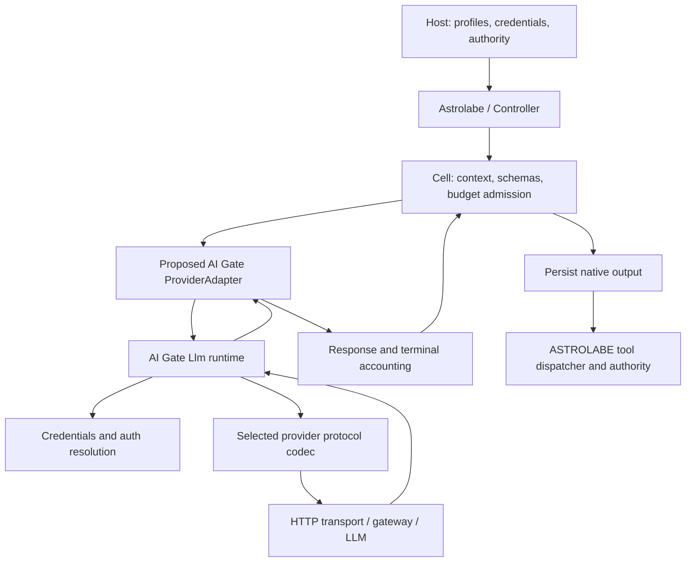

# ASTROLABE / llm-transport-sdk integration analysis

**Date:** 2026-09-28  
**Purpose:** Determine whether `llm-transport-sdk` can supply ASTROLABE's real LLM transport, gateway access, authentication and model-call layer, and identify the work needed to integrate it.  
**Assessment:** Source inspection and local offline verification. This document proposes an integration; it does not implement one or certify live provider behavior.

### Reading guide

- [Conclusion and feasibility](#1-executive-conclusion)
- [Existing SDK features and provider/gateway inventory](#4-sdk-capabilities-relevant-to-integration)
- [External-library dependency and module setup](#5-recommended-module-and-dependency-arrangement)
- [Request/tool translation](#6-request-translation-in-detail)
- [Native history and replay](#7-native-history-replay-and-durable-state)
- [Required estimator and context-admission changes](#8-token-estimation-and-context-admission-required-core-work)
- [Streaming, cancellation and partial usage](#10-invocation-streaming-and-cancellation)
- [Work split and implementation plan](#14-missing-work-and-ownership)
- [What to change in llm-transport-sdk for a clean integration](#19-sdk-changes-for-a-clean-supported-integration)
- [Source index](#20-source-index)

## 1. Executive conclusion

**Yes. The SDK is a suitable transport foundation for ASTROLABE, but it is not a drop-in implementation of ASTROLABE's `ProviderAdapter`.** Its existing HTTP execution, provider codecs, credentials, OAuth machinery, streaming, cancellation, retries and diagnostics should be reused behind a dedicated adapter module. ASTROLABE should retain ownership of the coding loop, tool execution, permissions, context admission, durable evidence and campaign accounting.

The language boundary is favorable: both projects target **JDK 26**, both builds use **Kotlin 2.4.20**, and ASTROLABE already provides a Java adapter interface and a future-to-coroutine bridge. No HTTP client rewrite or Java-to-Kotlin port is justified by the inspected code. [A1][A2][S1]

The significant work is preserving ASTROLABE's semantics:

1. **Request admission:** the public ASTROLABE entry point constructs a generic heuristic estimator. Native replay data makes that estimator report unknown history, which the core independently refuses. A transport adapter alone cannot repair that path.
2. **Prompt caching:** ASTROLABE always marks its stable prompt regions with breakpoints, while its standard validation rejects those markers for providers without explicit breakpoint support. Automatic provider caching is not the same capability.
3. **History translation:** flat ASTROLABE items must be assembled into SDK assistant turns and tool-result messages without losing reasoning, identifiers, ordering or provider origin. ASTROLABE's eviction and trimming must remain effective.
4. **Cancellation:** ASTROLABE requires a separately reconciled terminal result after cancellation. Cancelling an SDK `CompletableFuture` directly can discard the worker's eventual result. Local cancellation also does not establish that the provider stopped billing.
5. **Accounting:** SDK usage is already normalized, but ASTROLABE additionally needs dated prices, explicit missing dimensions, cache-write duration classes and potentially hosted-tool charges.
6. **Capability policy:** SDK catalog information and API compatibility settings are inputs to an ASTROLABE profile, not proof that a gateway satisfies all coding-agent requirements.

A restricted text/tool proof can make real calls with a small bridge. The larger changes below are needed to preserve the intended rich-history, accounting and admission contracts across multi-turn coding campaigns. In particular, this report identifies an SDK partial-usage retention gap and a separate Codex output-limit mismatch; neither prevents using the SDK for ordinary supported API profiles.

**Recommendation:** add an optional `:provider-ai-gate` module, prove one explicitly configured provider/model/API combination with ordinary text and local function tools, then broaden support using the same adapter and provider-specific mapping policies. Keep native continuation, compaction, hosted tools and response caching disabled until their separate contracts are implemented and tested.

### Decision by scope

| Intended result | Verdict |
|---|---|
| Make real text completions from Kotlin using the SDK | Supported by the SDK's current API and Kotlin consumer tests. |
| Replace a host-supplied fake adapter with a real coding-agent adapter | Feasible, with a new adapter and the core integration changes below. |
| Reuse authentication and HTTP across several providers/gateways | Feasible; those layers already exist. |
| Change only a Gradle dependency and run ASTROLABE unchanged | Insufficient: no class currently implements the required bridge. |
| Preserve all ASTROLABE invariants for every supported SDK provider | Requires provider-specific conformance work; not established by this review. |
| Claim production readiness or measured agent quality | Not supported by offline tests or source inspection. |

## 2. Scope, source authority and verification limits

### 2.1 Inspected revisions

| Project | Location relative to this report | Git HEAD |
|---|---|---|
| ASTROLABE | `ASTROLABE/` | `dba6344d6fe787adec0b1cb580dd5d2e8e7dd353` |
| llm-transport-sdk | `llm-transport-sdk/` | `d8dc26ad1204906bda48e8f5bcb5e64a08ab7885` |

Both working trees were clean at initial inspection. The source references at the end use paths relative to this report and name the relevant symbols or line locations. They refer to these revisions.

Source code is the primary evidence for implemented behavior. Architecture documents establish the intended contract, and tests establish the cases exercised. Historical progress notes and README claims do not override implementation. In particular, ASTROLABE's root README still says “architecture documentation only,” but the checkout contains an implemented core and its TODO records P0–P6 completion with live transport deferred to P7. That README is stale as an implementation inventory. [A3]

No authentication was initiated and no billable model calls were made. Provider availability, account entitlement, deployed gateway compatibility, current pricing and live quality remain unverified. The report describes checked-out implementation behavior rather than asserting current remote API behavior. Licensing, general security auditing and unrelated production-readiness checks are outside this report's scope.

### 2.2 What “replace the stubs” means here

ASTROLABE does not instantiate a hardcoded dummy LLM inside its production entry point. `Astrolabe(config, adapter, authority, ...)` accepts a `ProviderAdapter`; its campaign creates a `CellModel` from that adapter and the configured main profile. The main fake implementation, `FakeAdapter`, lives under `core/src/testFixtures`, alongside scripted models and fake profiles. [A1][A4]

Therefore the change is principally **supplying a real implementation at an existing injection point**, not removing fake logic throughout the core. Keep the fake implementation for deterministic regression tests.

This integration addresses the LLM side of P7. It does not supply ASTROLABE's separately deferred MCP client transport, confined process runner, LSP integration, UI/CLI or optional embedding provider. Those are different interfaces and should not be described as fixed by adding LLM HTTP access. [A3][A19]

## 3. Existing ASTROLABE integration contract

### 3.1 What is already present

| Area | Existing implementation | Integration consequence |
|---|---|---|
| Provider seam | `ProviderAdapter`: `capabilities`, `validate`, `start`, `normalizer` | Implement this contract in an optional module. |
| Java seam | `JavaProviderAdapter`, `JavaInvocation`, `ProviderAdapters.fromJava` | A Java implementation can be consumed by the Kotlin engine without exposing coroutines. |
| Request model | Ordered `S/R/K/T/A` segments, tools, profile, effort, output headroom, mask, optional continuation | The bridge must translate structure, not concatenate one giant prompt. |
| Response model | Messages, calls, results, reasoning references, usage and opaque continuation | Preserve provider-required content and origin during conversion. |
| Validation | Tool pairing, dialects, breakpoints, continuation support, known history and context/output limits | Add protocol-specific checks; retain shared checks. |
| Invocation lifecycle | `await`, `cancel`, `terminal`, explicit states | Separate executable output from terminal evidence. |
| Usage/accounting | Billable dimensions, missing fields, raw usage, dated decimal prices, reservations | Feed normalized usage into the existing single accounting writer. |
| Tools | Seven stable families, operation masks, parsing and local authority checks | The SDK describes model-callable functions; ASTROLABE executes them. |
| Durability | Response journaling before tool dispatch; terminal evidence archived without execution | Conversion must finish before exposing a response to the core. |
| Routing | Profiles and effort can change while the adapter is retained | One bridge must resolve every configured profile or explicitly reject unsupported ones. |

Sources: [A1][A2][A5][A6][A7][A8][A9][A10].

### 3.2 Actual call path



The core sequence is important: `Cell.kt` builds the request and estimate, calls adapter validation, independently checks context admission, reserves budget, starts the invocation, awaits the response, and awaits terminal reconciliation in `NonCancellable`. It then accounts usage, checks cancellation/authority, journals output, parses complete calls, and dispatches. [A8]

A bridge that simply returns `llm.complete(...).text()` would bypass almost everything needed for an autonomous coding agent.

## 4. SDK capabilities relevant to integration

### 4.1 Implemented transport and model-call foundation

The library is called **AI Gate** in its code (`net.ai.gate`); its Gradle root is `llm/`, not the repository root. Its public `Llm` API exposes blocking completion, asynchronous completion, blocking stream iteration, model lookup, credentials, request previews, connection diagnostics, listeners and provider-specific APIs. The runtime is documented as thread-safe; conversation and option values are immutable. [S1][S2][S3]

Its implementation contains codecs for OpenAI Responses, OpenAI Chat Completions, Anthropic Messages and Google Generate Content. Provider presets and custom provider configuration select APIs and compatibility behavior; a gateway is therefore configured as a provider endpoint with an explicit protocol contract. A compatible URL alone proves neither feature support nor accounting equivalence. [S4]

The SDK supplies:

- JDK HTTP transport and a public transport SPI for injection.
- Structured messages, local function-tool definitions, tool calls/results and provider tools.
- Streaming events and aggregate assistant replies, including partial replies on failure.
- API-key and supplied-token authentication; configurable OAuth flows and credential stores.
- Retry, timeout and cancellation policies.
- Model catalog entries with optional limits/prices and explicit unknown capabilities.
- Canonical conversation serialization and provider-origin metadata.
- Request previews, event listeners, diagnostics and offline testing facilities.

These are real implementations, not only interfaces. Existing tests exercise transport, codecs, authentication and Kotlin consumption. The limitations below concern how those implementations fit ASTROLABE. [S2–S13]

### 4.2 Concrete provider and gateway inventory

The source contains the following access routes. These are implemented SDK configurations, not a claim that every deployed endpoint has been live-tested in this review. [S4][S19]

| Access route | SDK entry point / wire API | Implication for ASTROLABE |
|---|---|---|
| OpenAI API | `Providers.openai()`; `openai-responses` and `openai-completions` | Ordinary API-key route; choose and freeze the protocol explicitly. |
| Anthropic API | `Providers.anthropic()`; `anthropic-messages` | API-key route with explicit cache markers and native thinking/tool content. |
| Google Gemini | `Providers.google()`; `google-generate-content` | Different reasoning/tool-result/cache mapping; reuse SDK codec. |
| OpenRouter | `Providers.openRouter()` | Compatible gateway, API key or configured PKCE key acquisition; gateway-specific replay limitations remain. |
| DeepSeek, xAI, Qwen, Mistral, Groq | Named `Providers` factories | Existing Completions compatibility configurations; still need qualified ASTROLABE profiles. |
| Ollama, LM Studio, vLLM | Named local-server factories | Configurable local endpoints, keyless options and local timeout defaults. |
| LiteLLM, Azure OpenAI | Factories on `OpenAiCompatible` | Host supplies endpoint/deployment information; not all are zero-argument presets. |
| Custom compatible gateways | `OpenAiCompatible.custom(...)`, `Anthropic.compatible(...)` | Reuse existing wire codecs with explicit endpoint/compatibility settings. |
| Codex subscription backend | `Providers.openAiCodex()` / `OpenAi.codex()`; provider ID `openai-codex` | Implemented OAuth and streaming Responses dialect, with a material output-limit mismatch described below. |

Provider IDs, model IDs and wire API IDs are distinct. The exact built-in API IDs are `openai-responses`, `openai-completions`, `anthropic-messages` and `google-generate-content`. Include the API identity in usage provenance and native replay metadata.

**Codex-specific integration issue:** this SDK preset is streaming-only and intentionally does not send `max_output_tokens`. ASTROLABE always supplies output headroom and uses it in admission and reservations. With strict SDK adaptation policy, dropping that option can reject the call; without strict policy, the field is omitted and the bridge cannot claim the requested remote generation cap was enforced. This profile needs an explicit unbounded/externally bounded output policy, conservative funding, cancellation behavior and tests before it can satisfy the same contract as an ordinary capped API request. It should not be the first profile used to prove the generic bridge. The source labels this backend unofficial; current remote behavior was not checked. [S19]

The SDK also records that Codex uses SSE, does not import existing CLI login state, and that OpenRouter `reasoning_details` are not replayed. These are relevant constraints when selecting the first account/gateway and deciding what “native reasoning support” means. [S19]

### 4.3 Fit matrix

| Requirement | SDK status | Remaining ASTROLABE work |
|---|---|---|
| JVM interoperability | Same JDK target; Kotlin consumer test exists | Add dependency/module and bridge. |
| HTTP/HTTPS and custom gateways | Implemented | Configure and pin endpoint, API and compatibility policy. |
| API key / bearer token | Implemented | Host credential provisioning and secret-store policy. |
| OAuth | Generic configurable machinery exists | Supply the actual provider/client configuration and host interaction. |
| Multi-provider requests | Implemented | Map ASTROLABE profiles to frozen SDK model/provider bindings. |
| Function-tool requests/results | Implemented | Preserve grouping, names, arguments, identifiers and masks. |
| Streaming | Implemented as blocking iteration | Worker/coroutine bridge; buffer until a whole safe response exists. |
| Cancellation | Token/future/stream cancellation exists | Independent terminal settlement and race handling. |
| Retries | Implemented | Budget policy, correlation, no double retry or hidden uncertain spend. |
| Context admission | Optional catalog limits; preview exists | Provider-aware estimation and core injection seam. |
| Prompt caching | Protocol-dependent support | Logical breakpoint policy; explicit markers versus automatic caching. |
| Response cache | Available and opt-in | Leave off initially; cached usage has different spend semantics. |
| Reasoning/native replay | Rich content and canonical serialization | ASTROLABE item envelope, compatible lineage checks and eviction tests. |
| Server-held continuation | Responses option exists | Core state propagation and effective-history admission are missing. |
| Native compaction | Not an established ASTROLABE integration | Keep disabled; assess separately. |
| Exact billing categories | Partial fit | Native usage mapping for TTL classes and other dimensions. |
| Hosted tools | SDK descriptions/codecs exist | ASTROLABE evidence, effect and charge handling; initially disabled. |
| Embeddings | No portable embedding method found on `Llm` | Separate provider or future SDK extension if needed. |
| MCP/runner authorization | Outside this library's role | Keep ASTROLABE's existing authority boundaries. |

## 5. Recommended module and dependency arrangement

### 5.1 Module boundary

Create **`ASTROLABE/provider-ai-gate`** as the only production module that depends directly on AI Gate. Keep `provider-api` independent of the SDK and `core` independent of vendor codecs. The host application depends on core plus the selected adapter module.

Suggested responsibilities, not mandatory class names:

| Component | Responsibility |
|---|---|
| `AiGateAdapter` | Implements `ProviderAdapter`; profile resolution, validation and dispatch. |
| Invocation implementation | Immediate handle, worker, cancel token, response and terminal completion. |
| Request/response mapping | ASTROLABE items ↔ SDK conversations; replay envelope and stop reasons. |
| Usage mapping | Protocol-specific conversion to `BillableUsage`. |
| Estimator | Same effective request representation used by transport validation and core admission. |
| Host binding | Owns `Llm`, credential store, frozen model bindings and lifecycle. |

A Kotlin bridge is the shortest path because ASTROLABE's types use Kotlin defaults and serialization. A Java bridge is equally feasible through `JavaProviderAdapter`; there is no need to introduce Java futures into core itself. Do not implement both bridges unless two public consumption surfaces are actually needed. [A2]

### 5.2 Local build integration

For development, use Gradle's composite build support. The proposed settings addition is:

```kotlin
// ASTROLABE/settings.gradle.kts — proposed
include(":provider-ai-gate")
includeBuild("../llm-transport-sdk/llm") {
    dependencySubstitution {
        substitute(module("net.ai.gate:ai-gate")).using(project(":"))
    }
}
```

The proposed adapter module can use ASTROLABE's convention plugin:

```kotlin
plugins {
    id("astrolabe.kotlin-library")
}

dependencies {
    api(project(":provider-api"))
    implementation(libs.ai.gate)
}
```

Add a pinned `ai-gate` library alias in `gradle/libs.versions.toml` for `net.ai.gate:ai-gate:0.1.0-SNAPSHOT`. The coordinate follows the SDK's group, root project name and version; it is **not evidence that the artifact is published to Maven Central**. The SDK build does not currently apply `maven-publish`. For distribution, add publication metadata and publish a versioned artifact to the chosen repository. Avoid making a sibling checkout a requirement for all downstream consumers. [S1]

Use `api` instead of `implementation` for AI Gate only if the adapter's public API exposes AI Gate types such as `Llm`; decide that deliberately. Public adapter-specific configuration can otherwise hide the vendor dependency. Preserve service-loader resources if packaging a combined JAR. The SDK also declares a JPMS module; an ordinary classpath consumer does not need to make ASTROLABE modular. [S14]

## 6. Request translation in detail

### 6.1 Mapping table

| ASTROLABE value | AI Gate representation | Policy required |
|---|---|---|
| `Profile.provider` / `Profile.model` | Bound `Model` and provider ID | Resolve from a validated registry; never silently switch endpoint or account. |
| `Profile.config` | Typed `ChatOptions` / provider options | Define a versioned allowlist; no credentials in profile JSON. |
| System `Message` in `S` | `Conversation.system(...)` | Preserve instruction role; reject unrepresentable system placement. |
| User text in `R`, `K`, `A`, pinned history | `UserMessage` | Preserve order and text boundaries. Repository data stays user content. |
| Assistant text and local calls from one turn | One `AssistantMessage` with ordered content | Preserve origin and turn grouping; do not fabricate one unrelated turn per call. |
| `ToolCall` | SDK `ToolCall.of(id, name, argsJson)` | Keep the raw argument string and the same call ID. |
| Consecutive `ToolResult` values | `ToolResultMessage` containing results | Preserve errors and call/result association; resolve names where a codec needs them. |
| `ReasoningRef` | `Content.Reasoning` or compatible stored SDK content | Keep signatures/redacted data opaque; bind to origin. |
| `Opaque` | Specific image/document/audio/unknown content mapping | Reject unknown mapping; do not stringify arbitrary data as ordinary prompt text. |
| `UsageItem` | No outbound message | Accounting-only. |
| `ToolSchema` | `Tool.function(...).parameters(JsonSchema...)` | Explicit schema dialect policy; preserve frozen schema bytes. |
| `ToolMask` | Local ASTROLABE enforcement; limited optional `ToolChoice` support | Operation names inside a function are not the same as function names. |
| `Effort` | `ReasoningLevel` / protocol-specific option | Validate supported levels and the effective output budget. |
| `maxOutputTokens` | `ChatOptions.maxTokens` | Use the same effective value for reservations and dispatch. |
| Segment breakpoint | SDK conversation cache boundary | Map after grouping messages; `0` means after system/tools. |
| `InvocationId` | Per-call SDK tag and bridge state | Do not assume it equals the SDK-generated request ID. |
| Continuation | Explicit provider option, only when enabled | Validate lineage and effective history size; initially reject. |

The two libraries use different JSON models: Kotlin `kotlinx.serialization.json` and `net.ai.gate.json`. An initial bridge can round-trip JSON text through each parser. Keep integer/decimal precision and null/absent distinctions, and never use `toString()` on arbitrary objects as a serialization contract. [A5][A6][S3][S7]

ASTROLABE `ToolResult` contains a call ID but no function name; SDK `ToolResult` carries both. Resolve the function name from the preceding validated call map while translating history. This is a small but necessary conversion, particularly for codecs whose native result format uses the function name. [A6][S7b]

### 6.2 Tool schemas: a manageable mismatch, not a missing SDK feature

`ToolSchemas.forLineage` currently constructs all seven families in `JSON_SCHEMA_2020_12`. It rejects profiles that do not advertise that dialect. The schemas have optional fields and some open-ended objects, including state patches and task packets. Relabeling the existing schema as `OPENAI_STRICT` does not transform it into a strict schema. [A7]

AI Gate accepts explicit JSON schemas. Its `FunctionTool` builder defaults to non-strict for an explicitly supplied schema; deriving a schema from a Java record opts into strictness. The Responses codec explicitly emits the tool's `strict` value, including `false`. Therefore an initial non-strict wire mapping can preserve ASTROLABE's current schema shape, subject to endpoint fixture/live validation. There is no need to rewrite all tool arguments as Java records. [S7]

If strict tools are later required, add a deliberate schema conversion/frozen dialect selection before a lineage starts. Test optional/null semantics, free-form objects, nested objects and local parser compatibility. Do not silently rewrite tools on every turn.

Also distinguish **`FunctionTool.strict`** (provider schema enforcement) from **`ChatOptions.strict`** (rejecting some SDK feature adaptations). The latter is not a JSON Schema validator and does not eliminate the need to inspect warnings. [S7][S15]

### 6.3 Masks and local execution

ASTROLABE's mask contains operations such as operations within `look`, `run` or `state`; its model tools are the seven family names. Restricting the SDK's function list cannot represent all these operation restrictions. Keep ASTROLABE's mask prompt and `validateCalls`/dispatcher enforcement. [A7][A8]

The SDK must never invoke filesystem edits, shell commands or ASTROLABE tools itself. Model tool calls remain proposals until the core journals, parses, validates and dispatches them. Malformed arguments must not be repaired into executable calls by the transport bridge.

## 7. Native history, replay and durable state

### 7.1 What can be reused

AI Gate's `AssistantMessage` retains content, model/API origin, response identifiers, usage and warnings. Reasoning can retain signatures and provider data; unknown content has a raw JSON representation. `Conversation.toJson/fromJson` offers a versioned canonical form. This is useful for a bridge-owned replay envelope. [S3][S8]

However, **canonical SDK serialization is not a promise to retain every field or byte of the complete original HTTP response**. Modeled content and selected provider replay fields are preserved; transient `ResponseInfo` and `Usage.raw()` are omitted from canonical conversation serialization. Preserve raw usage separately in `BillableUsage.native` before serialization, including any TTL fields needed after restart. For example, Responses decoding keeps function `call_id`, name and arguments but does not retain the separate function item ID in the common `ToolCall`; it also normalizes known message content and strips reasoning status. If ASTROLABE requires a field that a codec discards, extend that codec/content model or capture a suitable raw artifact. Do not call a normalized SDK object a byte-for-byte raw provider response. [S8][S4]

### 7.2 Proposed representation

Store a versioned bridge envelope in existing `Item.native` / `ReasoningRef` JSON fields where possible. It should include:

- Adapter/envelope version and selected wire API/revision.
- Provider ID, model ID and non-secret account/endpoint binding identity.
- Stable assistant-turn identity and content position.
- The SDK canonical content or provider replay fields needed to reconstruct the turn.
- An explicit distinction between replay data and diagnostic/archive data.

Keep local `ToolCall` items independently visible to ASTROLABE so its parser and executor continue to work. Reassemble each assistant turn once on the next request; avoid replaying the same full native envelope once for every item extracted from it. Store actual request identifiers and transport timings separately where canonical JSON omits them.

Do not maintain the authoritative transcript in an adapter-global mutable `Conversation`. The next ASTROLABE `Request` is authoritative: it contains the current context, stubbed results and rebuilt lineage. A hidden conversation can resurrect evicted text, duplicate results, mix concurrent cells, or replay instructions that the core has removed.

### 7.3 Eviction requires an explicit design

ASTROLABE trims old assistant messages and replaces old tool-result bodies with stubs. In `Residency.batch`, trimmed assistant messages are reconstructed without their previous `native` field. Tool calls remain separate. [A11]

Consequences:

1. A full SDK assistant message stored only on a text item's `native` field can disappear during trimming.
2. Replaying a full unmodified native message from another item can resurrect text the core intended to remove.
3. A native envelope that includes old tool results can defeat result stubbing and token budgeting.
4. Some reasoning/tool sequences may be indivisible for a specific protocol.

Use per-content replay metadata and stable turn associations, or introduce an explicit atomic replay-group abstraction if a protocol requires it. Test safe reduction through eviction. If a group cannot be reduced and does not fit, return a capacity condition or rebuild the lineage; never send malformed history.

### 7.4 Cross-model handoff

The SDK can adapt foreign history: reasoning may become text or be omitted, unknown content may be omitted, and tool IDs may be normalized with results remapped. This is useful for general chat but is not automatically ASTROLABE's desired policy. [S15]

For initial integration, enforce origin compatibility before replay and switch models at ASTROLABE packet/rebuild boundaries. Do not depend on the SDK silently dropping an opaque item. Treat adaptation warnings that affect history, tools, reasoning or context size as policy decisions. `ChatOptions.strict` rejects some adaptations, but not every warning path.

## 8. Token estimation and context admission: required core work

### 8.1 Concrete failure in an otherwise plausible adapter

The public entry point currently does this:

```kotlin
val model = CellModel(adapter, profile, HeuristicEstimator())
```

The generic estimator reports unknown history for **every item with non-null `native`**, and for opaque content/unknown continuation size. After the first response preserves native replay metadata, the next request can therefore be rejected before any network call. Moreover, `Cell` runs `ContextAdmission.check(request, estimate)` after `adapter.validate`, so accepting the request inside the adapter does not fix the supplied estimate. [A1][A12][A13]

This is a required integration change for reliable native history, not a theoretical future optimization.

### 8.2 Recommended solution

Expose a provider-aware `TokenEstimator` or a `CellModel` factory through the host/core configuration. The request estimator must use the same conversion and effective settings as dispatch, account for message/tool framing and replay data, and return an honest exact-or-margin estimate.

Keep generic text estimation for planning if useful, but ensure dispatch admission and reservations see the provider-aware request estimate. AI Gate's `preview()` exposes the encoded **completion** request body and adaptations without network or credentials. It is useful for shared content estimation, but `Engine.preview` prepares with `streaming=false`: stream flags/options can differ, and there is no public streaming-preview parameter. Account for that difference when qualifying a streaming profile. JSON byte length alone is not an exact token count. [S9]

An acceptable first version uses a calibrated, versioned estimate with a declared margin for a restricted text/tool protocol. An exact claim needs a model-appropriate tokenizer/counting method and coverage of framing/reasoning/media contributions. Unsupported media or server-held history remains explicitly unknown.

Audit item-level accounting too: ASTROLABE also uses `Item.estimate(estimator)` when adding residents, and that generic extension can mark native data unknown independently of an overridden request estimator. Ensure residency accounting does not assign misleading zero-sized native items. A model factory alone fixes the request injection seam, not every sizing call site. [A8][A12]

### 8.3 Routing and effective limits

`Controller.route` retains `model.adapter`, `model.estimator` and `model.maxOutputTokens` when constructing a `CellModel` for another profile. A routed model with a smaller output limit can fail `CellModel` construction; an estimator specialized to the old model can also be wrong. [A9]

Use a profile-aware factory to select the estimator and output headroom for the routed profile. Recompile and reserve against the resulting value. Keep `adapter.capabilities(profile)` consistent with the frozen `profile.capabilities`, since the core reads both at different points. Reject missing or oversized SDK limits rather than coercing optional `Long` values into arbitrary positive `Int` defaults.

The SDK's `Resolver` can clamp requested output limits and reasoning effort. Its own internal token estimate is a character heuristic, not a replacement for ASTROLABE admission. Some codecs also impose protocol minimums, such as Responses emitting at least 16 output tokens when the option is supported. Validate the effective request, not just the option originally requested, and ensure any changed headroom is reflected in budgeting. [S20]

## 9. Prompt caching, response caching and continuation

### 9.1 Logical breakpoints versus actual provider support

`Layout.render` marks `S`, `R`, `K` and a present `T` as cache breakpoints. `Validations.standard` rejects any marked segment when `capabilities.caching.breakpoints` is false. This blocks a truthful profile for an endpoint with automatic caching but no explicit breakpoint API. [A5][A14]

Recommended change: make breakpoint emission aware of the profile's explicit-marker policy, or give the adapter a documented logical-hint policy that is applied consistently before standard validation and dispatch. Do not advertise breakpoint support merely to get past validation.

For explicit-marker protocols, map the segment ends after message grouping, preserve the uncached volatile `A` tail, validate marker count and minimums, and capture TTL policy. SDK `Conversation.cacheBreakpoints` counts messages; it is not a direct list of ASTROLABE segment indices. Anthropic marker placement and compatibility settings are implemented in its codec. [S3][S4]

The current SDK codecs differ materially:

| Wire API | Implemented caching behavior |
|---|---|
| Anthropic Messages | Explicit message-count breakpoints, at most four markers, placed on eligible non-thinking blocks; duration depends on compatibility/options. |
| OpenAI Responses | Prompt-cache key/session and retention hints; no translation of the conversation's explicit breakpoint list. |
| OpenAI Completions | Optional Anthropic-style compatibility marks system and last message; it does not honor arbitrary `S/R/K/T` breakpoints. |
| Google Generate Content | Named `cachedContent` resource support; not equivalent to explicit prompt segment markers. |

These differences must be reflected in ASTROLABE capability profiles. A generic SDK breakpoint field does not imply every codec implements the same feature. [S4]

Automatic caching can still benefit from stable prefixes without explicit markers. Evaluate that separately from whether `breakpoints=true` is valid. Fake cache-hit simulations are not evidence of real provider billing.

### 9.2 Leave local response caching off initially

AI Gate's response cache is opt-in. A cache replay retains usage but marks `Usage.spent=false`. ASTROLABE's `BillableUsage`/`Accounting` do not have the same spend flag: naively passing those historical quantities through normal pricing would charge the replay again. [S6][A10]

Initially do not install a response cache, and prevent profile defaults from enabling it. If enabled later, distinguish model-visible history size from new billable spend, maintain replay provenance, partition by tenant/account, and test reservation reconciliation. This has no bearing on provider prompt-cache billing, which still belongs in normal usage dimensions.

### 9.3 Server-held continuation is not currently end-to-end

ASTROLABE's API types contain `OpaqueContinuation`, and AI Gate has an OpenAI Responses `previousResponseId` option. But the active `Cell` creates requests without propagating a continuation, and `appendNative` excludes continuations from transcript residents. No current path makes this a working integrated continuation feature. [A6][A8][S16]

Keep `continuation=false` initially and use explicit transcript replay. Enabling it later requires storing and carrying the continuation, deciding which history is already server-held, avoiding duplicate replay, checking account/model lineage, handling expiration and admitting the effective hidden history size. A response ID by itself provides no such size guarantee.

The Responses codec defaults storage off and still encodes the supplied full `Conversation` when `previousResponseId` is set. The SDK does not automatically turn full history into a continuation suffix. The bridge must make that decision explicitly if continuation is introduced. [S4][S16]

Native compaction requires a separate implementation and conformance gate; neither the existence of an opaque type nor a generic provider API escape hatch establishes it.

## 10. Invocation, streaming and cancellation

### 10.1 Execution model

`ProviderAdapter.start` must register and return an invocation immediately. SDK `complete` blocks, and `stream` blocks until headers before returning a blocking iterator. Run that work on an adapter-owned worker/virtual thread or a suitable blocking dispatcher. Do not block ASTROLABE's default coroutine dispatcher with socket reads. [A2][A5][S2][S5]

Two workable designs:

- **Kotlin adapter:** separate coroutine-independent worker ownership plus cancellation tokens, with cancellable waiting for the response and uncancellable waiting for terminal settlement.
- **Java adapter:** `JavaInvocation` owns separate response and terminal futures; `ProviderAdapters.fromJava` already waits without cancelling those futures.

Choose one implementation. A useful first transport path is a worker consuming the SDK stream and buffering the aggregate reply; non-streaming completion is also viable for profiles where it satisfies the required failure and usage behavior. ASTROLABE's provider API currently exposes completed responses, not token-by-token UI deltas.

### 10.2 Safe completion algorithm

1. Register `InvocationId`, response/terminal promises and a per-call `CancelToken` before scheduling work.
2. Convert and validate the request using the frozen profile binding.
3. Attach a per-call listener/tag to collect SDK request ID, terminal usage, warnings and retry evidence.
4. Open and consume the SDK call on the worker; always close stream resources.
5. Buffer all calls and content until a valid terminal condition is known.
6. Check cancellation and stop reason before constructing executable ASTROLABE calls.
7. On success, complete the response and then terminal settlement from one coordinated finalization path.
8. On failure/cancellation, preserve received partial evidence and usage, expose no executable partial/late calls, and complete terminal settlement exactly once.
9. Release listener registrations and worker resources after finalization.

Handle failures that occur before an SDK call starts, such as conversion errors or executor rejection. They must also settle the terminal promise; otherwise `Cell` can wait forever in its `NonCancellable` cleanup. [A8]

### 10.3 Do not cancel the result future as the accounting mechanism

AI Gate's `completeAsync` links cancellation to a token and also calls `CompletableFuture.cancel`. A cancelled future no longer accepts the worker's later normal/exceptional completion. ASTROLABE explicitly keeps its Java invocation futures alive so terminal accounting can finish. [S2][A2]

Signal cancellation through a per-call token and close an active stream when appropriate, but retain an independently owned terminal promise. Capture the worker's outcome and/or terminal event. Do not equate a cancelled future with fully reconciled usage.

The SDK's `RequestEvent.Finished` documents that cancellation means what the client observed: closing a socket does not prove remote work or billing stopped. Its `outcomeUnknown` flag should survive in transport evidence. ASTROLABE's `ProviderAcknowledged` state has no explicit field for remote cancellation certainty, so document its local meaning or extend the state/evidence model. Never fabricate a remote acknowledgment. [S10]

Observed late data can be archived. Unreceived remote output cannot be recovered by the bridge without an additional provider retrieval API. Missing final usage stays unknown, with the existing conservative reservation retained.

### 10.4 Concrete SDK limitation: partial stream usage can be lost

There is a specific implementation gap beyond the general possibility of a provider omitting usage:

- Anthropic's stream decoder receives usage in `message_start` and `message_delta`, but holds it internally until `message_stop` produces `ChatEvent.Done`.
- `Accumulator.snapshot()` builds a partial assistant message without assigning usage, leaving `Usage.empty()`.
- `DefaultChatStream.fail()` passes that snapshot to failure handling.

Therefore a stream cancelled or failed before `Done` can lose usage **already received on the wire**. A bridge using only `partial()` or the exception cannot recover fields the decoder never exposed. [S21]

The conservative initial behavior is unknown usage and retained funding. The SDK improvement is to expose incremental usage updates or a decoder snapshot and retain them in the aggregate used for terminal failure. Distinguish observed partial counters from final billable counters; receiving some output usage does not establish that remote generation ended. Add a fixture that sends usage, then interrupts before the final event. This extension directly improves ASTROLABE's terminal accounting contract.

### 10.5 Stop-reason mapping

| SDK stop / event | ASTROLABE result | Executable calls? |
|---|---|---|
| `STOP` | `EndTurn` | Only if a complete validated call set is actually present and the chosen protocol permits it. |
| `TOOL_USE` | `ToolUse` | Yes, after completion and validation. |
| `LENGTH` | `OutputLimit` | No in the recommended policy; archive partial content. |
| `REFUSAL`, `CONTENT_FILTER` | `Refusal` | No. |
| `ABORTED` caused by requested cancellation | `Cancelled` | No. |
| Transport interruption or incomplete stream | `Truncated` or mapped provider error plus terminal partial evidence | No. |
| `ERROR`, `OTHER`, unrecognized raw stop | Fail closed with native reason retained | No until deliberately supported. |

ASTROLABE's `Response` constructor forbids tool calls for `Truncated` and `Cancelled`, but does not enforce the same restriction for `OutputLimit`. The bridge must enforce the stronger policy itself; the cell's output-limit nudge assumes no call was executed. The SDK also retains raw argument text and does not make every `ToolCall` schema-valid at construction. [A6][A8][S7][S11]

## 11. Usage, prices and retries

### 11.1 Basic mapping

AI Gate `Usage.input` is already **uncached** input; its cache reads/writes are separate buckets, and `output` includes reasoning. Do not subtract cache counts from SDK `input` a second time. [S6]

| SDK value | ASTROLABE dimension / field |
|---|---|
| `input()` present | `UNCACHED_INPUT` |
| `cacheRead()` present | `CACHE_READ` |
| `output()` present | `OUTPUT` |
| `cacheWrite()` | Requires native TTL/dimension policy; do not blindly classify as five-minute writes. |
| `reasoning()` | Diagnostic unless a separately billed protocol dimension is established; normally already within output. |
| `raw()` | `BillableUsage.native` after JSON conversion |
| Missing expected counter | `BillableUsage.unknown` |
| Model/provider/API origin | `UsageProvenance` |

Use ASTROLABE's frozen dated `PriceTable` to price each known dimension once. Preserve SDK/provider-reported cost as diagnostic evidence where available; do not replace reproducible campaign pricing with an undated floating catalog lookup. [A10][S6]

### 11.2 Where the native usage object is necessary

- Anthropic cache creation can require separate five-minute and one-hour write quantities. The SDK common `cacheWrite` field aggregates writes, so read the raw usage or extend the common usage model with typed dimensions.
- Hosted tools may bill per invocation or another non-token unit; the common input/output fields do not cover all those charges.
- Gateways may expose extra fields or semantics that differ from their nominal protocol.
- Absent cache fields are not universally equivalent to zero. A protocol-specific documented omission rule may justify zero; a missing expected counter must remain unknown.

For example, when native usage establishes 100 uncached input, 200 cache-read, 30 five-minute writes, 40 one-hour writes and 50 output, preserve all five dimensions; total input is 370 and total token quantity is 420. Do not add the SDK's aggregate 70 cache writes on top of the two TTL classes. [A10][S6]

ASTROLABE's `PriceTable.price` divides all dimension quantities by one million. For non-token per-unit charges, encode the table's scale consistently or extend the pricing type with an explicit unit. A field named “per unit” in prose does not change this arithmetic. [A10]

### 11.3 Error mapping

| SDK condition | Initial ASTROLABE mapping | Additional evidence |
|---|---|---|
| Rate limit | `ProviderError.RateLimit` | Retry-after, HTTP/provider code, attempts. |
| Network / timeout | `ProviderError.Transport` | Original typed SDK cause and partial reply. |
| Bad request / unsupported feature | `InvalidRequest` or `UnsupportedSchema` when genuinely schema-related | Field/path and native error code. |
| Output truncation | `OutputLimit` response or error according to the bridge policy | Partial content and usage. |
| Refusal | `Refusal` response/error | Provider reason without local tool execution. |
| Known expired continuation | `ExpiredContinuation` | Only when supported and identified, not every HTTP 400. |
| Authentication failure | Initially typed cause under a controlled mapped error | Prefer adding an explicit authentication category for useful host recovery. |
| Missing usage | Incomplete/missing usage record | Do not lose an otherwise valid response or claim zero spend. |

ASTROLABE's error hierarchy lacks a dedicated authentication and timeout category. The Java bridge maps any foreign exception to generic `Transport`, so the adapter must perform deliberate SDK exception mapping before crossing that bridge. Preserve structured diagnostics outside exception strings. [A2][A5][S12]

### 11.4 Retry ownership and budgets

Keep network/provider retry policy in the transport layer as ASTROLABE's contract expects. Do not add an independent outer retry loop around SDK retries, and never retry local edits or verification failures as HTTP failures. AI Gate does not retry a stream after its first event. [A5][S5][S12]

The current SDK default allows three attempts and retries a selected status set (`408/409/429/503/529`) with jitter/backoff and a bounded `Retry-After`. Ambiguous post-send failures such as timeouts/resets and `500/502/504` are not silently retried by that default. This is a useful existing policy, not a claim that ASTROLABE must replace it. Integration still needs to account for the selected policy and any explicit overrides. [S12]

For the first adapter, use an explicit conservative retry policy, potentially one attempt until retry accounting is demonstrated. A request can fail after the provider accepted it; a later successful retry does not prove the first attempt was free. Record SDK attempts/retry events and unknown outcomes. Verify whether terminal usage covers just the final response or all attempts before making an exact cost claim; retain uncertainty for attempts whose charge was not reported.

ASTROLABE reserves by one invocation ID, while SDK retries occur inside that call. If the reservation does not cover the permitted retry envelope, either expand it or restrict retries. Respect campaign cancellation and a bounded total timeout including credential refresh and backoff.

## 12. Authentication, configuration and ownership

### 12.1 Reuse the SDK auth layer

Use the SDK's API-key strategy, supplied-token mechanism, credential stores and OAuth machinery. `Profile.config` should contain model-call options and binding identifiers; the SDK credential store supplies authentication independently. [A16][S13]

The host should:

1. Configure explicit provider IDs, endpoints, APIs and compatibility options.
2. Supply the appropriate credential store/environment policy.
3. Run setup/login outside an active coding turn; give interactive OAuth prompts to the host UI/console.
4. Resolve authenticated model bindings and validate profiles before starting the campaign.
5. Return actionable credential failures to the host.

The implemented auth options are specific enough to reuse directly:

| Authentication need | Available implementation | Remaining host work |
|---|---|---|
| Static API key | Bearer/header strategies, environment or stored credential | Choose configured provider and credential source. |
| Keyless local server | `ApiKeyAuth.none()` | Configure local endpoint/model. |
| Short-lived cloud token | `ApiKeyAuth.dynamic(..., TokenSupplier)` with expiry/refresh coordination | Supply token acquisition; no bundled cloud identity SDK is implied. |
| Public-client OAuth | PKCE, loopback/pasted/web redirects, device-code implementation | Provide host interaction and provider OAuth config. |
| Codex backend login | Concrete `OpenAi.codex()` preset | Host login flow plus the output-limit policy in §4.2. |
| OpenRouter login | API key or configured PKCE key acquisition | Select the intended route. |
| Confidential/client-credentials OAuth | Not implemented by `StandardOAuth` | Custom auth/token supplier or SDK extension if required. |
| Persistence | In-memory/file/scoped credential stores and a `CredentialStore` SPI | Pick the host's storage implementation. |

An auth enum value alone does not imply its flow is implemented: `StandardOAuth` explicitly rejects confidential clients and client-credentials grant. Stored OAuth refresh and concurrent refresh coordination already exist. Do not reproduce them inside ASTROLABE. The SDK documents Anthropic API-key access, not Claude Pro/Max subscription access. [S13][S19]

### 12.2 Keep two meanings of authorization separate

SDK authentication authorizes calls to an LLM provider. ASTROLABE's `Authority`, capability sets and execution mode authorize local tool effects and publication. Logging into a provider must not grant shell, filesystem, network or deployment authority in ASTROLABE. Hosted tools also do not inherit local executor permissions. [A17]

For multiple accounts, AI Gate offers `withCredentials` and scoped stores. Bind the chosen account/provider view to the adapter rather than swapping a global mutable credential during concurrent calls. No multi-account feature is required for an initial single-account integration. [S13]

### 12.3 Resource lifetime

Reuse a host-owned `Llm` runtime across calls. Create per-call options/cancel tokens and immutable conversations, not a new HTTP runtime per turn. Close borrowed versus owned resources according to the SDK contract. [S2]

`Astrolabe.close` currently cancels its scope and closes events; it neither owns nor closes its injected provider adapter. Define host shutdown order: stop campaigns, await terminal settlement/checkpoint completion, close projects as appropriate, then close the adapter-owned workers and SDK runtime. Calling `Astrolabe.close()` alone is not a new transport-resource ownership contract. [A1]

### 12.4 Freeze profiles and catalog behavior

AI Gate's catalog defaults include background refresh and live listings. ASTROLABE freezes policy/configuration at an attempt boundary. Resolve and retain immutable model bindings for that boundary; do not look up a newly refreshed model and different limits/options on every request. Use offline or manually refreshed catalog policy for deterministic fixture runs. [A16][S17]

SDK model capabilities have `UNKNOWN`, and model limits/prices can be absent. ASTROLABE capabilities use concrete booleans and positive limits. A profile compiler should reject incomplete required fields, use explicit verified overrides, and record provenance. A connection test can check configuration/auth/access, but it is not a tool-call, caching or billing conformance suite. [A18][S9][S17]

## 13. Observability and evidence

Use SDK per-call tags/listeners to correlate the ASTROLABE invocation with SDK request ID, provider request ID, chosen API, attempts, timing, warnings, cancellation and usage. The adapter receives only `Request` and `InvocationId`; it does not automatically receive work/cell/span identifiers. Add explicit call context if that richer correlation is required, rather than guessing it from a profile ID. [A5][S10]

ASTROLABE `Accounting.record` is the durable usage writer. SDK listeners should provide evidence to the bridge, not independently write a second bill for the same call. Distinguish original provider/model identity from a gateway's reported concrete response model.

`Accounting.Quantities.bytesTransmitted` currently measures the serialized ASTROLABE request handed to the adapter, not actual encoded HTTP bytes. Preserve that distinction or add a separate wire measurement from transport instrumentation. A preview body is also not TLS/network byte accounting. [A10]

Useful integration diagnostics are effective options, protocol revision, native usage, SDK warnings, stop reason, envelope version and the profile/price snapshot. These explain failed mappings and accounting differences without adding another independent reporting subsystem.

## 14. Missing work and ownership

| Priority | Work | Owner | Why it matters |
|---|---|---|---|
| Required | Add bridge module and host wiring | ASTROLABE integration | No current implementation connects the two APIs. |
| Required | Request/response/history mapping | Bridge | Text-only conversion loses tool and replay semantics. |
| Required | Immediate invocation + terminal state machine | Bridge | Cancellation must not lose accounting or execute late calls. |
| Required | Provider-aware estimator injection | ASTROLABE core + bridge | Generic native-history estimates block subsequent turns. |
| Required | Item/residency sizing review | ASTROLABE core | Request estimation alone does not cover all native-item accounting. |
| Required | Breakpoint policy | ASTROLABE layout/validation + bridge | Automatic-cache providers otherwise fail validation. |
| Required | Schema policy and validation | Bridge; core if dialect generation changes | Current schemas cannot simply be labeled strict. |
| Required | Usage normalizers and frozen prices | Bridge/host | Prevent duplicate cache/reasoning charges and false zero usage. |
| Required | Explicit capability/model bindings | Host/bridge | Catalog defaults are not verified endpoint parity. |
| Required | Retry/timeout policy tied to budgets | Bridge/host | Avoid hidden attempts and indefinitely pending terminal cleanup. |
| Required | Offline end-to-end adapter fixtures | Both projects' integration tests | Separate unit suites do not prove the bridge. |
| Before multi-model routing | Profile-aware model factory and headroom | ASTROLABE core | Current routing reuses estimator and output limit. |
| Before public distribution | Artifact publication and metadata | SDK | Source build exists; published dependency is not established. |
| Before claiming lossless replay | Audit codec retention of required native fields | SDK + bridge | Canonical content is not full raw wire preservation. |
| For observed partial usage preservation | Expose/retain decoder usage before `Done` | SDK | Current failure snapshots can lose usage already received on the wire. |
| Optional | Richer auth/timeout/cancellation error metadata | ASTROLABE provider-api | Better host recovery and remote-outcome clarity. |
| Optional | Typed billing dimensions / TTLs | SDK | Raw usage mapping works initially; typed support improves reuse. |
| Later | Continuation and compaction | Core + bridge + provider API as needed | Not connected through the current cell lifecycle. |
| Later | Hosted execution evidence/accounting | Core + bridge | SDK tool availability does not imply harness support. |
| Later | Response-cache spend semantics | Core + bridge | Cached historical token usage is not a new bill. |
| Separate project work | MCP, embeddings, confined runner, CLI/UI | Appropriate host/core modules | Outside this transport integration. |

Most required work belongs in the bridge and a small number of ASTROLABE seams. The SDK does not need wholesale redesign. Extend its public types only when a recorded provider fixture shows that required information cannot be preserved through existing APIs.

## 15. Implementation sequence and acceptance gates

### Phase 1 — Dependency and deterministic conversion

- Add the optional module/composite dependency and a minimal host composition example.
- Select one explicit provider/model/API configuration, without inventing a currently available model name from catalog examples.
- Map text, seven function schemas, completed calls and results.
- Implement pure profile/config validation and request preview fixtures.
- Define the native envelope and JSON conversion version.

**Exit:** both codebases compile together on JDK 26; previewed requests preserve roles, tools and stable prompt ordering; no production credential is needed.

### Phase 2 — Runtime correctness before live calls

- Implement invocation, streaming aggregation, cancellation, terminal settlement and error mapping.
- Add native replay and tool grouping round-trips, including process restart serialization.
- Inject provider-aware estimation and implement breakpoint policy.
- Implement missing-usage and basic input/output accounting.
- Disable response caching, continuation, hosted tools and unqualified routing profiles.

**Exit:** one ASTROLABE cell completes a multi-turn tool exchange through the real SDK using a local fake HTTP endpoint or injected SDK transport. This exercises the adapter and codec together, not only a fake `ProviderAdapter`.

### Phase 3 — Provider conformance

- Add protocol fixtures for Responses, Messages and any required compatible gateway.
- Verify TTL usage, reasoning replay, errors, output limits and partial streaming.
- Make capabilities reflect each qualified endpoint/API/model combination.
- Test routed profiles and role-specific headroom if routing is enabled.
- Validate SDK adaptations and any required native-field extensions.

**Exit:** each supported profile passes the contract matrix below; unsupported features are refused explicitly.

### Phase 4 — Authorized live smoke and agent evaluation

- Provision credentials through the host and run connection diagnostics.
- Run a small capped live campaign on a disposable repository with the existing local authority controls.
- Exercise a read/tool-result round trip and an authorized edit plus verification.
- Inspect actual usage, cancellation behavior and evidence persistence.
- Repeat only for each provider/gateway intended to be supported.

**Exit:** live transport functionality is measured for those profiles. This still does not promote optional routing, memory, delegation or quality claims; those retain their existing evaluation gates. [A3][A20]

### Phase 5 — External-library packaging

- If consumers need a binary dependency, publish a pinned SDK artifact and the adapter; otherwise retain the composite build for joint development.
- Document the small host composition surface: runtime construction, profile bindings, adapter injection and close order.
- Add advanced transport features only when required by the selected ASTROLABE profiles.

This is a substantial integration package rather than a one-file patch. Duration depends mostly on the number of protocols and whether native reasoning, hosted tools and server-held history are in the first release. This review does not attach a delivery estimate without that scope decision.

## 16. Required conformance tests

| Test | Expected result |
|---|---|
| Plain completion | Correct role/order/options, mapped stop and usage. |
| Two calls in one assistant turn | Both calls preserved; results paired once and replayed in valid protocol form. |
| Tool result is an error | Native error marker/content retained where supported. |
| Invalid JSON / invalid arguments | No local effect; explicit failure/disposition, no argument repair. |
| Stream interrupted mid-arguments | No executable call; partial evidence retained. |
| Stream ends with output limit after a complete-looking call | No tool executes under the initial conservative policy. |
| Refusal/filter/unknown stop | No tool executes; native stop retained. |
| Cancellation before dispatch | No HTTP call if cancellation wins; terminal promise still settles. |
| Cancellation during headers/body/backoff | Bounded cleanup; missing usage stays unknown. |
| Cancellation racing success | One terminal record, no late call dispatched. |
| Authentication failure/refresh | Typed host-visible outcome; no secret in logs or profile. |
| Missing usage / partly missing usage | Unknown dimensions and conservative funded reservation retained. |
| Cached input | Input counted once, no second subtraction from SDK normalized input. |
| Mixed cache-write durations | Separate rates/classes; aggregate not double billed. |
| Retry after ambiguous failure | Attempts visible; uncertain previous spend not declared free. |
| Unsupported explicit cache markers | Correct omission/refusal policy; no false capability flag. |
| Prefix stability | Same schema/system/repository bytes for equivalent requests. |
| Native reasoning + tools on second turn | Valid replay; provider-aware estimate admits only a known/bounded size. |
| Eviction and assistant trimming | Stubbed/trimmed content stays removed; required native groups remain valid. |
| Rebuild/model switch | No foreign opaque reasoning or obsolete continuation leaks. |
| Snapshot/restore | Native envelope reconstructs the same allowed history after restart. |
| Small-output-limit routed model | Effective headroom/estimator rebound before compilation and reservation. |
| Concurrent child calls | Independent transcripts/tokens/credentials; invocation IDs correlate correctly. |
| Response-cache replay, if later enabled | Visible context and new billed spend are accounted separately. |
| Hosted tool, if later enabled | Evidence and non-token charge recorded; no local permission inherited. |
| Shutdown and executor rejection | Every registered invocation settles; no leaked stream or worker. |

Use SDK `FakeServer`, injected `HttpTransport` or other existing fixtures to exercise real encoding/decoding. Use ASTROLABE's current cancellation, pairing, usage and residency tests as regression anchors. A new fake adapter alone would not validate this integration. [S18][A4][A20]

## 17. Local verification performed

All commands used the installed JDK 26 at `C:\Users\user\.gradle\jdks\eclipse_adoptium-26-amd64-windows.2` via `JAVA_HOME`, on Windows. These tests validate the existing integration-relevant components only; no integration implementation was introduced by this report.

| Command / directory | Result | What it establishes |
|---|---|---|
| `gradlew.bat :provider-api:test --offline --console=plain` in `ASTROLABE` | Successful; 19 tests, 0 failures/errors/skips, test output restored from Gradle cache | Existing request/pairing/usage/Java bridge suite is available and successful in the cache; not a fresh test execution. |
| `gradlew.bat test --offline --console=plain` in `llm-transport-sdk/llm` | Successful; test task executed, 200 tests total, 0 failures/errors, 3 skips | Existing SDK offline behavior and Kotlin consumption tests pass locally. |
| `gradlew.bat :provider-api:test :core:test --tests io.astrolabe.cell.TerminalAccountingTest --offline --console=plain --no-build-cache` in `ASTROLABE` | Successful; core compiled and the selected test executed, 1 test, 0 failures/errors/skips; provider-api remained up-to-date | Core's terminal-accounting contract is exercised for cancellation and provider failure with late evidence. |

The SDK skips were the catalog regeneration case, a file-store platform-specific case and `LiveSmokeTest`. No live test task was run. Existing compiler warnings appeared while compiling ASTROLABE; they did not fail the selected test.

**Not established by these runs:** a combined adapter build, a real model call, actual gateway parity, or an end-to-end live coding task. Those remain the implementation gates in §15.

## 18. Integration recommendation

Adopt AI Gate as the LLM access and transport implementation behind a dedicated ASTROLABE adapter. Preserve ASTROLABE's provider-neutral API and its control over tool effects and accounting.

Prioritize the estimator seam, logical caching policy, native history representation and terminal cancellation lifecycle alongside the first adapter. Treat these as completion criteria for the integration, not cleanup after a successful text demo. Begin with a narrow qualified profile set and explicit unsupported features, then use recorded protocol fixtures and a capped live campaign to expand support.

## 19. SDK changes for a clean, supported integration

### 19.1 Is extension without tricks or hacks possible?

**Yes.** AI Gate already has the right overall separation: a public facade, immutable conversation/options types, wire codecs, lifecycle primitives, usage metadata and transport/auth SPIs. Extend those general-purpose APIs where information is missing. Keep the ASTROLABE adapter thin and keep ASTROLABE types out of the SDK.

Normal conversions between `Request` and `Conversation`, between Java and Kotlin JSON values, and between usage/stop enums are ordinary adapter work. They do not justify embedding ASTROLABE inside the transport library. The problematic workarounds would be:

- Reading `net.ai.gate.internal.*` state through reflection to obtain partial usage or effective options.
- Cancelling a result future and trying to reconstruct its lost terminal result from logs.
- Advertising unsupported cache breakpoints or output limits just to pass ASTROLABE validation.
- Keeping an invisible adapter transcript that bypasses ASTROLABE's context trimming.
- Rewriting encoded JSON through an unversioned payload hook to implement a core protocol feature.
- Parsing error messages to infer authentication, cancellation certainty or retry outcomes when typed facts could be exposed.

The following extensions remove those pressures. **All proposed type/method names below are design sketches; they do not exist in the inspected SDK unless explicitly identified as existing.**

### 19.2 Prioritized SDK change list

| ID | SDK change | Need for ASTROLABE | Priority |
|---|---|---|---|
| SDK-1 | Retain incremental usage in partial/failed stream snapshots | Preserve observed usage on cancellation and failure | Fix the concrete gap before claiming complete terminal evidence preservation. |
| SDK-2 | Public call handle with independent terminal completion | Make lifecycle settlement a supported API instead of per-integration future/listener coordination | Recommended for the clean integration surface; existing public primitives can implement it first in the adapter. |
| SDK-3 | Versioned native replay/export envelope | Preserve required provider fields, origin, raw usage and turn grouping | Required for a broad claim of lossless supported native history; restrict initial profiles until qualified. |
| SDK-4 | Public effective request preparation for both complete and stream | Share admission decisions with the exact protocol/options used at dispatch | Recommended; eliminates duplicate mapping and preview differences. |
| SDK-5 | Explicit protocol capability/limit/caching descriptor | Represent unsupported output caps and distinct caching mechanisms truthfully | Required for broad multi-protocol profile construction; static verified bridge policy is an initial alternative. |
| SDK-6 | Rich usage dimensions and per-attempt outcome evidence | Cover TTL classes, non-token charges and uncertain retry spend | Needed for those billing features; simple completed calls can use existing fields. |
| SDK-7 | Explicit history adaptation policy and compatibility validation | Prevent silent loss of native content at model/API boundaries | Needed if SDK handoff is used; strict same-lineage bridge validation can cover the initial scope. |
| SDK-8 | Published versioned artifact | Consume as a normal external binary dependency | Needed for binary distribution, not for a composite/source dependency. |
| SDK-9 | Continuation/compaction APIs with known history semantics | Support optional server-held context | Later; not needed for stateless multi-turn coding. |
| SDK-10 | Optional coroutine convenience module | Avoid repeated Kotlin stream/future boilerplate | Optional; not a compatibility prerequisite. |

The smallest useful SDK change is SDK-1. The most valuable cohesive extension package is SDK-1 through SDK-5, with SDK-6 where exact multi-category billing is required. Do not delay basic API integration for SDK-9 or SDK-10.

### 19.3 SDK-1: keep usage as it arrives

**Current gap:** decoders retain usage privately until `Done`; failure snapshots contain empty usage even after receiving usage frames. See §10.4 and [S21].

**Implementation approach:**

1. Extend `ChatEvent` or the decoder contract with a usage update carrying native usage, normalized observations and whether counters replace previous cumulative values or add deltas.
2. Have each codec emit an update when usage arrives, including Anthropic start/delta frames and compatible Completions usage frames.
3. Store the latest merged observations in `Accumulator`.
4. Make `snapshot()` include observed usage and its completeness/finality state.
5. Preserve it through `DefaultChatStream.fail`, `LlmException.partial()` and `RequestEvent.Finished`.
6. Make the final `Done` usage authoritative and deduplicate updates, so cumulative counters are not summed twice.

**Important distinction:** a known input count plus a partial output count is not necessarily final billable usage. Add explicit `partial/final` or per-dimension completeness metadata. ASTROLABE must not release a full reservation merely because all counter names appeared before a cancelled request actually finished.

**Acceptance evidence:** send input usage, some output and partial output usage, then interrupt before `Done`; terminal evidence retains those observations and marks remaining billing uncertain. Repeat for success to prove no double counting.

### 19.4 SDK-2: a first-class call/terminal handle

**Current limitation:** `completeAsync` returns a cancellable future, while stream lifetime is managed separately by `ChatStream`. The existing token/listener/worker APIs can satisfy ASTROLABE through careful adapter code, but they leave every integration to reconstruct terminal settlement. [S2][S5][S10]

**Proposed public shape:**

```java
// Proposed API sketch, not current SDK code.
interface LlmCall {
    String requestId();
    CompletionStage<AssistantMessage> response();
    void cancel();
    CompletionStage<CallTerminal> terminal();
}
```

`CallTerminal` should contain the completed or partial assistant reply, observed usage and completeness, typed error, cancellation requested/observed status, remote-outcome certainty, and attempt metadata. It must be immutable and completed once for every registered call, including pre-dispatch failure and executor rejection.

`cancel()` requests cancellation; it does not cancel or destroy `terminal()`. Use read-only/minimal completion stages so callers cannot accidentally erase terminal data. Keep response cancellation semantics documented, while ensuring terminal completion survives them.

Implement this in the existing `Call`/`Engine` execution path, where retries, deadlines and events already live. Make `complete`, `completeAsync` and stream convenience paths delegate to shared lifetime machinery where practical. Do not create a second retry engine. Preserve existing APIs for compatibility.

This maps directly to ASTROLABE `Invocation`/`JavaInvocation`, while remaining useful to any application that needs final accounting after cancellation. Keep remote cancellation certainty separate from local connection closure.

### 19.5 SDK-3: native replay data and durable export

**Current gaps:** common content types do not preserve every field of known native items; canonical conversation serialization omits raw usage and transient response information; flat ASTROLABE items need stable turn/content associations. [S8]

Add a versioned public reply/history envelope that can preserve:

- Provider, model and wire API/revision origin.
- Native item IDs, call IDs and content order.
- Original provider replay blocks, including opaque signed reasoning.
- Normalized content and the relationship between normalized parts and native parts.
- Raw usage, normalized usage and usage completeness.
- Response/request identifiers required for diagnostics or continuation.

Separate **archive fidelity** from **replay eligibility**. Some raw fields are diagnostic and must not be sent back; codecs should explicitly select replayable fields. An envelope can preserve the original object for evidence while using a defined replay projection for the next request. Byte-identical HTTP replay is usually not the desired contract because request and response schemas differ.

Expose supported export/import through public methods; do not require consumers to use internal serializer classes. Version the format and read older versions deliberately. Retain the existing lightweight `Conversation.toJson()` if backward compatibility makes a separate archive export clearer.

Represent replay groups or compatibility constraints for content that cannot be split safely. Let the bridge validate a reduced history through the SDK before dispatch. ASTROLABE still decides what to trim or rebuild; the SDK reports whether the result is representable.

**Acceptance evidence:** a recorded native reply containing reasoning, multiple calls, item IDs, unknown fields and raw usage survives export/import. Re-encoding preserves every field the selected protocol requires, and trimming a display text part does not remove a required call/signature or resurrect an evicted tool result.

### 19.6 SDK-4: prepare once, admit, then execute

**Current limitation:** `preview()` is diagnostic preparation for completion mode; its public result does not give a reusable fully resolved execution contract for both modes. ASTROLABE must otherwise duplicate parts of effective-option and wire-format handling. [S9][S20]

Add public preparation that takes an explicit execution mode (`COMPLETE` or `STREAM`) and returns immutable facts such as:

- Selected provider/model/API and effective generation options.
- Effective output limit, including whether the endpoint can enforce it.
- Adapted conversation, schema mapping and cache placement decisions.
- Warnings, unsupported features and validation problems.
- A canonical content/request representation usable for token estimation.
- A model/options version or digest so later execution can verify the admitted request is the same request.

Ideally execute this prepared request without re-resolving a different catalog snapshot or applying a different adaptation after admission. Credentials can still be resolved/refreshed at dispatch; preparation should not persist an access token.

Token counting can be an optional SPI over the effective content representation. Return a count with provenance, exactness, margin and unknown-history flags. Do not label the SDK's existing character heuristic exact. A provider counting endpoint, if later added, is an explicit operation rather than hidden I/O during local validation.

This API would let one ASTROLABE estimator/adapter pipeline share representation and facts. It does **not** remove the need to inject that estimator into ASTROLABE's current public entry point.

### 19.7 SDK-5: capabilities must describe the selected protocol

The SDK already has model `Capabilities`, `SupportLevel` and typed API compatibility settings. Extend or combine them into a public resolved descriptor, rather than requiring ASTROLABE to inspect codec internals. [S17][S19]

The descriptor should distinguish:

| Capability | Useful representation |
|---|---|
| Output limit | Supported/unsupported/unknown, effective minimum/maximum, semantics for reasoning/output. |
| Caching | None, automatic prefix reuse, explicit message/block markers, or named cache resource. |
| Cache markers | Actual mapping granularity, maximum count, supported retention classes, known minimums. |
| Tools | Function tools, schema enforcement mode/dialect subset, parallel call support. |
| Streaming | Supported/required/unsupported and terminal usage behavior. |
| Native history | Supported replay envelope/version and origin compatibility requirements. |
| Continuation | Supported protocol mechanism and whether effective history size can be known. |
| Usage | Expected dimensions and whether counters can be partial or absent. |

Keep protocol support, model metadata and empirical endpoint verification separate. A descriptor can truthfully say “codec supports this; endpoint not yet verified.” The host/adapter constructs ASTROLABE's stronger profile using that information and its conformance evidence.

For `openai-codex`, report that output caps are unsupported instead of pretending that dropping `maxTokens` is equivalent to applying it. No SDK wrapper can make an endpoint enforce a field it does not accept. ASTROLABE must either adopt a documented alternative budget policy for that profile or exclude it from profiles requiring a hard generation cap.

### 19.8 SDK-6: richer billing and attempt evidence

Keep the current convenience accessors (`input`, `cacheRead`, `cacheWrite`, `output`), but add a dimension map or typed breakdown alongside them. Each dimension should state quantity, unit, whether it overlaps an aggregate, and whether it is final/known. Useful initial additions are five-minute/one-hour cache writes and hosted-tool units. Preserve native usage independently of the canonical chat representation.

Do not price aggregate cache writes in addition to TTL-specific writes. Preserve `spent=false` for response-cache replay and distinguish it from a provider prompt-cache hit, which can still incur a charge.

Expose an attempt ledger under one logical call: attempt index, typed reason, timing, provider request ID if known, observed usage and outcome certainty. It is acceptable for an attempt's bill to be unknown. It is not acceptable to imply that only the final successful attempt could have consumed resources.

ASTROLABE continues to own its dated `PriceTable` and campaign reservations. The SDK supplies the quantities and provenance; importing ASTROLABE's money/budget classes into the SDK would couple the projects unnecessarily.

### 19.9 SDK-7: explicit adaptation instead of silent history loss

`ChatOptions.strict` currently fails some `Notes.adapt` paths, while other transformations emit ordinary warnings. Offer a distinct history policy such as “same-origin replay required,” “reject lossy adaptation,” or “allow enumerated conversions.” These names are proposals, not existing enum values. [S15]

Return structured issues identifying the affected message/content item and transformation. Allow the adapter to validate compatibility before spending. A gateway that cannot replay a required reasoning field should produce an explicit unsupported-history result or request a new lineage.

For tool schemas, a public supported-dialect descriptor and schema validation result are more useful initially than a universal automatic schema transcoder. If strict conversion is added, version it and report the resulting schema before ASTROLABE freezes the lineage. Preserve the distinction between schema strictness and history/option adaptation strictness.

### 19.10 Later extensions that are not prerequisites

- **Server continuation:** a typed handle should include origin, storage semantics, suffix/full-history mode and known effective history size. SDK code should not blindly combine `previous_response_id` and an unchanged full transcript.
- **Native compaction:** expose it as an explicit operation with returned state and usage, not an invisible optimization inside ordinary completion.
- **Coroutine support:** place `suspend`/`Flow` convenience wrappers in an optional module so the main Java SDK remains independent of Kotlin runtime dependencies. These wrappers must preserve the terminal handle's lifetime.
- **Special authentication methods:** add a token supplier or provider auth implementation only if the selected gateway requires a method the SDK does not already supply.
- **Binary publication:** add a normal publication configuration when the host should consume a released artifact without the sibling source checkout.

### 19.11 Changes that still belong in ASTROLABE

Even after the SDK extensions, ASTROLABE must:

1. Implement its `ProviderAdapter` translation and host injection.
2. Accept the provider-aware estimator/model factory instead of constructing only `HeuristicEstimator`.
3. Make logical breakpoints consistent with real profile capabilities.
4. Preserve/reduce replay groups correctly during residency and rebuild.
5. Rebind estimator and output headroom when routing changes profiles.
6. Consume terminal usage and uncertainty without duplicate accounting.

Changing only the external SDK cannot fix code that hardcodes an ASTROLABE estimator or unconditionally emits breakpoints. Conversely, the SDK should not know about ASTROLABE's seven tool families, register, workspace, authority or campaign state. The clean final boundary is **general model access and protocol facts in AI Gate; agent policy and execution in ASTROLABE; explicit conversion in the adapter**.

### 19.12 Suggested extension order

1. Fix partial usage retention and add a regression fixture.
2. Add the independent terminal handle, reusing the current execution engine.
3. Define native envelope export/import and strict replay compatibility.
4. Expose effective preparation and resolved protocol capabilities, including output-cap support.
5. Add billing dimensions/attempt evidence needed by the selected providers.
6. Implement the ASTROLABE bridge against those public APIs and the core seams above.
7. Qualify ordinary capped API profiles first; add Codex/continuation/hosted features only with their explicit contracts.

This provides a supported external-library integration without reflection, private API dependencies, hidden transcripts or fabricated capabilities. It also improves the SDK for other agents with cancellation, replay and accounting requirements.

## 20. Source index

Paths are relative to this report. Line locations describe the inspected revisions; links intentionally open the full file for portable Markdown rendering.

### ASTROLABE

- **[A1]** [Entry point](ASTROLABE/core/src/main/kotlin/io/astrolabe/Astrolabe.kt), lines 52–67, 94–116: injected adapter, hardcoded estimator, lifetime; [CellModel](ASTROLABE/core/src/main/kotlin/io/astrolabe/cell/CellContext.kt), lines 45–59.
- **[A2]** [Java adapter and coroutine bridge](ASTROLABE/provider-api/src/main/kotlin/io/astrolabe/provider/JavaProviderAdapter.kt), lines 10–87; [JVM convention](ASTROLABE/build-logic/src/main/kotlin/astrolabe.kotlin-library.gradle.kts); [version catalog](ASTROLABE/gradle/libs.versions.toml).
- **[A3]** [Implementation plan/status](ASTROLABE/TODO.md), opening scope/status and P7 boundary; [root README](ASTROLABE/README.md); [modules](ASTROLABE/settings.gradle.kts).
- **[A4]** [FakeAdapter](ASTROLABE/core/src/testFixtures/kotlin/io/astrolabe/fixtures/FakeAdapter.kt), lines 52–147; [terminal accounting test](ASTROLABE/core/src/test/kotlin/io/astrolabe/cell/TerminalAccountingTest.kt).
- **[A5]** [ProviderAdapter, validation, invocation and errors](ASTROLABE/provider-api/src/main/kotlin/io/astrolabe/provider/ProviderAdapter.kt), lines 3–32, 59–183.
- **[A6]** [Request and response](ASTROLABE/provider-api/src/main/kotlin/io/astrolabe/provider/Request.kt), lines 47–124; [items and pairing](ASTROLABE/provider-api/src/main/kotlin/io/astrolabe/provider/Item.kt), lines 7–164.
- **[A7]** [Tool schema generation](ASTROLABE/core/src/main/kotlin/io/astrolabe/tool/ToolSchemas.kt), lines 37–56, 71–147.
- **[A8]** [Cell runtime](ASTROLABE/core/src/main/kotlin/io/astrolabe/cell/Cell.kt), lines 297–415: validation, admission, invocation and accounting; 628–666: masks/residents; 685 onward: output journal; 1090: output-limit/truncation nudge.
- **[A9]** [Controller routing](ASTROLABE/core/src/main/kotlin/io/astrolabe/campaign/Controller.kt), lines 1233–1264, 1497 onward: routed profiles retain adapter, estimator and output headroom.
- **[A10]** [Usage and pricing](ASTROLABE/provider-api/src/main/kotlin/io/astrolabe/provider/Usage.kt), lines 8–140; [Accounting](ASTROLABE/core/src/main/kotlin/io/astrolabe/telemetry/Accounting.kt), lines 27–129.
- **[A11]** [Residency](ASTROLABE/core/src/main/kotlin/io/astrolabe/cell/Residency.kt), `batch`, `stubNow` and result-stub behavior, especially lines 280–296.
- **[A12]** [Generic token estimation](ASTROLABE/provider-api/src/main/kotlin/io/astrolabe/provider/Estimate.kt), lines 54–106; [heuristic estimator](ASTROLABE/core/src/main/kotlin/io/astrolabe/budget/HeuristicEstimator.kt).
- **[A13]** [Independent context admission](ASTROLABE/core/src/main/kotlin/io/astrolabe/context/ContextAdmission.kt), lines 28–89.
- **[A14]** [Prompt layout](ASTROLABE/core/src/main/kotlin/io/astrolabe/cell/Layout.kt), lines 136–148, 193–226.
- **[A15]** [Provider architecture specification](ASTROLABE/docs/platform/adapters.md), §§15.1–15.5.
- **[A16]** [Configuration](ASTROLABE/core/src/main/kotlin/io/astrolabe/Config.kt), lines 15–54; [attempt snapshots](ASTROLABE/core/src/main/kotlin/io/astrolabe/AttemptConfig.kt).
- **[A17]** [Authority](ASTROLABE/core/src/main/kotlin/io/astrolabe/event/Authority.kt); [execution modes](ASTROLABE/core/src/main/kotlin/io/astrolabe/auth/Execution.kt); [dispatcher](ASTROLABE/core/src/main/kotlin/io/astrolabe/tool/Dispatcher.kt).
- **[A18]** [Capabilities and profiles](ASTROLABE/provider-api/src/main/kotlin/io/astrolabe/provider/Capabilities.kt), lines 6–69.
- **[A19]** [MCP client seam](ASTROLABE/core/src/main/kotlin/io/astrolabe/tool/run/McpClient.kt); [runner seam](ASTROLABE/core/src/main/kotlin/io/astrolabe/tool/run/Runner.kt); [embedding seam](ASTROLABE/core/src/main/kotlin/io/astrolabe/kb/EmbeddingProvider.kt).
- **[A20]** [Adapter acceptance specification](ASTROLABE/docs/platform/adapters.md#sec-15-4); [offline campaign gates](ASTROLABE/eval/src/main/kotlin/io/astrolabe/eval/Campaigns.kt).

### AI Gate / llm-transport-sdk

- **[S1]** [Build](llm-transport-sdk/llm/build.gradle.kts); [settings](llm-transport-sdk/llm/settings.gradle.kts); [version catalog](llm-transport-sdk/llm/gradle/libs.versions.toml).
- **[S2]** [Llm public API](llm-transport-sdk/llm/src/main/java/net/ai/gate/Llm.java), lines 40–121; [runtime facade](llm-transport-sdk/llm/src/main/java/net/ai/gate/internal/core/DefaultLlm.java), especially `completeAsync`, lines 86–110.
- **[S3]** [Conversation](llm-transport-sdk/llm/src/main/java/net/ai/gate/chat/Conversation.java); [ChatOptions](llm-transport-sdk/llm/src/main/java/net/ai/gate/chat/options/ChatOptions.java).
- **[S4]** Protocol codecs: [Responses](llm-transport-sdk/llm/src/main/java/net/ai/gate/vendors/openai/internal/ResponsesCodec.java), [Completions](llm-transport-sdk/llm/src/main/java/net/ai/gate/vendors/openai/internal/CompletionsCodec.java), [Messages](llm-transport-sdk/llm/src/main/java/net/ai/gate/vendors/anthropic/internal/MessagesCodec.java), [Generate Content](llm-transport-sdk/llm/src/main/java/net/ai/gate/vendors/google/internal/GenerateContentCodec.java); [Providers](llm-transport-sdk/llm/src/main/java/net/ai/gate/providers/Providers.java).
- **[S5]** [ChatStream](llm-transport-sdk/llm/src/main/java/net/ai/gate/chat/stream/ChatStream.java); [CancelToken](llm-transport-sdk/llm/src/main/java/net/ai/gate/lifecycle/CancelToken.java); [TimeoutPolicy](llm-transport-sdk/llm/src/main/java/net/ai/gate/config/TimeoutPolicy.java).
- **[S6]** [SDK Usage](llm-transport-sdk/llm/src/main/java/net/ai/gate/metadata/Usage.java), especially disjoint buckets, raw usage, reasoning and `spent`.
- **[S7]** [FunctionTool](llm-transport-sdk/llm/src/main/java/net/ai/gate/chat/tool/FunctionTool.java), lines 43–56; [Tool](llm-transport-sdk/llm/src/main/java/net/ai/gate/chat/tool/Tool.java); [ToolCall](llm-transport-sdk/llm/src/main/java/net/ai/gate/chat/content/ToolCall.java); [Responses codec](llm-transport-sdk/llm/src/main/java/net/ai/gate/vendors/openai/internal/ResponsesCodec.java), lines 104–107.
- **[S7b]** [SDK ToolResult](llm-transport-sdk/llm/src/main/java/net/ai/gate/chat/content/ToolResult.java), call ID, function name, content and error fields.
- **[S8]** [AssistantMessage](llm-transport-sdk/llm/src/main/java/net/ai/gate/chat/AssistantMessage.java); [Content](llm-transport-sdk/llm/src/main/java/net/ai/gate/chat/content/Content.java); [Conversation serialization](llm-transport-sdk/llm/src/main/java/net/ai/gate/internal/serialization/ConversationJson.java).
- **[S9]** [PreparedRequest](llm-transport-sdk/llm/src/main/java/net/ai/gate/diagnostics/PreparedRequest.java); [Engine preview/preparation](llm-transport-sdk/llm/src/main/java/net/ai/gate/internal/core/Engine.java); [ConnectionTester](llm-transport-sdk/llm/src/main/java/net/ai/gate/internal/core/ConnectionTester.java).
- **[S10]** [RequestEvent](llm-transport-sdk/llm/src/main/java/net/ai/gate/event/RequestEvent.java), especially `Finished`, lines 76–113.
- **[S11]** [SDK stop reasons](llm-transport-sdk/llm/src/main/java/net/ai/gate/chat/StopReason.java).
- **[S12]** [LlmException](llm-transport-sdk/llm/src/main/java/net/ai/gate/error/LlmException.java); [error codes](llm-transport-sdk/llm/src/main/java/net/ai/gate/error/ErrorCode.java); [retry policy](llm-transport-sdk/llm/src/main/java/net/ai/gate/config/RetryPolicy.java).
- **[S13]** [Auth](llm-transport-sdk/llm/src/main/java/net/ai/gate/auth/Auth.java); [ApiKeyAuth](llm-transport-sdk/llm/src/main/java/net/ai/gate/auth/ApiKeyAuth.java); [TokenSupplier](llm-transport-sdk/llm/src/main/java/net/ai/gate/auth/TokenSupplier.java); [CredentialStore](llm-transport-sdk/llm/src/main/java/net/ai/gate/auth/CredentialStore.java); [OAuthConfig](llm-transport-sdk/llm/src/main/java/net/ai/gate/auth/oauth/OAuthConfig.java); [AuthResolver](llm-transport-sdk/llm/src/main/java/net/ai/gate/internal/auth/AuthResolver.java).
- **[S14]** [JPMS declaration](llm-transport-sdk/llm/src/main/java/module-info.java); [service-loader registration](llm-transport-sdk/llm/src/main/resources/META-INF/services/net.ai.gate.spi.provider.ProviderBundle).
- **[S15]** [History handoff](llm-transport-sdk/llm/src/main/java/net/ai/gate/internal/core/Handoff.java); [adaptation policy](llm-transport-sdk/llm/src/main/java/net/ai/gate/internal/core/Notes.java).
- **[S16]** [Responses-specific options](llm-transport-sdk/llm/src/main/java/net/ai/gate/vendors/openai/OpenAiResponsesOptions.java), `previousResponseId`.
- **[S17]** [CatalogOptions](llm-transport-sdk/llm/src/main/java/net/ai/gate/catalog/CatalogOptions.java); [Model](llm-transport-sdk/llm/src/main/java/net/ai/gate/model/Model.java); [SDK capabilities](llm-transport-sdk/llm/src/main/java/net/ai/gate/model/Capabilities.java).
- **[S18]** [SDK test sources](llm-transport-sdk/llm/src/test); [Kotlin usage test](llm-transport-sdk/llm/src/test/kotlin/net/ai/gate/KotlinUsageTest.kt); [FakeServer](llm-transport-sdk/llm/src/main/java/net/ai/gate/testing/FakeServer.java); [HttpTransport SPI](llm-transport-sdk/llm/src/main/java/net/ai/gate/spi/http/HttpTransport.java).
- **[S19]** [Provider presets](llm-transport-sdk/llm/src/main/java/net/ai/gate/providers/Providers.java), lines 16–35; [compatible gateway factories](llm-transport-sdk/llm/src/main/java/net/ai/gate/vendors/openai/OpenAiCompatible.java); [Codex preset](llm-transport-sdk/llm/src/main/java/net/ai/gate/vendors/openai/OpenAi.java), lines 35–51; [implemented OAuth flows](llm-transport-sdk/llm/src/main/java/net/ai/gate/internal/auth/oauth/StandardOAuth.java), lines 43–70; [SDK documented limits](llm-transport-sdk/llm/README.md).
- **[S20]** [Effective option resolution](llm-transport-sdk/llm/src/main/java/net/ai/gate/internal/core/Resolver.java), lines 25–86; [Responses output minimum and unsupported limit behavior](llm-transport-sdk/llm/src/main/java/net/ai/gate/vendors/openai/internal/ResponsesCodec.java), lines 93–94.
- **[S21]** [Partial accumulator snapshot](llm-transport-sdk/llm/src/main/java/net/ai/gate/internal/core/Accumulator.java), lines 84–95; [stream failure handling](llm-transport-sdk/llm/src/main/java/net/ai/gate/internal/core/DefaultChatStream.java), lines 242–250; [Anthropic streamed usage](llm-transport-sdk/llm/src/main/java/net/ai/gate/vendors/anthropic/internal/MessagesCodec.java), lines 374–401.
