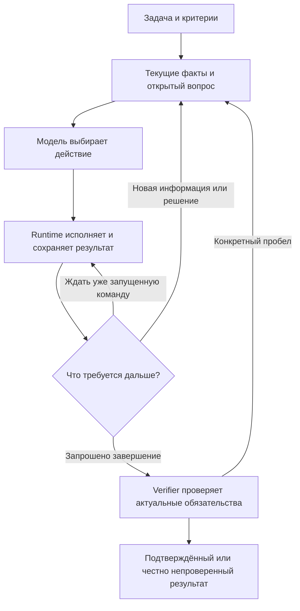

# ASTROLABE: критическое приложение к плану дальнейшего развития

**Дата:** 2026-10-02. **Статус:** исследование и предложения, без реализации и новых живых прогонов.

Дополнение к [further_development_ideas.md](further_development_ideas.md), версия 2. Исходный документ сохранён без изменений. Здесь уточняются его выводы, предлагается другой порядок вложений и разбираются альтернативы архитектуре. Это не новая спецификация и не изменение уже принятых решений владельца.

Исследование выполнено в Codex с независимыми разборами **GPT-6 Astra, GPT-6.1 Sol и GPT-6 Sol**. Это новые рецензенты; они не выдаются за Fable, Opus и Codex из исходного анализа. Итоговый отбор и ответственность за выводы — у составителя приложения. Разногласия и повторная проверка собственных предложений приведены в §10.

**Короткий маршрут чтения:** выводы — §0; конкретные поправки к исходнику — §2; новые находки в коде — §3; рейтинг — §5; практический план — §9.

## 0. Мой вывод

**Я бы сохранил ядро исполнения и проверки, но существенно сократил обязанности модели по обслуживанию harness.** Наиболее перспективная переработка — передать runtime все действия, для которых уже есть достаточно данных: ожидание процесса, отражение фактов исполнения, повтор разрешённой операции, запуск объявленной проверки, формирование достоверного статуса. Модели оставить выбор следующего содержательного действия, интерпретацию результата и работу с неопределённостью.

В `further_development_ideas.md` правильно найдены потери, но предлагаемый ответ слишком быстро становится большой системой регулирования. Оптимизация стоимости должна учитывать качество, а его независимая мера пока слабее, чем модель стоимости. **Есть риск построить хорошо настроенный регулятор вокруг плохо определённого результата.**

Мой порядок вложений:

1. **Исправить расчёт допустимости контекста и снять конкретные лишние расходы.** Повторный учёт резервов при маршрутизации, динамическая строка в стабильном префиксе, эхо записанного файла, LLM-опрос фоновых команд. Для этого не нужен полный governor.
2. **Сделать завершение одним согласованным процессом.** Проверка относится к конкретному дереву и требованию; её происхождение доходит до аналитики. Зелёный запуск команды не превращается автоматически в независимое подтверждение всей задачи.
3. **Раньше проверить прямой профиль.** Сделать STATE необязательным интерфейсом мыслительных заметок, а факты работы выводить из журнала. Эксперимент поднять с №12 исходника; универсальное включение не предлагать.
4. **Дать ограниченный выход из неудачной стратегии.** Различать ошибку среды, протокола и решения; сохранять лучший проверенный кандидат; при необходимости один раз менять способность исполнителя или обращаться за советом.
5. **Улучшать перенос состояния до автоматизации коротких эпох.** Переносить ограничения, актуальные свидетельства и незакрытый вопрос; считать стоимость восстановления после границы.
6. **Развивать экономический регулятор по одному решению.** Начать с прозрачного учёта и теневого расчёта. Включать управление только для рычага, который сохранил качество в сопоставимом эксперименте.

Самая существенная новая находка — в цепочке `Compiler → Controller.route → Router`: запас контекста смешан с фактическим входом, выходной резерв прибавляется повторно, а неудачная компиляция исходного профиля прекращает выбор до рассмотрения более вместительных профилей (§3.1). Это конкретнее и приоритетнее новой формулы оптимизации.

**Переписывание всего SDK сейчас имеет низкую ожидаемую отдачу.** Но замена части протокола ячейки может быть выгоднее последовательного исправления каждой его формальности. Сохранять весь нынешний способ общения с моделью только потому, что вокруг него много тестов, также было бы ошибкой.

## 1. Основания и пределы анализа

### 1.1 Что проверено

Рабочая точка: ASTROLABE `f68032f`, корневой репозиторий Studio `a25f8a5`, AI Gate SDK `91d432b`. Прочитаны актуальные handoff и snapshot, анализ эффективности, исходный план, прежний FABLE-анализ, релевантный текущий код. Три файла `ideas/ideas/` разобраны отдельным рецензентом; ключевые разделы перепроверены составителем. Веб-утверждения проверялись по статьям, документации и материалам авторов, а не только по прежней библиографии.

Уровни основания в этом документе:

- **Код:** поведение следует из прочитанной реализации; это статическая проверка, не воспроизведение на модели.
- **Отчёт:** число взято из существующего локального анализа; исходные измерения заново полностью не пересчитывались.
- **Расчёт:** арифметическое следствие явно названных допущений.
- **Гипотеза:** ожидаемое поведение после изменения; подтверждения на ASTROLABE пока нет.

Не запускались harness, платные модельные прогоны, сборки и тесты. Выполнены чтение кода, проверка источников, арифметика и проверка документа. Исследовательские вызовы трёх рецензентов не являются испытанием ASTROLABE.

### 1.2 Какие данные нельзя смешивать

| Срез | Что известно | Чего он не устанавливает |
|---|---|---|
| До D-363–D-375 | В отчёте: 39–48 ходов, 30–47% ходов с отказом; существенные задержки запуска и снимков | Нынешнюю частоту отказов после исправлений |
| После части исправлений | DeepSeek: 24 и 67 ходов; GLM: 16 модельных вызовов в новом анализе, 17 ходов в progress note | Полный результат на окончательном D-375 для всех моделей; «ход» и «вызов» могут считаться по-разному |
| Успех Angular-сценария | По отчёту прошли build, smoke и браузерные проверки | Что весь хвост с браузером можно удалить без потери качества |
| P0–P6: 185/185 DONE | Реализованы и проверены fixtures; поздние изменения имеют локальную Windows-проверку | Производственную эффективность всех слоёв, S2/S3, KB и маршрутизации |
| Десять прогонов / 360 пар из further | Полезный материал для диагностики расходов | 360 независимых задач или устойчивые оценки качества политик |

Источники: [harness-efficiency-analysis.md](harness-efficiency-analysis.md), [efficiency-progress.md](efficiency-progress.md), [actual_state](ASTROLABE/actual_state.md), [handoff](ASTROLABE/CONTINUE-TASK.md), [further, §§1–2 и приложение A](further_development_ideas.md).

Дампы `diags/` доступны, но полный набор `live1/live2` и скриптов исходного исследования описан как временные материалы прежней сессии. Числа 4%, 9%, 31% ниже остаются атрибутированными результатами того анализа, а не моими независимыми замерами. Проверка памяти нашла 24 изменённых отпечатка; навигационные карточки использовались как указатели, текущий код — как основание.

## 2. С чем я согласен и что поправляю в исходном анализе

### 2.1 Согласие

- Сохранить версии файлов, CAS, журнал эффектов, квитанции, владение процессами, восстановление и независимое право приёмки. Это полезные механизмы даже при замене модели и её интерфейса.
- Считать полную стоимость работы, включая неудачи, проверки и повторы. Разделять оплаченный счёт и оценку.
- Уменьшать рост истории в месте возникновения: компактный результат лучше постоянного ремонта раздутого транскрипта.
- Сохранять стабильность префикса; учитывать конкретный маршрут и правила провайдера.
- Заморозить расширение S2/S3, куратора, автоматической генерации инструментов и сложного обучения до появления полезного сигнала.
- Проверять изменения поведения парными задачами. Повтор записанного журнала сам по себе не показывает, как модель поведёт себя с другим контекстом.

### 2.2 Существенные поправки

| Место в further | Моя поправка | Последствие для плана |
|---|---|---|
| §0, §4.6, №1: полный G0 первым | Минимальный достоверный журнал нужен сразу. Отдельная таблица статистики, экран Studio и универсальная модель связки не нужны для устранения эхо файла или опросов | Разделить обязательный учёт и будущую аналитику; ремонт не ждать большого G0 |
| §3.1: masking при половине цены summarization | В The Complexity Trap половина цены относится к **raw history**. Например, в Table 1 у Qwen3-Coder: $0.61 masking, $0.64 summary, $1.29 raw | Снять завышенное преимущество именно над резюме; оставить простой baseline. [Источник](https://arxiv.org/html/2508.21433v1) |
| §3.1: ECLoop подтверждает CAS и read coverage | Работа исследует составные условия свидетельств, которые предварительно формируются под задачу. Эффект всей конструкции не выделяет пользу CAS | Сохранение CAS обосновывать его гарантией согласованности; не приписывать ему чужие +12 п.п. [Источник](https://arxiv.org/html/2607.28815v1) |
| §2.6: до 65K нет эффекта большого контекста | Отсутствие обнаруженной связи с reasoning tokens, временем и отказами не устанавливает отсутствие вреда пониманию и конечному качеству | Малый контекст оставить осмысленной гипотезой; его достаточность проверять отдельно |
| №4: 31% хвоста как главный резерв | Известна стоимость поздней работы, а не доля бесполезной работы. Playwright мог закрывать требование UI | Считать расходы после **достаточного набора проверок**, а не после первого build green |
| №12: direct после governor и эпох | Его экспериментальная версия может проверить более крупную концептуальную ставку раньше | Поднять исследование direct; перенос состояния включить в его стоимость |
| №15: эскалация в последней волне | Возможность остановить неподходящий способ решения может стоить больше кэш-оптимизации | Поднять ограниченный эксперимент; не вводить безусловный cheap-first |
| §4.3: цены известны с первого счёта | Первый счёт даёт стоимость вызова. Три неизвестных тарифа из одной суммы обычно не восстановить | Отдельно хранить bill, документированные rates и inferred rates |
| §4.3: кэш сходится примерно за 10 запросов | Стабильность маршрута не установлена; бинарный hit также не описывает объём кэшированных токенов | Диапазоны неопределённости и неизвестный upstream; без ложной точности |
| §4.4: 11–14 запросов на эпоху | Это условный оптимум бухгалтерской модели без измеренной потери информации | Не превращать число в расписание; сначала корректный handoff и естественные границы |
| §4.2: экономный профиль допускает 3×/4× | Это противоречит записанному там же ограничению владельца: 3× и больше неприемлемо | Соблюдать предел пользователя во всех профилях; экономность его молча не отменяет |
| §5.1: строки → токены → часы | Один интенсивный сеанс разработки не задаёт устойчивую норму для lifecycle, ABI, кэша и восстановления | Планировать проверяемые срезы с диапазоном труда и отдельным риском интеграции |
| §8: ни одного полного промаха кэша | Это зависит от внешней системы даже при правильном клиенте | Проверять отсутствие предотвратимых изменений префикса; внешние misses учитывать |
| §8: три профиля должны упорядочить цену и время | Более тщательная политика иногда и дешевле, и быстрее благодаря меньшему числу ошибок | Проверять соблюдение обещанных бюджетов и качество; не требовать искусственной монотонности |

**Отдельное несогласие:** утверждение «малые улучшения механики доказываются replay одного прогона» слишком широкое. Replay доказывает изменение сериализации, парсинга или условного счёта. Как только меняется видимый модели результат, допуск действий или момент остановки, может измениться вся дальнейшая траектория.

### 2.3 Что действительно осталось от FABLE_ANALYZE_AND_IDEAS

Ранние R3/R4 полезны как история причин, но значительная часть уже закрыта D-363–D-375. Возвращать весь пакет в backlog нельзя. Новую работу оправдывают текущие места в коде: `create` всё ещё отдаёт тело, маска остаётся в `[S]`, роли helper/escalation в Studio обнуляются.

Я бы вернул внимание к трём идеям прежнего [FABLE-анализа, §§7 и 11](FABLE_ANALYZE_AND_IDEAS.md): факты исполнения ведёт harness; лучший кандидат сохраняется при исчерпании бюджета; сильный советник вызывается по необходимости. Однако каскад «сначала повысить effort, затем совет, затем модель» не должен быть обязательным: при сломанном runner дополнительные рассуждения не исправляют среду.

## 3. Новые находки в текущем коде

Обозначение `K/` далее — `ASTROLABE/core/src/main/kotlin/io/astrolabe/`. Номера строк относятся к указанному commit; устойчивые ориентиры — имена классов и методов.

### 3.1 Допуск контекста и маршрутизация используют разные величины как одну

**Код.** [Compiler.compile](ASTROLABE/core/src/main/kotlin/io/astrolabe/context/Compiler.kt#L101) резервирует `maxOutputTokens + anchorMaxTokens + max(lookBudgetTokens, runBudgetTokens)`. [ContextCover.select](ASTROLABE/core/src/main/kotlin/io/astrolabe/context/ContextCover.kt#L115) включает резерв в фиксированные расходы и `totalTokens`. [Controller.route](ASTROLABE/core/src/main/kotlin/io/astrolabe/campaign/Controller.kt#L1658) передаёт этот total как `RoutingPacket.contextTokens`. [Router.selectProfile](ASTROLABE/core/src/main/kotlin/io/astrolabe/route/Router.kt#L143) прибавляет `outputTokens` ещё раз.

В результате при проверке окна выход зарезервирован повторно. При оценке стоимости плановые output/anchor/observation также представлены как уже оплачиваемый вход. Консервативный запас может быть полезен для admission, но это другая величина, чем размер запроса и его ожидаемая цена.

**Расчёт, иллюстрация малому окну:** окно 16 384, `alpha=0.65`, output=4 096, anchor=5 000, observation=4 000:

```text
floor(16 384 × 0.65) − (4 096 + 5 000 + 4 000) = −2 447
```

Места нет ещё до system, repository и contract. Это пример с заданным output limit, а не утверждение, что каждый профиль 16K сейчас настроен именно так. Часть проблемы малого окна уже названа в handoff; повторный учёт в routing — дополнительная находка.

**Вторая проблема:** `Controller.route` сразу возвращается, если первоначальный `Compiled` не `Ready`. Более вместительный профиль не получает шанс исправить нехватку места. Для `NeedsRescoping` из-за capacity это неправильный порядок выбора; для нехватки самих свидетельств большая модель проблему автоматически не решит.

**Изменение:** разнести текущий wire input, резерв будущего роста и output limit; компилировать допустимых кандидатов по их окнам, затем выбирать. Переоценка admission не должна автоматически повышать стоимость или tier из-за ошибки среды.

**Уверенность:** высокая в цепочке вычисления; величина влияния на живые задачи неизвестна. Нужны небольшие fixtures на границы окна, а не новое обучение маршрутизации.

### 3.2 «Шов экономики» ещё не равен готовому регулятору

**Код.** `Controller` создаёт `RoutingPolicy` без `attemptPolicies`; [Router.expectedCost](ASTROLABE/core/src/main/kotlin/io/astrolabe/route/Router.kt#L179) тогда возвращает консервативную цену одного вызова. `AttemptCost` существует, но реальная политика не получает из воздуха вероятности исходов и продолжений.

В [Economics.report](ASTROLABE/core/src/main/kotlin/io/astrolabe/campaign/Economics.kt#L109):

- `boundaryMoney` — вся стоимость первого вызова ячейки, включая полезный выход. `boundaryCostShare` не является причинно измеренным налогом границ.
- `kTokens` — выбранный `[K]`; в break-even он сравнивается с полным прошлым input. System/repository/anchor новой линии и восстановление знаний в эту разницу не входят полностью.
- `CACHE_WRITE=1.25` фиксирован; `rho` обязан быть строго между 0 и 1, поэтому крайний случай без скидки `rho=1` даже не представим в этом интерфейсе.

Подключать такие метрики непосредственно к управляющему решению рано. Сначала дать им точные названия и размерности: «доля первых вызовов», «оценка входа», «оплаченный счёт», «неизвестная стоимость восстановления». Это не предложение выкинуть `Economics`; это ограничение его нынешней интерпретации.

### 3.3 Происхождение приёмки должно доходить до метрик

**Код.** `Acceptance.origin` уже существует. Но [Resolver](ASTROLABE/core/src/main/kotlin/io/astrolabe/verify/Resolution.kt#L325) помечает успешно выполненный Run как `ProvenanceKind.Tested`; происхождение самого критерия не становится отдельной осью этого итогового объекта. Оно может быть восстановлено из связанных записей, но потребитель одного итогового поля различие не увидит.

Это особенно существенно при принятом владельцем режиме автоматического добавления команды модели. Он допустим для рабочего процесса. Для оценки качества нужно отдельно знать:

```text
кто задал требование → кто/когда создал проверку → что реально запускалось
→ на каком дереве и окружении → что подтвердилось → кто принял остаточный риск
```

Команда агента может действительно проверять поведение; команда пользователя может оказаться слабой. Происхождение не является оценкой качества само по себе. Оно позволяет не смешивать разные виды свидетельств и закреплять неизменный критерий для сравнения политик.

### 3.4 После исправления stall полезная активность ещё не стала измеримым прогрессом

**Код.** [Progress.work](ASTROLABE/core/src/main/kotlin/io/astrolabe/cell/Gates.kt#L93) учитывает применённые правки и новые результаты. Это помогло снять ложные остановки. Однако новая правка или новый лог могут повторять неудачную стратегию. Сигнатура по аргументам и выводу меняется даже при отсутствии продвижения требования.

Поэтому нужны разные сигналы:

- **Активность:** процесс работает, инструмент завершился, дерево изменилось. Защищает от ложного stall.
- **Изменение проверенного состояния:** закрыто обязательство, исчез воспроизводимый failure, найден конкретный контрпример. Полезно для диагностики продолжения.
- **Расход:** деньги, время, запросы. Абсолютный пользовательский лимит действует независимо от активности.

Даже отсутствие новых зелёных проверок не доказывает бесполезность исследования: отрицательный результат поиска иногда решает задачу. Не превращать счётчик квитанций в награду, которую агент должен максимизировать.

### 3.5 Вытеснение текста, доказательства чтения и право редактирования связаны

**Код.** [Cell.evict](ASTROLABE/core/src/main/kotlin/io/astrolabe/cell/Cell.kt#L1040) вызывает `Workset.stub`; [Workset](ASTROLABE/core/src/main/kotlin/io/astrolabe/workset/Workset.kt#L149) снимает coverage вытесненного результата. CAS отдельно проверяет версию файла.

Это объясняет возможный дополнительный расход, но не доказывает, что 44 чтения в известном прогоне были лишними. И простое сохранение coverage после eviction меняет смысл «модель видела текущие байты». Совпадающий hash не гарантирует, что модель помнит окружающий контракт.

**Пересмотренная рекомендация:** сначала связать события `eviction → отказ из-за coverage → чтение той же версии → edit` и оценить их долю. Затем попробовать удержание активных фрагментов и короткий `recall`. Разделить исторический факт чтения и текущую резидентность полезно для данных; автоматически выдавать прежнее право любой правки — преждевременно.

Узкий путь `exact old_text + expectedVersion` можно рассматривать позже. Он должен исключать неоднозначное совпадение, широкую замену, скрытые строки и произвольные трансформации. Даже тогда остаётся риск семантически неверного решения.

## 4. Как я изменил бы концепцию ячейки

### 4.1 Один источник фактов, небольшой интерфейс для мысли

В исходной концепции регистр одновременно описывает мысли модели, план, факты исполнения и условия продолжения. Это создаёт обязанность синхронизировать представление модели с состоянием, которое harness уже знает.

Я предлагаю чётче распределить ответственность:

| Содержание | Кто создаёт | Как попадёт в контекст |
|---|---|---|
| Запрос и ограничения пользователя | Пользователь; runtime сохраняет происхождение | Дословно либо точная структурная ссылка, без повышения статуса модельных заметок |
| Изменённые файлы, версии, процессы, результаты проверок | Runtime | Компактная проекция долговременных записей |
| Обязательства и текущая достаточность проверки | Контракт и verifier | Что подтверждено, что ещё неизвестно |
| Гипотеза, причина выбора, отвергнутая альтернатива | Модель | Короткая необязательная заметка; не доказательство |
| Следующий инструмент | Модель | Обычный вызов в доступном интерфейсе |
| Ожидание, фиксация квитанции, разрешённая цепочка завершения | Runtime | Один результат при достижении нужного события |

Это развитие принципа FABLE «harness наблюдает», а не заявка на новую универсальную архитектуру. Существенная замена — модель перестаёт быть обязательным оператором внутреннего журнала.

### 4.2 Как будет выглядеть работа



`finish_after_checks` здесь выражает намерение завершить. Runtime выполняет только уже разрешённую цепочку и проверяет свежесть свидетельств. Он не выдумывает отсутствующие требования и не объявляет успех по таймеру.

### 4.3 Что оставить строгим

Строгость на приёмке не отменяет строгие полномочия при самом действии. Сохранить ограничения путей, свежесть версий, защиту внешних эффектов, отмену процессов, durable ordering и целостность проверок. Упрощать можно синтаксис, отображение, обязательные записи плана и лишние переходы через модель.

S0/S1 должны получать маленький постоянный на ячейку набор доступных возможностей. Если позже нужна новая роль или инструменты, менять конфигурацию на явной границе. Скрытие инструментов по каждому ходу может снова разрушить кэш и сделать интерфейс непредсказуемым.

## 5. Мой рейтинг вложений

Рейтинг качественный: ожидаемая польза для подтверждённой работы, сила основания, цена внедрения и цена ошибки. Баллы с десятыми долями создали бы выдуманную точность. Ранги 3–5 могут меняться по классу задач.

**Единица затрат:** инженерный день, примерно 6–8 часов содержательной работы с узкими проверками и ревью. Это оценка объёма труда, не календарный SLA и не скорость набора кода агентом. Ожидание живых сравнений, доступов и CI учитывается отдельно. Диапазоны перекрываются по общей инфраструктуре; складывать строки таблицы механически нельзя.

| Ранг | Предложение | Потенциал и основание | Затраты | Отношение к further |
|---|---|---|---|---|
| **1 / A1** | **Корректный допуск + убрать лишние вызовы и дубли** | Высокая уверенность в дефектах; ограниченная, но непосредственная экономия; помогает и качеству при ложных отказах | **4–7 дней** на несколько отдельных срезов | №2, №3, №9 раньше; плюс новые ошибки routing |
| **2 / A2** | **Единое завершение и проверяемое происхождение результата** | Большой потенциал числа ходов и честности метрик; требует различать достаточную и слабую проверку | **3–6 дней** для первого класса задач | Объединить части №4 и №10; поднять качество oracle |
| **3 / A3** | **Прямой профиль с runtime-журналом** | Самая перспективная ограниченная переработка протокола; эффект на сильных и слабых моделях неизвестен | **4–7 дней** для S0/простого S1 и корректного переноса | Поднять эксперимент с №12; не включать всем |
| **4 / A4** | **Ограниченная смена стратегии по типу провала** | Может обрезать самые дорогие неудачи; умеет ухудшить стоимость коротких задач | **3–6 дней** на одну ветку: совет или смена исполнителя | Поднять №15; избежать обязательного каскада effort |
| **5 / A5** | **Сохранение лучшего кандидата и достаточный перенос** | Защищает качество при стоп-лоссе, перезапуске и direct; экономия косвенная, потенциально значительная | **3–6 дней** минимальный срез; **5–8** с нейтральной эпохой | Вернуть FABLE R24; сделать предпосылкой №11 |
| **6 / A6** | **Короткие, проверяемые сведения о среде проекта** | Полезно при повторных задачах и нестандартном toolchain; маленькая цена | **1–3 дня** на один повторяющийся сценарий | Сузить и поднять №16; большой KB оставить замороженным |
| **7 / A7** | **Гистерезис и экономическое вытеснение в теневом режиме** | Полезно при длинных дорогих хвостах; меняет поведение через повторные чтения | **3–5 дней** для отчёта и одной политики; epochs отдельно | №6 позже ремонтов; №11 условно |
| **8 / A8** | **Полный регулятор баланса по маршрутам** | Продуктовая ценность есть; ожидаемая денежная отдача пока сильно неопределённа | **6–12 дней дополнительно** после исправленного учёта; дальнейшая валидация отдельно | Разбить G0–G3; не считать 5,7K строк готовностью за одну сессию |

**Общая предпосылка B0:** 1–3 дня на минимальный экспорт фактов и замороженные сценарии; ведётся с A1, а не заменяет его. Жёсткие лимиты пользователя и честная остановка нужны с первой волны. Для них не требуется выученный прогноз длины задачи.

### A1. Что именно делать первым

1. Исправить размерности `Compiler/Controller/Router` и конфигурации малых окон. Это 2–4 дня из общего диапазона A1.
2. Перенести динамическую маску из стабильного `[S]`, сверяя **фактически сериализованный запрос** после адаптера. Подключить ключ сессии там, где endpoint его поддерживает.
3. Результат `create` заменить квитанцией с версией и размером, сохранив возможность корректного продолжения. Тело уже содержится в аргументах. Полная запись остаётся в хранилище.
4. Для фоновой команды ввести ожидание до завершения или явной готовности с отменой и дедлайном. Новая строка лога сама по себе не требует обращения к модели. Бесконечно работающий сервер требует другого условия, чем batch-команда.

**Почему это №1:** здесь известен сам лишний механизм. Часть экономии не зависит от угадывания сложности задачи. При этом интерфейс результата меняется, поэтому окончательный эффект качества всё равно требует проверки.

**Граница обещания:** 4% стоимости промаха и 9% опросов из further относятся к одному прогону. Это ориентиры верхнего резерва для похожих траекторий; они не складываются с эффектами завершения и не обещаются для всех задач.

**Когда остановиться:** если компактный ответ порождает компенсирующее чтение, вернуть минимальный нужный фрагмент. Если ожидание скрывает полезную диагностику, позволить прерывание по ошибке/событию. Не превращать «меньше обращений к модели» в абсолютный запрет.

### A2. Завершать по обязательствам, сохраняя различие видов проверки

Для bugfix сначала получить воспроизводитель, который падает на базе по нужной причине; затем проверить исправление и подходящие регрессии. Если воспроизводитель невозможен или задача иного класса, сохранить это ограничение явно. Не запускать весь проект до каждого тривиального изменения.

Один объявленный запуск проходит через `Scheduler` с правильными command/cwd/environment/contract/tree identities. Успешная свежая квитанция не требует повторного запуска того же теста под другим инструментом. Произвольный `run` нельзя задним числом признать полноценной приёмкой без достаточной фиксации этих условий.

После запроса завершения runtime либо принимает результат по обычным правилам, либо сообщает конкретный пробел. Для необязательной поздней проверки модель может назвать, какое ещё свойство она хочет подтвердить; это полезнее очередного общего «проверь ещё».

**Небольшая новая идея:** отчёт должен показывать оставшуюся неопределённость по свойствам результата: сборка, API-сценарий, UI, регрессия. Эта информация помогает выбрать следующую проверку. Она не требует общей шкалы «качество 87%» и не делает все виды проверок обязательными.

**Опровержение:** если сокращённый хвост даёт больше дефектов, обнаруживаемых независимой приёмкой или человеком, раннее завершение отступает. Если дублирование команд было существенным, экономия должна появиться без уменьшения проверяемых свойств.

### A3. Прямой профиль как проверка главной архитектурной гипотезы

В новом профиле runtime автоматически отражает изменения файлов, запуски и актуальные receipts. Модель может записывать гипотезы и решения; обязательные `next`, отметки плана и дубли фактов исполнения исчезают из простого пути.

Пересчитанная в further доля ходов «только STATE» — 8,7% — не устанавливает потолок пользы: протокол влияет ещё на планирование вызовов, ошибки, длину выхода и способ завершения. Это уточнение по другой совокупности, а не доказанное снижение в сопоставимом before/after. Но утверждать, что весь reasoning overhead вызван регистром, также нельзя.

**Минимальный эксперимент:** один интерфейс direct против нынешнего при том же наборе исполнительных гарантий, том же effort и критериях. Стабильные схемы в пределах ячейки; без одновременной замены инструментов на bash-only. Для слабой модели можно сохранить короткий план как опору, без обязанности обслуживать внутреннюю базу.

**Критическая зависимость:** `CarryForward` сегодня выбирает seeds по cursor/plan/next/focus. Их удаление требует другого выбора: изменённые файлы, актуальные ошибки, открытые обязательства и короткая заметка о следующем решении. Просто удалить инструкции о STATE недостаточно.

**Опровержение:** если уменьшаются административные ходы, но растут потеря требований, ранние пустые завершения или повторные открытия файлов, direct сохраняется только для тех классов, где прошёл сравнение. «Сильная модель» сама по себе не критерий включения.

### A4. Эскалировать способность, соответствующую причине провала

Предложение: использовать уже существующие `FailureClass`, `Ladder`, routing и helper seams для **одного ограниченного изменения стратегии**. Studio сейчас обнуляет роли в [TaskService](ASTROUI/backend/server/src/main/java/io/astrolabe/studio/tasks/TaskService.java#L541); их восстановление — лишь проводка, а не вся политика.

| Наблюдаемая ситуация | Разумный следующий шаг |
|---|---|
| Не удалось запустить установленную команду | Диагностика runner/PATH/cwd; не повышение effort |
| Повторяется ошибка схемы инструмента | Однозначное исправление аргументов или подсказка интерфейса |
| Повторяется одна проверяемая ошибка решения | Короткая консультация либо смена исполнителя |
| Не хватает необходимых свидетельств | Целевое чтение/поиск; больший профиль только если мешает вместимость |
| Требования допускают разные несовместимые решения | Уточнение у пользователя с описанием последствий |

Пакет советнику: задача, ограничения, текущий diff, актуальный failure и открытый вопрос. Ответ — конкретный следующий шаг или ограничение. Копирование всей истории дорого и переносит ошибочную интерпретацию.

**Моя ставка:** ценен выбор момента до дорогой неверной ветки, например перед ручной заменой отсутствующего toolchain. Но детектор такой ситуации несовершенен; постоянный сильный советник станет новым налогом. Сравнивать отдельно cheap-only, cheap+advisor и strong-only с одинаковой приёмкой.

### A5. Сохранять проверенный кандидат и смысл продолжения

Сначала использовать имеющиеся checkpoints, candidate identities, `CarryForward`, `NEG` и dead ends. Новая универсальная память не нужна.

**Минимальный перенос:** актуальная задача и ограничения; дерево кандидата; подтверждённые и непроверенные обязательства; доступные версии свидетельств; открытая гипотеза и дешёвый способ её различить с альтернативой; причина последней неудачи с границами применимости.

Пример полезной записи: «`npm test` не запустился через этот launcher; наличие Node не опровергнуто; проверить разрешение `.cmd`». Запись «npm отсутствует» повысила бы ограниченный результат инструмента до ложного факта среды.

Сохранять лучший по **тем же проверкам** кандидат до рискованной доработки. Количество зелёных тестов не задаёт универсальное качество: разные кандидаты могут закрывать разные свойства. При исчерпании бюджета выдавать сохранённый артефакт с его действительным статусом; не заменять автоматически пользовательское рабочее дерево старой версией.

Для будущих эпох нужна нейтральная причина handoff. Смена контекста не должна случайно становиться failed attempt, сбрасывать общий расход, терять процесс или вызывать эскалацию. Сейчас новые ячейки потребляют `cells`, а partial/failure имеют разные последствия в Controller. Поэтому «перенос уже есть» не означает «таймер эпох внедряется за несколько строк».

### A6. Память среды с дешёвой проверкой актуальности

Начать с одного повторяющегося расхода: как запустить проверку или dev-сервер в этом проекте. Хранить путь/argv/cwd, обнаруженную версию инструмента, относящиеся config/lock hashes и ссылку на успешный запуск. При изменении предпосылок перепроверять.

Не загружать весь накопленный справочник в каждый запрос. Подавать запись при задаче соответствующего класса. Пример: рабочая команда Gradle/JDK на Windows полезнее общего эссе об устройстве репозитория.

**Опровержение:** если подготовка и инвалидация дороже повторного обнаружения или советы устаревают, оставить обычное чтение конфигурации. Эта идея ценна при повторении, а не автоматически для одноразовой песочницы.

### A7–A8. Экономика как последовательность малых решений

Сначала измерять полный новый запрос, cached tokens, реальный bill, повторные чтения и стоимость handoff. Затем рассчитать альтернативное вытеснение **без его выполнения**. Первый управляющий рычаг — гистерезис и осторожное объединение переписываний, а не одновременная настройка effort, проверки, окна и модели.

Если альтернативы близки в пределах неопределённости, сохранять текущую политику. При неизвестной цене или upstream не придумывать точное преимущество. Политика должна иметь стабильный fallback, соблюдать жёсткие лимиты и не менять полномочия verifier.

Именованные профили полезны уже как прозрачные пользовательские настройки. Их можно дать раньше полного A8: бюджет, дедлайн, доступные модели и желаемая глубина дополнительных проверок. Нельзя молча ослаблять обязательные критерии, повышать лимит или обещать измеренный «оптимум».

## 6. Математика: что она позволяет предсказать

### 6.1 Считать всю работу и удерживать качество отдельно

Для фиксированного набора задач практическая основа:

```text
стоимость подтверждённого результата = сумма расходов всех попыток / число подтверждённых результатов
```

Рядом обязательно публиковать долю завершения, ошибочные приёмки, время и работу человека. Иначе политика может улучшить стоимость результата, просто отказываясь от сложных задач. Если подтверждённых результатов нет, показатель не превращается в ноль или выгодную оценку.

Для управленческого выбора полезна форма из `harness-resarch_02 §5.1`: стоимость API + цена времени + цена человеческого вмешательства, при отдельном ограничении на качество и покрытие задач. Точные коэффициенты неизвестны; показывать несколько измерений честнее, чем скрывать их в одном score.

`C/P` математически осмысленно для повторяемых попыток с одинаковой политикой, корректным средним расходом и соответствующими предпосылками возобновления. Ограниченный каскад с сохранённым патчем, сменой модели и зависимыми ошибками требует условных вероятностей:

```text
E[C] = c₁ + (1 − p₁) × (h + c₂|fail₁)
P(success) = p₁ + (1 − p₁) × p₂|fail₁
```

Здесь первая неудача должна быть корректно обнаружена; стоимость проверок входит в c, перенос — в h. При ложных приёмках нужны дополнительные ветви. Вероятность сильной модели на задачах, где уже не справилась дешёвая, обычно нельзя заменить её средней успешностью на всём benchmark.

**Расчёт для интуиции:** если расходы снизились на 20%, а вероятность успеха относительно прежней упала на 25%, то цена успеха меняется как `0.80/0.75 = 1.067`, то есть ухудшается примерно на 6,7%. Это сценарий, не прогноз ASTROLABE.

### 6.2 Интервал вытеснения — полезная чувствительность, слабый готовый policy

Формула `k* = sqrt(2F/(d·g))` в further корректно показывает компромисс при постоянных расходах и росте. Для его примерных `F=0.9×17K`, `d=0.1`, `g=1K` получается `k*=17.49`. Сам расчёт не оспариваю.

Но после A1–A3 изменятся рост истории g, число оставшихся запросов, стоимость повторного чтения и поведение модели. Оптимизировать интервал раньше этих изменений значит калибровать заведомо уходящий режим.

Для reset нужно сравнивать:

```text
экономия переноса старого контекста
> цена новой линии + повторное получение сведений + дополнительная генерация
  + ожидаемая цена ошибок из-за потери контекста
```

Последнее слагаемое неизвестно. Поэтому экономический выигрыш короткой эпохи — условное предложение к эксперименту, а не подтверждение её оптимальности.

### 6.3 Десяти запросов недостаточно для уверенной модели кэша

**Расчёт:** даже 10 попаданий из 10 при независимой постоянной вероятности дают двустороннюю точную 95% нижнюю границу около **0.69**. В реальности запросы зависимы, а маршруты и нагрузка меняются; этот упрощённый интервал уже показывает проблему точности.

Важнее считать token-weighted cached fraction и деньги. Попадание на 1K из 50K и на 49K из 50K — разные экономические события. Признак `CACHE_READ > 0` не заменяет модель стоимости хвоста.

Первый bill даёт одну сумму `C = u·p_in + c·p_cache + o·p_out`. Для определения нескольких неизвестных rates нужны документированные компоненты счёта либо несколько достаточно различающихся наблюдений; постоянные пропорции токенов мешают идентификации. Наценки, скидки и ярусы дополнительно усложняют задачу.

### 6.4 Мощность исследования: точечные заявления слабее общей идеи

При независимых группах, стандартном приближении мощности 80%, уровне 5%, `σ(log C)=0.5` и эффекте `ln(1.2)` получается около **118 задач на ветку**. Это воспроизводит порядок величины further. Но σ, корреляция пар и распределение задач были допущениями; универсального числа «нужно 80–120» нет.

Повторы одной задачи измеряют вариативность этой задачи. Они не заменяют разнообразие репозиториев. Последовательная проверка, подбор нескольких политик и остановка при удачном результате также меняют статистическую процедуру.

**Мой вывод:** не строить сложное online-обучение сейчас, но и не объявлять поведенческую адаптацию невозможной на годы. Возможны ограниченные правила по повторяющимся классам, точечные эксперименты и пересмотр defaults. Они просто не дают права заявить доказанные 10–20% глобального выигрыша по нескольким задачам.

### 6.5 Экономия разработки тоже входит в баланс

По цене из исходного отчёта `$0.149` за длинный прогон гипотетическое снижение на 20% даёт `$0.0298` за задачу, или **$29.80 на тысячу таких задач**. Если задача дороже или поток велик, экономика меняется. При нынешнем масштабе ценность может лежать прежде всего в сокращении ожидания, вмешательств и неудач.

```text
число задач до окупаемости = цена разработки и сопровождения / ожидаемая экономия на задачу
```

Это аргумент за дешёвые ремонты и проверку больших поведенческих ставок. Приписывать сложному governor высокую окупаемость только по API-центам без объёма использования нельзя.

## 7. Что я беру из трёх файлов ideas/ideas

| Материал | Полезное для нынешнего состояния | Что сузить или отложить |
|---|---|---|
| [harness-resarch_01](ideas/ideas/harness-resarch_01.md), M4/M7/M11, принципы | Экономика перечитывания; цена tool-интерфейса; проверка пользы каждого слоя; сложность включается по необходимости | «Microkernel» не требует нового runtime; гипотетические коэффициенты не становятся policy constants |
| [harness-resarch_02](ideas/ideas/harness-resarch_02.md), §§5.1–5.3, 5.5–5.10 | Достаточный контекст, стоимость человеческого вмешательства, зависимые ошибки, качество verifier, ценность различающего наблюдения | Его формулы сами оговаривают неизвестные коэффициенты; не превращать иллюстрации в точный оптимизатор |
| [merged-mix-of-ideas](ideas/ideas/merged-mix-of-ideas.md), m-03/m-06/m-10/m-18/m-20 | Воспроизводитель, исходные падения, reuse проверок, остановка по свидетельствам, полноценный журнал | Полные oracle-платформы, поиск множеством кандидатов и постоянная коллегия моделей сейчас дороже обоснованной пользы |

### Четыре уточнения к §7 further

1. **m-01/m-04 частично уже реализованы.** TestIntegrity, привязка версий и Resolver существуют. Нужен аудит конкретной непокрытой границы, особенно происхождения команды, а не новая система с тем же назначением.
2. **m-03/m-06 полезны за пределами benchmark.** На настоящем bugfix исходное падение и его причина защищают от ненужной работы по чужим красным тестам. Полный flake census всего репозитория при этом не нужен.
3. **m-08/m-14 заслуживают большей роли.** Лучший кандидат и ограниченная запись опровергнутой гипотезы дополняют stop-loss. Постоянно штрафовать повтор идеи нельзя: прошлый провал мог быть ошибкой реализации или среды.
4. **m-09 не делает доступ к информации «без потерь» для поведения модели.** Байты могут сохраниться в хранилище, но модель должна вовремя вспомнить о ссылке и запросить нужное. Стоит проверить автоматическое восстановление связанного с текущей ошибкой небольшого фрагмента, учитывая актуальность версии и лишний контекст; общий агент-навигатор пока избыточен.

**Разморозка более сильных проверок:** если найден воспроизводимый контрпример, который обычная независимая приёмка пропускает, добавить целевой differential/property/mutation check для соответствующего класса. Глобальную фабрику оракулов по-прежнему не предлагаю. Это условие возврата к замороженной идее, а не отмена решения владельца.

## 8. Что добавляет проверенный веб-research

Внешние результаты задают направления экспериментов. Ни один процент ниже не используется как обещание выигрыша ASTROLABE.

| Источник и срез | Что удалось установить | Как это меняет решение |
|---|---|---|
| **The Complexity Trap**, 2025, SWE-agent/SWE-bench Verified | Masking сопоставим с summarization и существенно дешевле raw history; сохраняет actions/reasoning, поэтому история продолжает расти | Начать с компактных результатов; не считать любую форму маскирования доказанно лучшей. [Полный текст, Table 1, §3.1](https://arxiv.org/html/2508.21433v1) |
| **Empirical Study of Harness Design**, 2026-09-17, 176 конфигураций, четыре модели, два benchmark | Зависимость от модели и задач сильная: в T4/128K SWE-bench у Mistral полный интерфейс 68.6%, bash-only 45.4%; у Nemotron-550B эффект другой. В абляции менялись также защитные свойства интерфейса | Подбирать direct/tool profile по измеренному поведению; отдельный bash-only — другая гипотеза. [Tables 3–4 и 11–12](https://arxiv.org/html/2609.20804v1) |
| **ECLoop**, 2026-07-30, два scaffold и две модели | Условия свидетельств могут уменьшать преждевременные действия; фиксация наблюдения не гарантирует его понимания | Сохранять полезные доказательные границы, устраняя формальные ритуалы. [§§2–3](https://arxiv.org/html/2607.28815v1) |
| **SWE-ABS**, 2026-03 | Усиленные тесты отвергли 2 184 из 11 041 ранее проходивших патчей выбранных агентов | Надёжность приёмки меняет экономический рейтинг; эти 19.78% не являются частотой дефектов ASTROLABE. [Исследование](https://arxiv.org/html/2603.00520v1) |
| **ImpossibleBench**, 2025-10 | Право abort снизило нарушения GPT-5 с 54% до 9% в специальном сценарии противоречащих требований; эффект не универсален по моделям | Честный partial/unverified нужен; это не довод автоматически останавливать сложные нормальные задачи. [§5.3](https://arxiv.org/html/2510.20270v1) |
| **Anthropic advisor strategy**, 2026-04-09 | Coding-сравнение содержит изменение thinking и prompt наряду с advisor | Советник — экспериментальная ветка; его отдельный причинный эффект из этих чисел не выделен. [Footnotes](https://claude.com/blog/the-advisor-strategy) |
| **Anthropic, long-running apps**, 2026-03-24 | По мере смены модели часть sprint-структуры стала лишней; резкое удаление scaffolding сначала ухудшало результат | Упрощать по компоненту. Плановые reset не объявлять обязательными. [Описание опыта](https://www.anthropic.com/engineering/harness-design-long-running-apps) |
| **Lost in Compaction**, 2026 | Исследуются потери пользовательских session constraints; COMPINT охватывает chat, agentic trajectories и research, а не benchmark ремонта кода | Ограничения пользователя должны переживать сжатие отдельно от рассказа модели. Это не доказательство 90% сохранности именно ASTROLABE. [Исследование](https://arxiv.org/abs/2608.11242) |
| **EET**, 2026-01 | Early termination использует извлечённый опыт, отдельные данные и модельную уверенность после edit/test | Мой вывод: взять этапы edit/test как точки оценки необходимости продолжения. Confidence и базу опыта пока не переносить как готовый механизм. [§§3–4](https://arxiv.org/html/2601.05777v1) |
| **SWE-Pruner**, 2026-01 | Task-aware pruning использует обученный reranker с CRF; многоязычность и цена интеграции существенны | Для Kotlin/Java/TS сначала targeted search, диапазоны и оглавления. Learned compressor — только если этот baseline недостаточен. [§3 и ограничения](https://arxiv.org/html/2601.16746v1) |

Дополнительная проверка [OpenRouter prompt caching](https://openrouter.ai/docs/guides/best-practices/prompt-caching) подтверждает `session_id`/`x-session-id` и истечение sticky session после 10 минут простоя. Это срок привязки маршрута, **не универсальный TTL KV-кэша**. Привязка помогает маршрутизации, но не гарантирует cache hit. В той же документации описан fallback на `prompt_cache_key`; реализация должна учитывать фактический endpoint и binding SDK.

[Документация Claude context editing](https://platform.claude.com/docs/en/build-with-claude/context-editing) описывает цену инвалидированного префикса и ограничения работы с thinking/history. Поэтому фразу further «Chat Completions — безопасно» следует сузить: история может оставаться допустимой для протокола и всё равно потерять нужный модели смысл. Проверять нужно обе стороны.

HarnessTax оставляю дополнительным ориентиром: первичная [страница проекта](https://harnesstax.github.io/) описывает 30 задач SWE-bench Lite и 30 Terminal-Bench 2.0 с тремя повторами и разными настройками harness. Setup проверен рецензентом по индексированному тексту первичной страницы; обычное открытие её JS-оболочки неполно. Число «разница успеха около 2%» не доказывает эквивалентности архитектур. Минималистичный цикл служит нужным baseline для цены структуры; его benchmark score не заменяет проверку Windows, восстановления и полномочий ASTROLABE.

## 9. План доработки с точками остановки

### Волна I. Сделать очевидные изменения и получить пригодный baseline

**Ориентир: 7–12 инженерных дней** на B0, A1 и минимальную часть A2 с общей инфраструктурой. Можно остановиться после любого полезного самостоятельного среза. Оценка включает интеграцию и узкие offline-проверки, но не календарное ожидание живых прогонов.

Порядок:

1. Зафиксировать текущий baseline и классификацию исходов; добавить недостающие факты в существующие долговременные записи.
2. Исправить admission/routing. Проверить окно, отсутствие двойного резервирования и рассмотрение более вместительного профиля только при capacity-проблеме.
3. Раздельно внести стабильный prefix, компактный create и ожидание background. Каждую причину расхода закрывать самостоятельным изменением.
4. Свести запуск объявленной приёмки и завершение, сохранив актуальность и происхождение receipts. Первым поддержать один понятный класс задач.
5. Дать явные бюджет/дедлайн и сохранённый частичный результат. Никакая активность не увеличивает предел сама.

**Минимальный B0 без отдельной аналитической платформы:** request/attempt/cell IDs; версии модели, binding, wire API, prompt и policy; запрошенный и фактически применённый effort либо unknown; usage по типам, bill и estimated cost раздельно; время модели и инструментов; отпечатки/размеры частей отправленного контекста; причина rewrite; command/tree/contract/check identity; происхождение критерия и итог. Записывать только недостающее, не дублировать существующую модель данных. Не копировать секреты из запросов в новый экспорт.

**Готово, когда:** отчёт восстанавливается из сохранённых фактов; резерв не считается входом; маска не меняет стабильную часть; файлы не дублируются без необходимости; ожидание имеет отмену; одна свежая объявленная проверка не выполняется повторно ради формы вызова; unverified остаётся отличим от независимо проверенного результата.

Если один из этих пунктов оказывается большой подсистемой, уменьшить его объём. Польза эхо-фикса не должна ждать универсального profiler UI.

### Волна II. Проверить, какие обязанности модели действительно нужны

**Ориентир: ещё 7–14 инженерных дней** для ограниченных версий A3–A5; живые сравнения — отдельный этап. Не включать одновременно direct, новую модель и другой effort: потом невозможно понять причину результата.

Сначала direct против прежнего профиля. Затем один режим помощи или смены исполнителя. Перенос и сохранение кандидата покрывают отмену, возобновление, новые сообщения пользователя и external file change — короткого happy path недостаточно.

**Минимальный будущий набор задач:**

- локальный bugfix с воспроизводителем;
- изменение API в существующем проекте и его caller;
- задача с уже падающим тестом на базе;
- UI-изменение, для которого build недостаточен;
- ошибка среды/launcher;
- длинное исследование с опровергнутой первой гипотезой;
- отмена/возобновление и новое ограничение пользователя.

Сначала 6–8 задач разных классов, 2–3 повтора пары для поиска крупных эффектов и регрессий. Это **screening**, не доказательство сохранения качества с точностью до нескольких процентов. Затем расширение по репозиториям и моделям. Сохранить отдельные задачи, не участвовавшие в подборе политики.

Фиксировать исходное дерево, проверки, разрешения, бюджет и маршрут; чередовать порядок запусков, учитывать warm/cold cache и изменения провайдера. Опциональное включение direct пользователем не даёт несмещённой оценки: пользователи выберут разные задачи. Для причинного сравнения нужны одинаковые пары.

**Метрики:** доля независимо подтверждённых задач; ложная приёмка; деньги всех попыток; p50/p90 времени; человеческие вмешательства; число запросов; повторные чтения той же версии; административные ходы; сохранность требований после handoff. Расход после первого зелёного показывать вместе с тем, какие новые свойства проверены позднее.

**Точка остановки:** если direct дешевле только ценой пропущенных требований, оставить старую опору для этого класса. Если советник не спасает достаточно неудачных траекторий, отключить его по умолчанию. Отрицательный результат здесь экономит больше, чем полировка заведомо слабой идеи.

### Волна III. Регулировать один подтверждённый рычаг

Сначала A6 там, где есть повторение, и A7 там, где действительно дорог перенос истории. Полный A8 начинать только если простой фиксированный профиль заметно проигрывает на наблюдаемых маршрутах.

Этапы governor: отчёт → теневое решение → ограниченный эксперимент → постепенное включение. Shadow проверяет арифметику и границы, но не неизвестную контрфактическую траекторию модели.

Для нейтральных эпох критерий пользы включает расходы **после** переноса: чтения, reasoning, восстановление гипотез и дефекты. Уменьшение пика контекста само по себе не является достаточной победой.

**Критерий отказа от большого governor:** если после A1–A5 остаточная экономия контекста мала, а стоимость определяется трудностью решения и output, оставить простой capacity-aware режим. Перейти к выбору модели/effort и качеству постановки задачи. Сложность регулятора должна окупать собственное сопровождение.

## 10. Что дали три модели и где их пришлось поправить

| Рецензент | Независимый акцент | Что вошло в итог | Что ограничено после проверки |
|---|---|---|---|
| **GPT-6 Astra** | Статическая трассировка Controller/Compiler/Router/Economics/Resolver | Двойной учёт резервов, ранний отказ routing, неправильная трактовка boundary metrics, происхождение успеха | Подтверждённый код не назван измеренной причиной конкретного live failure |
| **GPT-6.1 Sol** | Первичные исследования, границы переноса результатов | Исправленный знаменатель masking, ECLoop ≠ CAS, конфаундеры advisor, модельная зависимость tool-интерфейса | Внешние проценты не используются как прогноз; learned pruning и EET отложены |
| **GPT-6 Sol** | Сопоставление всех трёх файлов идей с нынешними механизмами | Baseline проверки, достаточность handoff, наблюдаемая цена действий, компактный fallback вместо большой системы | Идея сохранить edit coverage после eviction понижена после состязательного второго прохода |

Первое расхождение: оба Sol-разбора высоко ставили разделение coverage и residency. Повторная проверка показала, что изменение отзыва coverage в `Workset.stub` затрагивает защитный инвариант, а причинная доля лишних чтений ещё неизвестна. Поэтому итоговое предложение начинает с измерения цепочки и короткого recall (§3.5).

Второе расхождение: Astra сильнее поднимала direct, Sol 6.1 — независимую приёмку. Я ставлю минимальную приёмку и provenance перед direct, но не требую предварительно построить полный benchmark и governor. Это позволяет проверять сильную гипотезу без подмены качества экономией.

Третье уточнение: классификатор «полезная информация» по одному hash оказался слишком сильным обещанием. Итоговый журнал фиксирует наблюдаемые события. Нулевой поиск может быть полезен, уникальная правка — бесполезна; оценка прогресса остаётся ограниченной.

Согласие трёх моделей повышает шанс найти пропуск в рассуждении, но не заменяет независимые данные. Общие исходные документы и сходные предпосылки коррелируют их ошибки. Поэтому в план вошли не «три голоса за», а проверенные места кода, явные гипотезы и способы отказаться от них.

## 11. Условия, при которых я поменяю мнение

- Если на реальных задачах direct теряет требования даже с правильным handoff, структурированный профиль должен оставаться основным для соответствующей модели.
- Если стоимость провайдера почти целиком определяется повторным входом, а cache нестабилен, A7/A8 поднимаются выше в рейтинге.
- Если человеческая проверка часто находит ошибки после зелёных автоматических тестов, целевые дополнительные оракулы поднимаются выше микроскопической экономии токенов.
- Если ограниченный советник редко меняет исход или повторяет ту же ошибку, сильная модель сразу либо честная остановка могут быть выгоднее каскада.
- Если минимальный эксперимент на существующих executor/verifier показывает, что orchestration мешает даже после direct, оправдана **замена одного пути Controller/Cell за стабильным интерфейсом**. Сравнить её с текущим путём на одинаковых задачах. Переписывание storage, process ownership и transport для этого не требуется.

**Моё итоговое предпочтение:** ближайшая серьёзная ставка — простой протокол ячейки поверх проверяемого исполнения, с ранним выходом из неверной стратегии и сохранением полезного результата. Экономический регулятор должен улучшать этот рабочий путь по данным. Его наличие само по себе не приближает идеальный баланс.

## Приложение. Проверяемость этого дополнения

Основные локальные точки для повторной проверки:

| Тема | Где смотреть |
|---|---|
| Актуальные изменения и live-ограничения | `ASTROLABE/CONTINUE-TASK.md`, `ASTROLABE/actual_state.md`, `harness-efficiency-analysis.md`, `efficiency-progress.md` |
| Резервы, компиляция, маршрутизация | `K/context/Compiler.kt:101`, `ContextCover.kt:115`, `K/campaign/Controller.kt:1650`, `K/route/Router.kt:143` |
| Ошибочная интерпретация экономики границ | `K/campaign/Economics.kt`, `report`, `boundaryMoney`, `breakEven` |
| Политика стоимости попыток | `K/route/AttemptCost.kt`, `Router.expectedCost`, создания `RoutingPolicy` в Controller |
| Маска и кэш | `K/cell/Layout.kt:186`, `Kernel.system`; далее сериализация в adapter/SDK |
| Эхо записи | `K/tool/edit/Edit.kt:611`, `CreatePlan` и `ReplacePlan` |
| Вытеснение и coverage | `K/cell/Cell.kt:1040`, `K/workset/Workset.kt:149`, проверки hunk в `Edit.kt` |
| Активность и прогресс | `K/cell/Gates.kt`, `Progress.work`, `CallSignature` |
| Перенос | `K/context/CarryForward.kt`, `carry`, выбор seeds по cursor/focus; цикл ячеек Controller |
| Происхождение проверки | `K/contract/Contract.kt`, `Acceptance.origin`; `K/verify/Resolution.kt:325`; `Scheduler` |
| Отключённые роли Studio | `ASTROUI/backend/server/src/main/java/io/astrolabe/studio/tasks/TaskService.java:541` |

Не перепроверялись полностью: бухгалтерия старых 360 вызовов, калибровочные скрипты прежних рецензентов, текущий биллинг всех провайдеров, актуальность удалённого CI, все неактивные слои SDK. Их состояние и эффекты здесь не объявлены доказанными.

SHA-256 исходного `further_development_ideas.md` при начале исследования: `4F01DADA715AD6DE1403BFB77557D18F0DB0B9FCD8397F37259CAADE862589E3`. Контрольная сумма совпала при проверке после записи приложения.
